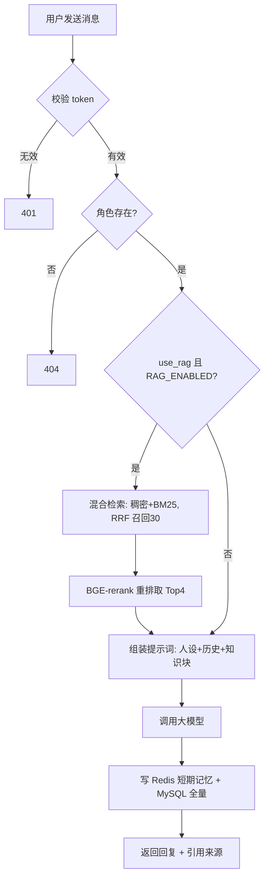
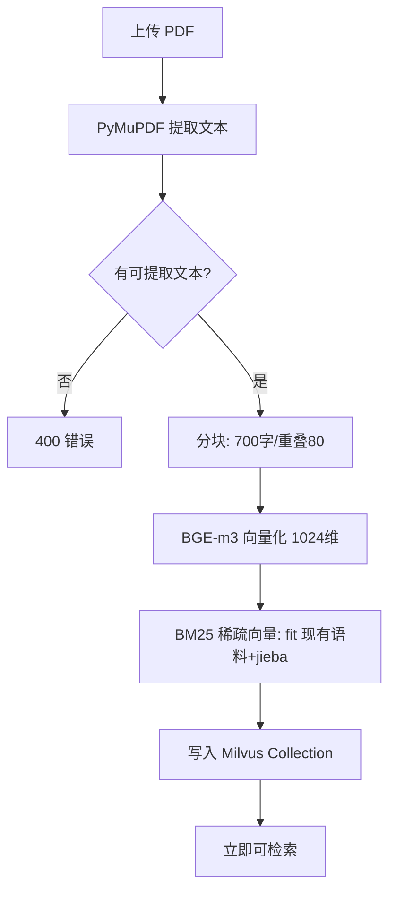
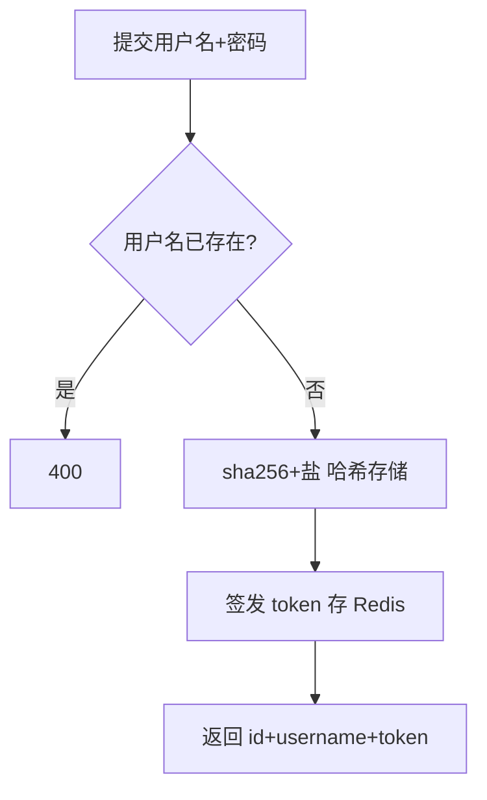

# 基于 RAG 的角色扮演系统 · 需求规格说明书

| 项 | 内容 |
|---|---|
| 版本 | v1.0 |
| 日期 | 2026-09-16 |
| 状态 | 已实现（与当前代码 v0.2.0 一致） |
| 配套 | [思维导图](思维导图.md) · [接口文档](接口文档.md) · [设计文档](设计文档.md) · [需求对照检查表](需求对照检查表.md) |

## 1. 引言

### 1.1 编写目的
本文档定义"基于 RAG 的角色扮演系统"的功能需求、业务规则、业务流程与非功能需求，作为开发、测试、验收的依据。系统对标 character.ai：用户可与虚拟角色进行多轮对话，角色拥有独立人设与领域知识库，回答由大模型结合知识检索生成。

### 1.2 项目背景
大模型本身无长期记忆且可能产生幻觉。本系统用 Redis 提供短期记忆、MySQL 持久化、Milvus 向量库提供角色领域知识（RAG），使角色回答既保持人设一致，又具备专业知识准确性。

### 1.3 术语
| 术语 | 定义 |
|---|---|
| 角色（Role） | 人设 + 提示词模板 + 知识库的集合，如"林医生" |
| 人设（Persona） | 角色的身份、性格、说话风格描述 |
| 知识库 | 某角色的文档集合，分块向量化后存于 Milvus（每角色一个 Collection） |
| 短期记忆 | 最近 10 轮对话，存 Redis，过期 7 天 |
| 混合检索 | 稠密向量 + BM25 稀疏向量双路召回，RRF 融合 |
| 引用来源（sources） | 本次回答注入的知识块原文 |

### 1.4 参考资料
RAGAS 评测论文、Milvus 官方文档、《中国高血压防治指南》（示例知识文档参考）

## 2. 总体描述

### 2.1 产品定位
多用户 × 多角色的角色扮演聊天服务：社交陪伴（虚拟朋友）+ 领域专家（医生/律师/教师等），REST API + SSE 流式输出。

### 2.2 用户特征
普通用户：注册登录后选择角色聊天、上传知识文档；管理员：角色/知识库管理（本版本未做权限分级，登录用户均可管理）。

### 2.3 运行环境
| 环境 | 配置 | 状态 |
|---|---|---|
| 开发 | Windows 11 + 本机 MySQL/Redis + Docker Milvus + DeepSeek API | ✅ 在用 |
| 测试 | pytest（SQLite + 真 Redis + 假 LLM）；Jmeter 压测（LLM_MOCK 开关） | ✅ |
| 生产 | WSL Ubuntu-24.04（镜像网络，直连 Windows MySQL），部署脚本 deploy/*.sh | ✅ 验证通过 |

### 2.4 设计与实现约束
- 大模型统一走 OpenAI 兼容协议（本地 vLLM/SGLang 或在线 API 均可）
- 检索质量指标基线：context_recall 1.000、context_precision 0.968（RAGAS 实测）
- 生成质量指标基线：faithfulness 0.951、answer_correctness 0.726（提示词三轮优化后）

### 2.5 假设与依赖
依赖外部服务：MySQL、Redis、Milvus（Docker）、在线 LLM API；本地向量化依赖 BGE-m3 / BGE-reranker-v2-m3 模型文件。

## 3. 功能需求

> 编号 FR-x；"实现位置"指向代码，供追踪。

### 3.1 用户模块
| 编号 | 需求 | 说明 | 实现 |
|---|---|---|---|
| FR-01 | 注册 | 用户名唯一（2~64 字符）、密码 6~64 字符，服务端只存哈希 | `app/api/users_roles.py` |
| FR-02 | 登录 | 校验用户名密码，签发 token（Redis 存 7 天） | 同上 |
| FR-03 | 鉴权 | 除注册登录外所有接口需 `X-Token` 头，无效返回 401 | `app/api/deps.py` |

### 3.2 角色模块
| 编号 | 需求 | 说明 | 实现 |
|---|---|---|---|
| FR-04 | 角色列表 | 返回全部角色（id/名称/分类/人设/模板） | `app/api/users_roles.py` |
| FR-05 | 创建角色 | 名称唯一；人设必填；模板缺省用默认模板 | 同上 |
| FR-06 | 更新角色 | 部分字段更新 | 同上 |
| FR-07 | 删除角色 | 逻辑删除（知识库 Collection 保留） | 同上 |
| FR-08 | 内置角色 | 首启写入 5 角色：小阳(朋友)/林医生(医生)/王律师(律师)/张老师(教师)/Emily(英语学习) | `app/seed.py` |
| FR-09 | 模板升级 | 旧默认模板自动升级为含 `{knowledge}` 的新版；自定义模板不动 | 同上 |

### 3.3 对话模块
| 编号 | 需求 | 说明 | 实现 |
|---|---|---|---|
| FR-10 | 非流式对话 | 输入角色+内容，返回回复+引用来源 | `app/api/chat_knowledge.py` |
| FR-11 | 流式对话 | SSE：`data:{"delta"}` 分块 → 可选 `{"sources"}` → `[DONE]` | 同上 |
| FR-12 | 多轮记忆 | 每轮写入 Redis（最近 10 轮）+ MySQL 全量 | `app/services/chat_service.py` |
| FR-13 | 会话隔离 | 记忆 key 含 user_id×role_id，互不串扰 | `app/store/memory.py` |
| FR-14 | 历史记录 | 查询某角色会话的全部消息（MySQL） | `app/api/chat_knowledge.py` |
| FR-15 | RAG 开关 | 请求级 `use_rag=false` 可跳过检索；全局 `RAG_ENABLED` | 同上 |

### 3.4 知识库模块
| 编号 | 需求 | 说明 | 实现 |
|---|---|---|---|
| FR-16 | PDF 上传入库 | 解析→分块→BGE-m3 向量化→写入角色 Collection（含 BM25 稀疏） | `app/api/chat_knowledge.py` |
| FR-17 | 文档列表 | 按来源聚合（文件名、块数、更新时间） | 同上 |
| FR-18 | 文档删除 | 删除该来源全部块，立即生效（Strong 一致性） | 同上 |
| FR-19 | 检索流程 | 稠密+稀疏混合召回 30 → BGE-rerank 重排 → Top4 注入提示词 | `app/services/knowledge_service.py` |

### 3.5 评测与运维
| 编号 | 需求 | 说明 | 实现 |
|---|---|---|---|
| FR-20 | RAGAS 评测 | 题库驱动，可换 judge 重判，输出对比报告 | `app/eval/*`、`scripts/run_eval.py` |
| FR-21 | 压测模式 | `LLM_MOCK=true` 时 LLM 返回预设回复（不调外部 API） | `app/core/llm.py` |
| FR-22 | 日志 | 全模块 python logging，关键操作留痕 | 各模块 logger |

## 4. 业务流程

### 4.1 对话流程（含 RAG）

### 4.2 知识入库流程

### 4.3 注册登录流程

## 5. 业务规则

| 编号 | 规则 | 说明 |
|---|---|---|
| BR-01 | 会话记忆窗口 | Redis 保留最近 10 轮（20 条消息），超出自动裁剪；TTL 7 天 |
| BR-02 | 知识块注入格式 | 有知识时提示词含【知识库内容】段 + 5 条准确性指令 + 2 组 few-shot 示例；无知识整段省略 |
| BR-03 | 知识来源约束 | 回答须严格依据知识块，无依据须明示"知识库中没有相关信息"，不得编造 |
| BR-04 | 精确数值优先 | 涉及数值/标准/指标必须使用知识库精确数值 |
| BR-05 | 子问题全覆盖 | 多子问题逐条回答，不遗漏 |
| BR-06 | 角色一致性 | 始终以角色身份说话，不提及自己是 AI |
| BR-07 | 知识库隔离 | 检索只查当前角色的 Collection，角色间知识不共享 |
| BR-08 | 删除即时生效 | 文档删除后检索立即可见（Milvus Strong 一致性 + flush） |
| BR-09 | 密码安全 | 只存 sha256+随机盐哈希；登录连续失败不做锁（本版本） |
| BR-10 | token 有效期 | 7 天，过期需重新登录 |
| BR-11 | 流式失败保护 | 流式中途失败不写入半截回复，仅保留用户消息 |
| BR-12 | 检索召回参数 | 混合召回 30、重排取 Top4（`.env` 可调 RAG_RECALL_K/RAG_TOP_K） |
| BR-13 | 长期记忆 | 每轮对话沉淀到 Milvus 记忆库（user×role 隔离），检索相似度低于 MEMORY_SIMILARITY 的记忆不注入 |

## 6. 非功能需求

| 类别 | 指标 | 依据 |
|---|---|---|
| 性能 | 注册接口 157 req/s@100并发，0 错误；对话(MOCK) 50 req/s@100并发；真实 LLM 端到端约 1.3s/请求 | Jmeter 实测 |
| 扩展性 | nginx 双实例负载均衡：100 并发吞吐 +111%（50→106 req/s），延迟 -68% | Jmeter 实测 |
| 检索质量 | context_recall 1.000 / context_precision 0.968 | RAGAS 基线 |
| 生成质量 | faithfulness 0.951 / answer_correctness 0.726 / relevancy 0.955 | RAGAS 三轮优化 |
| 安全性 | 密码哈希存储；token 鉴权；接口参数校验（pydantic） | 代码 |
| 可用性 | 首次启动自动建表+内置角色；健康检查 /docs；日志 server.log | 代码 |
| 可维护性 | 104 个自动化用例全绿；模块按层划分；pyflakes 零告警 | 测试 |
| 可移植性 | 依赖清单分 core/rag；部署脚本支持 Ubuntu/WSL/云（幂等） | deploy/ |

## 7. 数据需求

| 存储 | 结构 | 说明 |
|---|---|---|
| MySQL | users(id, username唯一, password_hash, created_at) | 用户 |
| MySQL | roles(id, name唯一, category, persona, prompt_template, created_at, updated_at) | 角色 |
| MySQL | messages(id, user_id, role_id, sender, content, created_at) + 索引(user_id, role_id, created_at) | 全量消息 |
| Redis | `session:token:{token}` → user_id（String，TTL 7天） | 登录态 |
| Redis | `chat:history:{uid}:{rid}` → List<{role,content}>，裁剪至 10 轮 | 短期记忆 |
| Milvus | 每角色 Collection `role_kb_v2_{id}`：id / text / summary / dense(1024) / sparse / source / created_at / updated_at；记忆库 `user_memory_{uid}_{rid}` 同构 | 知识库 + 长期记忆 |

## 8. 外部接口需求

- 大模型：OpenAI 兼容 `chat/completions`（流式/非流式），`LLM_BASE_URL/API_KEY/MODEL` 配置
- 评测 judge：同协议可独立配置（`--model` 或 `JUDGE_*`）
- 自有接口：见 [接口文档](接口文档.md)

## 9. 验收标准（汇总）

1. 注册/登录/角色 CRUD/对话/历史/知识上传删除全接口可用（已 e2e + WSL 部署验证）
2. RAG 检索质量：recall ≥ 0.95 且 precision ≥ 0.95（实测 1.0 / 0.97）
3. 生成质量：faithfulness ≥ 0.90（实测 0.951）
4. 156 个自动化用例全部通过
5. 压测四场景 0 错误（实测满足）
