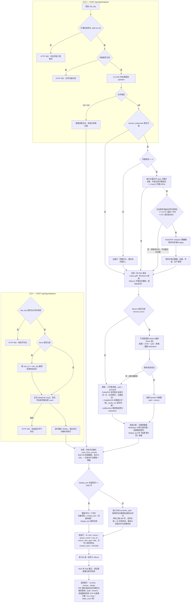
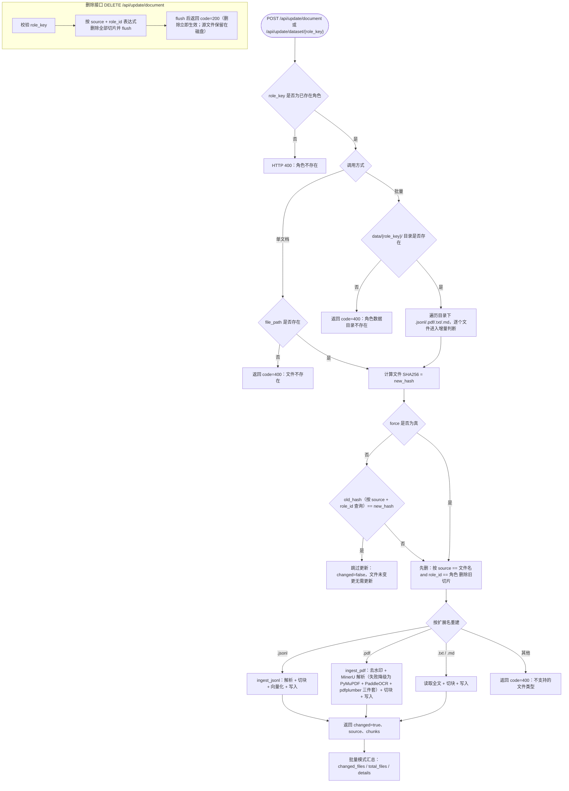
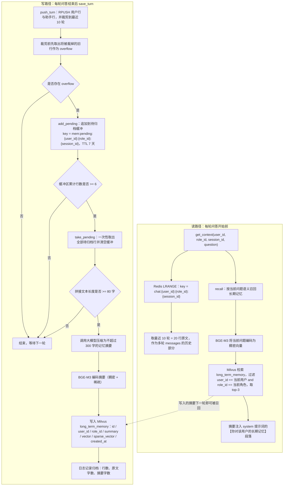

# 业务流程与业务规则

> 本文档描述系统四条核心业务流程（问答、知识入库、知识更新、双层记忆）与从代码中
> 提炼的业务规则。流程图使用 Mermaid 描述，规则条目均标注实现位置。

---

## 1. 核心业务流程：一次问答的完整链路

由 `app/core/rag_service.py` 的 `_prepare` + `chat` / `chat_stream` 编排，共 13 个阶段。

```mermaid
flowchart TD
    S(["用户提问：POST /api/chat/ask 或 /api/chat/stream"]) --> V{"question 去空格后是否为空"}
    V -->|"是"| E1["HTTP 400：问题不能为空"]
    V -->|"否"| P1["① 角色装载 RoleService.get_by_key"]
    P1 --> C1{"角色存在且 status 为真"}
    C1 -->|"否"| E2["HTTP 400：角色不存在或已停用"]
    C1 -->|"是"| P2["② 会话装载 SessionService.get_or_create"]
    P2 --> C2{"是否传入 session_id"}
    C2 -->|"未传"| NEW["新建会话，生成 UUID session_id"]
    C2 -->|"已传且存在"| C3{"sessions.user_id 是否等于请求 user_id"}
    C3 -->|"否"| E3["HTTP 403：会话不属于当前用户"]
    C3 -->|"是"| REUSE["复用该会话"]
    C2 -->|"已传但不存在"| NEW2["以该 session_id 新建会话"]
    NEW --> P3
    REUSE --> P3
    NEW2 --> P3

    P3["③ 双层记忆召回 MemoryService.get_context"] --> M1["Redis List 取最近 10 轮对话原文"]
    P3 --> M2["Milvus 按问题语义召回该用户该角色的 top-3 记忆摘要"]
    M1 --> C4{"短期记忆是否非空"}
    M2 --> C4
    C4 -->|"是"| RW["④ 追问改写 QueryService.rewrite<br/>temperature=0.1，取最近 6 行历史，补全指代"]
    C4 -->|"否"| RAW["跳过改写，直接使用原始问题"]
    RW --> EX
    RAW --> EX
    EX["⑤ 查询扩写 QueryService.expand<br/>1 个问题 → 3 个检索查询（QUERY_EXPAND_N）"] --> P4

    P4["⑥ 向量路召回 RetrieveService._vector_route<br/>扩写出的每个查询各跑一遍，按 role_id 过滤"] --> D1["BGE-M3 一次前向：稠密向量 + 稀疏权重"]
    D1 --> D2["Milvus hybrid_search：两路各召回 20 条"]
    D2 --> D3{"混合检索是否成功"}
    D3 -->|"否"| D4["降级：纯稠密向量检索"]
    D3 -->|"是"| D5["RRFRanker k=60 融合为一路"]
    D4 --> D5
    D5 --> P4B["⑦ 元数据路召回 MetadataService.search<br/>抽取法条号 → MySQL law_index 精确命中 → Milvus 取原文"]
    P4B --> D8["⑧ 加权 RRF 融合：原问题权重 1.5×，元数据路 2.5×"]
    D8 --> P5["⑨ 重排序 BGE-reranker-v2-m3 逐对打分"]
    P5 --> C5{"重排是否成功"}
    C5 -->|"否"| D6["降级：取融合顺序前 5 条"]
    C5 -->|"是"| D7["取 top-5 作为参考资料"]
    D6 --> P6
    D7 --> P6

    P6["⑩ 提示词组装"] --> SP["system = 人设 + 回答规则 + 长期记忆 + 参考资料"]
    SP --> MSG["history = 最近 10 轮短期记忆原文；user = 当前问题"]
    MSG --> P7["⑪ 调用 DeepSeek deepseek-flash 生成"]
    P7 --> C6{"正文为空（推理耗尽 token 或提前停止）"}
    C6 -->|"是"| RETRY["max_tokens 放大重试，仍为空则用角色兜底话术"]
    C6 -->|"否"| P8
    RETRY --> P8

    P8["⑫ 追加免责声明 _with_disclaimer"] --> C7{"disclaimer 是否已包含在正文中"}
    C7 -->|"否"| APP["正文末尾追加两个换行 + 免责声明"]
    C7 -->|"是"| SKIP["不重复追加"]
    APP --> P9
    SKIP --> P9
    P9["⑬ 记忆与消息落库"] --> L1["save_turn：写 Redis 短期记忆，必要时归档 Milvus 长期记忆"]
    P9 --> L2["touch：会话轮次 +1，首轮以提问作标题"]
    P9 --> L3["写入 messages 表：user 消息 + assistant 消息（含 sources）"]
    L1 --> OUT["返回结果 / 推送事件流"]
    L2 --> OUT
    L3 --> OUT
    OUT --> O1["非流式：answer + session_id + role + search_query + sources"]
    OUT --> O2["流式：meta → delta × N → done"]
    OUT --> O3["Redis zSet role:hot 热度 +1"]
```

**关键设计说明**

| 设计点 | 说明 |
|---|---|
| 记忆存正文、消息存全文 | `save_turn` 存不含免责声明的正文，`messages` 表存含声明的完整回答，避免记忆摘要被固定套话占满 |
| 热度只在成功后累加 | `incr_role_hot` 位于正常返回路径上，问答失败不计数 |
| 流式与落库内容一致 | 免责声明在流式场景下作为额外的 `delta` 补发，落库内容与用户所见完全一致 |
| 检索失败不编造 | 检索全失败时参考资料为空，提示词写入「（本轮没有检索到相关资料）」，由角色兜底话术接管 |

---

## 2. 知识入库流程

两条入口共用同一套切块与向量化逻辑。

---

## 3. 知识更新流程

核心是**内容哈希比对**：入库时把文件 SHA256 写进每条切片的 `content_hash`，
更新时先查旧哈希，一致则跳过，避免无谓的重复向量化。

---

## 4. 双层记忆流程

短期记忆保证「刚说过的话」一字不差，长期记忆让「很久以前说过的关键信息」在需要时
被重新想起，而不是随窗口滑出而永久丢弃。

**设计说明**

| 设计点 | 说明 |
|---|---|
| 为什么先取 overflow 再裁剪 | 若先 `LTRIM` 再读取，被裁掉的内容将永久丢失，无法归档 |
| 为什么要缓冲区 | 每轮滑出的内容仅约 2 行，立即摘要会产生碎片摘要并频繁调用大模型；累计 6 行后一次性摘要更经济 |
| 短文本不归档 | 拼接后不足 80 字不生成摘要，避免产生「嗯」「好的」之类的无意义记忆 |
| 记忆隔离 | 长期记忆以 `user_id + role_id` 双重过滤，同一用户不同角色互不干扰，不同用户之间完全隔离 |
| 记忆与免责声明 | 归档的是不含免责声明的回答正文，防止固定套话反复进入摘要 |

---

## 5. 业务规则

规则来源：`app/core/prompt.py` 的通用规则模板（`BASE_RULES`）、`app/core/role_service.py`
的角色种子数据（`persona` / `rules` / `fallback` / `disclaimer`）、以及各服务层的实现约束。

| 编号 | 类别 | 规则 | 来源 / 实现 |
|---|---|---|---|
| BR-01 | 通用 | **严格依据【参考资料】作答**，不得编造资料中不存在的事实、条款或数据 | `BASE_RULES` 第 1 条；资料来自 Milvus 检索结果，为空时提示词写入「（本轮没有检索到相关资料）」 |
| BR-02 | 通用 | 参考资料不足以回答时，**按角色配置的兜底话术回复**，不得改用推测性回答 | `BASE_RULES` 第 2 条，`{fallback}` 由 `roles.fallback` 填充 |
| BR-03 | 通用 | 始终保持角色设定中的身份、语气与立场，不跳出角色 | `BASE_RULES` 第 3 条 + `roles.persona` |
| BR-04 | 通用 | 回答条理清晰；涉及专业结论时优先引用资料原文 | `BASE_RULES` 第 4 条 |
| BR-05 | 通用 | 不得向用户暴露「参考资料」「知识库」「检索」等系统实现细节 | `BASE_RULES` 第 5 条 |
| BR-06 | 通用 | 检索结果在提示词中按「资料1（标题）：正文」编号成块，供模型引用 | `build_system_prompt` |
| BR-07 | 免责声明 | **每个角色的免责声明自动追加到回答末尾**，存于 `roles.disclaimer` 字段 | `RagService._with_disclaimer`：以两个换行分隔追加 |
| BR-08 | 免责声明 | 声明已包含在正文中时不重复追加 | 追加前做包含性判断 |
| BR-09 | 免责声明 | 流式场景下追加的声明作为单独一段 `delta` 补发，保证用户所见与落库内容一致 | `chat_stream` 计算 `final[len(answer):]` 补发 |
| BR-10 | 免责声明 | 写入记忆的是**不含**声明的正文，写入 `messages` 表的是**含**声明的完整回答 | 分别调用 `save_turn(answer)` 与 `add_message(final)` |
| BR-11 | 法律 | **引用法律时须写明法律名称与条文序号**，例如「《中华人民共和国刑法》第一百三十三条」 | `lawyer.rules` 第 1 条 |
| BR-12 | 法律 | 涉及具体案件时，先提示用户补充关键事实（时间、地点、金额、证据情况） | `lawyer.rules` 第 2 条 |
| BR-13 | 法律 | **须区分「法律如何规定」与「实践通常如何处理」**，不得混为一谈 | `lawyer.rules` 第 3 条 |
| BR-14 | 法律 | 涉及诉讼时效、管辖、举证责任等程序性问题时，务必主动提示 | `lawyer.rules` 第 4 条 |
| BR-15 | 法律 | 兜底话术：现行法律条文中没有直接对应规定时，建议补充具体情况或携带材料当面咨询执业律师 | `lawyer.fallback` |
| BR-16 | 法律 | 免责声明：分析仅为一般性法律意见，不构成正式法律意见书，具体案件请委托律师办理 | `lawyer.disclaimer` |
| BR-17 | 心理 | 先回应情绪，再处理认知，不要一上来就分析或给建议 | `psychologist.rules` 第 1 条 |
| BR-18 | 心理 | 使用认知行为疗法框架识别认知歪曲（以偏概全、灾难化、先知错误等）时，**要说明判断依据** | `psychologist.rules` 第 2 条 |
| BR-19 | 心理 | 多提开放式问题，引导用户自己表达，避免长篇独白 | `psychologist.rules` 第 3 条 |
| BR-20 | 心理 | **绝不进行精神科诊断，也不建议、评价任何精神类药物** | `psychologist.rules` 第 4 条 |
| BR-21 | 心理 | 兜底话术：资料不足时不凭感觉下判断，转而邀请用户补充具体情况 | `psychologist.fallback` |
| BR-22 | 心理 | **高危情况给出危机干预热线**：免责声明固定包含全国心理援助热线 `12356` 与北京心理危机干预中心 `010-82951332`，并提示可联系身边信任的人 | `psychologist.disclaimer` |
| BR-23 | 金融 | **严禁推荐具体个股、给出买卖时点或承诺收益** | `financial_advisor.rules` 第 1 条 |
| BR-24 | 金融 | 回答配置类问题时，先了解用户的风险承受能力、投资期限与资金用途 | `financial_advisor.rules` 第 2 条 |
| BR-25 | 金融 | 涉及具体数据时须注明来源与时间，避免使用过时行情 | `financial_advisor.rules` 第 3 条 |
| BR-26 | 金融 | 主动提示风险，包括但不限于市场风险、流动性风险与集中度风险 | `financial_advisor.rules` 第 4 条 |
| BR-27 | 金融 | 兜底话术：资料中没有可靠数据支撑时，明确说明凭现有信息给建议不负责任 | `financial_advisor.fallback` |
| BR-28 | 金融 | **回答尾部附免责声明**：「以上为一般性说明，不构成具体投资建议。市场有风险，投资需谨慎。」 | `financial_advisor.disclaimer` |
| BR-29 | 身份权限 | **会话归属校验**：复用已有 `session_id` 提问时若该会话不属于当前 `user_id`，返回 **HTTP 403**「会话不属于当前用户」 | `SessionService.get_or_create` 抛 `PermissionError`，`api/chat.py` 转 403 |
| BR-30 | 身份权限 | `session_id` 不存在时按该 ID 新建会话，不返回 404（幂等友好） | `get_or_create` 分支 |
| BR-31 | 身份权限 | 密码不得明文存储：PBKDF2-HMAC-SHA256（20 万次迭代、16 字节随机盐），比对使用恒时比较 | `app/api/system.py` |
| BR-32 | 身份权限 | 长期记忆严格按 `user_id + role_id` 过滤，跨用户不可见 | `MemoryService.recall` / `stats` |
| BR-33 | 身份权限 | 登录失败 401、账号停用 403、用户名重复 400、角色不存在 400、角色/会话不存在 404 | 各接口异常分支 |
| BR-34 | 知识库 | 入库前必须校验角色存在，避免写入无归属的脏切片 | `_check_role` |
| BR-35 | 知识库 | 上传仅接受 `.pdf` / `.txt` / `.md`，空文件拒绝 | `ALLOWED_EXT` 与内容长度校验 |
| BR-36 | 知识库 | 更新幂等：文件 SHA256 与库中 `content_hash` 一致时跳过重建 | `UpdateService.update_document` |
| BR-37 | 知识库 | 更新采用**先删后增**，删除范围严格限定为 `source + role_id` | `delete_by_expr` |
| BR-38 | 知识库 | 去水印宁可漏删不可误删：仅「重复出现」不足以判定，还须满足形态特征，水平黑色小字号正文页眉不会被删除 | `WatermarkRemover._watermark_like`（`app/core/watermark.py`） |
| BR-39 | 知识库 | 页数少于 3 页的 PDF 跳过去水印统计，避免样本不足导致误判 | `MIN_PAGES` |
| BR-40 | 知识库 | 长文切块后丢弃长度小于 20 字的碎块，减少低信息量切片干扰检索 | `IngestService._rows_from_records` |
| BR-41 | 知识库 | 入库完成后必须 flush 并 load 集合，否则新写入的数据无法被检索到 | `MilvusStore.insert` |
| BR-42 | 稳定性 | 记忆读写、热度统计失败仅记录告警，不阻断问答主流程 | `MemoryService` / `redis_conn` 异常兜底 |
| BR-43 | 知识库 | PDF 解析以 **MinerU 为主路径**（独立 venv + 子进程），未安装或解析失败时降级为**自研三件套**（PyMuPDF 文本层 + PaddleOCR 图表文字 + pdfplumber 表格）；MinerU 产出的 Markdown **不做归一化**（合并硬换行会毁掉标题与表格结构），且必须剥掉 base64 内嵌图 | `PDFService.extract_pages` / `mineru_service.strip_images` |
| BR-45 | 知识库 | `use_ocr` / `use_tables` **只作用于兜底路径**：走 MinerU 时它自带 OCR 与表格识别且无法单独关闭，两个开关被忽略并记一条 note；`watermark` 里的 `ocr_*` / `table_*` 计数也只在兜底路径下有值，走 MinerU 时恒为 0 | `PDFService.extract_pages` / `app/api/knowledge.py` 的 Form 参数 |
| BR-44 | 知识库 | 删除后立即 `flush`：Milvus 删除是最终一致的，不 flush 会出现「接口返回 200 删除成功、紧接着查询仍能查到旧数据」 | `MilvusStore.delete_by_expr` |
