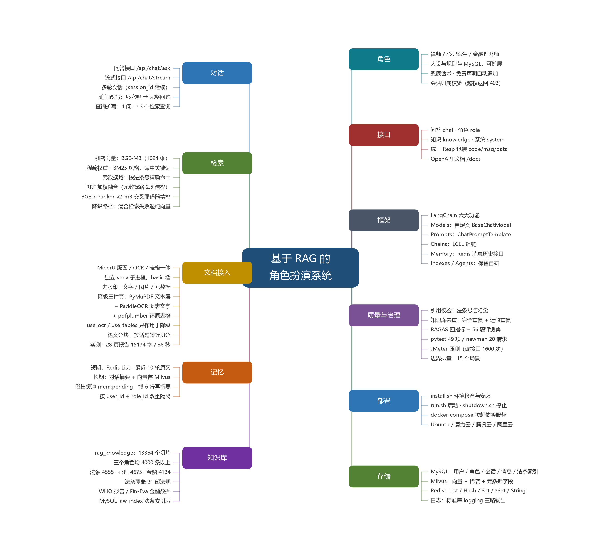
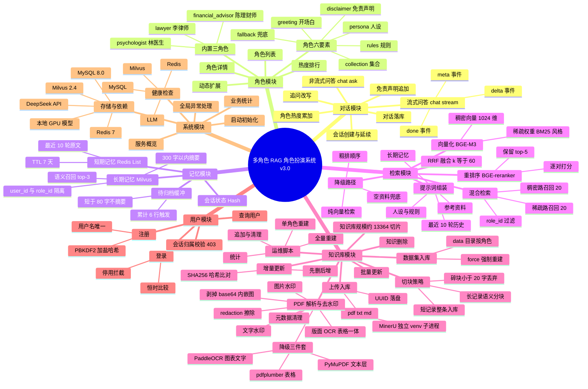

# 系统思维导图

## 思维导图（图片）

- 图片：`docs/思维导图.png`（矢量版 `docs/思维导图.svg`，可无损缩放）
- 生成脚本：`.venv/bin/python -m scripts.draw_mindmap`
- 覆盖九个分支：对话、检索、记忆、知识库、角色、接口、测试与评测、部署、存储

> 下方文字版为思维导图的文本化清单，便于检索与逐项核对；
> **内容以图片为准**，文字版仍在持续补充。
>
> PDF 解析链路调整为「MinerU 主路径 + 三件套兜底」后，生成脚本
> `scripts/draw_mindmap.py` 的「文档接入」分支已同步，图片也已重新生成。

---

## 附：文本版清单

- **多角色 RAG 角色扮演系统 v3.0**
  - **1. 对话模块**
    - 1.1 非流式问答 `POST /api/chat/ask`
      - 输入：question、role_key、user_id、session_id
      - 输出：answer、session_id、role、search_query、sources
    - 1.2 流式问答 `POST /api/chat/stream`
      - 事件序列：meta → delta × N → done
      - 异常事件：error
    - 1.3 会话创建与延续
      - 不传 session_id：自动新建并返回
      - 传 session_id：校验归属后复用
      - 传不存在的 session_id：以该 ID 新建
    - 1.4 追问改写
      - 触发条件：存在历史消息
      - 模型参数：temperature 0.1，max_tokens 1024
      - 失败回退：使用原问题
    - 1.5 免责声明追加
      - 非流式：直接拼接；流式：补发一段 delta
      - 记忆存正文，消息存全文
    - 1.6 对话落库
      - Redis 短期记忆
      - MySQL messages 归档
      - 会话轮次与标题更新
    - 1.7 角色热度累加
  - **2. 角色模块**
    - 2.1 角色列表 `GET /api/roles`
    - 2.2 角色详情 `GET /api/roles/{role_key}`
      - 含 persona、rules、fallback、disclaimer、collection
    - 2.3 热度排行 `GET /api/roles/hot`
    - 2.4 内置角色
      - lawyer 李律师 · 法律
      - psychologist 林医生 · 心理健康
      - financial_advisor 陈理财师 · 金融理财
    - 2.5 动态扩展能力
      - 人设与规则存 MySQL，新增角色无需改代码
      - 进程内缓存 + 变更后失效
    - 2.6 角色要素
      - persona 人设、rules 回答规则、greeting 开场白
      - fallback 兜底话术、disclaimer 免责声明
  - **3. 记忆模块**
    - 3.1 短期记忆
      - 存储：Redis List
      - key：`chat:{user_id}:{role_id}:{session_id}`
      - 容量：最近 10 轮即 20 行，TTL 7 天
    - 3.2 待归档缓冲
      - 存储：Redis List
      - key：`mem:pending:{user_id}:{role_id}:{session_id}`
      - 触发阈值：累计 6 行；短于 80 字不摘要
    - 3.3 长期记忆
      - 存储：Milvus `long_term_memory`
      - 内容：大模型压缩的 300 字以内摘要
      - 隔离：user_id 与 role_id 双重过滤
      - 召回：按当前问题语义取 top-3
    - 3.4 会话状态 Hash
      - key：`session:meta:{session_id}`
      - 字段：角色、用户、轮次、最后活跃时间
  - **4. 检索模块**
    - 4.1 向量化 BGE-M3
      - 稠密向量 1024 维
      - 稀疏权重 BM25 风格
      - 一次前向同时产出
    - 4.2 混合检索
      - 稠密路召回 20 条、稀疏路召回 20 条
      - 过滤条件：role_id
    - 4.3 RRF 融合
      - 参数 k 等于 60
      - 免归一化，直接按倒数排名累加
    - 4.4 重排序 BGE-reranker-v2-m3
      - 交叉编码器逐对打分
      - 保留 top-5
    - 4.5 降级路径
      - 混合检索失败 → 纯向量检索
      - 重排失败 → 粗排顺序
      - 全部失败 → 空资料 + 兜底话术
    - 4.6 提示词组装
      - system：人设 + 规则 + 长期记忆 + 参考资料
      - history：最近 10 轮原文；user：当前问题
  - **5. 知识库模块**
    - 5.1 数据集入库 `POST /api/ingest/dataset`
      - 数据目录：`data/{role_key}/`
      - 支持 force 强制重建
    - 5.2 上传入库 `POST /api/ingest/upload`
      - 格式：pdf、txt、md
      - 落盘：uploads 目录，UUID 命名
    - 5.3 PDF 解析与去水印
      - 解析主路径：MinerU，独立 venv + 子进程，basic 档
      - 版面 / OCR / 公式 / 表格一次解析为整篇 Markdown
      - 剥掉 base64 内嵌图；Markdown 不做归一化
      - 降级路径：MinerU 不可用或失败时退回三件套
        - PyMuPDF 逐页取文本层并归一化
        - PaddleOCR 补图表文字（按 `_needs_ocr` 逐页判断）
        - pdfplumber 还原表格为 Markdown
        - `use_ocr` / `use_tables` 只作用于这条路径
        - 统计口径：`ocr_lines` / `table_count` 等，走 MinerU 时恒为 0
      - 文字水印：多页重复 + 形态特征
      - 图片水印：重复铺版或大面积透明图层
      - 元数据：标题、作者、生产者清空
      - 擦除方式：redaction 精确擦除（先去水印再交给 MinerU）
    - 5.4 切块策略
      - 短记录：整条入库，embed_text 作检索目标
      - 长记录：语义分块（按相邻句相似度低谷切分）
      - 碎块过滤：小于 20 字丢弃
    - 5.5 增量更新 `POST /api/update/document`
      - SHA256 哈希比对，先删后增
      - 按 source 与 role_id 限定范围
    - 5.6 批量更新 `POST /api/update/dataset/{role_key}`
    - 5.7 知识删除 `DELETE /api/update/document`
    - 5.8 运维脚本 `scripts/knowledge_base.py`
      - 全量重建、单角色重建、追加、清理、统计
    - 5.9 数据抓取脚本 `scripts/fetch_statutes.py`
      - 拉取现行法条并按「条」切分
      - 只取有效状态、整部纳入、同名保留最新版
    - 5.10 知识库规模
      - 合计约 13364 切片
      - lawyer 4555、psychologist 4675、financial_advisor 4134
      - 法条覆盖 21 部法规 4068 条
  - **6. 用户模块**
    - 6.1 注册 `POST /api/users/register`
      - 用户名唯一校验
      - PBKDF2-HMAC-SHA256 加盐哈希
    - 6.2 登录 `POST /api/users/login`
      - 恒时比较校验密码
      - 账号停用拦截
    - 6.3 查询用户 `GET /api/users/{user_id}`
    - 6.4 演示账号 demo / demo123
    - 6.5 会话归属校验 403
  - **7. 系统模块**
    - 7.1 健康检查 `GET /api/health`
      - MySQL、Redis、Milvus、LLM 四项状态
    - 7.2 业务统计 `GET /api/stats`
      - 集合行数、分角色知识量、四表计数
    - 7.3 服务概览 `GET /`
    - 7.4 全局异常处理
      - 统一 500 响应 + 完整堆栈日志
    - 7.5 服务启动初始化
      - 建库建表 + 写入角色种子数据
      - 模型懒加载，不阻塞启动
    - 7.6 存储与依赖
      - MySQL 8.0 业务数据、Redis 7 短期记忆与热度
      - Milvus 2.4 向量检索、DeepSeek API 大模型
      - 本地 GPU 推理 BGE 系列模型

---

## 形式二：Mermaid 思维导图

