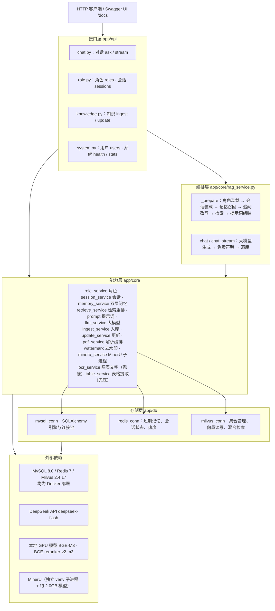

# 系统设计

> 本文档说明系统的分层架构、技术选型与存储结构（MySQL / Milvus / Redis）。
> 所有字段与参数均取自代码实现。数据集构成见 `06-数据集说明.md`。

---

## 1. 系统分层架构

**分层职责**

| 层 | 职责 | 关键约束 |
|---|---|---|
| 接口层 | 参数校验、异常到 HTTP 状态码的映射、响应封装（`Resp`） | 不含业务逻辑，不直接访问存储 |
| 编排层 | 串联一次问答的全部阶段，是唯一了解完整链路的地方 | 依赖能力层组件，不直接操作数据库连接 |
| 能力层 | 每模块单一职责，可独立测试 | 通过 `app/db` 访问存储，通过 `config/components` 获取重资源单例 |
| 能力层（PDF 解析组） | `pdf_service` 解析编排 · `watermark` 去水印 · `mineru_service` 主路径 · `ocr_service` / `table_service` 兜底 | `watermark` 对两条路径通用；`ocr_service` / `table_service` 只在 MinerU 不可用时被调用 |
| 存储层 | 连接管理、集合管理、读写原语 | 不含业务语义 |
| 外部依赖 | 用户、缓存、向量、模型四类外部服务，以及本地 PDF 解析器 MinerU | 均为 Docker、远程 API 或本地子进程；MinerU 不可用时降级为 PyMuPDF + PaddleOCR + pdfplumber 三件套 |

---

## 2. 技术选型

| 组件 | 选型 | 版本 | 选型理由 |
|---|---|---|---|
| Web 框架 | FastAPI + Uvicorn | 0.141.1 / 0.53.0 | 原生异步、Pydantic 出入参校验、自动生成 OpenAPI 文档；Uvicorn 轻量且支持 SSE 长连接 |
| 大模型 | DeepSeek `deepseek-flash` + openai SDK | — / 3.13.0 | 中文能力强、成本低；通过 OpenAI 兼容协议调用，可无缝切换兼容端点 |
| 向量化模型 | BGE-M3 | FlagEmbedding 1.4.2 | 一次前向同时产出稠密向量与稀疏权重，混合检索无需额外 BM25 组件 |
| 重排模型 | BGE-reranker-v2-m3 | FlagEmbedding 1.4.2 | 交叉编码器精度显著高于向量相似度，多语言支持好 |
| 推理框架 | PyTorch | 2.14.0 | 需与本机 CUDA 版本匹配，有 GPU 时自动启用 fp16 |
| 向量数据库 | Milvus + pymilvus | 2.4.17 standalone / 3.0.1 | 原生支持稀疏向量与多路混合检索 + RRFRanker，一个组件同时承担知识库与长期记忆 |
| 关系数据库 | MySQL + SQLAlchemy + mysql-connector-python | 8.0 / 2.0.52 / 26.7.0 | 存放用户、角色、会话、消息四类结构化数据，utf8mb4；ORM 提供声明式模型与连接池（pool_size 10 / max_overflow 20 / pre_ping） |
| 缓存 | Redis + redis-py | 7 / 8.1.0 | 短期记忆 List 读写 O(1)，另承担热度 zSet 与会话状态；客户端支持 pipeline 批量操作 |
| PDF 解析 | MinerU + PyMuPDF + PaddleOCR + pdfplumber | 4.0.5 / 1.28.2 / 3.7.0 / 0.11.10 | MinerU 一次解析即产出 Markdown（版面 / OCR / 公式 / 表格一体），装在项目内独立 venv（要求 `openai<3`，与主环境冲突），以子进程调用；PyMuPDF 负责去水印，并在 MinerU 不可用时与 PaddleOCR（图表文字）、pdfplumber（表格）组成兜底三件套 |
| 文本切分 | 自研语义分块 | — | 按相邻句向量相似度的低谷切分，短记录不切 |
| 配置管理 | python-dotenv + pydantic | 1.2.3 / 2.13.5 | `.env` 兜底、环境变量优先，集中类型转换 |
| 日志 | Python 标准库 logging | 3.12 | 控制台 + 滚动文件 + 错误日志三路输出，无第三方依赖 |

---

## 3. MySQL 表结构

数据库 `rag_roleplay`，字符集 `utf8mb4`，由 `Base.metadata.create_all` 在建库后自动建表。

### 3.1 users 用户表

| 字段 | 类型 | 约束 | 含义 |
|---|---|---|---|
| id | INT | PK，自增 | 用户 ID，接口默认使用 1 号演示用户 |
| username | VARCHAR(64) | 非空，唯一 | 登录名 |
| password_hash | VARCHAR(128) | 非空 | 密码哈希，格式 `盐hex$哈希hex`（PBKDF2-HMAC-SHA256，20 万次迭代） |
| nickname | VARCHAR(64) | 默认空串 | 昵称，注册时缺省取用户名 |
| status | BOOLEAN | 非空，默认 1 | 1 正常 / 0 禁用，登录时校验 |
| created_at | DATETIME | 默认当前时间 | 创建时间 |
| updated_at | DATETIME | 默认当前时间，更新时刷新 | 更新时间 |

### 3.2 roles 角色表

角色人设与提示词模板的数据源，**新增角色无需改代码**。

| 字段 | 类型 | 约束 | 含义 |
|---|---|---|---|
| id | INT | PK，自增 | 角色 ID |
| role_key | VARCHAR(64) | 非空，唯一 | 角色标识，与 `data/` 下的目录名一致（lawyer / psychologist / financial_advisor） |
| name | VARCHAR(64) | 非空 | 角色显示名（李律师 / 林医生 / 陈理财师） |
| category | VARCHAR(32) | 默认空串 | 领域分类（法律 / 心理健康 / 金融理财） |
| description | VARCHAR(512) | 默认空串 | 角色简介，用于列表展示 |
| persona | TEXT | — | 人设提示词，注入 system 提示词首段 |
| rules | TEXT | — | 角色专属回答规则，追加在通用规则之后 |
| greeting | TEXT | — | 开场白 |
| fallback | TEXT | — | 知识库无命中时的兜底话术 |
| disclaimer | TEXT | — | 免责声明，自动追加到回答末尾 |
| collection | VARCHAR(64) | 默认空串 | 对应 Milvus 集合名（`rag_knowledge`） |
| avatar | VARCHAR(255) | 默认空串 | 头像地址，本期未使用 |
| sort_order | INT | 默认 0 | 排序权重，越小越靠前 |
| status | BOOLEAN | 非空，默认 1 | 是否启用，停用角色不出现在列表且无法问答 |
| created_at | DATETIME | 默认当前时间 | 创建时间 |
| 索引 | `idx_role_status` | (status, sort_order) | 支撑角色列表按启用状态与排序字段查询 |

### 3.3 sessions 会话表

| 字段 | 类型 | 约束 | 含义 |
|---|---|---|---|
| id | BIGINT | PK，自增 | 内部主键 |
| session_id | VARCHAR(64) | 非空，唯一 | 对外暴露的会话 ID（UUID hex），接口使用该字段 |
| user_id | INT | 非空，外键 → users.id，ON DELETE CASCADE | 会话归属用户，用于归属校验 |
| role_key | VARCHAR(64) | 非空 | 会话所属角色 |
| title | VARCHAR(128) | 默认空串 | 会话标题，首轮提问截取前 120 字 |
| turn_count | INT | 默认 0 | 累计对话轮数，每轮 +1 |
| created_at | DATETIME | 默认当前时间 | 创建时间 |
| updated_at | DATETIME | 默认当前时间，更新时刷新 | 最近活跃时间，会话列表按其倒序 |
| 索引 | `idx_session_user_role` | (user_id, role_key) | 支撑按用户 + 角色的会话列表查询 |

### 3.4 messages 消息表

| 字段 | 类型 | 约束 | 含义 |
|---|---|---|---|
| id | BIGINT | PK，自增 | 消息序号，同一会话内按此升序即对话顺序 |
| session_id | VARCHAR(64) | 非空 | 所属会话 ID（字符串关联，**不建外键**，级联删除由 `SessionService` 显式执行） |
| role | VARCHAR(16) | 非空 | 消息角色：`user` / `assistant` |
| content | TEXT | 非空 | 消息正文；助手消息含免责声明 |
| sources | TEXT | 可空 | 该轮命中的知识来源，JSON 字符串（title / source / score 数组） |
| created_at | DATETIME | 默认当前时间 | 创建时间 |
| 索引 | `idx_msg_session` | (session_id, id) | 支撑按会话顺序读取历史 |

**表间关系**：`users` 1—N `sessions`（外键级联删除）；`sessions` 与 `messages` 以
`session_id` 字符串关联，删除会话时先删消息再删会话；`roles` 与业务表通过
`role_key` 字符串关联，无外键约束。

---

## 4. Milvus 集合结构

两个集合均启用动态字段（`enable_dynamic_field=True`），主键由应用侧生成 UUID hex，
维度由 `EMBEDDING_DIM=1024` 决定。

### 4.1 rag_knowledge 知识库集合

| 字段 | 类型 | 约束 | 含义 |
|---|---|---|---|
| id | VARCHAR(64) | 主键 | 切片 ID，应用侧生成的 UUID hex |
| text | VARCHAR(65535) | — | 切片正文，即喂给大模型的 `display_text` |
| vector | FLOAT_VECTOR | dim=1024 | 稠密语义向量（BGE-M3） |
| sparse_vector | SPARSE_FLOAT_VECTOR | — | 稀疏词项权重（BM25 风格） |
| role_id | VARCHAR(64) | — | 所属角色，检索时按此过滤，实现角色间知识隔离 |
| source | VARCHAR(255) | — | 来源文件名，更新的删除边界 |
| doc_type | VARCHAR(32) | — | 文档类型：article / qa / case / knowledge / pdf / text |
| title | VARCHAR(512) | — | 条目标题，用于组装参考资料的小标题 |
| content_hash | 动态字段 | — | 源文件 SHA256，仅文件入库时写入，支撑增量更新比对 |

**索引**

| 字段 | 索引类型 | 度量 | 参数 |
|---|---|---|---|
| vector | HNSW | IP（内积） | M=16，efConstruction=200；检索时 ef=64 |
| sparse_vector | SPARSE_INVERTED_INDEX | IP | — |

**检索方式**：`hybrid_search` 以 `AnnSearchRequest` 发起稠密与稀疏两路请求（各 `limit=20`，
带 `role_id` 过滤表达式），由 `RRFRanker(k=60)` 融合；降级路径为 `dense_search`。

### 4.2 long_term_memory 长期记忆集合

| 字段 | 类型 | 约束 | 含义 |
|---|---|---|---|
| id | VARCHAR(64) | 主键 | 记忆 ID，UUID hex |
| user_id | VARCHAR(64) | — | 记忆归属用户，与 role_id 共同构成隔离维度 |
| role_id | VARCHAR(64) | — | 记忆归属角色 |
| summary | VARCHAR(65535) | — | 对话摘要，由大模型压缩生成，不超过 300 字 |
| vector | FLOAT_VECTOR | dim=1024 | 摘要的稠密向量 |
| sparse_vector | SPARSE_FLOAT_VECTOR | — | 摘要的稀疏权重（写入时一并生成，召回当前使用稠密检索） |
| created_at | VARCHAR(32) | — | 归档时间，格式 `YYYY-MM-DD HH:MM:SS` |

**索引**：与 `rag_knowledge` 相同（HNSW + IP，M=16，efConstruction=200；
SPARSE_INVERTED_INDEX + IP）。

**读写方式**：写入由 `MemoryService.store` 单条插入；召回由 `dense_search`
按 `user_id == "x" and role_id == "y"` 过滤取 `LONG_TERM_TOP_K=3` 条。

---

## 5. Redis Key 设计

| Key 模式 | 数据类型 | 用途 | TTL | 相关操作 |
|---|---|---|---|---|
| `chat:{user_id}:{role_id}:{session_id}` | List | **短期记忆**：最近 `SHORT_TERM_TURNS=10` 轮对话原文，一轮 2 行（`用户：` / `助手：` 前缀） | 7 天 | `RPUSH` 追加、`LTRIM -20 -1` 裁剪、`LRANGE -20 -1` 读取、`LLEN` 计数 |
| `mem:pending:{user_id}:{role_id}:{session_id}` | List | **待归档缓冲**：滑出短期窗口的旧行暂存于此，累计达到 `MEMORY_SUMMARY_TRIGGER=6` 行时取出摘要并写入 Milvus | 7 天 | `RPUSH` 追加、`LRANGE + DEL` 一次性取出清空 |
| `session:meta:{session_id}` | Hash | **会话状态**：字段含 `role_key`、`user_id`、`turn_count`、`last_active`，供快速读取会话概况而无需查 MySQL | 7 天 | `HSET` 写入（每轮问答结束时）、`HGETALL` 读取 |
| `role:hot` | zSet | **角色热度**：成员为 `role_key`，分值被提问次数，供 `/api/roles/hot` 排行 | 无 | `ZINCRBY` +1、`ZREVRANGE 0 k-1 WITHSCORES` |
| `ingest:done:{role_id}` | Set | **已入库来源文件**：记录某角色下已入库的文件名，`/api/stats` 的 `ingested_sources` 即读自此 | 无 | `SADD` 入库时写入、`SREM` 删除文档时移除、`SMEMBERS` 查询 |
| `cache:stats` | String | **统计结果缓存**：`/api/stats` 需扫 Milvus 全量，结果缓存 30 秒；加 `?refresh=true` 跳过 | 30 秒 | `SETEX` 写入、`GET` 读取 |

**设计说明**

| 要点 | 说明 |
|---|---|
| key 命名规范 | `业务:维度...` 分层，避免不同业务互相覆盖；`user_id + role_id + session_id` 三段隔离保证会话之间的短期记忆不串扰 |
| TTL 统一 7 天 | 短期记忆与待归档缓冲同步过期；过期不丢数据——完整历史已归档在 MySQL `messages` 表 |
| 读写降级 | 所有 Redis 操作均包裹异常处理，失败时读返回空、写记录告警，不阻断问答主流程 |
| 连接参数 | `socket_connect_timeout=5`，`health_check_interval=30`，`decode_responses=True` |

---
