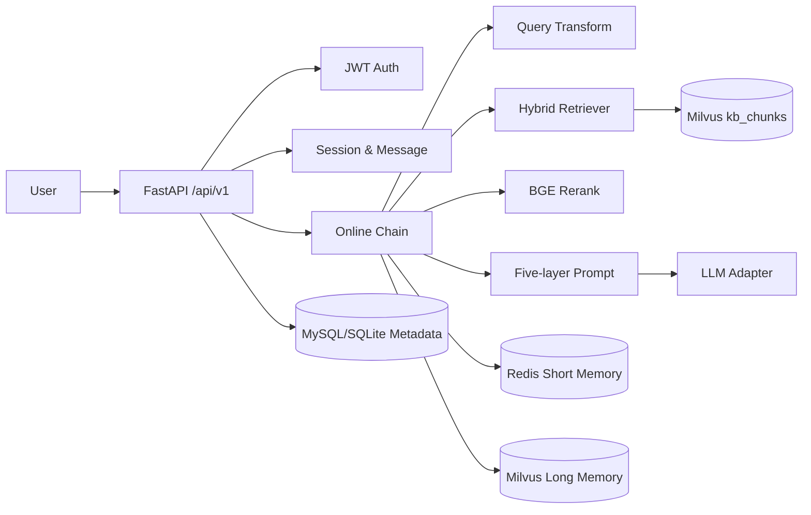

# RAG Roleplay System

基于 RAG 的多用户、多角色、多轮对话后端。系统支持角色提示词模板、角色知识库检索、Redis 短期记忆、Milvus 长期记忆、SSE 流式回答和评测/部署脚本。

## 架构



## 快速开始

```powershell
cd "D:\桌面\跑通验证"
python -m pip install -r requirements.txt
copy .env.example .env

# 中间件：MySQL / Redis / Milvus / Attu
# Docker Desktop 已启动后执行
docker compose -f docker-compose.middleware.yml -p rag-roleplay up -d

# 启动新主应用（端口 8902；backend 主线用 8901，两条线分开端口才能同时运行）
python -m uvicorn src.api.main:app --host 127.0.0.1 --port 8902
```

> ⚠️ **知识库数据不在交付文件里，首次运行必须自己构建一次。**
> 向量数据存在 Milvus 容器内（Docker 卷），不是仓库里的文件。刚起步时集合是空的，
> 直接打开网页或调检索/问答接口会得到空结果 —— 这是正常现象，按下面「离线构建（首次运行必做）」做一遍即可。
> 另注：`docker compose down -v` 会连数据卷一起删掉，知识库随之清空，需要重建。

资源不足时可在 `.env` 中使用降级配置：

```env
EMBEDDING_BACKEND=hash
LLM_BACKEND=mock
MYSQL_URL=sqlite:///./data/rag_roleplay.sqlite3
```

这样不依赖本地大模型也能跑通注册、角色、会话、Prompt 和 API 流程；启动 Milvus 后可跑完整检索链路。

## 离线构建（首次运行必做：构建知识库）

本交付含**两套并列实现**，各有自己的向量集合与构建入口，互不依赖 —— 按你要看的那条线选一个即可。

### A. backend 主线 —— 国标文档知识库问答（集合 `rag_docs_v6`）

对应《项目总览.md》《代码说明.md》讲的那条线。

```powershell
# 注意：与 B 用的是同一个端口，两条线不能同时启动
python -m uvicorn backend.server:app --host 127.0.0.1 --port 8901
```

启动后打开 <http://127.0.0.1:8901>，在「文档构建」页签上传 `data/pdfs/` 下的 5 份国标 PDF。
后台会自动执行「解析 → 清洗 → 分块 → 向量化 → 入库」，进度与每步耗时直接显示在页面上。
解析较慢（MinerU 实测单份 3–17 分钟，5 份合计约 130 页），等进度条走完即可检索与问答。

### B. src 新架构 —— 多用户角色扮演（集合 `kb_chunks`）

```powershell
python -m src.offline.pipeline --role lawyer --input data/samples --chunk semantic --rebuild
```

正式数据按角色放入 `data/raw/<角色>/`，再把 `--input` 指向该目录：

```text
data/raw/lawyer/
data/raw/psychologist/
```

## API 示例

```powershell
# 注册
curl -X POST http://127.0.0.1:8902/api/v1/auth/register -H "Content-Type: application/json" -d "{\"username\":\"alice\",\"password\":\"password123\"}"

# 登录后把 token 放到 Authorization: Bearer <token>
curl http://127.0.0.1:8902/api/v1/roles -H "Authorization: Bearer <token>"

# 创建会话
curl -X POST http://127.0.0.1:8902/api/v1/sessions -H "Authorization: Bearer <token>" -H "Content-Type: application/json" -d "{\"role_id\":\"lawyer\"}"

# SSE 对话
curl -N -X POST http://127.0.0.1:8902/api/v1/chat/completions -H "Authorization: Bearer <token>" -H "Content-Type: application/json" -d "{\"session_id\":1,\"message\":\"合同违约怎么办？\",\"stream\":true}"
```

统一错误响应包含 `code/message/data/trace_id`；流式接口返回 `delta`、`references`、`done`、`error` 事件。

## 目录说明

- `configs/settings.py`：pydantic-settings 读取 `.env`
- `configs/roles/`：角色卡，已实现 `lawyer` 和 `psychologist`
- `src/offline/`：解析、分块、BGE-m3、Milvus、元数据、CLI 构建
- `src/online/`：查询改写、检索、rerank、五层 Prompt、LLM、后处理、链路编排
- `src/memory/`：Redis 短期记忆、Milvus 长期记忆
- `src/api/routers/`：auth / roles / sessions / chat / kb / feedback
- `evaluation/`：评测集构建和 RAGAS 报告入口
- `scripts/`：start/stop/health/deploy/load_test
- `backend/`：**国标知识库问答主线**（FastAPI + 原生前端 + Milvus 混合检索 + 角色扮演），
  即《项目总览.md》《代码说明.md》讲的那条线；与 `src/` 是两套并列实现，互不依赖

## 测试

```powershell
pytest tests/unit tests/integration -q
python -m unittest discover -s tests -v
python evaluation/build_dataset.py
python evaluation/run_ragas.py
```

## 排障 FAQ

- Docker 报 `dockerDesktopLinuxEngine` 不存在：先启动 Docker Desktop。
- **网页里知识库是空的、检索/问答没有结果**：这不是故障 —— 向量数据存在 Milvus 容器内，交付文件不含数据，先按「离线构建（首次运行必做）」构建一次。
- `/health` 返回 degraded：Milvus 未启动或 `MILVUS_URI` 配置错误。
- BGE 模型下载慢：先用 `EMBEDDING_BACKEND=hash` 跑通流程，再切回 `flag`。
- LLM 不可用：先用 `LLM_BACKEND=mock`，接入 Ollama/OpenAI-compatible 后改为 `ollama`/`local`/`api`。
- Windows 中文路径 curl 乱码：用 PowerShell 或 Python requests 调接口。

## 验收状态

- [x] 新目录结构与核心模块落地
- [x] JWT 注册登录、角色、会话、SSE 聊天接口
- [x] 离线解析/分块/Embedding/Milvus 管线
- [x] Redis 短期记忆 + Milvus 长期记忆（可降级）
- [x] pytest 与 unittest 通过
- [x] Compose 配置可解析
- [ ] Docker 引擎启动后，执行中间件真实健康检查
- [ ] Milvus 真实入库后运行完整 RAGAS 指标
