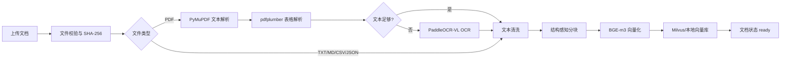
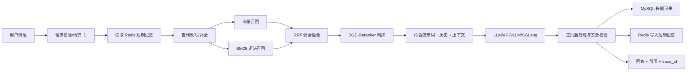
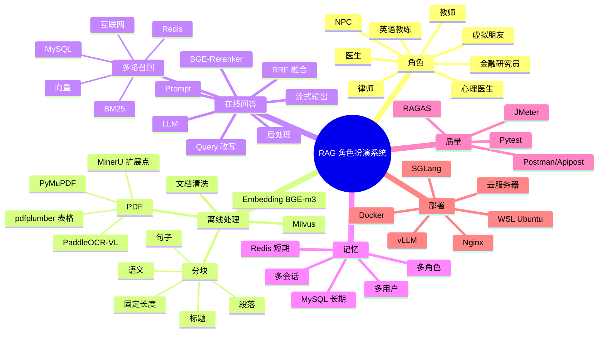

# 需求规格说明书

## 1. 项目概述

项目名称：基于 RAG 的角色扮演系统。

目标：用户选择或创建一个人物角色，通过自然语言进行多轮对话。系统根据角色提示词、会话记忆和知识库资料生成更可靠、更贴合角色的回答，并返回可追溯引用。

## 2. 用户与角色

- 普通用户：创建会话、选择角色、发送问题、查看回答和引用。
- 知识库管理员：上传、更新和检查 PDF/TXT/Markdown/CSV/JSON 文档。
- 角色配置人员：定义角色名称、性格、专业领域、语气、安全策略和知识库范围。
- 测试人员：使用 Postman/Apipost、Pytest、JMeter 和 RAGAS 检查功能、质量和性能。

角色类型包括虚拟朋友、社交陪伴、NPC、客服、医生、心理健康助手、律师、金融研究员、科学家、教师和英语教练。高风险角色必须配置免责声明、升级人工或建议线下专业服务的规则。

## 3. 功能需求

| 编号 | 功能 | 说明 |
| --- | --- | --- |
| FR-01 | 角色管理 | 创建和读取角色；保存角色提示词和知识范围 |
| FR-02 | 文档上传 | 支持 PDF/TXT/MD/CSV/JSON；记录状态、来源和错误 |
| FR-03 | 文档解析 | PDF 文本、表格、扫描件 OCR 可插拔 |
| FR-04 | 文档分块 | 标题/段落优先，过长文本按句子和重叠窗口切分 |
| FR-05 | 向量化 | BGE-m3 或本地确定性降级 embedding |
| FR-06 | 混合检索 | 向量召回、词法召回、多路融合、角色范围过滤 |
| FR-07 | 重排序 | BGE-Reranker 可选；支持 fallback |
| FR-08 | 多轮聊天 | user_id、role_id、conversation_id 隔离；Redis 保存短期记忆 |
| FR-09 | 长期记录 | MySQL/SQLite 保存用户、角色、消息和引用 |
| FR-10 | 大模型调用 | Mock、OpenAI 兼容 API、本地 vLLM/SGLang 网关 |
| FR-11 | 流式输出 | SSE 返回 meta、token、done 事件 |
| FR-12 | 可追溯性 | 返回引用片段、文档 ID、检索方式、分数和 trace_id |
| FR-13 | 评测 | RAGAS 接口和本地代理指标 |
| FR-14 | 日志 | 请求 ID、阶段耗时、异常堆栈、组件状态 |

## 4. 业务流程

### 4.1 离线知识库流程

管理员上传文档后，系统校验扩展名，保存原文件，计算 SHA-256，创建 processing 记录。解析器优先使用 PyMuPDF，pdfplumber 补充表格，文本过少时尝试 PaddleOCR-VL。规范化后的内容经过结构感知分块，再由 embedding 模型生成向量，最后写入 Milvus 或本地向量索引，并将文档状态修改为 ready。

### 4.2 在线问答流程

用户请求进入接口后生成 request_id/trace_id，读取短期记忆，对短问题做基于上一轮的查询补全，然后执行向量召回和词法召回，使用 RRF 融合并重排。系统将角色提示词、历史消息和引用上下文传给大模型，随后进行正则化后处理，保存消息与引用，并返回回答。

## 5. 业务规则

1. 用户、角色、会话使用组合键隔离，不能读取其他用户的短期记忆。
2. 角色知识范围为 `global` 时可检索全局文档；其他范围只检索 metadata 中匹配的 `role_id`。
3. 知识库没有足够证据时必须明确说明，不能伪造法条、指南、判例、行情或诊断结论。
4. 医疗、法律、金融、心理健康角色不得把系统回答表述成诊断、正式法律意见、收益承诺或危机干预替代品。
5. 上传文件必须使用安全文件名和服务端生成的存储名；禁止路径穿越。
6. 文档处理失败时保留失败记录和错误消息，不能把半成品标记为 ready。
7. API Key 仅从环境变量读取；日志不得打印 Key、完整隐私内容或系统提示词。
8. 返回引用只包含必要片段，并限制长度，降低敏感数据泄露风险。
9. 流式输出结束后才保存完整 assistant 消息；中途断开时应在生产版本增加取消状态和补偿策略。

## 6. 非功能需求

- 可维护性：解析器、Embedding、向量库、记忆、LLM 采用适配器边界。
- 可观测性：每个 HTTP 请求有 request_id，聊天有 trace_id，日志记录阶段耗时。
- 可部署性：支持 Win11 + WSL + Ubuntu、本地 Python、Docker Compose、云服务器。
- 可扩展性：可增加 Neo4j、MongoDB、ClickHouse、互联网搜索等召回通道。
- 安全性：生产环境必须增加认证、授权、限流、脱敏、HTTPS 和审计。

## 7. 思维导图

