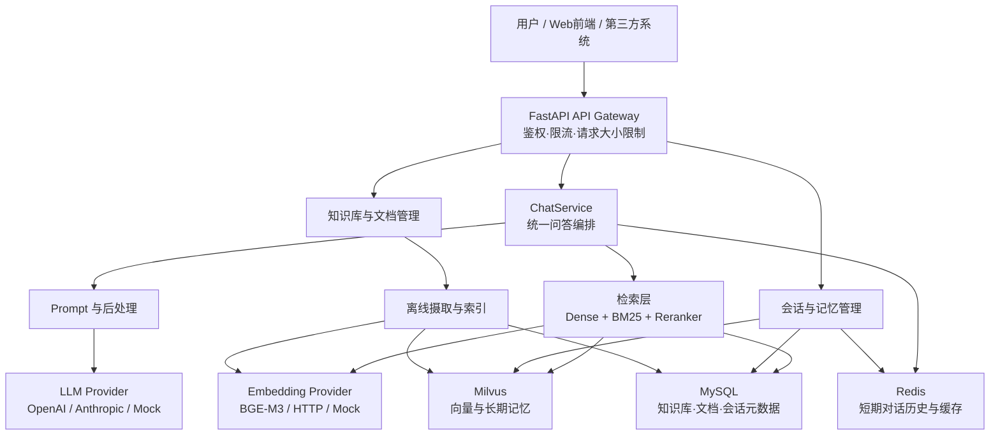
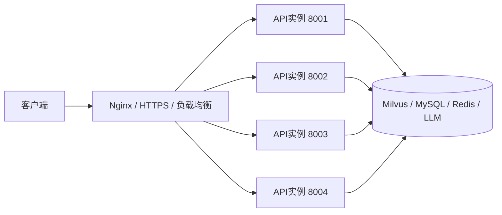

# 技术架构

## 1. 系统定位

RAG项目面向企业客服问答场景，把企业文档和客服问答数据构建为可检索知识库。用户通过 REST API 或 Web 页面提问，系统完成问题预处理、混合召回、重排序、上下文组装和 LLM 生成，并返回答案与来源片段。

## 2. 技术组件

| 层次 | 组件 | 项目中的作用 |
|---|---|---|
| 接入层 | FastAPI + Uvicorn | 提供异步 HTTP API、OpenAPI/Swagger 文档和 SSE 输出 |
| 前端层 | `static/index.html` | 提供基础 Web 问答入口 |
| 解析层 | PyMuPDF、pdfplumber、python-docx、TXT/Markdown/JSONL 适配器 | 将异构文档转换为统一文档模型 |
| 数据处理 | 清洗、质量检查、去重、分块策略 | 降噪并形成可索引文本块 |
| 向量层 | BGE-M3、HTTP Embedding 或 Mock | 将文本和问题编码为向量 |
| 向量存储 | Milvus | 保存文档块向量并执行 Dense 检索 |
| 稀疏检索 | BM25；可选 MySQL 元数据检索 | 补足关键词、编号和精确短语召回 |
| 排序层 | Lexical、本地模型或 HTTP Reranker | 对候选片段进行相关性重排和阈值过滤 |
| 生成层 | OpenAI、Anthropic 或 Mock | 根据上下文生成客服答案 |
| 记忆层 | Redis、MySQL、Milvus | 分别保存短期历史、会话元数据和长期记忆 |
| 安全与运维 | API Key、限流、Prometheus、健康检查 | 控制访问、观察性能和检查依赖状态 |

## 3. 总体架构

## 4. 部署拓扑

开发环境可单实例运行；生产环境可由 Nginx 反向代理多个 Uvicorn 实例。Milvus、MySQL 和 Redis 可以使用 Docker 或系统服务部署。

## 5. 运行模式

- **Mock 模式**：Embedding、LLM 可使用 Mock，适合开发和离线链路验证；
- **外部模型模式**：Embedding 和 LLM 通过 HTTP/API 接入，适合服务化部署；
- **本地模型模式**：可将 BGE-M3、Reranker 或本地 LLM 放在带 NVIDIA GPU 的 Conda 环境中运行；
- **持久化模式**：配置 `DATABASE_URL` 后启用 MySQL 元数据和会话能力，配置 Redis 后启用短期记忆。

## 6. 关键安全设计

生产环境将 `APP_ENV` 设置为 `production` 后，必须配置 `API_KEY` 或 `API_KEY_IDENTITIES`；请求身份来自服务端凭证，不信任请求体中的用户和租户字段。对外暴露服务时应同时配置 HTTPS、反向代理访问控制、密钥轮换和数据库最小权限。
