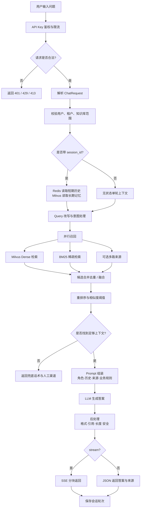
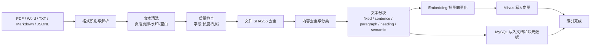
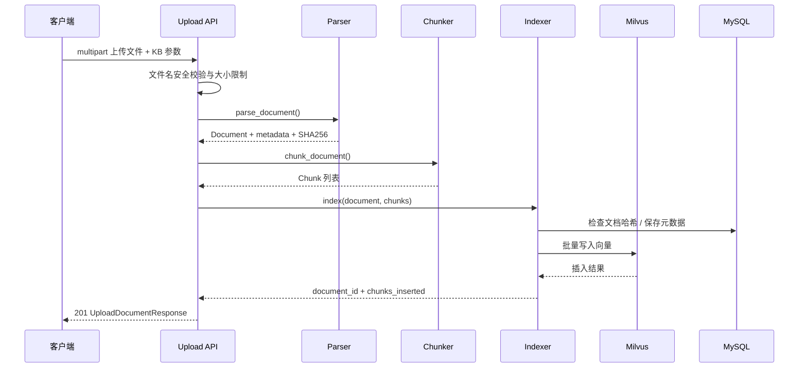
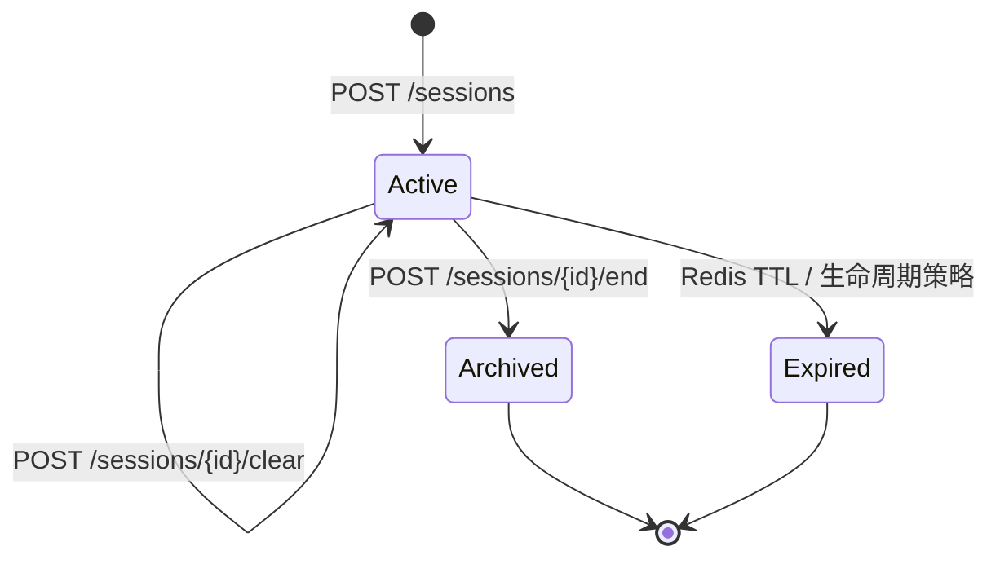

# 业务与数据流程图

## 1. 用户问答业务流程

## 2. 离线知识库构建流程

## 3. 文档上传数据流

## 4. 会话生命周期

## 5. 数据存储边界

| 数据 | 存储 | 生命周期 |
|---|---|---|
| 原始上传文件 | `DOCUMENT_STORAGE_PATH` | 文档处理期间或按部署策略保留 |
| 文档、块和知识库元数据 | MySQL | 持久化 |
| 文档向量 | Milvus | 持久化，可按文档删除 |
| 当前会话消息 | Redis | 滑动窗口 / TTL |
| 用户偏好和长期摘要 | Milvus 记忆集合 | 跨会话持久化 |
| API 指标 | Prometheus 采集端 | 由监控系统保留 |
