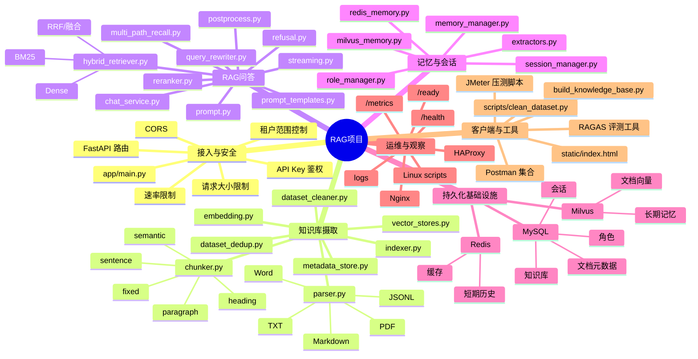
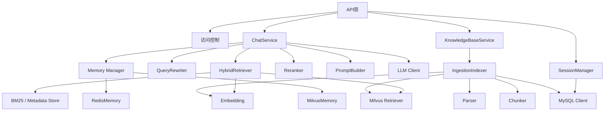

# 模块思维导图

## 模块依赖关系

## 代码职责速览

- `app/api/v1/`：HTTP 路由、请求模型、身份范围和依赖装配；
- `app/ingestion/`：文档解析、数据清洗、分块、Embedding、向量索引；
- `app/rag/`：检索、重排、提示词、生成、后处理和流式响应；
- `app/memory/`：会话生命周期、短期/长期记忆和角色管理；
- `app/llm/`：不同 LLM 提供商的统一客户端接口；
- `app/core/`：配置、安全、指标和请求限制；
- `scripts/`：离线清洗、评测、可视化和运维辅助工具；
- `deploy/`：Linux 启停脚本及反向代理配置。
