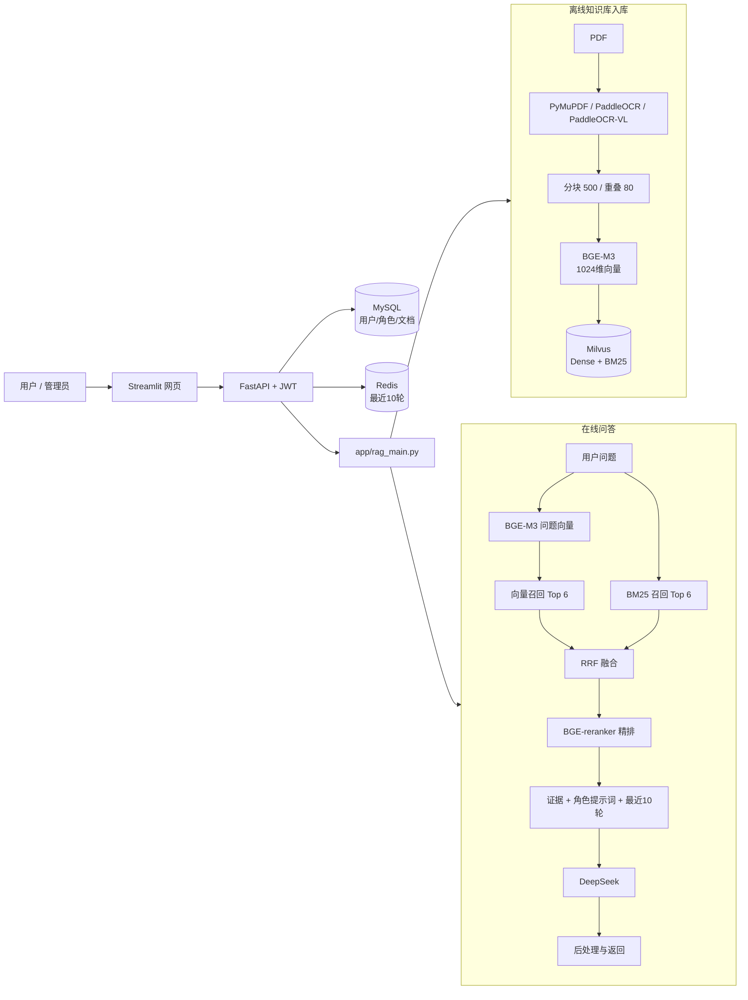

# 基于 RAG 的多角色知识库问答系统

这是一个可在 Windows + Docker Desktop + Python 环境运行的完整 RAG 项目。系统支持多用户、角色提示词、PDF 知识库、混合检索、重排序、多轮对话、管理员权限和 RAGAS 评测。当前默认角色是“医疗健康教育助手”，知识库也可以上传其他领域 PDF。

项目主要用于学习、演示和答辩。最核心的代码是 `app/rag_main.py`，它把 PDF 解析、分块、向量化、Milvus 入库、混合检索、重排序、提示词组装、DeepSeek 生成和后处理集中在一个文件中，便于顺着一条主线阅读。

> 系统提供知识检索和一般健康教育，不替代医生诊断、面诊或治疗建议。

## 一、答辩开场怎么介绍

可以用下面这段话开场：

> 我的项目是一个基于 RAG 的多角色知识库问答系统。离线阶段将 PDF 中的文字、表格和图片内容提取出来，经过清洗、分块后，使用 BGE-M3 生成 1024 维向量，并存入 Milvus。Milvus 同时保存原文并建立 BM25 稀疏索引。在线问答阶段，用户问题同时进行向量召回和 BM25 关键词召回，使用 RRF 融合两路结果，再用 BGE-reranker 精排，最后把检索证据、角色提示词和 Redis 中最近 10 轮对话交给 DeepSeek 生成答案。MySQL 保存用户、角色和文档元数据，Redis 保存短期记忆，JWT 负责登录认证和用户隔离。

项目解决的核心问题是：让大模型优先依据用户上传的资料回答，降低知识过时和无依据编造的问题，并且让回答能够追溯到具体来源。

## 二、项目整体架构



系统分为三层：

1. `web_ui.py` 是展示层，提供登录、聊天和知识库管理页面。
2. `app/main.py` 与 `app/routers/` 是接口层，负责 JWT 权限、参数校验和业务入口。
3. `app/rag_main.py` 是 RAG 核心层，负责离线入库和在线问答。

## 三、离线入库流程：上传 PDF 后发生了什么

离线入口是 `app/rag_main.py` 中的 `build_index()`。API 在 `app/routers/knowledge_routes.py` 中调用它。

### 第 1 步：校验并保存 PDF

管理员调用 `POST /api/v1/knowledge/documents` 上传文件。系统检查：

- 当前用户是否为管理员。
- `role_id` 对应的角色是否存在。
- 文件扩展名是否为 `.pdf`。
- 文件开头是否为 `%PDF-`，避免仅修改扩展名的伪 PDF。
- 文件是否超过 `MAX_UPLOAD_MB=20` MB。

文件保存到 `data/uploads/`，MySQL 的 `documents` 表记录原文件名、保存路径、所属用户、所属角色和处理状态。

### 第 2 步：快速基础解析

函数：`extract_pdf_text(path, use_visual=False)`。

首次索引强调“尽快可检索”，因此先执行速度较快的解析：

| 内容 | 工具或模型 | 实现方式 |
|---|---|---|
| PDF 原生文字 | PyMuPDF（`fitz`） | `page.get_text("text")` |
| 有边框或可检测表格 | PyMuPDF | `page.find_tables()` 后按行转为文本 |
| 扫描页 | PaddleOCR | 页面渲染成图片后进行文字检测和识别 |
| 普通文本页中的嵌入图片 | 第二阶段处理 | 避免视觉模型阻塞首次入库 |

基础 PaddleOCR 使用本地 `PP-OCRv6_medium_det` 和 `PP-OCRv6_medium_rec`。当前关闭文档方向分类、图像矫正和文本行方向模型，以降低 CPU 消耗。

解析完成后执行 `remove_repeated_watermarks()` 文本去水印。系统统计每页出现的短文本，默认将“至少出现在 3 页、覆盖 60% 页面、长度不超过 80 字符”的重复内容视为页眉、页脚或文字水印，并在切块前删除。包含 `|` 的表格行不会作为水印删除。该过程只清理进入 RAG 的文本，不修改用户上传的原始 PDF，也不处理覆盖正文的复杂图片水印。

| 去水印配置 | 默认值 | 作用 |
|---|---:|---|
| `WATERMARK_REMOVAL_ENABLED` | `true` | 是否启用文本去水印 |
| `WATERMARK_MIN_PAGES` | `3` | 至少在多少页重复 |
| `WATERMARK_PAGE_RATIO` | `0.6` | 至少覆盖文档多少比例的页面 |
| `WATERMARK_MAX_CHARS` | `80` | 参与判断的单行最大字符数 |

### 第 3 步：文本清洗和分块

函数：`clean_text()` 和 `chunk_text()`。

| 参数 | 当前值 | 作用 |
|---|---:|---|
| `CHUNK_SIZE` | 500 | 每个文本块的目标最大字符数 |
| `CHUNK_OVERLAP` | 80 | 相邻块保留 80 个字符上下文 |

分块先识别段落，再按中英文句号、问号、感叹号和分号切句。短句依次合并到 500 字左右；超过限制时产生新块，并把上一块末尾 80 字带入新块。

为什么需要重叠：如果一个事实正好跨越两个分块边界，完全不重叠可能导致语义被截断。重叠可以提高召回完整信息的概率，但也会增加少量存储和重复内容。

### 第 4 步：BGE-M3 向量化

函数：`embedding_model()` 和 `encode_documents()`。使用模型：`BAAI/bge-m3`。

| 参数 | 当前值 | 说明 |
|---|---:|---|
| 设备 | `cpu` | 当前电脑没有使用 CUDA |
| 向量维度 | 1024 | 必须与 Milvus collection 字段一致 |
| `batch_size` | 8 | 每批编码 8 个文本块 |
| `normalize_embeddings` | `true` | 将向量归一化，适合余弦相似度 |
| 离线加载 | `true` | 直接读取 D 盘模型，不在运行时下载 |

每个分块会得到一个 1024 维浮点向量。问题向量和文档向量使用同一个模型，才能处于同一语义空间。

### 第 5 步：写入 Milvus

函数：`ensure_collection()` 和 `build_index()`。

| 字段 | 用途 |
|---|---|
| `id` | 分块唯一 ID，由文档 ID 和分块序号稳定生成 |
| `document_id` | 对应 MySQL 文档 ID |
| `owner_id` | 文档所有者，用于用户隔离 |
| `role_id` | 文档所属角色 |
| `is_public` | 是否允许其他用户检索 |
| `source` | 来源 URL 或原文件名 |
| `summary` | 分块前 120 字摘要 |
| `text` | 分块原文，也是 BM25 输入字段 |
| `dense_vector` | BGE-M3 的 1024 维向量 |
| `sparse_vector` | Milvus 根据 `text` 自动生成的 BM25 稀疏向量 |
| `created_at` / `updated_at` | 创建和更新时间 |

稠密向量使用 HNSW 索引，参数为 `M=16`、`efConstruction=200`，距离度量使用 `COSINE`。稀疏检索使用 `SPARSE_INVERTED_INDEX + BM25`。

### 第 6 步：生成知识库首页目录

函数：`classify_document()` 和 `update_document_catalog()`。

DeepSeek 根据文档前 12000 个字符生成文档分类、准确标题、一句话摘要和 3～5 个可回答问题。分类调用参数为 `temperature=0.1`，并要求返回 JSON。低温度让分类结果更稳定。DeepSeek 不可用时，程序根据文件名和正文开头生成兜底目录，不影响知识库入库。

### 第 7 步：PaddleOCR-VL 后台视觉增强

基础索引完成后文档立刻进入 `ready` 状态，用户已经可以查询。随后系统启动后台视觉增强：

1. 提取 PDF 中较大的嵌入图片和表格区域。
2. 基础 OCR 中出现“图表、占比、趋势、百分比”等词时选择 `Chart Recognition`。
3. OpenCV 检测到较多横线和竖线时选择 `Table Recognition`。
4. 其他图片选择 `OCR`。
5. PaddleOCR-VL 输出经过控制符清洗后重新分块和向量化。
6. 使用 Milvus `upsert` 更新相同分块 ID。

| 参数 | 当前值 | 作用 |
|---|---:|---|
| 模型 | `PaddleOCR-VL-1.6` | 图片文字、表格和图表理解 |
| `PADDLEOCR_VL_MAX_NEW_TOKENS` | 256 | 单张图片最大生成长度 |
| `PADDLEOCR_VL_MAX_PIXELS` | 501760 | 控制输入图像规模和 CPU 耗时 |
| `PADDLEOCR_VL_MAX_IMAGES_PER_PAGE` | 4 | 每页最多处理 4 张嵌入图片 |
| CPU 数据类型 | `float32` | 当前 CPU 上比 bfloat16 更稳定 |

视觉增强使用全局锁串行执行，避免多个模型推理任务同时耗尽内存。任何视觉识别异常都会记录日志并保留基础索引，不影响已经可用的知识库。

## 四、在线问答流程：用户提问后发生了什么

在线入口是 `POST /api/v1/chat`。核心函数是 `hybrid_search()` 和 `generate_answer()`。

### 第 1 步：JWT 认证和角色检查

客户端在请求头携带 `Authorization: Bearer <JWT>`。JWT 使用 HS256 签名，默认有效期 24 小时。接口从令牌读取用户 ID，再从 MySQL 查询用户是否仍然有效。系统还会检查 `role_id` 是否存在且公开；角色的 `system_prompt` 决定大模型身份、语气和回答边界。

### 第 2 步：问题向量化

用户问题使用同一个 BGE-M3 转换成 1024 维归一化向量。模型通过 `lru_cache` 只加载一次，后续请求复用内存中的模型。

### 第 3 步：Dense 向量召回

Milvus 使用问题向量在 `dense_vector` 字段执行 HNSW + COSINE 检索：

- `TOP_K_DENSE=6`：取语义最接近的 6 个分块。
- 查询参数 `ef=64`：搜索更多候选节点，提高召回质量。

向量检索擅长处理表达不同但含义接近的问题，例如“血压偏高怎么办”和“高血压管理建议”。

### 第 4 步：BM25 关键词召回

同一个问题在 `sparse_vector` 字段进行 BM25 检索，`TOP_K_SPARSE=6`。BM25 擅长精确词、专有名词、数字和法规名称。

### 第 5 步：RRF 融合

函数：`reciprocal_rank_fusion()`。

```text
RRF_score(d) = Σ 1 / (60 + rank_i(d))
```

`rank_i(d)` 是文档块在第 i 路召回中的排名。RRF 使用排名而不是直接相加原始分数，因为余弦相似度和 BM25 分数不在同一量纲上。一个分块如果同时被两路召回，会获得更高融合分数。

融合后最多保留 `max(TOP_K_FINAL × 3, 12)` 个候选。当前 `TOP_K_FINAL=3`，因此进入重排序的候选最多为 12 个。

### 第 6 步：BGE-reranker 精排

使用模型：`BAAI/bge-reranker-base`。

BGE-M3 将问题和文档分别编码，速度快，适合大规模召回；reranker 把“问题 + 候选文本”共同输入，判断更精确，但计算更慢。因此项目采用“先召回、后精排”。精排后默认保留 3 个证据块。

### 第 7 步：用户级数据隔离

每次 Milvus 查询都带过滤条件：

```text
role_id == 当前角色 AND (is_public == true OR owner_id == 当前用户)
```

用户只能检索当前角色允许的公开资料或自己拥有的资料。JWT 提供可信用户 ID，客户端不能随意指定其他用户。

### 第 8 步：读取最近 10 轮对话

Redis Key 格式：

```text
chat:{user_id}:{role_id}:{session_id}
```

每轮保存一条 user 和一条 assistant 消息。Redis List 只保留最后 20 条，也就是最近 10 轮。当前按需求不设置 TTL，用户可以主动清空记忆。

### 第 9 步：组装提示词并调用 DeepSeek

发送给 DeepSeek 的内容包括角色系统提示词、知识库策略与安全约束、Redis 最近 10 轮、带编号的检索证据和当前问题。

| 参数 | 当前值 | 说明 |
|---|---:|---|
| 模型 | `deepseek-chat` | 在线生成答案 |
| `temperature` | 0.2 | 降低随机性，增强事实稳定性 |
| 请求超时 | 90 秒 | 避免外部 API 长期阻塞 |
| `GENERAL_KNOWLEDGE_FALLBACK` | `true` | 未命中时允许通用回答并明确标注 |

未配置 DeepSeek API 时，系统直接返回最相关的知识库原文。

### 第 10 步：后处理和返回

`postprocess()` 删除 `<think>...</think>` 推理标签、合并多余空行，并确保医疗免责声明存在。接口返回 `answer`、`sources` 和 `session_id`。急症关键词如“胸痛、呼吸困难、意识不清、自杀”等会在调用大模型前直接分流。

## 五、项目使用的模型

| 模型 | 存放位置 | 用于哪一步 | 是否启用 |
|---|---|---|---|
| BGE-M3 | `D:\models_bge_ocr\huggingface\hub\...bge-m3...` | 文档和问题向量化 | 是 |
| BGE-reranker-base | `D:\models_bge_ocr\bge-reranker-base` | RRF 后候选精排 | 是 |
| PP-OCRv6 medium det | `D:\models_bge_ocr\paddlex\official_models` | 图片文字区域检测 | 是 |
| PP-OCRv6 medium rec | `D:\models_bge_ocr\paddlex\official_models` | 图片文字识别 | 是 |
| PaddleOCR-VL-1.6 | `D:\models_bge_ocr\PaddleOCR-VL-1.6` | 图片、复杂表格和图表理解 | 是，后台增强 |
| DeepSeek Chat | 在线 API | 分类与最终答案生成 | 是，需要 API Key |

`PP-LCNet_x1_0_doc_ori`、`UVDoc` 和 `PP-LCNet_x1_0_textline_ori` 已存在于 PaddleX 缓存，但当前代码关闭方向分类、文档矫正和文本行方向识别，因此它们不是当前主链路的必经模型。

## 六、数据库和中间件分别做什么

| 组件 | 版本 | 保存内容 | 为什么使用 |
|---|---|---|---|
| MySQL | 8.4 | 用户、角色、文档元数据、知识目录 | 适合结构化数据、事务和关联查询 |
| Redis | 7.4 | 最近 10 轮对话 | List 读写快，适合短期会话状态 |
| Milvus | 2.5.14 | 原文、稠密向量、BM25 稀疏向量 | 同时支持向量检索和全文检索 |
| MinIO | Compose 依赖 | Milvus 对象数据 | Milvus standalone 的对象存储依赖 |
| etcd | 3.5.18 | Milvus 元数据 | Milvus 的元数据和协调依赖 |

PDF 文件本身保存在 `data/uploads/`，Milvus 保存的是 PDF 解析后的文本分块和向量。

## 七、主要文件怎么阅读

| 顺序 | 文件 | 作用 |
|---:|---|---|
| 1 | `app/config.py` | 所有环境变量和 RAG 参数的类型定义 |
| 2 | `app/main.py` | FastAPI 启动入口、初始化数据库和默认角色 |
| 3 | `app/routers/knowledge_routes.py` | PDF 上传、快速索引、视觉增强、删除和重建 |
| 4 | `app/rag_main.py` | 最主要代码，包含完整离线和在线 RAG 流程 |
| 5 | `app/routers/chat_routes.py` | 在线聊天入口：检索、记忆、生成 |
| 6 | `app/chat_memory.py` | Redis 最近 10 轮对话实现 |
| 7 | `app/models.py` | MySQL 数据表定义 |
| 8 | `app/auth.py` | 密码哈希、JWT 生成和权限校验 |
| 9 | `web_ui.py` | Streamlit 登录、聊天和知识库管理页面 |

`app/rag_main.py` 内部阅读顺序：

| 阶段 | 关键函数 | 一句话解释 |
|---|---|---|
| PDF 解析 | `extract_pdf_text()` | 汇总原生文字、表格、OCR 和可选视觉内容 |
| 文本分块 | `chunk_text()` | 生成带重叠的语义文本块 |
| 模型加载 | `embedding_model()` / `reranker_model()` | 首次调用加载，之后复用缓存 |
| Milvus 初始化 | `ensure_collection()` | 创建 Dense + BM25 混合 collection |
| 离线入库 | `build_index()` | 解析、分块、向量化、入库和目录更新 |
| 双路召回 | `_search()` | 分别查询向量字段和 BM25 字段 |
| 融合 | `reciprocal_rank_fusion()` | 将两路排名合并成统一候选列表 |
| 在线检索 | `hybrid_search()` | 双路召回、RRF 和 reranker 的总入口 |
| 文档分类 | `classify_document()` | 生成首页分类、标题、摘要和推荐问题 |
| 回答生成 | `generate_answer()` | 拼提示词、历史、证据并调用 DeepSeek |

## 八、配置文件怎么理解

| 文件 | 用途 | 是否可以公开 |
|---|---|---|
| `.env` | 当前电脑实际配置，包含密码和 API Key | 不可以 |
| `.env.example` | 无密钥的配置模板和全部参数说明 | 可以 |
| `compose.yaml` | MySQL、Redis、Milvus、MinIO、etcd | 可以 |
| `requirements.txt` | 主程序 Python 依赖和固定版本 | 可以 |
| `requirements-eval.txt` | RAGAS 评测额外依赖 | 可以 |
| `deploy/nginx.conf` | 生产环境反向代理示例 | 可以 |

| 环境变量 | 当前值 | 影响 |
|---|---:|---|
| `RERANK_ENABLED` | `true` | 是否启用 BGE 精排 |
| `OCR_ENABLED` | `true` | 是否启用基础 PaddleOCR |
| `PADDLEOCR_VL_ENABLED` | `true` | 是否进行后台视觉增强 |
| `CHUNK_SIZE` | 500 | 块太小上下文不足，太大检索不精准 |
| `CHUNK_OVERLAP` | 80 | 防止关键信息被边界截断 |
| `TOP_K_DENSE` | 6 | 向量召回数量 |
| `TOP_K_SPARSE` | 6 | BM25 召回数量 |
| `TOP_K_FINAL` | 3 | 最终送给 DeepSeek 的证据数量 |
| `GENERAL_KNOWLEDGE_FALLBACK` | `true` | 库中无答案时是否允许通用回答 |

修改 `EMBEDDING_MODEL` 后，如果新模型向量维度不是 1024，必须同步修改 `EMBEDDING_DIMENSION`，并更换 collection 名称或重建全部向量。

## 九、API 设计

基础地址：`http://127.0.0.1:8000/api/v1`。交互式文档：`http://127.0.0.1:8000/docs`。

| 方法 | URL | 权限 | 功能 |
|---|---|---|---|
| POST | `/auth/register` | 公开 | 注册普通用户 |
| POST | `/auth/login` | 公开 | 登录并返回 JWT |
| GET | `/roles` | 登录 | 查询公开角色 |
| POST | `/roles` | 管理员 | 创建角色和提示词 |
| GET | `/knowledge/catalog` | 公开 | 查询首页知识分类和快捷问题 |
| GET | `/knowledge/documents` | 管理员 | 查询知识库文档和处理状态 |
| POST | `/knowledge/documents` | 管理员 | 上传 PDF 并后台建立索引 |
| POST | `/knowledge/documents/{id}/reindex` | 管理员 | 重建指定文档索引 |
| DELETE | `/knowledge/documents/{id}` | 管理员 | 删除 PDF、MySQL 记录和 Milvus 向量 |
| POST | `/knowledge/search` | 登录 | 只执行混合检索，不生成答案 |
| POST | `/chat` | 登录 | 检索、读取记忆并生成答案 |
| DELETE | `/chat/{role_id}/{session_id}/memory` | 登录 | 清空本人当前会话记忆 |
| GET | `/health` | 公开 | 检查 FastAPI 是否运行 |

## 十、如何运行

本机 PowerShell `CurrentUser` 执行策略为 `RemoteSigned`，通常不需要重复执行 `Set-ExecutionPolicy`。

```powershell
cd C:\Users\Administrator\Desktop\rag
.\scripts\run.ps1
```

打开网页 <http://127.0.0.1:8501>，API 文档 <http://127.0.0.1:8000/docs>。

停止：

```powershell
cd C:\Users\Administrator\Desktop\rag
.\scripts\shutdown.ps1
```

当前窗口仍禁止脚本时可临时执行：

```powershell
Set-ExecutionPolicy -Scope Process Bypass
```

## 十一、答辩现场演示顺序

1. 打开 Docker Desktop，展示 `medical-rag` 下的五个服务。
2. 执行 `scripts/run.ps1`，展示 API 和网页地址。
3. 用管理员登录，在知识库管理页上传测试 PDF。
4. 展示文档从“处理中”变为“可检索”和分块数量。
5. 展示系统自动生成的分类、标题和快捷问题。
6. 问语义问题，展示混合检索和有依据回答。
7. 问 PDF 图片或图表问题，展示视觉增强效果。
8. 连续追问，展示 Redis 多轮记忆；清空后再次追问。
9. 打开 Swagger 或 Postman，展示 JWT 和完整 API。
10. 运行测试和 RAGAS，展示工程质量与评测指标。

推荐演示问题：

```text
低空飞行培训主要包括哪些内容？
PDF 第 3 页图表中的五个细分领域分别是什么，各占多少？无法辨认的数值不要猜测。
高血压日常饮食要注意什么？
```

## 十二、RAGAS 如何评测

`evaluation/run_ragas.py` 会登录真实 API，调用 `/chat`，收集答案和上下文，再用 DeepSeek 作为评判模型、本地 BGE 作为 embedding。

```powershell
.\.venv\Scripts\python.exe evaluation\run_ragas.py
```

| 指标 | 含义 | 优化方向 |
|---|---|---|
| `faithfulness` | 回答是否忠于检索证据 | 提示词约束、提高召回相关性、减少无依据扩展 |
| `answer_relevancy` | 回答是否直接回应问题 | Query 改写、精排、减少无关内容 |
| `context_precision` | 排在前面的上下文是否相关 | 分块优化、混合检索、reranker、分数过滤 |

评测问题、标准答案和上传资料必须对应，否则评分反映的是数据不匹配，而不是系统能力。

## 十三、常见答辩问题和回答

### 1. 为什么使用 RAG，而不是直接调用大模型？

大模型知识可能过时，也不了解用户私有 PDF。RAG 在回答前检索本地知识库，把证据交给大模型，可以动态更新知识、提供来源，并降低无依据编造。

### 2. 为什么同时使用向量检索和 BM25？

向量检索擅长语义相似，BM25 擅长精确关键词、数字和专有名词。两者互补，比单一路径更稳定。

### 3. 为什么用 RRF，不直接相加两路分数？

余弦相似度和 BM25 分数范围不同，直接相加没有统一含义。RRF 只依赖排名，可以稳定融合异构召回结果。

### 4. reranker 和 embedding 模型有什么区别？

BGE-M3 将问题和文档分别编码，适合快速召回；BGE-reranker 联合读取问题和候选文本，更精确但更慢，所以只处理少量候选。

### 5. 为什么分块是 500、重叠是 80？

500 字能保留一段相对完整的中文语义，又不会让一个块包含太多主题；80 字重叠保护跨边界信息。这是工程初始值，后续通过 RAGAS 和业务数据调优。

### 6. 为什么使用 Milvus？

Milvus 支持 HNSW、余弦距离、标量过滤和 BM25。一个 collection 就能完成稠密与稀疏混合检索，并按用户和角色过滤。

### 7. MySQL、Redis 和 Milvus为什么不能只留一个？

MySQL 管理结构化业务关系和事务；Redis 管理高频短期会话；Milvus 管理高维向量和全文检索。三者职责不同。

### 8. PDF 中的图片和表格怎么处理？

原生表格由 PyMuPDF 抽取，扫描页由 PaddleOCR 识别。复杂图片、图表和表格在基础索引完成后交给 PaddleOCR-VL，结果再更新到 Milvus。

### 9. 为什么视觉理解放到第二阶段？

CPU 上 PaddleOCR-VL 单张复杂图片可能需要数分钟。如果它阻塞首次入库，文档会长期无法检索。两阶段设计先保证基础内容可用，再异步增强视觉信息。

### 10. PaddleOCR-VL 失败会怎样？

异常被捕获并写入日志，基础 OCR 和已经建立的 Milvus 索引继续保留，文档不会因此无法检索。

### 11. 多用户隔离怎么实现？

JWT 确定当前用户，Milvus 每条分块保存 `owner_id`、`role_id` 和 `is_public`，查询时服务端生成过滤表达式限制范围。

### 12. 多轮对话为什么用 Redis？

对话历史读写频繁、结构简单，Redis List 适合追加和裁剪。系统保留最后 20 条消息，即 10 轮。

### 13. 知识库如何动态更新？

管理员可以上传、删除和重建。上传和重建重新解析并写入向量；删除同时清理 PDF、MySQL 元数据、首页目录和 Milvus 分块。

### 14. 如何降低大模型幻觉？

混合检索、RRF 和 reranker 提高证据质量；提示词要求优先引用知识库；资料不足时标注通用知识；医疗高风险问题增加规则分流。

### 15. 系统性能瓶颈在哪里？

CPU 上主要瓶颈是 PaddleOCR-VL，其次是 BGE-reranker 和首次模型加载。可以使用 GPU、量化、批处理、任务队列和缓存优化。

### 16. 如果并发增加怎么扩展？

把视觉索引迁移到 Celery/RQ；API 部署多个实例并由 Nginx 负载均衡；Milvus 独立部署；生成端使用 vLLM 或云端模型服务。

### 17. 项目目前有哪些不足？

当前视觉增强使用进程内线程，API 重启会中断任务；CPU 推理慢；没有知识库版本管理；视觉增强没有独立进度字段；RAGAS 示例集较小。生产版本需要任务队列、GPU、监控和更完整数据集。

### 18. RAGAS 低分说明什么？

faithfulness 低通常表示答案超出证据；context precision 低表示召回不相关；answer relevancy 低表示回答偏题。应先检查评测问题和资料是否匹配，再定位分块、检索、精排或提示词。

## 十四、测试与验收

```powershell
.\.venv\Scripts\python.exe -m unittest discover -s tests -v
.\.venv\Scripts\python.exe scripts\check_py_lines.py
Invoke-RestMethod http://127.0.0.1:8000/health
```

其他测试资源：

- `tests/postman_collection.json`：Postman/APIpost 接口测试。
- `tests/jmeter_chat.jmx`：JMeter 压力测试。
- `tests/smoke_api.py`：上传、索引和问答冒烟测试。
- `output/pdf/medical_knowledge_sample.pdf`：医疗文字 PDF。
- `output/pdf/multimodal_medical_test.pdf`：文字、表格和图片混合 PDF。

## 十五、开发和生产环境说明

当前开发环境使用 Python 3.12、Docker Desktop 和本地 CPU 模型。Ubuntu 22.04 可执行：

```bash
chmod +x scripts/*.sh
./scripts/install.sh
./scripts/run.sh
```

生产环境需要使用强密码、不提交 `.env`、配置 Nginx HTTPS、限制数据库端口、备份 Docker volumes，并使用 GPU 或独立推理服务处理 PaddleOCR-VL。

## 十六、补充设计文档

- `docs/RAG_ARCHITECTURE.md`：RAG 离线和在线流程架构。
- `docs/REQUIREMENTS.md`：需求规格、业务流程和规则。
- `docs/DESIGN.md`：技术架构和功能设计。
- `docs/API.md`：HTTP JSON 接口说明。
- `evaluation/README.md`：RAGAS 评测说明。
