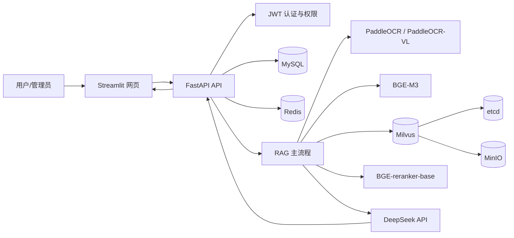
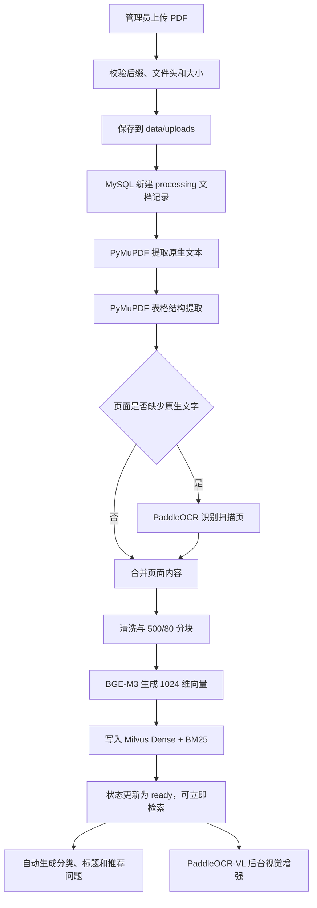
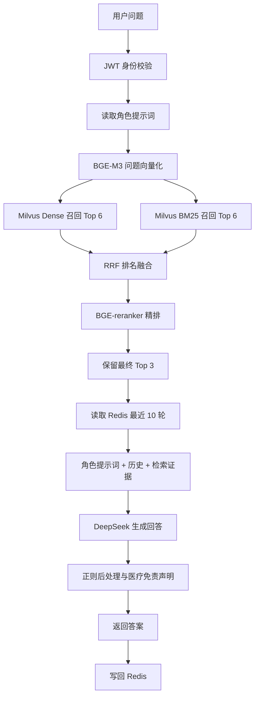

# 基于 RAG 的多角色知识库问答系统项目报告

> 项目名称：Medical RAG 多角色知识库问答系统  
> 报告日期：2026 年 9 月 23 日  
> 运行环境：Windows、Docker Desktop、Python、CPU  
> 项目位置：`C:\Users\Administrator\Desktop\rag`

---

## 一、项目概述

本项目实现了一套可在个人电脑运行的 RAG（Retrieval-Augmented Generation，检索增强生成）知识库问答系统。管理员可以上传 PDF，系统自动完成文档解析、分块、向量化和 Milvus 入库；普通用户登录后可以围绕知识库进行多轮问答。

系统以医疗健康教育为当前演示场景，但文档分类、标题生成和检索流程并不限定医疗领域，后续可以扩展到法律、金融、教育、客服和 NPC 等角色。

项目当前核心能力如下：

- JWT 登录认证、管理员权限和多用户访问。
- 多角色配置和角色提示词。
- PDF 原生文本、表格、图片和扫描页解析。
- BGE-M3 文本向量化。
- Milvus Dense 向量召回与 BM25 关键词召回。
- RRF 多路融合与 BGE-reranker 精排。
- Redis 保存最近 10 轮短期对话记忆，不设置 TTL。
- DeepSeek API 生成最终答案。
- MySQL 保存用户、角色、文档状态和知识目录。
- 知识库上传、查询、删除、重建和目录展示。
- RAGAS 质量评估、Python 单元测试和 JMeter 压力测试。

---

## 二、需求完成情况

| 需求 | 完成情况 | 实现说明 |
|---|---:|---|
| PDF 上传与解析 | 已完成 | 支持原生文本、表格、扫描页和图片 |
| 图片文字 OCR | 已完成 | PaddleOCR PP-OCRv6 检测与识别 |
| 图片、表格视觉理解 | 已完成 | PaddleOCR-VL 后台增强 |
| 文档分块 | 已完成 | 默认 500 字符，重叠 80 字符 |
| BGE-M3 向量化 | 已完成 | CPU 本地推理，1024 维向量 |
| Milvus 向量数据库 | 已完成 | 存储文本、向量、来源、用户和角色字段 |
| BM25 混合检索 | 已完成 | Milvus 内置 BM25 稀疏向量 |
| 多路召回 | 已完成 | Dense 与 BM25 双路召回 |
| RRF 融合 | 已完成 | 使用倒数排名融合异构检索结果 |
| BGE 重排序 | 已完成 | `BAAI/bge-reranker-base` 精排 |
| 大模型生成 | 已完成 | 当前使用 DeepSeek 在线 API |
| 多轮对话 | 已完成 | Redis 保存最近 10 轮 |
| 多用户、用户隔离 | 已完成 | JWT 用户身份与 Milvus 过滤表达式 |
| 多角色 | 已完成 | MySQL 角色表和角色提示词 |
| 动态知识库 | 已完成 | 上传、删除、重建索引 API |
| RAGAS 评估 | 已完成 | 诚实度、回答相关性、上下文精度 |
| JMeter 压力测试 | 已完成 | 2 并发和 5 并发实测 |
| vLLM 本地生成 | 未启用 | 当前生成端为 DeepSeek API，可后续替换 |
| Word、Excel 直接上传 | 未实现 | 当前上传接口仅接受 PDF |
| 持久化任务队列 | 未实现 | 当前使用进程内线程，并提供重启恢复 |

---

## 三、总体技术架构



### 3.1 应用层

- `Streamlit`：用户登录、知识目录、快捷提问、聊天和管理员知识库管理。
- `FastAPI`：认证、角色、文档、检索和聊天接口。
- `SQLAlchemy`：访问 MySQL。

### 3.2 数据层

- `MySQL 8.4`：用户、角色、文档、处理状态、首页目录和推荐问题。
- `Redis 7.4`：最近 10 轮对话短期记忆。
- `Milvus 2.5.14`：文本块、稠密向量、BM25 稀疏向量和元数据。
- `etcd 3.5.18`：Milvus 元数据协调。
- `MinIO`：Milvus 对象数据存储。

### 3.3 模型层

| 模型 | 用途 | 当前位置 |
|---|---|---|
| BGE-M3 | 文档和问题向量化 | `D:\models_bge_ocr\huggingface\hub\models--BAAI--bge-m3` |
| BGE-reranker-base | 候选文本精排 | `D:\models_bge_ocr\bge-reranker-base` |
| PP-OCRv6 medium det | 文字区域检测 | `D:\models_bge_ocr\paddlex\official_models\PP-OCRv6_medium_det` |
| PP-OCRv6 medium rec | 中文文字识别 | `D:\models_bge_ocr\paddlex\official_models\PP-OCRv6_medium_rec` |
| PaddleOCR-VL 1.6 | 图片、图表、复杂表格理解 | `D:\models_bge_ocr\PaddleOCR-VL-1.6` |
| DeepSeek Chat | 最终回答生成和目录分类 | 在线 API |

---

## 四、完整运行流程

### 4.1 系统启动流程

1. 用户执行 `scripts/run.ps1`。
2. Docker Compose 启动 MySQL、Redis、etcd、MinIO 和 Milvus。
3. FastAPI 连接数据库并创建缺失的数据表。
4. 系统检查并创建默认管理员与医疗健康教育角色。
5. 系统扫描 MySQL 中状态为 `processing` 的文档，自动恢复上次中断的索引任务。
6. Streamlit 启动网页界面。
7. API 地址为 `http://127.0.0.1:8000/docs`。
8. 网页地址为 `http://127.0.0.1:8501`。

### 4.2 PDF 离线入库流程



系统采用“两阶段入库”：

1. **基础索引阶段**：优先利用 PDF 原生文字和表格结构，快速写入 Milvus。
2. **视觉增强阶段**：在基础索引可用后，后台处理图片、图表和无法结构化提取的表格。

这样设计的原因是 PaddleOCR-VL 在 CPU 上计算量很大。如果把全部视觉识别放在首次入库前，用户会长时间看不到可检索状态。当前代码还会跳过已经成功提取的原生表格，避免视觉模型重复处理。

### 4.3 在线问答流程



### 4.4 检索算法

1. **Dense 语义召回**：BGE-M3 将问题编码为 1024 维向量，以 COSINE 相似度搜索。
2. **BM25 关键词召回**：适合医学名词、数字、药物名称和精确短语。
3. **RRF 融合**：使用 `1 / (60 + rank)` 融合两路排名，避免直接比较不同量纲的分数。
4. **BGE 重排序**：对问题与候选文本进行交叉编码，得到更准确的相关性顺序。
5. **权限过滤**：检索条件包含角色 ID、公开标记和所有者 ID，实现用户级数据隔离。

### 4.5 生成与防幻觉策略

- 优先要求大模型依据检索证据回答并标注资料编号。
- 无直接知识库依据时，允许使用通用知识，但必须明确声明知识库没有直接依据。
- 禁止伪造知识库引用。
- 医疗角色不能冒充医生、诊断疾病或擅自调整处方。
- 检测到胸痛、呼吸困难、昏迷等急症词时，直接建议拨打 120 或前往急诊。
- 后处理删除 `<think>` 等推理标签，并附加医疗免责声明。

---

## 五、数据库设计与数据流向

### 5.1 MySQL

主要数据表：

- `users`：账号、密码哈希、管理员标记和启用状态。
- `roles`：角色名称、描述和系统提示词。
- `documents`：PDF 路径、所属用户、角色、状态、分块数量和错误信息。
- `document_catalogs`：文档分类、标题、摘要和推荐问题。

### 5.2 Redis

Redis 按用户、角色和会话 ID 隔离聊天记录，只保留最近 10 轮。当前不设置 TTL，因此会话不会因超时自动删除，但用户可以通过 API 或网页清空。

### 5.3 Milvus

Collection 名称为 `medical_chunks_bge_m3`，主要字段如下：

- `id`：文档 ID 与分块序号生成的稳定 UUID。
- `document_id`：关联 MySQL 文档。
- `owner_id`：文档所有者。
- `role_id`：所属角色。
- `is_public`：是否公开。
- `source`：文件名或来源 URL。
- `summary`：分块摘要。
- `text`：向量对应原文，同时作为 BM25 输入。
- `dense_vector`：BGE-M3 生成的 1024 维向量。
- `sparse_vector`：Milvus BM25 函数生成的稀疏向量。

### 5.4 当前实际知识库状态

截至本报告生成时：

- 角色：`医疗健康教育助手`，角色 ID 为 1。
- 文档：`国家基层高血压防治管理指南2020版.pdf`。
- 文档 ID：12。
- 状态：`ready`。
- Milvus 分块数：87。
- 实测问题：`高血压患者的降压目标是多少？`
- 检索结果成功命中：一般高血压患者血压降至 `140/90 mmHg 以下`。

---

## 六、API 设计

API 统一前缀为 `/api/v1`。

| 方法 | 地址 | 权限 | 功能 |
|---|---|---|---|
| POST | `/auth/register` | 公开 | 注册用户并返回 JWT |
| POST | `/auth/login` | 公开 | 登录并返回 JWT |
| GET | `/roles` | 登录用户 | 查询角色 |
| POST | `/roles` | 管理员 | 新建角色 |
| GET | `/knowledge/catalog` | 公开 | 首页知识目录与推荐问题 |
| GET | `/knowledge/documents` | 管理员 | 查询全部知识库文档 |
| POST | `/knowledge/documents` | 管理员 | 上传 PDF 并建立索引 |
| POST | `/knowledge/documents/{id}/reindex` | 管理员 | 重建指定文档索引 |
| DELETE | `/knowledge/documents/{id}` | 管理员 | 删除 PDF、MySQL 和 Milvus 数据 |
| POST | `/knowledge/search` | 登录用户 | 独立执行混合检索 |
| POST | `/chat` | 登录用户 | 完整 RAG 多轮问答 |
| DELETE | `/chat/{role_id}/{session_id}/memory` | 登录用户 | 清空当前会话记忆 |

FastAPI 自动接口文档：`http://127.0.0.1:8000/docs`。

---

## 七、项目测试

### 7.1 单元测试

执行命令：

```powershell
cd C:\Users\Administrator\Desktop\rag
.\.venv\Scripts\python.exe -m unittest discover -s tests -p "test_*.py" -v
```

本次实际结果：

- 测试数量：18。
- 通过数量：18。
- 失败数量：0。
- 结果：`OK`。

覆盖内容包括：

- 密码哈希和 JWT。
- 文本清洗与分块边界。
- RRF 融合排序。
- DeepSeek 生成策略和急症短路逻辑。
- PDF 文本、表格和 OCR 图片提取。
- PaddleOCR-VL 输出清洗与失败降级。
- 快速索引跳过视觉模型。
- 已能原生提取的表格不重复运行视觉模型。
- 知识库自动分类的本地降级逻辑。

### 7.2 API 与集成测试

项目包含：

- `tests/smoke_api.py`：登录、角色、上传、聊天和来源检查。
- `tests/postman_collection.json`：Postman/APIpost 接口集合。
- FastAPI Swagger：可逐个调用接口进行人工验收。

已完成真实接口验证：

- `/health` 返回 `ok`。
- 管理员登录成功。
- 文档状态为 `ready`。
- `/knowledge/search` 返回文档 ID 12 的高血压指南片段。
- API 修复后未出现新的 Traceback 或 ERROR。

---

## 八、RAGAS 质量评估

### 8.1 评估方法

RAGAS 脚本读取 `evaluation/dataset.json` 中的问题与参考答案，通过真实 `/chat` 接口收集：

- `question`：测试问题。
- `answer`：系统生成答案。
- `contexts`：RAG 实际召回的知识片段。
- `ground_truth`：人工参考答案。

使用三个指标：

| 指标 | 含义 | 目标 |
|---|---|---|
| Faithfulness | 回答是否忠于检索证据，是否编造 | 越接近 1 越好 |
| Answer Relevancy | 回答是否切题 | 越接近 1 越好 |
| Context Precision | 排在前面的检索片段是否真正相关 | 越接近 1 越好 |

### 8.2 已记录评估结果

```text
Faithfulness:      0.0589
Answer Relevancy:  0.9439
Context Precision: 0.0000
```

### 8.3 结果解读

- **Answer Relevancy 0.9439**：回答与用户问题高度相关，说明 DeepSeek 能理解问题并给出切题内容。
- **Faithfulness 0.0589**：回答中的大部分陈述没有被当次检索上下文直接支持，存在使用通用知识或引用证据不足的问题。
- **Context Precision 0.0000**：评估时召回片段与参考答案未形成有效匹配，说明当时测试集、知识库内容或召回排序不一致。

该结果不能简单解释为“大模型完全回答错误”。它反映的是：回答虽然切题，但没有充分建立在知识库证据上。此前知识库中混有与医疗问题不一致的 PDF，也会显著拉低 Faithfulness 和 Context Precision。

### 8.4 优化建议

1. 使用当前高血压指南重新构造逐题可验证的评测集。
2. 每个问题保存对应文档、页码或标准答案证据。
3. 增加检索相似度阈值，过滤明显无关片段。
4. 改进医学表格跨块问题，使用父子块或标题增强分块。
5. 在提示词中进一步限制“有知识库证据时只能根据证据回答”。
6. 将通用知识回答与知识库回答分开统计，避免混合评估。
7. 扩大评测样本，当前 2 道题不足以代表整体质量。

### 8.5 运行方式

```powershell
cd C:\Users\Administrator\Desktop\rag
.\.venv\Scripts\python.exe evaluation\run_ragas.py
```

执行前需要：后端正在运行、`.env` 中存在有效 DeepSeek API 配置，并已安装 `requirements-eval.txt` 中的评估依赖。

---

## 九、JMeter 压力测试

### 9.1 测试环境

- JMeter 版本：5.6.3。
- 安装位置：`D:\model_JMeter\apache-jmeter-5.6.3`。
- Java：复用 PyCharm 自带 JBR。
- 测试接口：`POST /api/v1/chat`。
- 测试问题：`高血压患者的降压目标是多少？`
- 每个线程使用独立会话 ID。
- 响应断言：HTTP 200，并且 JSON 中必须包含 `answer`。
- 测试内容：完整执行向量化、Dense/BM25、RRF、重排序、DeepSeek 和 Redis 记忆流程。

### 9.2 第一轮：2 并发基线

| 指标 | 结果 |
|---|---:|
| 并发用户 | 2 |
| 总请求数 | 2 |
| 成功数 | 2 |
| 错误率 | 0% |
| 平均响应时间 | 6,155 ms |
| P95 | 6,375 ms |
| 最大响应时间 | 6,375 ms |
| 吞吐量 | 约 0.3 请求/秒 |

HTML 报告：`output/jmeter/20260923-215521/report/index.html`。

### 9.3 第二轮：5 并发压力测试

| 指标 | 结果 |
|---|---:|
| 并发用户 | 5 |
| 总请求数 | 5 |
| 成功数 | 5 |
| 错误率 | 0% |
| 平均响应时间 | 11,228 ms |
| P95 | 12,765 ms |
| 最大响应时间 | 12,765 ms |
| 吞吐量 | 约 0.3 请求/秒 |

HTML 报告：`output/jmeter/20260923-215711/report/index.html`。

### 9.4 性能分析

- 2 并发和 5 并发均为 0% 错误，说明接口在小规模并发下功能稳定。
- 并发从 2 增加到 5 后，平均响应时间从 6.16 秒增加到 11.23 秒，增加约 82%。
- 吞吐量没有明显提升，仍约为 0.3 请求/秒。
- 当前主要瓶颈包括 CPU 上运行 BGE-M3、BGE-reranker，以及 DeepSeek 网络请求等待。
- 当前配置适合个人演示、学习和低并发场景，不适合作为高并发生产系统直接部署。

### 9.5 运行方式

```powershell
cd C:\Users\Administrator\Desktop\rag
.\scripts\run_jmeter.ps1 -Threads 5 -Loops 1 -RampSeconds 2
```

参数说明：

- `Threads`：并发用户数。
- `Loops`：每个用户执行次数。
- `RampSeconds`：逐步启动全部用户所用时间。

测试结果保存在 `output/jmeter/日期时间/`，其中：

- `results.jtl`：逐请求原始数据。
- `summary.json`：关键指标摘要。
- `report/index.html`：JMeter 可视化 HTML 报告。

---

## 十、运行与停止

### 10.1 Windows 启动

```powershell
cd C:\Users\Administrator\Desktop\rag
.\scripts\run.ps1
```

如果当前 PowerShell 策略不允许执行脚本，可以只对当前窗口临时放行：

```powershell
Set-ExecutionPolicy -Scope Process -ExecutionPolicy Bypass
```

当前用户已经配置 `RemoteSigned` 时通常不需要每次执行该命令。

### 10.2 检查运行状态

```powershell
docker compose ps
Invoke-RestMethod http://127.0.0.1:8000/health
```

### 10.3 停止

```powershell
cd C:\Users\Administrator\Desktop\rag
.\scripts\shutdown.ps1
```

停止脚本只停止服务和容器，不删除 Docker Volume，因此 MySQL、Redis 和 Milvus 数据会保留。

---

## 十一、主要文件说明

| 文件或目录 | 作用 |
|---|---|
| `app/rag_main.py` | 最主要代码：解析、分块、向量化、Milvus、检索、重排、生成 |
| `app/main.py` | FastAPI 入口、初始化和中断任务恢复 |
| `app/config.py` | 全部项目配置 |
| `app/models.py` | MySQL 数据模型 |
| `app/routers/` | 认证、角色、知识库和聊天 API |
| `app/chat_memory.py` | Redis 最近 10 轮对话记忆 |
| `web_ui.py` | Streamlit 网页 |
| `.env` | 当前机器真实配置，包含敏感信息，不应公开 |
| `.env.example` | 可公开的配置模板 |
| `compose.yaml` | Docker 五个基础服务 |
| `tests/` | 单元测试、Postman、JMeter 测试计划 |
| `evaluation/` | RAGAS 数据集和执行脚本 |
| `scripts/run.ps1` | Windows 启动脚本 |
| `scripts/shutdown.ps1` | Windows 停止脚本 |
| `scripts/run_jmeter.ps1` | JMeter 自动登录、执行和报告汇总 |
| `data/uploads/` | 上传 PDF 的实际保存位置 |
| `output/jmeter/` | 压力测试结果和 HTML 报告 |
| `docs/` | 需求、API、设计和 RAG 流程架构文档 |

---

## 十二、项目优势

1. 离线入库和在线问答流程完整，可真实运行，不是单纯演示代码。
2. 同时使用向量召回和 BM25，兼顾语义相似与关键词精确匹配。
3. RRF 解决异构检索分数无法直接相加的问题。
4. 使用 BGE-reranker 对候选进行二次精排。
5. 图片与复杂表格采用两阶段视觉增强，不阻塞基础知识库可用性。
6. API 重启后能够恢复卡在 `processing` 的入库任务。
7. 管理页面展示当前处理阶段和失败原因，便于定位问题。
8. 删除知识库会同步清理 PDF、MySQL、Milvus 和首页目录。
9. 具备 JWT、管理员权限和用户级检索隔离。
10. 同时具备单元测试、接口测试、RAGAS 和 JMeter 四类验证手段。

---

## 十三、现有限制与风险

1. **CPU 性能限制**：PaddleOCR-VL、BGE-M3 和重排序在 CPU 上耗时明显。
2. **并发能力有限**：5 并发平均响应约 11 秒，不适合高并发生产环境。
3. **任务系统较轻量**：后台线程不是完整的持久化任务队列，虽然支持重启恢复，但不适合多实例调度。
4. **评测样本不足**：当前 RAGAS 只有 2 道题，统计意义有限。
5. **RAGAS 诚实度较低**：需要让评测问题、知识库证据和参考答案严格对齐。
6. **文件格式限制**：上传接口目前只支持 PDF，不直接接收 Word 和 Excel。
7. **生成依赖网络**：DeepSeek API 不可用时，只能返回检索证据，无法正常生成完整答案。
8. **Redis 无 TTL**：会话不会自动过期，需要手动清理或后续增加数据生命周期策略。
9. **医疗边界**：系统只适合健康教育，不可用于实际诊断和处方决策。

---

## 十四、后续优化计划

### 14.1 检索质量

- 增加父子分块、标题分块和语义分块。
- 增加 Query 改写、扩写和多查询召回。
- 增加相似度阈值和低质量候选过滤。
- 对表格建立专用行列结构文本与页面元数据。
- 增加文档去重、低质量文档检测和知识库版本管理。

### 14.2 性能

- 将 BGE-M3 和 BGE-reranker 部署到 GPU。
- 对问题向量、重复查询和重排结果增加缓存。
- 将视觉增强移入 Celery/RQ 等持久任务队列。
- FastAPI 使用多 Worker，但模型服务应独立部署，避免每个 Worker 重复加载。
- 大模型改用流式输出，改善用户等待体验。
- 生产环境增加 Nginx 负载均衡和限流。

### 14.3 生成模型

- 保留 DeepSeek 在线 API，同时提供 vLLM、SGLang 或 Xinference 本地接口适配。
- 为不同角色配置不同生成模型、温度和最大输出长度。
- 增加引用校验和答案事实一致性二次检查。

### 14.4 测试评估

- RAGAS 数据集扩展到至少 50～100 个领域问题。
- 分别评估检索命中率、MRR、Recall@K、生成忠实度和端到端正确率。
- JMeter 增加 10、20 并发阶梯测试，但应先完成 GPU 或服务拆分。
- 增加断网、Milvus 停机、Redis 停机和 DeepSeek 超时等故障测试。

---

## 十五、项目结论

本项目已经实现一条完整、可运行、可测试的 RAG 链路：从管理员上传 PDF 开始，经过多模态解析、文本分块、BGE-M3 向量化、Milvus Dense 与 BM25 混合检索、RRF 融合、BGE 重排序，再结合 Redis 多轮记忆和 DeepSeek 生成回答。

实际运行结果证明：当前高血压指南已成功建立 87 个向量分块，能够检索到具体降压目标；18 项单元测试全部通过；JMeter 在 2 并发和 5 并发下均保持 0% 错误。系统已经满足本地学习、项目演示和答辩需要。

当前最需要继续改进的是检索证据与评测集的严格对齐，以及 CPU 环境下的响应速度。若未来面向生产环境，应优先采用 GPU 模型服务、持久任务队列、缓存、流式输出和负载均衡。

总体评价：**功能链路完整、架构清晰、具备真实知识库管理和质量评估能力，适合作为可落地的 RAG 学习与答辩项目。**
