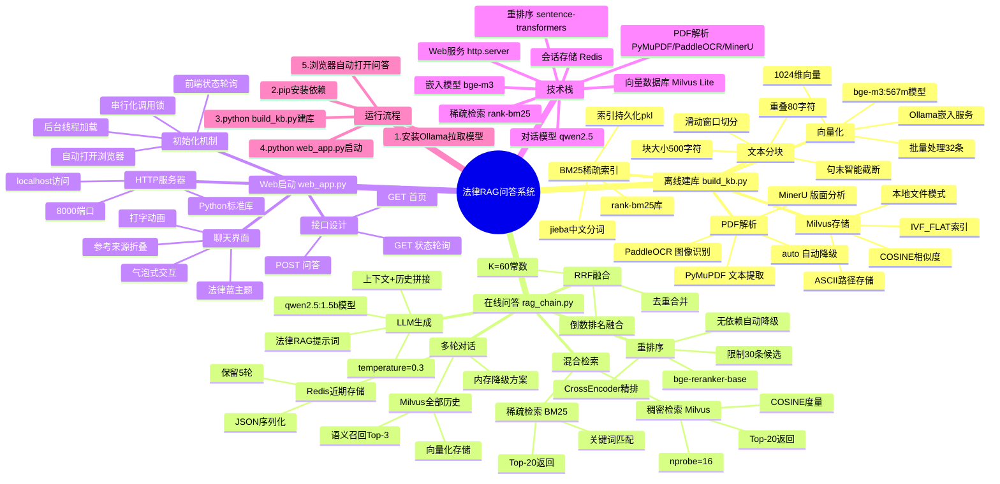
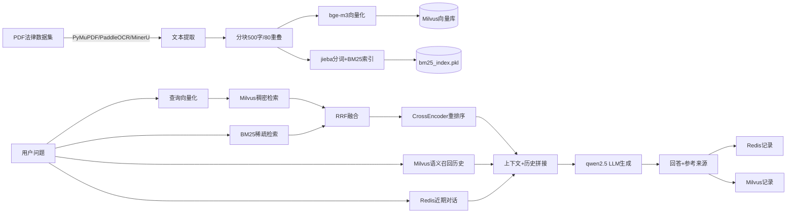

# 法律RAG问答系统 - 思维导图

## Mermaid 思维导图



## 文本结构图

```
法律RAG问答系统
│
├── 离线建库 (build_kb.py)
│   ├── PDF解析
│   │   ├── PyMuPDF ── 文本型PDF，速度快
│   │   ├── PaddleOCR ── 扫描件，图像识别
│   │   ├── MinerU ── 版面分析，结构化输出
│   │   └── auto ── 自动选择+降级
│   ├── 文本分块
│   │   ├── 滑动窗口 (500字符/80重叠)
│   │   └── 句末截断 (。！？\n；)
│   ├── 向量化
│   │   ├── bge-m3:567m (Ollama)
│   │   └── 1024维向量
│   ├── Milvus存储
│   │   ├── IVF_FLAT索引
│   │   ├── COSINE相似度
│   │   └── C:\Users\ETERNITY\milvus_legal_rag.db
│   └── BM25索引
│       ├── rank-bm25 + jieba分词
│       └── bm25_index.pkl 持久化
│
├── 在线问答 (rag_chain.py)
│   ├── 混合检索
│   │   ├── 稠密: Milvus向量检索 → Top-20
│   │   └── 稀疏: BM25关键词检索 → Top-20
│   ├── RRF融合 (K=60)
│   ├── 重排序
│   │   ├── CrossEncoder (bge-reranker-base)
│   │   └── 降级: 原始分数排序
│   ├── 多轮对话
│   │   ├── Redis → 近期5轮对话
│   │   ├── Milvus → 全部历史 (语义召回Top-3)
│   │   └── 内存降级 (无Redis时)
│   └── LLM生成
│       ├── qwen2.5:1.5b (Ollama)
│       └── 法律RAG提示词模板
│
├── Web启动 (web_app.py)
│   ├── HTTP服务器 (Python标准库, 端口8000)
│   ├── 聊天界面 (法律蓝主题, 气泡交互)
│   ├── 接口
│   │   ├── GET / ── 聊天页面
│   │   ├── GET /status ── 初始化状态
│   │   └── POST /ask ── 问答接口
│   └── 初始化机制 (后台线程+前端轮询+串行锁)
│
└── 运行流程
    ├── 1. ollama pull bge-m3:567m + qwen2.5:1.5b
    ├── 2. pip install pymilvus milvus-lite pymupdf ...
    ├── 3. python build_kb.py (离线建库)
    └── 4. python web_app.py (启动Web问答)
```

## 数据流图


