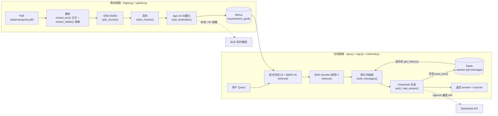
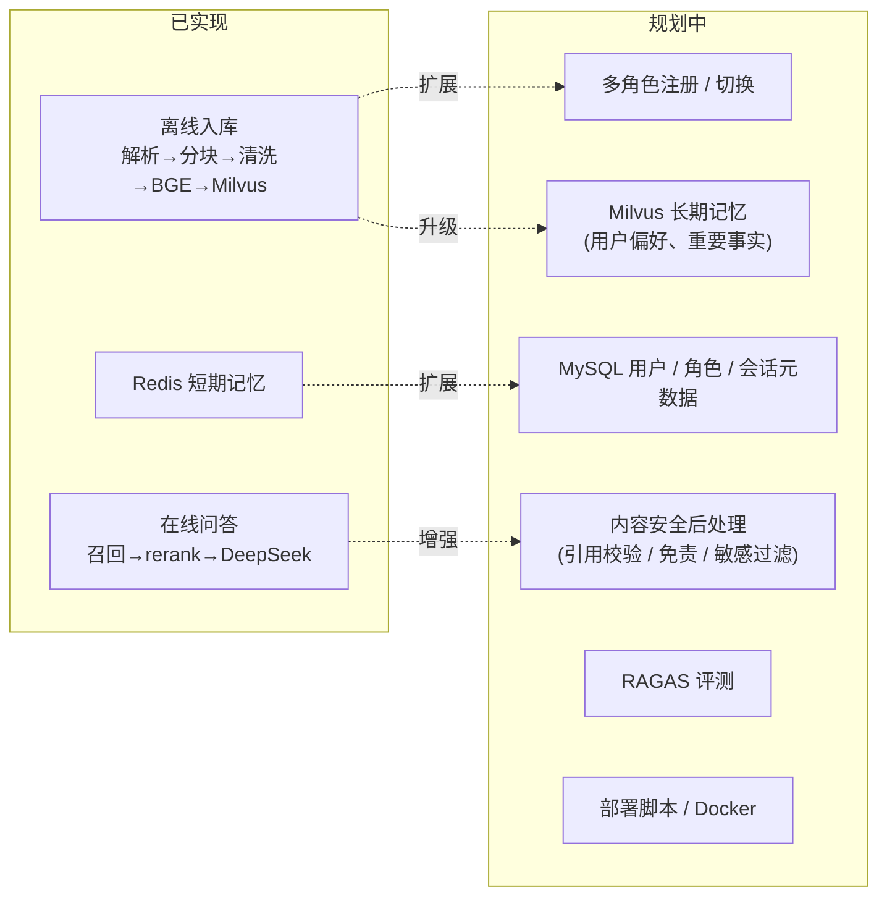

# 技术架构设计

| 项目 | 内容 |
| --- | --- |
| 系统名称 | RAG 角色扮演系统（首个角色：高血压医生） |
| 文档版本 | v1.0 |
| 日期 | 2026-09-15 |
| 技术栈 | Python 3.12 / FastAPI / Milvus（降级 Chroma）/ Redis / sentence-transformers / DeepSeek API |

> 本文描述当前**已实现**架构，代码为扁平 10 文件（`api.py` / `ingest.py` / `retrieval.py` / `rag.py` / `milvus_store.py` / `db.py` / `roles.py` / `parser.py` / `admin.py` / `init_db.py`）。文中引用函数名不写行号，避免代码演进导致文档过期；`[规划中]` 部分只给未来架构图，不展开实现细节。

---

## 1. 总体架构图

系统由「离线链路」「在线链路」两条流水线 + 外部依赖组成：



**链路说明**：
- **离线链路**（`ingest.py` + `parser.py`）：把领域 PDF 解析（PyMuPDF 正文 + pdfplumber 表格）→ 分块 → 清洗 → 向量化，写入 Milvus（`USE_MILVUS=false` 时降级 Chroma），为在线问答提供检索源。
- **在线链路**（`api.py` + `rag.py` + `retrieval.py`）：每次提问实时执行「召回 → 精排 → 组装 → 生成」，并用 Redis 维护多轮记忆。
- **外部依赖**：Milvus（向量库，`USE_MILVUS=false` 时降级为本地 Chroma）、Redis（短期记忆）、DeepSeek API（生成）、BGE 系列模型（向量化与精排，本地加载，`HF_ENDPOINT` 走镜像）。

---

## 2. 离线链路详解

流程：`PDF → PyMuPDF/pdfplumber 解析（可选 MinerU，见 2.3）→ 400/60 分块 → 数据清洗 → bge-m3 向量化 → Milvus 持久化`。

### 2.1 逐环节说明

| 环节 | 函数（位置） | 输入 → 输出 | 关键参数 / 说明 |
| --- | --- | --- | --- |
| PDF 解析 | `extract_text()`、`extract_tables()`（parser.py） | PDF 路径 → `[{page, text}]` | `extract_text()` 用 `pymupdf` 逐页抽正文并过滤页眉页脚（每页前 3/后 3 行中重复出现即丢弃）；`extract_tables()` 用 `pdfplumber` 把每张表格渲染为独立 chunk；页码从 1 起，空页跳过；另有可选 MinerU 解析（见 2.3），走独立 collection |
| 空白归一 | `normalize_whitespace()`（ingest.py） | 原始文本 → 归一文本 | 压缩空白、合并连续换行，去掉 PDF 抽取常见的断裂空格 |
| 分块 | `split_chunks()`（ingest.py） | 单页文本 → `[{id, content, page}]` | `CHUNK_SIZE=400`、`CHUNK_OVERLAP=60`；先按句末标点/换行切句，句间累加至超 400 切块，超长单句按步长 340 硬切；id=`p{页码}_c{序号}`；CHUNK_OVERLAP=60 仅作用于超长单句硬切分支（step=340 + 重叠 60）；正常句边界路径按 400 字贪心累加，块间无重叠。 |
| 数据清洗 | `clean_chunks()`（ingest.py） | 分块后列表 → 清洗后列表 + 统计 | 按 content 的 MD5 去重（保留首个）；丢弃过短（<20 字）、纯符号、乱码（含替换符或有效字符占比 <0.5）的 chunk；日志打印清洗前后数量 |
| 向量化 | `load_embedder()`（ingest.py） | 文本 → 向量 | `BAAI/bge-m3`（本地路径），`normalize_embeddings=True`，`batch_size=32`；`@lru_cache` 进程内复用 |
| 持久化 | `create_collection()`、`insert()`、`delete_by_source()`（milvus_store.py）、`ingest_pdf()`（ingest.py） | 向量+文本+元数据 → Milvus | schema：`id`(VARCHAR 主键)/`embedding`(FLOAT_VECTOR 1024)/`content`(VARCHAR 65535)/`page`(INT64)/`source`(VARCHAR)/`domain`(VARCHAR)/`created_at`(INT64)/`updated_at`(INT64)/`summary`(VARCHAR 512，取 content 前 100 字)；索引 HNSW + `metric_type=COSINE`；`USE_MILVUS=false` 时降级 Chroma `PersistentClient`；入库前先 `delete_by_source` 清该 source 旧数据，再 `insert` + `flush` |
| 入库结果 | — | — | 实测 100 个 chunk；metadata 含 `page`/`source`/`domain`/`created_at`/`updated_at`/`summary` |

关键常量：ingest.py 有 `PDF_PATH`、`CHROMA_DIR`、`COLLECTION`、`EMBED_MODEL`、`CHUNK_SIZE=400`、`CHUNK_OVERLAP=60`、`BATCH_SIZE=32`、`SOURCE_NAME`；milvus_store.py 有 `MILVUS_URI`、`MILVUS_COLLECTION`、`USE_MILVUS`、`EMBED_DIM=1024`（从 .env 读）。

### 2.2 PDF 解析选型理由

- 正文用 **PyMuPDF**（`import pymupdf`）替代 pypdf：文本型 PDF 抽取更稳，可顺带过滤页眉页脚。
- 表格用 **pdfplumber** 结构化抽取：把每张表格渲染为独立 chunk，保留行列关系。
- **MinerU 已集成**：作为可选补充解析器，处理复杂版面（保留标题层级与 HTML 表格），走独立 collection，详见 2.3。
- `Paddle-OCR-VL` 面向扫描件 OCR 场景，当前无扫描件，无此需求。

### 2.3 MinerU 对比 PyMuPDF

MinerU 作为**可选补充解析器**，与默认的 PyMuPDF/pdfplumber 并存，通过 collection 切换，二者互不覆盖。

**集成方式**（主项目代码零改动）：

- 独立 venv：`~/mineru_venv`，不进主项目依赖。
- 解析走远程 API（`--remote`），本地无 GPU；远程 API 有 IP 限流，正式使用需注册拿 token。
- 输出 JSON 到 `~/.mineru/doclib/parsed/`。
- 转换脚本 `scripts/mineru_to_ingest.py`：读 MinerU JSON，处理 `text` / `paragraph_title` / `doc_title` / `table` / `equation` 五种块——标题转为 markdown `#` 层级、表格保留 caption + HTML body，输出为与 `extract_text()` 同构的 `[{page, text}]`。
- 写入独立 collection `hypertension_guide_mineru`（32 条），主知识库 `hypertension_guide`（2232 条）不受影响。

**效果对比**：

| 维度 | PyMuPDF + pdfplumber（默认） | MinerU（可选） |
| --- | --- | --- |
| 速度 | 快：本地解析，纯文本抽取 | 慢：远程 API 解析，本地无 GPU |
| 结构保留 | 正文 + 表格转独立 chunk，无标题层级 | 保留标题层级（`#`~`######`）与 HTML 表格 |
| 适用场景 | 文本型 PDF | 复杂版面（扫描件、复杂表格、公式） |
| 集成方式 | 主项目内 `parser.py` | 独立 venv + 文件系统交互，主项目零改动 |
| 目标 collection | `hypertension_guide`（2232 条） | `hypertension_guide_mineru`（32 条） |

---

## 3. 在线链路详解

流程：`Query → 向量召回 20 + BM25 召回 20 → RRF 融合 top-20 → BGE-reranker-v2-m3 精排 4 → 提示词组装 → DeepSeek 生成 → 返回`。

### 3.1 逐环节说明

| 环节 | 函数（位置） | 输入 → 输出 | 关键参数 / 说明 |
| --- | --- | --- | --- |
| 向量召回 | `retrieve()`（retrieval.py） | query → 20 候选 | `RECALL_K=20`；Milvus 模式走 `search()`（milvus_store.py），`similarity=distance`（COSINE 的 distance 即余弦相似度）；Chroma 降级走 `query(...)`，`similarity=1−余弦距离`（纯向量降级时用） |
| BM25 召回 | `retrieve()`（retrieval.py） | query → 20 候选 | `load_keyword_index()`（ingest.py）从 Milvus（`query_all()`）或 Chroma 拉全量 chunk、jieba 分词构建 `BM25Okapi`；`get_scores` 取 `RECALL_K=20` 条；构建失败则降级为纯向量检索 |
| RRF 融合 | `retrieve()`（retrieval.py） | 向量+BM25 候选 → top-20 | `_rrf_fuse()`：`score=Σ 1/(k+rank)`，`k=RRF_K=60`；`similarity` 归一化到 [0,1]（`rrf/(2/(k+1))`） |
| 精排 | `retrieve()`（retrieval.py） | 融合后 top-20 → top-4 | `BAAI/bge-reranker-v2-m3`（CrossEncoder）`predict` 得 logits → 排序取 `RERANK_TOP_K=4`，`similarity=sigmoid(logits)` 保留 4 位 |
| 精排降级 | `retrieve()`（retrieval.py） | — | reranker 加载/推理异常 → 回退融合结果 top-4，`similarity` 为 RRF 归一化分数（BM25 也降级时为 `1−余弦距离`） |
| 读历史 | `get_history()`（rag.py） | session_id → `[{role, content}]`（旧→新） | Redis `LRANGE 0 -1` 后 `reversed`；失败降级为 `[]` |
| 提示词组装 | `build_messages()`（rag.py） | contexts + history → messages | `system = DOCTOR_PERSONA + "【参考资料】" + 上下文`，上下文格式 `[资料{i}｜第{page}页]`；序列 `[system, ...history, user]` |
| 生成 | `ask()`（rag.py） / `ask_stream()`（rag.py） | messages → answer | `deepseek-flash`，`temperature=0.7`，`stream=False` / `True`；客户端 `_get_client()`（rag.py） |
| 写回记忆 | `save_turn()`（rag.py） | 本轮问答 → Redis | pipeline `LPUSH` + `LTRIM` + `EXPIRE` |
| 返回 | — | `{answer, sources:[{content, page, similarity}]}` | `sources` 由 `retrieve()` 产出 |

**相似度多语义**：rerank 成功时 `similarity = sigmoid(logits)`；reranker 降级时 `similarity = RRF 归一化分数`；BM25 也降级时 `similarity = 1 − 余弦距离`，各口径不同，不可横向比较。

### 3.2 /chat 与 /chat/stream 对比

| 维度 | `POST /chat` | `POST /chat/stream` |
| --- | --- | --- |
| 调用函数 | `ask()`（rag.py） | `ask_stream()`（rag.py） |
| DeepSeek 参数 | `stream=False` | `stream=True` |
| 返回格式 | 单次 JSON `{answer, sources}` | SSE：`event: sources` → 逐 token `data:` → `data: [DONE]` |
| Redis 写入时机 | 生成完成后无条件写入 | 仅正常完成时写入，中断则不写 |
| 首 token 延迟 | 需等全部生成完才返回 | 逐 token 输出，首 token 即返回（日志记录首 token 耗时） |

### 3.3 后处理

生成结果在返回 / 落库前统一经 `postprocess()`（rag.py）正则清洗，按序执行 5 条规则：

1. **去代码块标记**：去掉 Markdown 代码块的围栏行（开闭围栏连同语言标记，如 json / markdown），保留围栏内内容。
2. **压缩空行**：4 个及以上连续空行压缩为 2 个空行。
3. **去行尾空格**：去掉每行行尾的空格 / 制表符。
4. **去首尾空白**：`strip()`。
5. **规范引用格式**：`资料1` / `资料 1` / `【资料1】` 统一为 `资料1`。

**调用位置与流式说明**：

- `ask()`：在 `answer = resp.choices[0].message.content` 之后调用，返回值与 `save_turn()` 落库内容均为清洗后。
- `ask_stream()`：仅在 `answer = "".join(answer_parts)` 拼接完整后、`save_turn()` 写 Redis 之前调用；**逐 token 的 SSE 输出不做后处理**（保持原样）。原因是流式 token 在拼出完整 answer 前就已逐段 yield 出去，无法回溯清洗，因此流式场景下客户端收到的流式内容为原始文本，而 Redis 记忆为清洗后文本，两者可能不一致。
- 每次清洗用 `logger.info` 记录长度变化（`before -> after`）。

> 本文 3.3 的后处理仅做格式清洗；引用校验、免责声明、敏感词过滤属内容安全层面，规划中，见 9.2。

---

## 4. 记忆系统

多轮记忆基于 Redis，存每个会话最近 N 轮对话。

**Key 规范**：`session:{session_id}:messages`（List 类型，`decode_responses=True`）。

**Value**：每轮一条 JSON `{"user": ..., "assistant": ...}`（`ensure_ascii=False`）。

**写入流程**（`save_turn()`，rag.py；pipeline 原子执行）：

```
LPUSH session:{id}:messages  '{"user":..., "assistant":...}'
LTRIM session:{id}:messages  0 (REDIS_MAX_ROUNDS-1)   # 保留最近 10 轮
EXPIRE session:{id}:messages  REDIS_TTL               # 86400 秒（1 天）
```

**读取流程**（`get_history()`，rag.py）：

```
LRANGE session:{id}:messages 0 -1   # 新→旧
→ reversed()                        # 旧→新
→ 展开为 [{role:user}, {role:assistant}, ...]
```

**关键参数**（rag.py）：`REDIS_MAX_ROUNDS=10`、`REDIS_TTL=86400`、`socket_connect_timeout=2`、`socket_timeout=2`。

**连接管理**：懒加载单例 `_get_redis()`（rag.py）。

**降级路径**：Redis 读写任何异常仅 `logger.warning`——读历史返回 `[]`、写记忆跳过，**不抛错、不中断主流程**（即降级为「无记忆」）。

---

## 5. 接口设计

### 5.1 健康检查

`GET /health` → `200 {"status": "ok"}`

### 5.2 非流式问答

`POST /chat`，请求体：

```json
{"message": "血压多少算高？", "session_id": "user-123-abc"}
```

响应体：

```json
{
  "answer": "根据《国家基层高血压防治管理指南》，……",
  "sources": [
    {"content": "……", "page": 3, "similarity": 0.8123}
  ]
}
```

错误：`message` 为空串（`""`）时，pydantic `min_length=1` 校验失败，FastAPI 默认返回 `422 {"detail": [{"type": "string_too_short", ...}]}`；`message` 为纯空白（如 `"  "`）时，经 `strip()` 判空后手动返回 `422 {"detail": "message 不能为空"}`；内部异常 → `500 {"detail": "{异常类名}: {异常消息}"}`。

### 5.3 流式问答

`POST /chat/stream`，请求体同 `/chat`；响应 `text/event-stream`，headers 含 `Cache-Control: no-cache`、`X-Accel-Buffering: no`。事件序列：

```
event: sources
data: [{"content":"……","page":3,"similarity":0.8123}]

data: 根据
data: 指南
...
data: [DONE]
```

异常中断时：`event: error` + `data: generation interrupted`，随后 `data: [DONE]`。

---

## 6. 数据模型

### 6.1 Milvus collection（`hypertension_guide`）

| 字段 | 类型 | 说明 |
| --- | --- | --- |
| `id` | VARCHAR(64) | 主键，形如 `p{页码}_c{序号}`（如 `p3_c0`） |
| `embedding` | FLOAT_VECTOR(1024) | 归一化向量，1024 维（BGE-m3 默认输出） |
| `content` | VARCHAR(65535) | chunk 原文 |
| `page` | INT64 | 页码 |
| `source` | VARCHAR | 来源文件名（如 `guide.pdf`） |
| `domain` | VARCHAR | 知识领域标签（角色名），admin 上传时写入 |
| `created_at` | INT64 | 入库时间戳（Unix 秒） |
| `updated_at` | INT64 | 更新时间戳，入库时同 created_at，更新时刷新 |
| `summary` | VARCHAR(512) | 摘要，取 content 前 100 字（不调 LLM） |

索引参数：HNSW，`metric_type=COSINE`（`search` 返回的 `distance` 即余弦相似度）。

> `USE_MILVUS=false` 时降级为 Chroma collection，字段为 `id`/`embedding`/`document`/`metadata{"page","source"}`，索引 `hnsw:space=cosine`。

### 6.2 Redis Key 规范

| 项 | 值 |
| --- | --- |
| Key 格式 | `session:{session_id}:messages` |
| 类型 | List（每条为 JSON 字符串） |
| TTL | 86400 秒（`REDIS_TTL`） |
| 长度上限 | 10 轮（`REDIS_MAX_ROUNDS`，`LTRIM` 裁剪） |

---

## 7. 技术选型理由

- **Milvus（已迁移，Chroma 降级）**：已将向量存储从 Chroma 迁至 Milvus，支撑更大规模数据与分布式检索；`USE_MILVUS` 开关保留 Chroma（本地 `PersistentClient`）作为降级，便于无 Milvus 服务时本地运行。
- **BM25（rank_bm25）而非 Elasticsearch**：当前数据量小（单文档 100 chunk），`rank_bm25` 本地内存索引足够，无需引入 ES 独立服务与运维成本；配合 jieba 中文分词补足向量检索对专有名词、编号、分级数字的精确匹配。
- **bge-m3**：1024 维多语向量模型（本地路径加载），`normalize_embeddings` 已归一化，配合余弦距离够用。
- **BGE-reranker-v2-m3**：CrossEncoder 交叉编码器在中文精排上效果好，用「召回 20 → 精排 4」的性价比最高。
- **Redis 而非 MySQL 存短期记忆**：读写快，`EXPIRE` 天然支持 TTL 过期、无需手动清理；MySQL 留作用户/角色/会话元数据（`[规划中]`）。
- **DeepSeek API 而非本地部署**：当前无 GPU，本地部署不可行；DeepSeek API 成本低、中文效果好、OpenAI 兼容（开箱即用）。未来若有 GPU 可切 vLLM/SGLang 自托管，改动集中在 `_get_client()`（rag.py），其余链路不受影响。

---

## 8. 部署架构

- **开发环境（WSL2）**：单机本地进程——`uvicorn` 启动 FastAPI，Milvus 经 Docker 本地部署（`MILVUS_URI=http://127.0.0.1:19530`），Redis 本地实例；BGE 模型本地加载（`.env` 中 `RERANK_MODEL` 指向 ModelScope 本地路径，`HF_ENDPOINT=https://hf-mirror.com` 走镜像）。
- **未来生产环境（`[规划中]`）**：云服务器 + Docker 容器化，Redis/Milvus 等依赖独立部署，应用服务与模型服务解耦。

---

## 9. 已知限制与未来扩展路径

### 9.1 已知限制

- **单角色硬编码**：人设写死在 `DOCTOR_PERSONA` 常量（rag.py），新增角色需改代码。
- **扁平结构**：10 文件无分层；已有 pytest 单元测试覆盖核心函数，集成测试待补，模块边界靠约定。
- **单文档、覆盖式入库**：只支持一份 PDF，每次全量重建，无增量更新。
- **无鉴权 / 限流**：接口裸奔，`session_id` 默认 `"default"` 存在串记忆风险。
- **相似度双语义**：rerank 与降级两条路径的 `similarity` 口径不同，不可横比。
- **表格结构化有限**：分级表/对照表经 `pdfplumber` 抽取为独立 chunk（行内制表符、行间换行），行列关系以文本形式保留，但未做跨行/合并单元格的结构化还原。
- **无质量评测**：缺 RAGAS 等自动化评测，迭代靠人工判断。

### 9.2 未来扩展路径



> 上图中 `[规划中]` 各节点仅画演进方向，具体实现方案另议，本文不展开实现细节。
