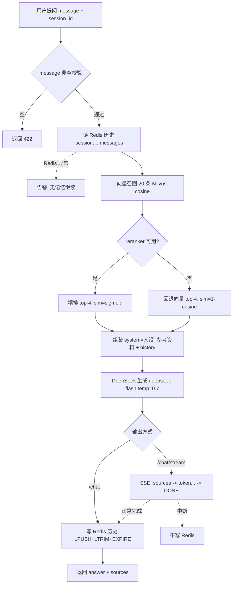
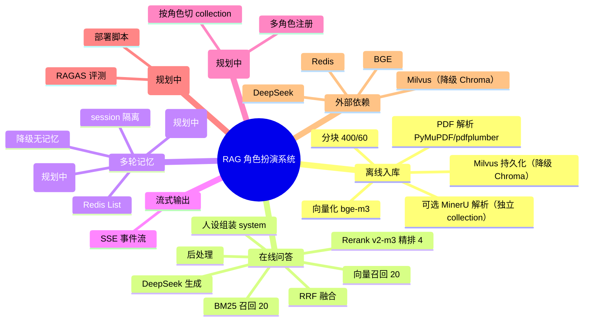

# 需求规格说明书（SRS）

| 项目 | 内容 |
| --- | --- |
| 系统名称 | RAG 角色扮演系统（首个角色：高血压医生） |
| 文档版本 | v1.0 |
| 日期 | 2026-09-15 |
| 技术栈 | Python 3.12 / FastAPI / Milvus（降级 Chroma）/ Redis / sentence-transformers / DeepSeek API |

---

## 文档口径

本文用两种标注区分功能的落地状态，请按此阅读：

- **[已实现]**：当前代码已具备的真实能力，描述与代码一一对应（常量、字段名、默认值均来自实际实现）。
- **[规划中]**：尚未实现、规划中的能力。每条仅说明「要做什么 / 为什么 / 依赖什么」，不展开设计与实现细节（这些留待《技术架构设计》文档）。

现状核对说明：当前实现为扁平 10 文件（`api.py` / `ingest.py` / `retrieval.py` / `rag.py` / `milvus_store.py` / `db.py` / `roles.py` / `parser.py` / `admin.py` / `init_db.py`）、单角色硬编码，尚不存在分层结构与多角色抽象。向量存储已迁移到 Milvus（`USE_MILVUS=false` 可降级 Chroma）。凡标 `[规划中]` 的条目（多角色、MySQL、Milvus 长期记忆、RAGAS 评测、部署脚本等）均**未**在当前代码中落地，请勿视为已实现能力。已有 pytest 单元测试覆盖核心函数（tests/），集成测试待补。

---

## 1. 项目背景与目标

### 1.1 背景

面向垂直领域咨询场景，构建一个「检索增强生成（RAG）+ 角色扮演」的问答系统：系统先从一个领域的权威资料中检索相关内容，再以特定专家人设组织回答，使回答既专业、又有可追溯的资料来源。首个落地角色为**高血压专科医生**，面向高血压相关的健康科普问答。

### 1.2 目标

1. **检索准确**：从知识库中召回与用户问题最相关的片段，作为回答依据。
2. **回答拟人化**：以专家人设、自然口吻组织回答，而非简单拼接资料。
3. **结果可溯源**：返回 `answer` 的同时返回引用的 `sources`（含原文、页码、相似度）。
4. **多轮记忆**：同一会话内保持上下文连贯，支持追问。

### 1.3 现状 / 规划总览

| 模块 | 现状 | 规划 |
| --- | --- | --- |
| 离线入库 | 已实现（PyMuPDF/pdfplumber 解析 → 分块 → 清洗 → BGE 向量化 → Milvus，可降级 Chroma） | 多文档/增量更新 |
| 在线问答 | 已实现（向量 + BM25 混合召回 + RRF 融合 + rerank 精排 + DeepSeek + 后处理） | — |
| 多轮记忆 | 已实现（Redis 短期记忆） | MySQL 会话元数据、Milvus 长期记忆 |
| 流式输出 | 已实现（SSE） | 取消 / 断点续传 |
| 角色管理 | 未实现（硬编码单角色） | 多角色注册与切换 |

---

## 2. 功能清单

### 2.1 离线入库

**功能描述**：将领域 PDF 文档解析、分块、向量化后写入向量库，供在线问答检索。

**[已实现]** 入库流程与参数：

1. **PDF 解析**：正文用 `pymupdf`（`extract_text()`）逐页抽取并过滤页眉页脚（每页前 3/后 3 行中重复出现的行丢弃）；表格用 `pdfplumber`（`extract_tables()`）抽取为独立 chunk。
2. **分块**：`CHUNK_SIZE=400`（块大小）、`CHUNK_OVERLAP=60`（相邻块重叠 60 字符）。先按句末标点/换行切句，再累加句子直至超过 400 字符切块；超长单句按步长 340 硬切。块 ID 形如 `p{页码}_c{序号}`（表格 chunk 为 `p{页码}_t{序号}`）。
3. **数据清洗**：`clean_chunks()` 按 content 的 MD5 去重，丢弃过短（<20 字）、纯符号、乱码的 chunk，并打印清洗前后数量。
4. **向量化**：`BAAI/bge-m3`（sentence-transformers，本地路径），`normalize_embeddings=True`，批大小 32。
5. **持久化**：Milvus collection `hypertension_guide`（`metric_type=COSINE`），字段含 `id`/`embedding`/`content`/`page`/`source`/`domain`/`created_at`/`updated_at`/`summary`。入库前按 `source` 删除旧数据再写入（`USE_MILVUS=false` 时降级 Chroma `PersistentClient`，metadata 含 `page`、`source`）。
6. **入库粒度**：当前单文档（`guide.pdf`），实测 100 个 chunk。

**补充解析器 MinerU**：可选解析器，定位为处理复杂版面（保留标题层级与 HTML 表格）。走远程 API 解析（本地无 GPU），输出经 `scripts/mineru_to_ingest.py` 转换为 `[{page, text}]` 后入库到独立 collection `hypertension_guide_mineru`（32 条）。两套解析器并存，通过 collection 切换：`hypertension_guide`（PyMuPDF 默认，2232 条）与 `hypertension_guide_mineru`（MinerU 复杂版面，32 条），互不覆盖。

**[规划中]**

- **多文档 / 增量更新**：要做什么——支持多份 PDF 与更多格式、按变更增量入库；为什么——当前仅单文档覆盖式入库，无法扩展；依赖——入库任务调度与文档元数据管理。

### 2.2 在线问答

**功能描述**：接收用户提问，完成「检索 → 精排 → 生成」并返回回答与来源。

**[已实现]** 链路与参数：

1. **向量召回**：在 Milvus 中按余弦相似度（`COSINE`）召回 `RECALL_K=20` 条（`USE_MILVUS=false` 时降级 Chroma 余弦距离）。
2. **BM25 关键词召回**：`load_keyword_index()` 从 Milvus（`query_all()`）拉全量 chunk、jieba 分词构建 `BM25Okapi`，query 分词后 `get_scores` 取 `RECALL_K=20` 条。
3. **RRF 融合**：`_rrf_fuse()` 双路按 `score = Σ 1/(k + rank)`（`k=RRF_K=60`）融合，取 top-`RECALL_K` 送精排；similarity 归一化到 [0,1]（精排前展示用）。
4. **精排**：`BAAI/bge-reranker-v2-m3`（CrossEncoder）对融合结果重排，取 `RERANK_TOP_K=4` 条。
5. **组装**：`system = DOCTOR_PERSONA + "【参考资料】" + 上下文`，其中上下文格式为 `[资料{i}｜第{page}页]\n{content}`；消息序列为 `[system, ...历史(旧→新), user]`。
6. **生成**：调用 DeepSeek `deepseek-flash`（`temperature=0.7`），返回 `{answer, sources:[{content, page, similarity}]}`。
7. **后处理**：`postprocess()` 正则清洗生成结果——去掉 Markdown 代码块标记（保留块内内容）、4 个及以上连续空行压缩为 2 个、去每行行尾空格与首尾空白、规范「资料N」引用格式（`资料1` / `资料 1` / `【资料1】` 统一为 `资料1`）；`ask()` 返回前与 `ask_stream()` 写 Redis 前调用，流式逐 token 输出不处理。

**相似度多语义说明**：rerank 成功时 `similarity = sigmoid(logits)`；reranker 降级时回退融合结果（`similarity = RRF 归一化分数`）；BM25 也降级（纯向量）时 `similarity = 1 − 余弦距离`。各口径不同，不可直接横向比较。

**降级**：BM25 索引不可用（构建/分词失败）时回退纯向量检索并写 warning；reranker 加载或推理异常时回退融合结果（或纯向量结果）前 `RERANK_TOP_K` 条。两者均不中断服务。

### 2.3 多轮记忆

**功能描述**：以会话为单位保存多轮对话历史，使模型能理解追问与上下文。

**[已实现]** 记忆机制：

- **存储**：Redis List，key 为 `session:{session_id}:messages`，每轮以 JSON `{"user": ..., "assistant": ...}` 写入。
- **写入策略**：`LPUSH` 新消息 → `LTRIM` 保留最近 `REDIS_MAX_ROUNDS=10` 轮 → `EXPIRE` 设 `REDIS_TTL=86400` 秒（1 天）。
- **读取**：`LRANGE 0 -1` 后逆序恢复为旧→新，展开为 `[{role:user}, {role:assistant}]`。
- **会话隔离**：以 `session_id` 维度隔离，默认值 `"default"`。
- **降级**：Redis 读写异常仅记录告警，返回空历史或跳过写入，不影响主流程（即降级为「无记忆」）。

**[规划中]**

- **MySQL 会话元数据**：要做什么——持久化用户信息、角色信息与会话元数据到 MySQL；为什么——这类结构化数据适合关系型存储且需长期留存；依赖——关系表设计与读写层改造。
- **Milvus 长期记忆**：要做什么——将用户偏好、重要事实等长期记忆向量化存入 Milvus；为什么——跨会话保留用户特征以支撑个性化回答；依赖——长期记忆的抽取/写入链路与 collection 规划。
- **会话生命周期**：要做什么——支持显式创建/清除会话、TTL 与轮数可配、长对话压缩；为什么——当前会话隐式产生且无清理入口；依赖——会话管理接口。

### 2.4 流式输出

**功能描述**：通过 SSE 流式返回生成结果，提升响应体感。

**[已实现]** `POST /chat/stream`：

- 响应类型 `text/event-stream`，headers 含 `Cache-Control: no-cache`、`X-Accel-Buffering: no`。
- 事件序列：先 `event: sources`（携带 `sources` JSON）→ 逐 token 以 `data: {行内容}` 输出 → 结束 `data: [DONE]`。
- 异常中断：`event: error`（`generation interrupted`）后接 `data: [DONE]`。
- 流式生成被中断时不写入 Redis 历史。

**[规划中]** 取消 / 断点续传：要做什么——支持客户端取消生成、断线后从断点续传；为什么——长回答场景下改善体验与资源占用；依赖——生成器生命周期管理与状态恢复。

### 2.5 角色管理

**功能描述**：支持多个专家角色的注册与切换（心理医生、律师、金融理财师等）。

**[规划中]** 多角色能力：

- 要做什么——将人设从硬编码 `DOCTOR_PERSONA` 常量中抽离为可配置、可注册的角色，支持按角色切换。
- 为什么——当前单角色硬编码，新增角色需改代码，无法复用检索与生成链路。
- 依赖——角色配置文件/注册机制，以及检索空间（collection）按角色隔离。

> 现状说明：人设目前是 `rag.py` 中硬编码的 `DOCTOR_PERSONA` 常量（严谨、温和的高血压专科医生定位 + 8 条回答要求），无独立角色管理模块。

### 2.6 接口与健康检查

**[已实现]** 三个接口：

| 接口 | 方法 | 说明 |
| --- | --- | --- |
| `/health` | GET | 健康检查，返回 `{"status": "ok"}` |
| `/chat` | POST | 非流式问答 |
| `/chat/stream` | POST | 流式问答（SSE） |

**请求体（`/chat` 与 `/chat/stream` 共用）**：

| 字段 | 类型 | 必填 | 说明 |
| --- | --- | --- | --- |
| `message` | string | 是 | 用户提问，`min_length=1`；纯空白串返回 422 |
| `session_id` | string | 否 | 会话 ID，默认 `"default"` |

**响应体（`/chat`）**：

| 字段 | 类型 | 说明 |
| --- | --- | --- |
| `answer` | string | 生成回答 |
| `sources` | array | 引用来源列表，每项 `{content, page, similarity}` |

**错误处理**：`message` 校验失败返回 422；内部异常返回 500，格式为 `{异常类名}: {异常消息}`。

---

## 3. 业务流程

用户提问 → 检索 → 生成 → 返回的主链路（含两个降级分支与流式分支）：

**说明**：
- `/chat` 与 `/chat/stream` 共用同一链路（非空校验 → 读历史 → 召回 → 精排 → 组装 → 生成），仅在「输出方式」处分叉。
- `/chat`：生成后写入历史，一次性返回 `answer + sources`。
- `/chat/stream`：SSE 流式输出，仅正常完成时写入历史，中断则不写。
- 降级分支 1：reranker 异常时回退向量 top-K。
- 降级分支 2：Redis 异常时跳过记忆读写，以无记忆状态继续。

---

## 4. 业务规则

### 4.1 角色人设约束

回答须符合「高血压专科医生」人设：严谨、温和，依据参考资料作答。具体要求由 `DOCTOR_PERSONA` 常量中的 8 条回答要求定义（如仅基于提供的资料、不编造知识库外信息等）。

### 4.2 医疗免责

系统回答属健康科普，**不构成医疗诊断或治疗建议**；涉及具体用药、剂量、病情判断时，应引导用户咨询执业医师或前往正规医疗机构。

### 4.3 session 隔离

记忆以 `session_id` 为隔离维度，不同 `session_id` 互不可见。注意：默认 `session_id="default"` 会被所有未显式指定会话的请求共用，生产环境应要求调用方显式传入唯一会话 ID，避免串话。

### 4.4 降级策略

| 故障点 | 降级行为 |
| --- | --- |
| reranker 加载/推理异常 | 回退向量召回 top-K，`similarity=1−余弦距离` |
| Redis 读写异常 | 告警并继续，降级为无记忆 |

降级原则：任一外部依赖故障均不中断主问答流程，保证服务可用。

### 4.5 安全边界

- **输入校验**：`message` 非空且非纯空白，长度受字段校验约束。
- **密钥保护**：DeepSeek 密钥等敏感信息存于 `.env`，不写入代码、日志或返回结果。
- **内容边界**：回答仅限知识库与人设允许范围，不越权提供诊疗决策。

**[规划中]** 限流、鉴权、审计：要做什么——增加请求限流、调用方鉴权与操作审计；为什么——当前接口无鉴权与频控，面向生产暴露有滥用风险；依赖——网关/中间件与身份体系。

---

## 5. 非功能需求

### 5.1 性能

- 检索 + 精排阶段耗时需可观测：日志记录 rerank 耗时、向量召回条数。
- 生成阶段记录 DeepSeek 调用耗时、流式首 token 与总耗时。
- 首包时间（流式）：应尽早输出 `sources` 事件以改善体感。

### 5.2 可用性

- 提供 `/health` 健康检查。
- 外部依赖（reranker、Redis）故障均可降级，主流程不中断。
- 结构化日志覆盖：请求信息、检索命中、rerank 耗时、Redis 读写、DeepSeek 耗时。

### 5.3 可扩展性

- **角色**：支持从单角色扩展到多角色（`[规划中]`）。
- **文档**：支持从单文档扩展到多文档/增量更新（`[规划中]`）。
- **模型**：向量、rerank、生成模型均通过常量/环境变量指定，可替换。
- **向量库**：已迁移到 Milvus，`USE_MILVUS` 开关保留 Chroma 降级。

### 5.4 安全

- 密钥经环境变量管理，不进仓库与日志。
- 输入校验与医疗合规免责（见 4.2、4.5）。

### 5.5 质量与运维

**[规划中]**

- **RAGAS 评测**：要做什么——引入 RAGAS 对检索与生成质量做自动评测；为什么——量化迭代效果、避免凭感觉调参；依赖——评测数据集与离线评测脚本。
- **部署脚本**：要做什么——提供一键部署/容器化脚本；为什么——降低交付与环境复现成本；依赖——依赖清单与运行环境约定。

---

## 6. 思维导图

模块与依赖关系总览（`(规划中)` 为尚未实现节点）：

