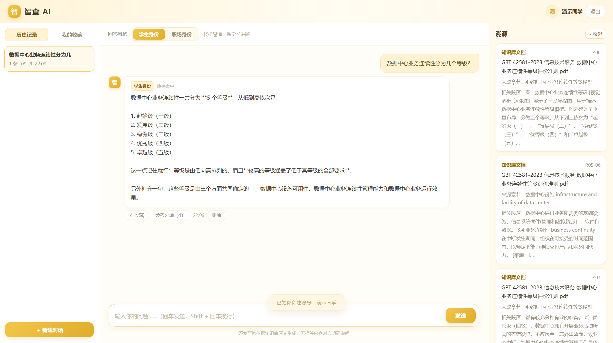
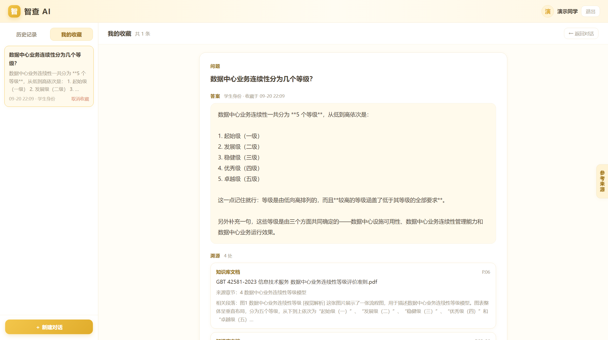

# 计算机专业知识库 RAG 问答助手

面向企业标准合规场景的私有知识库问答系统。用户用自然语言提问，系统基于知识库中的国家标准原文作答，并**明确标注答案出自哪份文档的第几页**。

---

## 一、项目背景

企业在承接数据中心运维项目、处理客户数据、验收外包软件时，需频繁查阅三份国家标准：

| 标准 | 用途 |
| --- | --- |
| GB/T 42581-2023《信息技术服务 数据中心业务连续性等级评价准则》 | 投标资质、年度复审 |
| GB/T 41479-2022《信息安全技术 网络数据处理安全规范》 | 合规审计、监管检查 |
| GB/T 32904-2016《软件质量量化评价规范》 | 外包软件验收打分 |

三份标准合计 74 页，人工查阅存在**查得慢、引不准、上手慢、版本混**四个痛点。尤其是投标应答与审计举证必须写明"依据某文件第 X 页"，人工摘录常出错。

本系统用 RAG（检索增强生成）解决这一问题：**检索负责定位原文，生成负责讲清楚，页码作为元数据贯穿全链路**。

> 完整需求分析见 [`docs/需求文档.md`](docs/需求文档.md)。

---

## 二、核心特性

| 特性 | 说明 |
| --- | --- |
| **页码级溯源** ⭐ | 每条答案都附来源文档名称与页码，可回到原文核对（跨页片段显示为「第 7-8 页」） |
| **防幻觉** | 答案严格依据检索到的原文生成；知识库无相关内容时明确拒答，不编造条款 |
| **多轮对话** | 支持省略主语的追问（如先问"分几级"，再问"那第 4 级呢"） |
| **图表理解** | 解析 PDF 中的流程图、表格，把图形语义补充进知识库（V2） |
| **混合检索** | 稠密向量 + 稀疏关键词 + RRF 融合，提升召回（V2） |
| **结果重排** | BGE-reranker 重排 + 查询改写，提升排序质量（V3） |
| **简洁前端** | 三栏式界面：左侧历史记录 / 我的收藏，中间可切换学生·职场身份的问答，右侧溯源面板（只展示文档、来源段落、页码）；登录后提问即保存历史，答案可收藏 |

### 界面预览

<table>
<tr>
<td width="50%"><br><b>登录界面</b> —— 账号登录，会话与收藏按用户隔离</td>
<td width="50%"><br><b>主界面</b> —— 三栏布局：左历史 / 收藏，中问答，右溯源</td>
</tr>
<tr>
<td><br><b>学生身份</b> —— 答案右侧直接给出文档名与页码</td>
<td><br><b>职场身份</b> —— 同一问题，回答口径随身份切换</td>
</tr>
<tr>
<td><br><b>历史记录</b> —— 提问即留痕，可回看完整会话</td>
<td><br><b>我的收藏</b> —— 好答案一键收藏，独立成页</td>
</tr>
</table>

<details>
<summary>展开查看其余界面截图</summary>

| 说明 | 截图 |
| --- | --- |
| 欢迎页：左右分栏引导 |  |
| 欢迎页：从相册选头像 |  |
| 从历史记录打开往期会话 |  |
| 从收藏页返回对话 |  |
| 溯源面板可收起，给答案让出空间 |  |
| 我的收藏独立浏览页 |  |

</details>

---

## 三、技术栈

| 环节 | 组件 |
| --- | --- |
| PDF 版面解析 | MinerU（提取文本 + **页码元数据** + 表格 + 图表） |
| 视觉理解 | 通义千问 VL（qwen-vl-plus，解析 PDF 图表） |
| 文本分块 | LangChain RecursiveCharacterTextSplitter |
| 向量模型 | BGE-M3（1024 维，同时提供稠密与稀疏表示） |
| 向量数据库 | Milvus |
| 重排模型 | BGE-reranker-v2-m3 |
| 业务元数据库 | MySQL（文档元信息、chunk 元数据、页码） |
| 缓存 / 会话 | Redis |
| 生成模型 | deepseek-v4-flash |
| 评测框架 | RAGAS + 自算指标 |
| Web 服务 | FastAPI + Uvicorn |
| 日志 | Python 原生 logging |
| 前端 | 静态 HTML + 原生 JS（无构建步骤） |

---

## 四、目录结构

```
cs-rag/
├── docs/                       # 全部工程文档（中文）
│   ├── 需求文档.md              # M1 需求分析
│   ├── 技术决策记录.md          # ADR 形式的选型与迭代决策（19 条）
│   ├── 接口文档.md              # API 说明 + Postman/JMeter 指引
│   ├── 基线评测报告.md          # M3 V1 基线指标与问题归因
│   ├── 版本迭代文档.md          # V1/V2/V3 迭代记录（改动点、问题、解决方案）
│   ├── 指标对比文档.md          # 各版本指标对比与归因分析
│   ├── 部署运行手册.md          # M4 环境、启动、验证、故障排查
│   ├── 部署验证记录.md          # M4 部署实测记录（对照 N3/N4）
│   ├── 答辩讲解文档.md          # 逐模块讲解 + 高频考点问答
│   └── superpowers/            # 设计阶段产出的 plan 与 design spec
├── data/
│   ├── source_docs/            # 知识库源 PDF（仓库不附带，见目录内 .gitkeep 说明）
│   └── finetune/               # Qwen3-0.6B LoRA 微调数据集与切分脚本
├── scripts/                    # 离线数据管线
│   ├── pdf_parse.py            # MinerU 解析，提取文本 + 页码
│   ├── chunk_split.py          # LangChain 分块，保页码元数据
│   ├── embedding_store.py      # BGE-M3 向量化，写入 Milvus + MySQL
│   ├── build_v1_index.py       # 一键构建 V1 索引
│   ├── vision_caption.py       # 图表视觉描述生成（V2）
│   ├── ragas_eval.py           # RAGAS 评测
│   ├── preflight_check.py      # 启动前环境自检
│   ├── ui_smoke_test.mjs       # UI 冒烟测试（产出 _shots/）
│   └── mineru_entry.py         # MinerU 调用入口
├── backend/                    # FastAPI 后端
│   ├── config.py               # 全局配置（读取 .env）
│   ├── logging_config.py       # 日志配置（Trace 仅后端）
│   ├── embedder.py             # BGE-M3 封装
│   ├── llm_client.py           # deepseek + qwen-vl 客户端
│   ├── reranker.py             # BGE-reranker-v2-m3 封装（V3）
│   ├── db/                     # MySQL / Milvus / Redis 封装 + schema.sql
│   ├── rag_pipeline/           # 各版本检索链路（V1/V2/V3 并存）
│   │   ├── v1_pipeline.py      # V1 朴素稠密检索
│   │   ├── rrf.py              # RRF 融合纯函数（V2）
│   │   ├── v2_pipeline.py      # V2 混合检索（继承 V1，仅覆盖检索）
│   │   ├── query_rewrite.py    # 查询改写（V3）
│   │   └── v3_pipeline.py      # V3 重排 + 查询改写
│   ├── api/                    # 接口层（query / auth / history / favorite / upload / build_kb）
│   └── main.py                 # 服务入口
├── frontend/                   # 前端页面（三栏问答界面 + 账号登录 + 历史/收藏）
├── tests/                      # 单元测试（pytest）
├── eval/                       # 评测集与各版本评测结果
├── _shots/                     # UI 界面截图（由 ui_smoke_test.mjs 产出）
├── .env.example                # 配置模板（中文注释）
└── README.md
```

---

## 五、快速开始

### 5.1 前置依赖

| 组件 | 说明 |
| --- | --- |
| Python | 3.12 |
| Milvus | v2.6+，监听 `19530` |
| MySQL | 8.0+，监听 `3306` |
| Redis | 6.0+，监听 `6379` |
| MinerU | 3.4+，模型权重已下载（CPU 模式即可） |
| BGE-M3 / BGE-reranker-v2-m3 | 本地模型权重 |
| DeepSeek API Key | 文本生成 |
| 通义千问 VL API Key | 图表解析（V2 起需要） |

### 5.2 安装依赖

> 本项目使用独立虚拟环境，避免与系统 Python 环境冲突。

```bash
# 创建虚拟环境（本项目使用继承式 venv，复用宿主环境中的重型依赖）
python -m venv --system-site-packages .venv

# 安装依赖
.venv/Scripts/python.exe -m pip install -r requirements.txt
```

### 5.3 配置

```bash
copy .env.example .env
```

编辑 `.env`，重点填写：

- `MYSQL_PASSWORD`：MySQL 密码
- `DEEPSEEK_API_KEY`：DeepSeek 密钥
- `BGE_M3_PATH`、`BGE_RERANKER_PATH`：本地模型路径
- `VISION_API_KEY`：通义千问 VL 密钥（V2 起需要，同时把 `VISION_ENABLED` 设为 `true`）

另有几项与版本行为相关，一般保持默认即可：

| 配置项 | 默认 | 说明 |
| --- | --- | --- |
| `PIPELINE_VERSION` | `v3` | 服务端链路版本，改回 `v1` / `v2` 即可回退 |
| `RETRIEVE_CANDIDATE_K` | `20` | 两路检索各自的候选数（V2 起生效） |
| `RRF_K` | `60` | RRF 融合平滑常数（V2 起生效） |

### 5.4 构建知识库

> 先把 PDF 原始文档放入 `data/source_docs/`（本仓库不附带，见该目录下 `README.md`）。BGE-M3、BGE-reranker-v2-m3 与 MinerU 的模型权重同样需要提前下载到本地。

```bash
# 方式一：命令行（三步依次执行）
.venv/Scripts/python.exe -m scripts.pdf_parse       # MinerU 解析（CPU 环境约 10 秒/页）
.venv/Scripts/python.exe -m scripts.chunk_split     # 分块
.venv/Scripts/python.exe -m scripts.embedding_store # 向量化并入库

# 方式二：启动服务后，点击网页上的「加载知识库」按钮
```

### 5.5 启动服务

```bash
.venv/Scripts/python.exe -m backend.main
```

启动后访问：

| 地址 | 说明 |
| --- | --- |
| `http://127.0.0.1:8000` | 问答页面 |
| `http://127.0.0.1:8000/docs` | 接口文档（Swagger） |
| `http://127.0.0.1:8000/api/health` | 健康检查 |

局域网访问：将 `.env` 中 `APP_HOST` 设为 `0.0.0.0`（默认已是），然后通过 `http://<本机IP>:8000` 访问。

### 5.6 运行评测

```bash
.venv/Scripts/python.exe -m scripts.ragas_eval --pipeline v1 --tag baseline
```

---

## 六、版本迭代

| 版本 | 定位 | 新增能力 | 状态 |
| --- | --- | --- | --- |
| **V1** | MVP 基线 | 朴素稠密检索；建立评测基线 | ✅ 已完成（M3） |
| **V2** | 检索增强 | 后端 Trace 日志完善、图表视觉解析、稠密+稀疏+RRF 混合检索 | ✅ 已完成（M5 第一轮） |
| **V3** | 进阶优化 | BGE-reranker 重排、查询改写、稳定性与异常防护 | ✅ 已完成（M5 第二轮） |

### 各版本指标对比

同一套评测集（检索 12 条 / 生成 6 条 / 安全 12 条），`recall@k`、`MRR`、`refusal_accuracy` 自算，`faithfulness` 走 RAGAS：

| 配置 | recall@1 | recall@3 | recall@5 | MRR | faithfulness | 拒答准确率 |
| --- | --- | --- | --- | --- | --- | --- |
| V1 · 原始索引（基线） | 0.5833 | 0.8333 | 0.9167 | 0.7250 | 0.7071 | 1.0000 |
| V1 · 视觉解析后索引 | **0.7500** | 0.8333 | 0.9167 | **0.8125** | 0.6374 | 1.0000 |
| V2 · 混合检索 | 0.6667 | **0.9167** | 0.9167 | 0.7778 | 0.7439 | 0.9167 |
| V3 · 重排 | **0.7500** | 0.8333 | 0.9167 | **0.8125** | **0.9543** | 0.9167 |
| V3 · 重排 + 查询改写 | **0.7500** | 0.8333 | 0.9167 | 0.8083 | 0.8118 | 0.9167 |

> **如实说明**：V3 重排把 faithfulness 从 0.7439 拉到 **0.9543**（本版最实在的收益）；但查询改写**未带来收益**（faithfulness 回落到 0.8118），故默认关闭。检索侧 `recall@5` 从 V1 起即达 0.9167 上限，各版本差异集中在 `recall@1` 与 `MRR`。完整归因与逐样本分析见[指标对比文档](docs/指标对比文档.md)。

各版本链路代码并存（`v1_pipeline.py` / `v2_pipeline.py` / `v3_pipeline.py`），可横向对比评测。

**运行时切换版本**：服务端使用哪个链路由 `.env` 的 `PIPELINE_VERSION` 决定（当前默认 `v3`）。若某版本出现问题，改成 `v1` 或 `v2` 即可回退，**无需改动任何代码**，接口契约与前端交互均不受影响。

V3 内部还分两个开关：`RERANK_ENABLED=true`（重排，默认开）、`QUERY_REWRITE_ENABLED=false`（查询改写，默认关，实测无收益）。

```bash
# 评测时按版本横向对比（不经过服务，直接调用链路）
.venv/Scripts/python.exe -m scripts.ragas_eval --pipeline v1 --tag baseline
.venv/Scripts/python.exe -m scripts.ragas_eval --pipeline v2 --tag v2
.venv/Scripts/python.exe -m scripts.ragas_eval --pipeline v3 --tag v3
```

评测结果写入 `eval/eval_result/`，已提交的各版本结果可直接对照上表。

迭代记录见 [版本迭代文档](docs/版本迭代文档.md)，指标对比与归因见 [指标对比文档](docs/指标对比文档.md)。

---

## 七、文档索引

| 文档 | 内容 | 状态 |
| --- | --- | --- |
| [需求文档](docs/需求文档.md) | 项目背景、用户画像、功能清单、非功能需求、范围边界 | ✅ M1 |
| [技术决策记录](docs/技术决策记录.md) | ADR 形式的选型与迭代决策，19 条（含被否决方案及理由、架构与数据模型说明） | ✅ 持续更新 |
| [基线评测报告](docs/基线评测报告.md) | V1 基线指标、问题归因、迭代靶点清单 | ✅ M3 |
| [接口文档](docs/接口文档.md) | API 定义、调用示例、Postman / JMeter 指引 | ✅ M3 |
| [部署运行手册](docs/部署运行手册.md) | 环境依赖、启动步骤、验证方法、故障排查 | ✅ M4 |
| [部署验证记录](docs/部署验证记录.md) | 部署实测数据，对照 N3 响应性能 / N4 并发能力 | ✅ M4 |
| [版本迭代文档](docs/版本迭代文档.md) | V1→V2→V3 改动点、遇到的问题与解决方案 | ✅ M5 |
| [指标对比文档](docs/指标对比文档.md) | 各版本指标对比、归因分析与度量口径说明 | ✅ M5 |
| [答辩讲解文档](docs/答辩讲解文档.md) | 逐模块讲解、技术选型标准答案、高频考点问答 | ✅ M5 |
| [设计过程文档](docs/superpowers/) | 各版本开发前的方案设计与任务拆解 | ✅ M5 |

> 架构与数据流说明分散在 [技术决策记录](docs/技术决策记录.md)（ADR-001 ~ ADR-019）与 [答辩讲解文档](docs/答辩讲解文档.md) 第三章「项目目录结构」中。

---

## 八、重要约定

1. **页码溯源是硬性要求**：V1/V2/V3 各版本的答案都必须返回来源文档名称 + 页码，不得降级。
2. **Trace 仅后端留存**：检索中间过程（命中块、相似度分数、链路节点）只写入服务端日志，**不提供 Trace 查询接口，前端不展示检索链路细节**。
3. **禁止幻觉**：生成模型只能依据检索到的原文片段作答，无相关内容时必须明确拒答。
4. **密钥不入库**：所有密钥存放于 `.env`，该文件已被 `.gitignore` 忽略；`.gitignore` 中以 `**/.env` 兜底，防止备份目录中的副本被误提交。
5. **源 PDF 不入库**：出于版权与体积考虑，`data/source_docs/` 不附带国标原文，仅保留说明文件，获取方式见该目录下的 `README.md`。
