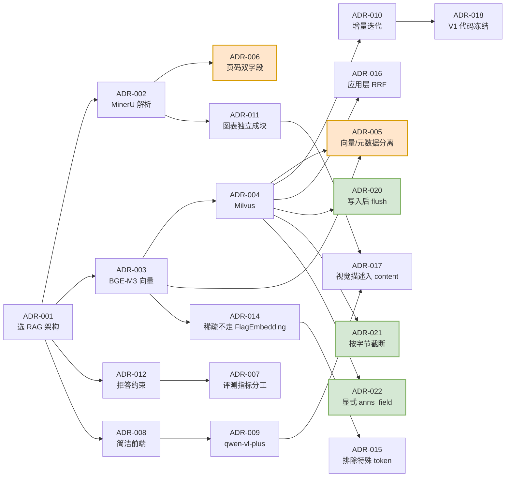

# 技术决策记录（ADR）

> 本文档以 ADR（Architecture Decision Record）形式记录项目中的关键技术决策。
> 每条记录包含：**背景 → 决策 → 备选方案与否决理由 → 后果**。
> 记录被否决的方案同样重要 —— 它说明选型是权衡的结果，而非默认。

| 状态标记 | 含义 |
| --- | --- |
| ✅ 已采纳 | 当前生效的决策 |
| ⏳ 待验证 | 已决策但需实测确认 |
| ❌ 已否决 | 评估后放弃的方案 |

**变更历史**

| 日期 | 阶段 | 变更 |
| --- | --- | --- |
| 2026-09-18 | M2 系统设计 | 建立 ADR-001 ~ ADR-012 |
| 2026-09-18 | M3 实现 V1 | 追加 ADR-013（PDF 解析模式由 txt 改用 OCR） |
| 2026-09-20 | M5 实现 V2 | 追加 ADR-014 ~ ADR-022（稀疏编码、RRF 融合、视觉描述、V1 冻结，以及三个实测发现的健壮性修复） |

---

## ADR-001 采用 RAG 架构，而非关键词检索或模型微调

- **状态**：✅ 已采纳
- **日期**：2026-09-18
- **背景**：业务场景（M1 第 1.2 节）要求答案必须能**回指到标准原文的具体页码**，用于投标应答与合规审计举证。

**决策**：采用检索增强生成（RAG）架构。

**备选方案与否决理由**

| 方案 | 否决理由 |
| --- | --- |
| 全文关键词检索（`Ctrl+F` 类） | 只能命中字面相同的词。用户问"灾备多久能恢复"、标准原文写"恢复时间目标（RTO）"，关键词直接失效。且无法返回连续语义段落 |
| 模型微调 | 微调后知识固化在参数中，**无法给出可靠出处**，而"出处"恰是本场景的第一需求；标准换版即需重训，维护成本高；本场景最忌讳编造条款，微调的幻觉风险不可控 |
| **RAG** ✅ | 检索负责**定位原文**、生成负责**讲清楚**，职责解耦；页码作为元数据天然贯穿链路，直接满足溯源要求；标准换版只需重建索引，无需重训模型 |

**后果**

- 正面：溯源可靠性由数据管线保证，不依赖模型"自觉"；知识库更新成本低
- 负面：引入完整的检索链路复杂度（解析、分块、向量化、检索、生成），系统组件数量显著高于纯模型方案

---

## ADR-002 PDF 解析选用 MinerU

- **状态**：✅ 已采纳（实测验证）
- **日期**：2026-09-18
- **背景**：需要在解析 PDF 的同时**保留页码元数据**，并提取表格、图表等非纯文本元素。

**决策**：使用 MinerU 做版面解析。

**备选方案与否决理由**

| 方案 | 页码元数据 | 版面理解 | 表格 | 图表 | 结论 |
| --- | --- | --- | --- | --- | --- |
| PyPDF2 / pypdf | 需自行按页遍历拼装 | ❌ 无 | ❌ 抽成散乱文本 | ❌ 完全丢失 | ❌ 否决 |
| pdfplumber | 同上 | ⚠️ 仅坐标级 | ⚠️ 部分支持 | ❌ 丢失 | ❌ 否决 |
| **MinerU** ✅ | ✅ **原生按内容块输出页码** | ✅ 识别标题/正文/表格/图片/公式 | ✅ 输出 HTML 结构化表格 | ✅ 输出图片 + 图注 + 页码 | ✅ 采纳 |

**否决 PyPDF2/pdfplumber 的核心原因**：它们只解决"把字抽出来"，而本项目还需要"这个字在第几页"和"这个图表是什么" —— 后者是 V2 视觉解析的输入前提。用它们实现需自行构建版面分析，等于重造 MinerU。

**实测验证结果**（M1 数据确认阶段）：

- 已用同类国标文档实跑 MinerU，输出内容块列表**全部携带页码字段，无缺失**
- 图表元素被正确识别为独立内容块，携带图片路径、图注、坐标与页码

**后果**

- 正面：页码溯源与图表解析一次到位，V2 视觉解析有现成输入
- 负面：**CPU 推理较慢**。缓解：解析属一次性离线操作，且本机模型权重已就绪，无需下载

**配套决策**：保留降级路径 —— MinerU 异常时切换轻量解析方案，**但页码元数据必须保留**，确保 F5 硬性要求在任何情况下不失效。

---

## ADR-003 向量模型选用 BGE-M3

- **状态**：✅ 已采纳（本地权重已验证完整）
- **日期**：2026-09-18

**决策**：使用 BGE-M3 生成向量，**维度 1024**。

**选型依据**

1. **中文语义能力强**：知识库为中文国标文档，BGE-M3 在中文语义匹配上明显优于多语言通用模型
2. **一份模型三种输出**：同时支持密集向量、稀疏权重（lexical weights）、多向量（ColBERT）。**V2 的混合检索可复用同一份模型**，无需引入 BM25 等额外组件 —— 这是选择它的决定性因素
3. **长文本友好**：标准条款常为长句与多子句结构，需要较强的长文本建模能力
4. **本地权重已就绪**：无调用成本、无数据外泄风险，可完全离线运行

**后果**

- 正面：V2 混合检索的实现成本大幅降低（同一模型同时出稠密与稀疏表示）
- 负面：**CPU 编码速度慢**。缓解：向量化只发生在离线建库阶段（一次性）；在线仅需编码用户问题（单条），开销可接受

---

## ADR-004 向量数据库选用 Milvus

- **状态**：✅ 已采纳（实例已运行并验证连通）
- **日期**：2026-09-18

**决策**：使用 Milvus 存储 chunk 向量。

**备选方案与否决理由**

| 方案 | 否决理由 |
| --- | --- |
| FAISS | 是**库**而非**服务**：无并发访问能力、无持久化服务、无法多进程共享。M4 要求"服务化 + 局域网访问 + 不少于 20 并发"，FAISS 需自行封装服务层 |
| Qdrant / Weaviate | 能力上可行，但**稀疏向量与稠密向量共存的成熟度**不及 Milvus 2.6；且任务书指定 Milvus |
| **Milvus** ✅ | 服务化部署、支持稠密/稀疏向量并存、支持标量字段过滤、生态成熟 |

**关键理由**：Milvus 2.6 支持 **`SPARSE_FLOAT_VECTOR` 字段**，这是 **V2 混合检索（稠密 + 稀疏 + RRF）的前置条件**。用 FAISS 实现混合检索需自行维护两套索引并手写融合逻辑，复杂度与出错面都显著更高。

**后果**

- 正面：V2 混合检索可直接在现有 Collection 上加字段实现；并发与服务化开箱即用
- 负面：引入独立的 Milvus 服务依赖（含 etcd、MinIO 组件），部署复杂度高于嵌入式方案

---

## ADR-005 向量与元数据分离存储（Milvus + MySQL）

- **状态**：✅ 已采纳
- **日期**：2026-09-18
- **背景**：页码、文档名等溯源信息既可存在 Milvus 的标量字段中，也可独立存 MySQL。

**决策**：**Milvus 存向量，MySQL 存元数据；页码溯源以 MySQL 为唯一真相源。**

**职责边界**

| 存储 | 回答的问题 |
| --- | --- |
| Milvus | "哪些块与问题相关？"（相似度计算） |
| MySQL | "这些块是什么、来自哪一页？"（结构化查询与溯源） |

**否决"全塞进 Milvus"的理由**：

1. **抗风险**：若元数据只存在于向量库，索引重建、迁移或版本切换时溯源信息有丢失风险。分离后 Milvus 可随时重建，MySQL 中的溯源数据不受影响
2. **查询能力**：MySQL 擅长结构化查询（按文档统计、按时间筛选、关联问答记录），向量库的标量过滤能力有限
3. **任务书要求**：明确要求 MySQL 存储文档元信息与 chunk 元数据

**代价与缓解**：检索后需二次查询 MySQL 回填元数据，增加一次数据库往返。缓解：`chunk_id` 建索引，且 MySQL 为本地连接，单次往返开销在毫秒级，相对生成模型耗时（秒级）可忽略。

**决策补充**：Milvus 中仍**冗余保存 `page_no`、`content` 字段**，用于检索结果快速回显与日志记录；但**对外返回的溯源信息一律以 MySQL 为准**，保证一致性。

---

## ADR-006 页码采用 `page_no` + `page_nums` 双字段设计

- **状态**：✅ 已采纳
- **日期**：2026-09-18
- **背景**：LangChain 分块时，一个 chunk 可能由**多个相邻内容块合并**而成，而这些内容块可能跨越两页。

**决策**：每个 chunk 同时保存两个页码字段：

- `page_no`（INT）—— **主页码**，取 chunk 覆盖的首个内容块页码，用于前端展示
- `page_nums`（JSON）—— **完整页码列表**（去重排序），用于保留完整溯源信息

**否决"只存单个页码"的理由**：

若 chunk 跨第 3、4 页而只记录 `page_no = 3`，用户按页码翻到第 3 页可能**找不到答案后半部分的内容**，溯源精度受损。而 N1 明确要求页码溯源在各版本不得降级。

**否决"只存页码列表"的理由**：

前端展示需要单一主页码（"第 3 页"比"[3,4]"更符合普通用户阅读习惯），且排序、展示逻辑更简单。

**后果**

- 正面：跨页 chunk 的溯源信息完整；前端展示简洁；为后续"页码区间"展示（如"第 3-4 页"）预留了数据基础
- 负面：多存一个字段，写入逻辑略复杂

---

## ADR-007 评测指标分工：确定性指标自算，faithfulness 走 RAGAS

- **状态**：✅ 已采纳
- **日期**：2026-09-18
- **背景**：M5 门禁要求"**分数说话**" —— 每轮迭代必须给出对比基线的指标提升数据。若指标本身不可复现，迭代对比就失去意义。

**决策**

| 指标 | 计算方式 | 理由 |
| --- | --- | --- |
| `recall@k` | **自算** | 给定标注结果与检索返回列表，数值可精确计算 |
| `MRR` | **自算** | 同上 |
| `refusal_accuracy` | **自算** | 判断是否拒答为确定性判定 |
| `faithfulness` | **RAGAS**（deepseek-v4-flash 作裁判模型） | 需要语义级判断"答案是否完全由上下文支撑"，无法用规则精确计算 |

**否决"全部交给 RAGAS"的理由**：

`recall@k`、`MRR` 本质是**集合运算**，用 LLM 判定会引入随机性。同样一份检索结果，两次评测可能得出不同数值 —— 这会直接污染 V1/V2/V3 的对比数据，产生**虚假的提升或下降**。

**后果**

- 正面：检索类指标完全可复现，版本对比可信；RAGAS 只承担它真正擅长的语义判定
- 负面：需要自行实现检索指标计算逻辑并维护金标准标注

---

## ADR-008 前端采用静态 HTML + 原生 JS，且不做检索链路可视化

- **状态**：✅ 已采纳
- **日期**：2026-09-18

**决策**：前端为静态 HTML + 原生 JavaScript，由 FastAPI 托管，**无构建步骤**；页面上**不出现任何检索链路可视化内容**。

**关于技术形态**

| 方案 | 否决理由 |
| --- | --- |
| Vue / React | 全部交互仅有四个动作（加载、提问、看答案、看来源）。引入框架、构建工具、依赖管理带来的复杂度**远超收益** |
| 服务端模板渲染 | 交互以异步局部更新为主，模板渲染反而需要额外处理 |
| **静态 HTML + 原生 JS** ✅ | 无构建步骤 → 部署手册无需描述前端构建；单进程单端口启动；页面轻量加载快 |

**关于不做链路可视化**

这不是功能取舍的"偷懒"，而是**由用户画像推导出的产品决策**：

1. M1 用户画像明确，使用者是交付工程师与合规专员 —— **他们不关心检索原理**，检索分数、向量维度、链路节点对他们无意义，反而增加认知负担
2. 展示检索中间结果会让用户**对答案来源产生混淆**：用户真正需要的是"这句话出自哪份文件哪一页"，而不是"第 7 个 chunk 相似度 0.83"
3. 任务书明确约束：Trace 仅后端日志内部记录，不对前端提供查询接口

**后果**

- 正面：用户界面极度聚焦，学习成本近乎为零；部署简单
- 负面：开发调试时无法从界面直观查看检索过程 → **由后端日志承担此职责**（见《架构图_V1.md》3.6 节与 `backend/logging_config.py`）

---

## ADR-009 视觉理解模型选用通义千问 VL（qwen-vl-plus）

- **状态**：✅ 已采纳（接口连通性已验证）
- **日期**：2026-09-18

**背景与决策过程**

任务书指定的视觉模型为 `DeepSeek-V4-Flash-Vision`。但在 M2 阶段做环境核验时实测发现：**DeepSeek 官方 API 仅提供 `deepseek-flash` 与 `deepseek-v4-pro` 两个纯文本模型，不存在视觉模型**（调用任意视觉模型名均返回模型不存在的错误）。

因此需要重新选型。**决策：使用通义千问 VL（`qwen-vl-plus`），通过 OpenAI 兼容接口调用。**

**备选方案与否决理由**

| 方案 | 否决理由 |
| --- | --- |
| 继续等待 DeepSeek 视觉模型上线 | 会阻塞 V2 交付，且上线时间不可控 |
| 本地部署视觉模型（如 Qwen2.5-VL-3B） | 本机**无 GPU**，CPU 推理极慢；且需额外下载数 GB 权重 |
| **通义千问 VL（qwen-vl-plus）** ✅ | 中文图表理解能力强；OpenAI 兼容接口，与现有调用方式一致；接口连通性已实测通过 |

**架构上的应对（比选型本身更重要）**

不把视觉模型**硬编码**进链路，而是抽象出 `VisionProvider` 接口，通过配置项驱动：

```
VISION_BASE_URL=…
VISION_API_KEY=…
VISION_MODEL=…
```

**理由**：视觉模型是本项目唯一存在外部不确定性的组件（指定的模型不存在、后续可能更换厂商）。抽象成可插拔 Provider 后，更换视觉模型**只需修改 `.env`，无需改动任何业务代码**。

**后果**

- 正面：V2 图表解析能力落地；视觉模型可随时替换；配置项与调用方式保持 OpenAI 兼容规范，未来若 DeepSeek 上线视觉模型可直接切回
- 负面：引入第二个外部模型服务商，需管理两套 API 密钥

---

## ADR-010 V2/V3 采用增量扩展，而非重写

- **状态**：✅ 已采纳
- **日期**：2026-09-18

**决策**：V2/V3 均**在上一版本代码基础上叠加**：

- **新建** `v2_pipeline.py` / `v3_pipeline.py`，**保留** `v1_pipeline.py` 可独立运行
- API 契约与前端交互逻辑保持稳定，仅允许**新增**响应字段
- 数据库表结构变更均采用**新增字段/新增表**方式

**否决"V2 直接改写 V1 文件"的理由**：

1. **版本对比是硬需求**：M5 门禁要求给出"对比基线的指标提升数据"。若 V1 被覆盖，就无法在同一环境下重新运行 V1 验证基线的可靠性
2. **归因分析**：出现指标波动时，需要能回退到上一版本定位是哪个改动引入的
3. **任务书明确约束**：迭代是"逐轮增强"，不是"推倒重来"

**后果**

- 正面：三个版本可共存、可对比、可回归；问题归因有据可依
- 负面：存在一定代码重复。缓解：公共逻辑（向量化、数据访问、日志）抽到共享模块，各版本 pipeline 只保留**差异化链路**

---

## ADR-011 表格与图片独立成块，不参与文本切分

- **状态**：✅ 已采纳
- **日期**：2026-09-18

**决策**：解析产出的**表格块与图片块各自独立成一个 chunk**，不参与 LangChain 的文本切分与合并流程。

**否决"与其他文本一起切分"的理由**：

1. **表格结构会碎裂**：表格的语义依赖于行列结构。若被切分器拦腰截断，前半段丢失表头、后半段丢失行标签，检索时即使命中也无法被正确理解
2. **图片语义单元不可分**：图注与图片必须整体保留
3. **页码归属清晰**：独立成块后，块与页码是一对一关系，溯源最精确

**后果**

- 正面：表格与图表的语义完整性得以保留；页码归属精确
- 负面：若表格内容超出单块容量，需特殊处理（截断或按行拆分）。当前 3 份文档的表格规模均在容量内，暂不处理，标记为**后续版本观察项**

---

## ADR-012 提示词强制约束"无依据必须拒答"

- **状态**：✅ 已采纳
- **日期**：2026-09-18
- **背景**：M1 的 N2 要求防止幻觉 —— 本场景用户是拿答案去投标和应对审计的，**编造的标准条款会造成实际业务损失**。

**决策**：在系统提示词中设置硬约束：

1. 只依据提供的检索原文片段作答，不使用模型自身的先验知识补充
2. 检索片段与问题无关时，**明确回复"知识库中未收录相关内容"**，不得推测作答
3. 涉及具体指标数值、等级要求时，必须严格引用原文表述，不做改写或换算

**配套验证**：构造**安全集评测样本（≥10 条）**，包含知识库中确实不存在答案的问题（如询问其他标准的内容、编造的标准号），验证系统拒答准确率 `refusal_accuracy`。

**否决"不做硬约束、依赖模型自觉"的理由**：

通用对话模型的默认行为是"尽量给出有帮助的回答"，在上下文不足时会**用参数化知识补全**。本场景中这恰恰是最危险的行为 —— 一个页码正确但内容编造的答案，比明确的"未收录"危害大得多。

**后果**

- 正面：从提示词层面守住防幻觉底线，并由安全集量化验证
- 负面：拒答率上升可能影响"看起来的可用性"。缓解：V3 通过查询改写提升召回，从**检索端**减少"明明有答案却拒答"的情况，而非放松生成端约束

---

## ADR-013 PDF 解析模式固定使用 OCR，禁用文本层提取

- **状态**：✅ 已采纳（实测验证）
- **日期**：2026-09-18（M3 实现阶段）
- **背景**：MinerU 支持三种解析方法：

  | 方法 | 含义 |
  | --- | --- |
  | `auto` | 自动判断 |
  | `txt` | 直接抽取 PDF 内嵌文字层 |
  | `ocr` | 走 OCR 识别 |

  本项目三份 PDF 均为**文本型**（内含可选中的文字层），直觉上 `txt` 模式最为高效 —— 无需 OCR 计算，速度最快。M2 阶段即按此选了 `txt`。

**决策**：**固定使用 `ocr` 模式**，并放弃 `txt` 模式。

**实测对比**

在 M3 首次真实构建时，发现解析产物存在内容缺失。用同一份文档（GBT 32904-2016）的同一页（第 5 页）做对照：

| 原文应为 | `txt` 模式输出 | `ocr` 模式输出 |
| --- | --- | --- |
| `a）需方依此确定软件质量量化评价需求和评价指标；` | `) 需方依此确定…` ❌ | `a）需方依此确定…` ✅ |
| `GB/T 11457 信息技术 软件工程术语` | `/ 信息技术 软件工程术语` ❌ | `GB/T 11457 信息技术 软件工程术语` ✅ |
| `GB/T 16260.1—2006 软件工程 产品质量 第1部分：质量模型` | `/ — 软件工程 产品质量 第 部分:质量模型` ❌ | `GB/T16260.1—2006 … 第1部分：质量模型` ✅ |
| `GB/T 29832.3 系统与软件可靠性 第3部分：测试方法` | `GB/T29832.3 … 第3部分:测试方法` ✅ | ✅ |

即：`txt` 模式会**间歇性地丢失行首字符** —— 同一页中有的行完整、有的行残缺。

**否决 txt 模式的决定性理由**

丢失的恰好是**标准编号**（`GB/T 11457`、`GB/T 16260.1—2006`）。而在标准合规场景中，标准编号是用户最常用的检索线索 —— 用户会直接问「GB/T 16260.1 规定了什么」。

一旦编号在入库时丢失，**该问题将永远无法命中，且系统会正确地拒答**。这是最坏的一类故障：系统表现"正常"（拒答符合防幻觉设计），但实际能力已经受损，且很难被察觉。

**后果**

- 正面：文本完整性得到保障，标准编号可被正常检索
- 负面：**解析耗时增加约一倍**（CPU 环境约 6.6 秒/页 → 10-20 秒/页）。可接受 —— 解析是一次性离线操作，且 74 页总量下总耗时仍在二十分钟量级

**方法论意义**

这条决策是「**先跑通再信任**」的例证：`txt` 模式"看起来"是更优选择 —— 更快、且文档确实是文本型。合理性的判断不能只依据参数文档的描述，必须落到真实数据的产出上核对。

本项目因此在离线管线中保留了产物抽查环节（如 `chunk_split.py --show N`），用于人工核对分块与页码的正确性。

**附带发现**

不要用 `--start` / `--end` 做分页解析再拼接：分页解析时 MinerU 输出的 `page_idx` 会**从 0 重新计数**，拼接后页码将整体错位。如需处理超长文档，应按整份文件解析。

---

## ADR-014 稀疏向量直接加载 `sparse_linear.pt`，不引入 FlagEmbedding

- **状态**：✅ 已采纳（实测验证）
- **日期**：2026-09-20（M5 实现 V2 阶段）
- **背景**：V2 混合检索需要 BGE-M3 的稀疏权重（lexical weights）。常规做法是引入 `FlagEmbedding` 库。

**决策**：**不引入 `FlagEmbedding`**，而是直接加载模型目录中的 `sparse_linear.pt`（3.5 KB 的线性层）。

**备选方案与否决理由**

| 方案 | 否决理由 |
| --- | --- |
| 引入 `FlagEmbedding` | 会连带触发 `sentence-transformers` 的版本降级，可能破坏本项目**既有的稠密编码**——而稠密向量是 V1 基线与 V2 对比的共同基准，不容有失 |
| 自行实现 BM25 稀疏检索 | ADR-003 已论证：BGE-M3 同一份权重即可产出稀疏表示，引入独立词法组件属额外复杂度 |

**实测验证**

1. `sparse_linear.pt` 已在本地模型目录中，`weight` shape 为 `(1, 1024)` + `bias`，可直接 `torch.load`
2. 手动 CLS 池化 + L2 归一化的结果与 `sentence-transformers.encode(normalize_embeddings=True)` **逐元素完全相同**（最大差 `0.000e+00`，余弦 `1.000000`）
3. 稀疏权重落在实词上：「等级」0.3162、「连续」0.2913、「充分」0.3090、「功能」0.2424

**后果**

- 正面：零新依赖；稠密输出与 V1 完全一致，两版本可比；**因共用同一编码器，稠密与稀疏可合并为一次 forward**，CPU 环境下推理耗时减半
- 负面：需自行维护稀疏编码逻辑（约 30 行），并承担与 FlagEmbedding 实现细节产生偏差的风险。缓解：以实测权重值作为回归测试基线

---

## ADR-015 稀疏编码必须排除特殊 token

- **状态**：✅ 已采纳（实测验证）
- **日期**：2026-09-20

**决策**：在稀疏权重压缩时**显式排除 `<s>`（id 0）、`<pad>`（id 1）、`</s>`（id 2）**。

**背景**：BGE-M3 基于 XLM-Roberta，其特殊 token 经 `sparse_linear` 后**同样会获得权重**。实测 `<s>` 与 `</s>` 的权重达 0.1760~0.1956，与实词处于同一量级。

**否决「保留特殊 token」的理由**：

这些 token 在**任何**文本中都会出现，因此对每一段文本贡献**相同方向的常量偏置**，不携带任何区分度，属于纯噪声。保留它们相当于给所有文档加一个无关维度的固定分量，稀释真实词面的信号。

**实测效果**

排除后，单条查询的稀疏非零维度数从 **12 → 10**、**11 → 9**，正好各少 2 个，与预期一致。

**后果**

- 正面：稀疏向量只表达真实词面信息；维度更稀疏，检索更快
- 负面：需在代码中硬编码特殊 token ID（已注释说明其来源为 XLM-Roberta 词表约定）

---

## ADR-016 RRF 融合在应用层完成，而非使用 Milvus 服务端 `hybrid_search`

- **状态**：✅ 已采纳
- **日期**：2026-09-20

**决策**：分别调用 `search_dense()` 与 `search_sparse()` 取回两路候选，在**应用层**用自实现的纯函数 `rrf.fuse()` 融合。

**备选方案与否决理由**

| 方案 | 否决理由 |
| --- | --- |
| Milvus 服务端 `hybrid_search` + `RRFRanker` | 只返回**融合后的名次**，拿不到两路各自的分数与排名。而任务书 V2 第 1 项明确要求 Trace「完整记录检索命中块、相似度分数、命中页码」；要用服务端融合满足该要求，就得额外再单独查一次，反而多一次往返 |
| **应用层自算 RRF** ✅ | 两路的命中块、分数、页码天然都在手上，Trace 直接可得；融合是纯函数，可单测 |

**后果**

- 正面：Trace 能回答「某个块是靠稠密还是靠稀疏被召回的」——这是 V2 归因分析的核心问题（本轮[指标对比文档](指标对比文档.md)的通道互补分析即由此而来）；RRF 逻辑可单元测试
- 负面：两次 Milvus 往返，且融合逻辑需自行维护。缓解：本地连接，实测两次往返在毫秒级，相对生成模型秒级耗时可忽略

---

## ADR-017 视觉描述追加进 chunk 的 `content`，不新增字段

- **状态**：✅ 已采纳
- **日期**：2026-09-20
- **背景**：视觉模型解析出的图表描述需要进入知识库。可选方案：拼接进现有 `content`、新增独立字段、或另起一条 chunk。

**决策**：把描述以 `图注 + "\n[视觉解析] " + 描述` 的形式**追加进原图片块的 `content`**。

**备选方案与否决理由**

| 方案 | 否决理由 |
| --- | --- |
| 新增 `vision_desc` 字段（MySQL 列 + Milvus 标量字段） | 改动面大（两张存储结构变更 + 入库脚本 + 回填逻辑），且 Milvus 集合本就必须重建；收益仅是「原文与模型输出可区分」，当前无此需求 |
| 图片另起一条新 chunk | 同一张图会产生两条 chunk 互相竞争名次，可能把原本靠前的图注块挤掉；且需额外去重逻辑 |
| **追加进 content** ✅ | 不改表结构，检索与生成自动生效，改动最小（符合 ADR-010 增量扩展） |

**后果**

- 正面：最小改动达成目的；描述直接参与向量化，检索即生效；实测 6 个图片块的 content 长度 621~1496 字符，远低于上限
- 负面：**原文与模型生成的描述混在同一字段，事后无法区分哪句是模型写的**。若将来需要审计模型输出的准确性，需回溯 `.vision.json` 缓存（该缓存按图片文件名保存了描述原文，可作补偿）

---

## ADR-018 V1 代码冻结，不随 V2 重构

- **状态**：✅ 已采纳（有意偏离 ADR-010）
- **日期**：2026-09-20

**决策**：**`v1_pipeline.py` 一行都不改**，即使这意味着 V1/V2 之间存在少量重复代码。V2 采用**继承**方式复用 V1 的公共环节（`V2Pipeline(V1Pipeline)` 仅覆盖 `retrieve()`），而非抽取共享基类后同步修改 V1。

**与 ADR-010 的关系**：ADR-010 主张「公共逻辑抽到共享模块，各版本 pipeline 只保留差异化链路」。本条决策**有意偏离**该主张，理由如下。

**核心理由：基线可归因性**

V2 重灌知识库后，**索引内容已经变化**（图片块追加了视觉描述）。此时：

- 若 V1 代码**保持原样** → V1 在新索引上的任何指标变化，都能**干净归因到索引改动**
- 若 V1 代码**被重构** → 指标波动将同时混入「代码改动」与「索引改动」两个因素，**再也分不清**

本轮[指标对比文档](指标对比文档.md)的三点归因设计（「视觉解析的净贡献 = V1新索引 − 基线」）之所以成立，完全依赖本条决策。

**否决「抽取共享基类」的理由**：

抽取基类必然要修改 `v1_pipeline.py`。即使改的是纯结构、不改行为，也需要逐行复核「行为确实未变」，而这个复核本身又要消耗一轮评测——而评测又因索引已变而无法与基线直接对比。**收益（少几十行重复代码）远小于代价（失去基线可归因性）。**

**后果**

- 正面：V1 与 V2 的差异**严格限定在检索环节**，归因结论可信；V1 可独立运行复核基线
- 负面：`_build_context` / `_build_messages` / `_build_sources` / `_finish` 等公共环节在 V1、V2 之间以继承形式复用（非复制），实际上**并未产生真实重复**；真正的代价是 V2 与 V1 形成继承耦合，若 V3 需要不同的公共环节行为，需重新考虑结构

---

## ADR-019 不使用 `HYBRID_SPARSE_WEIGHT`

- **状态**：✅ 已采纳
- **日期**：2026-09-20

**决策**：`backend/config.py` 中的 `hybrid_sparse_weight`（默认 0.3）**保持不被任何代码读取**，并在配置注释中说明原因。

**背景**：该配置项是 M2 阶段「稠密分数与稀疏分数按权重加权融合」设想的遗留。V2 最终采用 RRF 融合。

**否决「改为加权融合以利用该配置」的理由**：

稠密通道输出**余弦相似度**（0~1），稀疏通道输出**内积**（无上界），两者**尺度不可直接比较**。加权融合必须先做分数归一化，而归一化方式的选择本身又是一个需要调参的假设。RRF 基于**名次**融合，天然免疫尺度不一致问题——这正是选择它的原因。

**后果**

- 正面：避免了「配置项存在但语义无效」造成的误导——若不说明，后人会以为调整它可影响结果
- 负面：保留了一个无用配置项。保留而非删除，是为不破坏既有 `.env` 的兼容性

---

## ADR-020 Milvus 写入完成后必须显式 flush

- **状态**：✅ 已采纳（实测发现并修复）
- **日期**：2026-09-20

**决策**：`insert_vectors()` 在写入循环结束后调用 `flush_collection()`，使数据**立即可被检索到**。

**背景与实测**

Milvus 在默认一致性级别下，新插入的数据要等**自动 flush**（周期性触发）之后才进入可检索状态。实测：同一进程内先 `insert` 再 `search`：

| 操作 | 命中数 |
| --- | --- |
| 插入后**不 flush** 直接检索 | **0** |
| `flush` 后检索 | **1**（正确命中） |

**严重性：这是一个静默失效**

原代码库中**没有任何 flush 调用**。V1 之所以从未暴露该问题，仅因为知识库是提前一天灌入的，期间已被 Milvus 自动 flush。但 V2 的「重建知识库后立即评测」工作流**必然踩到**，且失败表现为「不报错、只是少召回甚至完全查不到」——属于本项目 ADR-013 记录过的最难察觉的一类故障。

**后果**

- 正面：写入即可检索，重建后的评测结果可信
- 负面：flush 是相对昂贵的操作，`insert_vectors` 每批调用一次会略微增加写入耗时。当前 127 条规模下影响可忽略

---

## ADR-021 Milvus 字符串字段必须按 UTF-8 字节截断

- **状态**：✅ 已采纳（实测发现并修复）
- **日期**：2026-09-20

**决策**：新增 `_truncate_utf8(text, max_bytes)`，**按 UTF-8 字节数**截断写入 Milvus 的字符串字段（`chunk_id` / `doc_id` / `content`），替换原先的字符切片。

**背景与实测**

Milvus 的 `VARCHAR(max_length=N)` 以 **UTF-8 字节**计数，而 Python 的字符串切片按**字符**计数。一个中文字符占 3 字节。向 `content` 写入 20000 个中文字符时：

```
MilvusException(code=1100, length of varchar field content exceeds max length,
                row number: 0, length: 24576, max length: 8192)
```

即 `text[:8192]` 对中文内容实际产生 **24576 字节**，超限 3 倍。这是**整条插入被拒绝**，不是静默截断。

**影响面**

触发阈值为 **2730 个中文字符**（8192 ÷ 3）。当时 `CHUNK_MAX_CHARS = 2000`（=6000 字节）尚未触达，因此该缺陷一直**潜伏**——一旦有人调大该配置，所有含长中文块的写入会整体失败。

**后果**

- 正面：兜底真正生效；截断时记 WARNING，不再静默
- 负面：截断语义变为「按字节」而非「按字符」，对纯 ASCII 内容两者等价，对中文内容需以字节理解

---

## ADR-022 稠密检索必须显式指定 `anns_field`

- **状态**：✅ 已采纳（实测发现并修复）
- **日期**：2026-09-20

**决策**：`search_dense()` 在调用 Milvus `search` 时**显式声明 `anns_field="embedding"`**。

**背景与实测**

V1 时期集合只有一个向量字段，Milvus 能**自动推断**检索目标。V2 加入 `sparse_embedding` 后，集合内出现**两个向量字段**，此时不指定 `anns_field` 会直接报错：

```
MilvusException(code=65535, message=multiple anns_fields exist,
                please specify a anns_field in search_params)
```

**严重性：V2 的前置动作本身会让 V1 失效**

「加稀疏字段」是 V2 的必要步骤，而这个动作**本身**就会让 V1 的稠密检索完全不可用。若只验证 V2 能否工作，会误以为一切正常，直到发现 V1 也已损坏。

该问题由实现计划中「冒烟测试 V1 仍可用」这一步抓出——**这个看似多余的检查步骤，实际拦下了一次完整的 V1 功能回归**。

**配套措施**：新增 `has_sparse_field()`，并在 `insert_vectors()` 写入稀疏向量前校验集合是否含该字段；若不含，抛出**可执行的中文提示**（告知需执行 `--rebuild`），而不是让 Milvus 抛出晦涩的字段错误。

**后果**

- 正面：双向量字段集合下检索行为明确；V1 与 V2 均可正常工作
- 负面：`anns_field` 与字段名形成硬编码耦合，若将来字段改名需同步修改

---

## 附：决策关联图



> **橙色**为**页码溯源**相关的核心决策链：MinerU 产生页码（ADR-002）→ 双字段设计保完整溯源（ADR-006）→ 元数据独立存储防丢失（ADR-005）。
>
> **绿色**为 V2 实现期间**由测试实测发现**的三个健壮性修复（ADR-020/021/022）。三者都属于「静默失效」类缺陷——不报错、只是能力受损或数据写不进去，是本项目最需要警惕的故障模式（同类教训见 ADR-013）。
