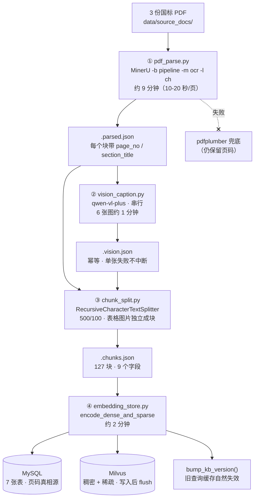
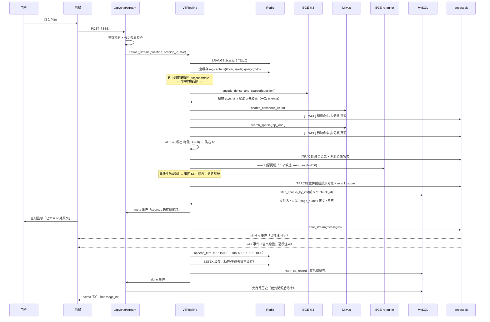

# 计算机专业知识库 RAG 问答助手 —— 答辩讲解文档

| 项 | 值 |
| --- | --- |
| 文档用途 | 答辩讲解脚本 + 技术栈/目录/模块速查 |
| 编制日期 | 2026-09-28 |
| 依据 | 全部源码、`docs/` 下既有文档、`eval/eval_result/` 下五个真实评测结果文件 |
| 说明 | 本文所有数字均取自**评测结果文件的实际内容**；凡与既有文档不一致处，在第七章「如实披露」中逐条标出 |

---

## 〇、三分钟开场（背下来就够）

> 这是一个**面向企业标准合规场景的私有知识库问答系统**。业务背景是：公司承接数据中心运维、处理客户数据、验收外包软件，日常要查三份国家标准，合计 74 页。人工查有四个痛点——**查得慢、引不准、上手慢、版本混**，其中最要命的是"引不准"：投标应答和审计举证必须写明"依据某文件第 X 页"，人工摘录经常写错页码。
>
> 系统用 **RAG（检索增强生成）** 解决：**检索负责定位原文，生成负责讲清楚，页码作为元数据贯穿全链路**。用户用大白话提问，系统基于三份国标的原文作答，并**明确标注答案出自哪份文档的第几页**；知识库里没有的内容，系统明确拒答、绝不编造。
>
> 技术上是一个 **FastAPI + Milvus + MySQL + Redis** 的服务，配一条**离线建库管线**。分三轮迭代：**V1 朴素稠密检索建基线 → V2 视觉解析 + 稠密稀疏混合检索 → V3 重排 + 查询改写**。每轮都用**同一套 30 条评测集**量化验证，先立尺子再改代码。

---

## 一、项目背景：为什么是 RAG

### 1.1 业务场景

三份国标对应三类强合规诉求：

| 业务活动 | 依据标准 | 典型使用人 |
| --- | --- | --- |
| 承接数据中心托管/运维，需通过业务连续性等级评价（投标资质、年度复审） | GB/T 42581-2023《信息技术服务 数据中心业务连续性等级评价准则》（29 页） | 交付工程师、体系专员 |
| 为金融、政务客户处理数据，需通过合规审计 | GB/T 41479-2022《信息安全技术 网络数据处理安全规范》（13 页） | 安全合规专员 |
| 采购/验收外包软件，需做量化评价打分 | GB/T 32904-2016《软件质量量化评价规范》（32 页） | 质量管理员、项目经理 |

合计 **3 份文档 / 74 页 / 3.26 MB**，是本项目的**全部**知识库来源。

### 1.2 四个痛点

1. **查得慢**：一次典型查询要开 PDF、翻目录、`Ctrl+F`、跨页比对，平均 3–5 分钟。若问法与标准原文用词不一致（用户问"灾备恢复多久"，标准写的是"恢复时间目标（RTO）"），`Ctrl+F` 直接失效。
2. **引不准** ⭐：投标和审计必须写"依据 GB/T 42581-2023 第 X 页"，人工摘录常页码写错、条款号对不上，在评标现场被打回。
3. **上手慢**：新员工不知道某个要求落在哪份标准的哪一章，只能整个文件夹通读。
4. **版本混**：三份标准年份不同（2016 / 2022 / 2023），人工比对容易张冠李戴。

### 1.3 三条技术路线对比（高频考点）

| 方案 | 能否解决 | 结论 |
| --- | --- | --- |
| `Ctrl+F` / 全文关键词检索 | 只能命中字面相同的词，解决不了"问法≠原文用词"；且返回不了连续语义段落 | ✗ |
| 把标准内容拿去微调大模型 | 模型"记住"了但给不出可靠出处；标准换版就要重训；**本场景最忌讳编造条款** | ✗ |
| **RAG** | 先检索原文片段，再让模型**只依据这些片段**作答，答案天然可附原文出处 | ✓ **采用** |

**一句话说清 RAG 的价值**：它把"翻得准"和"说得对"两件事解耦——检索负责定位原文，生成负责讲清楚，页码作为元数据贯穿始终。

### 1.4 用户画像对设计的硬约束

使用者是**交付工程师与合规专员，不是工程师视角的技术用户**。这直接推导出两条设计红线：

- 界面上**不出现**检索分数、向量维度、链路节点等内部概念——他们不关心"第 7 个 chunk 相似度 0.83"，只关心"这句话出自哪份文件哪一页"。
- 因此 **Trace（检索中间过程）只写服务端日志，不提供 Trace 查询接口，前端不做检索链路可视化**。

---

## 二、完整技术栈清单（逐个解释用途）

### 2.1 全景表

| 分层 | 组件 | 版本（实测） | 在本项目里干什么 |
| --- | --- | --- | --- |
| 语言/运行时 | Python | 3.12.7 | 全部后端与离线脚本 |
| 虚拟环境 | venv（`--system-site-packages`） | — | 继承宿主已装的 MinerU/PyTorch，避免数 GB 重复下载 |
| Web 框架 | FastAPI | 0.135.1 | 提供 REST + SSE 接口，自动生成 Swagger 文档 |
| ASGI 服务器 | Uvicorn | 0.41.0 | 跑 FastAPI 进程 |
| 数据校验 | Pydantic v2 + pydantic-settings | — | 请求体校验、错误中文话术、读 `.env` 配置 |
| 向量数据库 | Milvus | 2.6.6（Docker） | 存稠密 + 稀疏向量，做相似度检索 |
| Milvus 客户端 | pymilvus | 2.6.11 | Python 侧建集合、写入、检索 |
| 业务元数据库 | MySQL | 8.0.42（Windows 服务 `MySQL80`） | **页码溯源的唯一真相源**：文档元信息、chunk 元数据、用户、历史、收藏 |
| MySQL 客户端 | PyMySQL | 1.1.1 | 纯 Python 驱动，免编译 |
| 缓存 / 会话 | Redis | 8.6.1（Docker） | 多轮对话短期记忆 + 高频查询缓存 |
| Redis 客户端 | redis-py | 7.2.1 | — |
| PDF 版面解析 | **MinerU** | 已装（CPU 模式） | 从 PDF 抽文本 + **页码元数据** + 表格 + 图表区域 |
| 解析兜底 | pdfplumber | 0.11.0 | MinerU 不可用时降级，**仍保留页码** |
| 页数统计 | pypdf | 4.2.0 | 读取 PDF 真实页数 |
| 文本分块 | LangChain `RecursiveCharacterTextSplitter` | langchain-text-splitters 1.1.2 | 正文递归切分（500 字符 / 100 重叠） |
| 视觉理解模型 | **通义千问 VL**（`qwen-vl-plus`） | 阿里云百炼 | 解析 PDF 里的流程图/结构图，把图内语义转成中文描述 |
| 向量模型 | **BGE-M3**（本地权重） | sentence-transformers 5.2.3 | 一次 forward 同时产出**稠密 1024 维**与**稀疏词元权重** |
| 重排模型 | **BGE-reranker-v2-m3**（本地权重，2.27 GB） | sentence-transformers `CrossEncoder` | 对候选池做 CrossEncoder 精排 |
| 生成模型 | **deepseek-v4-flash** | openai 1.109.1 | 基于检索片段生成最终答案（OpenAI 兼容接口） |
| 推理框架 | PyTorch / Transformers | 2.11.0 / 4.57.6 | 加载本地三个模型权重 |
| 数值计算 | numpy **锁定 `<2.0`** | 1.26.4 | 见下方「为什么锁 numpy」 |
| 评测框架 | **RAGAS** | 0.4.3 | 算 `faithfulness`（忠实度） |
| 评测辅助 | datasets / langchain-openai / langchain-huggingface | — | RAGAS 的裁判模型与向量模型接入 |
| 日志 | Python 原生 `logging` | — | 请求日志 + 检索 Trace + 错误堆栈，10 MB×10 滚动 |
| 前端 | 原生 HTML/CSS/JS | **无框架、无构建** | 三栏式问答界面 |
| 测试 | pytest | 9.1.1 | 12 个测试文件，中文用例名 |
| UI 冒烟 | Node + Edge headless + CDP | 无第三方依赖 | 8 个场景自动截图（**当前已与页面脱节，见第七章**） |

### 2.2 几个「为什么选它」的标准答案

**为什么用 Milvus，不用 FAISS？**
FAISS 是**库**不是**服务**：无并发访问能力、无持久化服务、无法多进程共享。需求要求服务化 + 局域网访问 + 不少于 20 并发，FAISS 得自己封装服务层。更关键的是：**Milvus 2.6 支持 `SPARSE_FLOAT_VECTOR` 字段**，这是 V2 混合检索（稠密 + 稀疏）的前置条件——用 FAISS 实现混合检索要自己维护两套索引并手写融合，复杂度和出错面都显著更高。

**为什么 Milvus 和 MySQL 都要，不把元数据全塞进向量库？**
职责边界很清楚：

| 存储 | 回答的问题 |
| --- | --- |
| Milvus | "哪些块与问题相关？"（相似度计算） |
| MySQL | "这些块是什么、来自哪一页？"（结构化查询与溯源） |

三条理由：① **抗风险**——Milvus 可以随时重建，MySQL 里的溯源数据不受影响；② **查询能力**——MySQL 擅长结构化查询（按文档统计、按时间筛选、关联问答记录）；③ 任务书明确要求用 MySQL 存文档元信息与 chunk 元数据。
代价是检索后要二次查 MySQL 回填元数据，但 `chunk_id` 有索引、本地连接往返在毫秒级，相对生成模型的秒级耗时可忽略。

**为什么视觉模型用通义千问 VL 而不是任务书指定的 DeepSeek-V4-Flash-Vision？**
M2 阶段做环境核验时**实测发现**：DeepSeek 官方 API 只提供 `deepseek-flash` 与 `deepseek-v4-pro` 两个纯文本模型，**不存在视觉模型**（调用任意视觉模型名都返回模型不存在）。本机无 GPU，本地部署视觉模型（如 Qwen2.5-VL-3B）CPU 推理极慢且要下数 GB 权重。于是改用 `qwen-vl-plus`（中文图表理解强、OpenAI 兼容接口）。
**比选型本身更重要的是架构应对**：不把视觉模型硬编码进链路，而是抽象成 `VisionProvider`，由 `VISION_BASE_URL / VISION_API_KEY / VISION_MODEL` 三项配置驱动——换模型只改 `.env`，**无需改动任何业务代码**。视觉模型是本项目唯一存在外部不确定性的组件，所以给了它唯一的可插拔设计。

**为什么 PDF 解析固定用 `ocr` 模式，不用更快的 `txt` 模式？**（ADR-013，实测踩出来的）
实测 `txt` 模式（直接抽 PDF 文字层）会**丢失行首字符**：

- `"GB/T 11457 信息技术 软件工程术语"` → 被解析成 `"/ 信息技术 软件工程术语"`
- `"a）需方依此确定软件质量量化评价需求…"` → 被解析成 `") 需方依此确定…"`

对标准知识库而言，**标准编号恰恰是用户最常用的检索线索**，一旦丢失，用户按编号提问将完全无法命中。同页改用 `ocr` 后字符全部完整还原。代价是解析耗时约翻倍（CPU 约 10–20 秒/页，3 份 PDF 全量解析约 9 分钟）。
评测集里的 **R12（"GB/T 16260.1 是什么标准"）就是专门用来验证这条决策是否生效的**。

**为什么 `numpy` 必须锁在 2.0 以下？**
若宿主的 pandas / scipy / scikit-learn 由 conda 安装，它们是用 numpy 1.x 编译的。一旦 numpy 被 pip 升级到 2.x，这些包会因 **C ABI 不兼容**而全部无法导入——本项目实际踩过这个坑。同理，安装 ragas 时建议 `--no-deps`，避免它顺手把 numpy 升上去。

**为什么不用 FlagEmbedding 拿 BGE-M3 的稀疏向量？**
标准做法是装 `FlagEmbedding`，但它会连带触发 `sentence-transformers` 版本降级，破坏本项目既有的稠密编码。排查后发现模型权重目录里**已经有** `sparse_linear.pt`（仅 3.5 KB，就是稀疏权重的线性层），可以直接 `torch.load` 加载。**收益**：不引入新依赖，而且因为稠密输出可验证为完全一致，可以把稠密与稀疏**合并成一次 forward**，省掉一半 CPU 推理时间。

**为什么前端用原生 JS，不上 Vue/React？**
全部交互只有四个动作：登录、提问、看答案、看来源页码。引入框架、构建工具、依赖管理带来的复杂度**远超收益**。原生方案的直接好处是：**无构建步骤**（部署手册不用描述前端构建）、单进程单端口启动、页面轻量加载快。（V1.1 增量加了历史/收藏/双身份后，代码量涨到 1185 行，但仍在原生可控范围内。）

---

## 三、项目目录结构

```
cs-rag/
├── README.md                     # 项目总览、快速开始、文档索引
├── requirements.txt              # Python 依赖（含大量「为什么这么装」的注释）
├── .env.example                  # 配置模板（十七组，逐项中文注释）
├── .env                          # 实际配置（已 gitignore，含密钥）
├── pytest.ini                    # 测试配置（纯 ASCII，中文说明在 conftest.py）
├── start_backend.bat             # 一键启动：查 venv → 体检依赖 → 起后端
│
├── docs/                         # 全部工程文档
│   ├── 需求文档.md                # M1：背景、用户画像、F1–F12 功能、N1–N9 非功能、范围边界
│   ├── 架构图_V1.md               # M2：V1 分层架构、数据流、数据模型、选型说明
│   ├── 架构图_V2.md               # M5：V2 架构（混合检索 + 视觉解析）
│   ├── 接口文档.md                # 21 个接口定义、调用示例、Postman/JMeter 指引
│   ├── 技术决策记录.md            # 22 条 ADR，含被否决方案及理由
│   ├── 基线评测报告.md            # M3：V1 基线指标与问题归因（迭代靶点来源）
│   ├── 指标对比文档.md            # V1/V2 指标对比与归因分析
│   ├── 版本迭代文档.md            # V1→V2 改动点、遇到的 10 个问题与解决方案
│   ├── 部署运行手册.md            # 环境依赖、启动顺序、验证、故障排查
│   ├── 部署验证记录.md            # M4：部署实测数据（对照 N3/N4）
│   ├── 答辩讲解文档.md            # 本文件
│   └── superpowers/              # V2/V3 的 spec 与实施计划（过程记录）
│
├── data/
│   ├── source_docs/              # 【输入】知识库源 PDF（3 份国标）
│   ├── parsed/                   # 【中间产物】MinerU 解析结果 + 分块结果 + 视觉描述缓存
│   ├── avatars/                  # 用户上传的自定义头像图片
│   └── finetune/                 # 微调数据集（智查AI SFT，学生/职场双身份），非主线功能
│
├── scripts/                      # 【离线管线】与在线服务严格解耦
│   ├── __init__.py
│   ├── pdf_parse.py              # ① MinerU 解析 → .parsed.json（含页码元数据）
│   ├── mineru_entry.py           # MinerU 调用入口（解决解释器绑定问题，仅 3 行）
│   ├── vision_caption.py         # ② qwen-vl-plus 解析图表 → .vision.json
│   ├── chunk_split.py            # ③ 分块 → .chunks.json（保页码）
│   ├── embedding_store.py        # ④ 向量化并入库（Milvus + MySQL）
│   ├── build_v1_index.py         # 评测工具：重建「V1 旧索引」用于归因对比
│   ├── ragas_eval.py             # 评测脚本：检索/生成/安全三类指标
│   ├── preflight_check.py        # 启动前依赖体检（被 start_backend.bat 调用）
│   └── ui_smoke_test.mjs         # UI 冒烟测试（Edge headless + CDP）
│
├── backend/                      # 【在线服务】
│   ├── main.py                   # FastAPI 入口：生命周期、中间件、异常处理、路由注册、静态托管
│   ├── config.py                 # 全局配置单例（读 .env，十七组参数）
│   ├── logging_config.py         # 日志 + 请求上下文 + 检索 Trace 辅助函数
│   ├── embedder.py               # BGE-M3 封装（稠密 + 稀疏，一次 forward）
│   ├── llm_client.py             # ChatLLM（deepseek）+ VisionLLM（qwen-vl）客户端
│   ├── reranker.py               # BGE-reranker 封装（含超时与降级）
│   ├── db/
│   │   ├── milvus_client.py      # 向量库封装：建集合、写入、稠密/稀疏检索
│   │   ├── mysql.py              # 业务库封装：7 张表的读写
│   │   ├── redis_client.py       # 缓存与会话记忆
│   │   └── schema.sql            # 建表语句（7 张表）
│   ├── rag_pipeline/             # 【检索链路】三个版本并存
│   │   ├── __init__.py           # get_pipeline_by_name() 版本路由工厂
│   │   ├── v1_pipeline.py        # V1 全量业务逻辑（answer/retrieve/提示词/溯源/收尾）
│   │   ├── rrf.py                # RRF 融合纯函数（V2 新增）
│   │   ├── v2_pipeline.py        # V2：继承 V1，只覆盖 retrieve()
│   │   ├── v3_pipeline.py        # V3：继承 V2，覆盖 retrieve() + _build_sources()
│   │   └── query_rewrite.py      # 查询改写（V3，默认关闭的对照实验分支）
│   └── api/                      # 【接口层】
│       ├── query.py              # 问答（含 SSE 流式）+ 旁路写历史
│       ├── build_kb.py           # 知识库构建（后台线程）+ 状态查询
│       ├── upload.py             # PDF 上传 + 文档清单
│       ├── auth.py               # 登录（账号即身份）/ 用户信息 / 退出
│       ├── history.py            # 历史会话的增删查 + 上下文回灌
│       └── favorite.py           # 收藏的增删查
│
├── frontend/                     # 【前端】静态三件套，无构建
│   ├── index.html                # 全部 DOM（工作台 + 欢迎/登录页）
│   ├── app.js                    # 全部交互逻辑（单 IIFE，1185 行）
│   └── style.css                 # 鹅黄/奶油配色、三档媒体查询
│
├── eval/                         # 【评测】
│   ├── 测试数据集.json            # 30 条金标准（检索 12 / 生成 6 / 安全 12）
│   └── eval_result/              # 各版本评测结果 JSON（含逐题明细）
│
├── tests/                        # 12 个测试文件 + conftest.py
├── logs/                         # 服务端日志（已 gitignore）
└── 其余游离资产                  # 见下方说明
```

### 3.1 游离资产（答辩时可一句话带过）

| 路径 | 是什么 |
| --- | --- |
| `_shot/`、`_shots/` | UI 冒烟测试产出的界面截图 |
| `backup_before_ui_v2/` | UI 改版（三栏式）之前的代码备份 |
| `experiment_backup_v3/` | V3 重排/改写实验的备份 |
| `_kb_dump.txt` | 知识库全量分块的内容导出（人工抽查用） |
| `data/finetune/` | 智查AI 微调数据集（`zhicha_ai_sft.jsonl` + 训练/验证切分脚本），用于说明「双身份回答」的数据基础，**不是本系统运行所必需** |

---

## 四、核心模块拆解（大白话版）

> 本章按**八个角色**分类讲解。每一节都回答三个问题：**它是什么、它做了什么、为什么这么设计。**

### 4.0 先把整体角色关系说清楚

想象一条工厂流水线：

- **离线管线（`scripts/`）**＝ 建仓库。把 PDF 拆成小块、贴上"来自第几页"的标签、算成向量存起来。**只在建库时跑一次**。
- **前端（`frontend/`）**＝ 门店。用户在这里提问、看答案、看来源。
- **后端 API（`backend/api/`）**＝ 前台接待。收请求、校验参数、管账号和会话、把结果包成 JSON 或 SSE 吐回去。
- **检索链路（`backend/rag_pipeline/`）**＝ 仓库管理员。拿着问题去仓库里找最相关的几块原文。
- **模型调用（`embedder.py` / `llm_client.py` / `reranker.py`）**＝ 三台专用机器：一台把文字变数字（向量），一台把数字比大小（重排），一台把原文写成答案（生成）。
- **向量库 / 业务库 / 缓存（`backend/db/`）**＝ 三个仓库：Milvus 存向量、MySQL 存"这是什么、来自第几页"、Redis 存短期记忆和热答案。
- **评测（`eval/` + `scripts/ragas_eval.py`）**＝ 质检部门。每改一次就量一次，用数字说话。

---

### 4.1 前端（`frontend/`）

**是什么**：一个**零依赖、零构建**的静态页面——原生 HTML + CSS + JS，没有任何 CDN 引用、没有 package.json、没有 webpack/vite。页面只加载两个外部资源：`/static/style.css` 和 `/static/app.js`，由 FastAPI 直接托管。

**页面长什么样（三栏式）**：

| 区域 | 内容 |
| --- | --- |
| 顶栏 | 左侧品牌「智」；右侧头像 + 账号 + 「切换账号」 |
| 左栏（268px） | 「历史记录 / 我的收藏」两个 Tab；历史按会话列出，标题取首问前 12 字；底部「＋ 新建对话」 |
| 中栏 | 顶部「学生 / 职场」身份切换；中部对话区（答案带身份标签、收藏按钮、参考来源按钮、删除按钮）；底部输入框 |
| 右栏（336px，可收起） | 溯源面板，只展示**文档名称 / 来源章节 / 相关段落 / 页码** |
| 独立页 | 全屏欢迎/登录页（左右分栏：左侧卖点介绍，右侧账号 + 头像选择） |

**核心逻辑做对了什么**：

1. **流式回答用 `fetch` + `ReadableStream` 手工解析 SSE**。为什么不用 `EventSource`？因为 `EventSource` 只支持 GET，而提问要 POST + JSON body。实现要点是严格处理**分包**：把 `buffer` 按 `\n\n` 切事件块，切剩的半个事件留在 buffer 等下一片；`JSON.parse` 失败的块静默跳过（用来兼容心跳行）。
2. **"服务端 token 到即整块重渲染"的准打字机效果**。不是本地定时器逐字模拟，而是收到 `delta` 就重渲染气泡 + 一个 CSS 闪烁光标。比模拟打字更跟手，代码只有十几行。
3. **等待期的心跳文案**。推理模型（deepseek-v4-flash）先"想"再"说"，想的过程可能十几秒。前端每 500 ms 刷新状态行：`正在检索知识库…（已 3 s）` → `模型正在思考… 已推理 486 字（已 8 s）`。**这是针对推理模型特性专门做的体验设计**。
4. **自动降级，用户无感**。先走 `/api/chat/stream`，失败则自动回退到一次性接口 `/api/chat/query`；两条路最终都调用同一个 `fillAnswer()` 渲染，所以**实时回答和历史回放在界面上的表现完全一致**。
5. **页码格式化的三态处理**：单页 `P.08`、连续跨页 `P.08-09`、不连续 `P.08、11`，页码补零。
6. **收藏的时序问题**：答案刚生成时还没有 `message_id`，无法收藏。解法是后端在流末尾补发一个 `saved` 事件回传 `message_id`，前端拿到后才允许收藏。
7. **头像是全客户端 canvas 处理**：选图 → 校验类型与体积（>8 MB 拒绝）→ `FileReader` 读为 dataURL → canvas 取 `min(w,h)` **居中裁成正方形** → 铺白底 → 缩到 160×160 → 导出 JPEG 0.85（约 10 KB）。省带宽，且任何原图都能用。
8. **XSS 防护**：所有用户输入和文档内容进 `innerHTML` 前一律 `escapeHtml`（转义 `& < > " '`）。

**如实说明的边界**：

- **不做 Markdown 渲染、不做代码高亮**。答案走"转义 + `\n` 换行"，是纯文本呈现。
- **没有 token 计数 UI**；耗时只在流式过程中以「（已 N s）」出现。
- **页码不跳转 PDF 原文**。溯源卡片是"文档名 + 章节 + 页码 + 段落摘要"的可核对信息，用户拿页码自己去翻原文。
- `state.sessions` 未在 state 初始声明，靠 `(state.sessions || [])` 兜底。

---

### 4.2 后端 API（`backend/api/`）

**是什么**：FastAPI 的接口层。对外共 **21 个接口**，全部错误统一返回 `{"detail": "中文说明"}`。

#### 4.2.1 接口清单

| 分组 | 方法 + 路径 | 说明 |
| --- | --- | --- |
| 系统 | `GET /api/health` | 健康检查，返回 milvus/mysql/redis 三个布尔值 |
| 知识库 | `POST /api/kb/build` | 构建/重建（**后台线程 + 立即返回**） |
| | `GET /api/kb/status` | 构建进度 + 知识库规模（前端轮询） |
| | `POST /api/kb/upload` | 上传 PDF |
| | `GET /api/kb/documents` | 文档清单 |
| 问答 | `POST /api/chat/session` | 新建会话 |
| | **`POST /api/chat/query`** | **提问（核心接口）** |
| | **`POST /api/chat/stream`** | **提问（SSE 流式）** |
| | `POST /api/chat/clear` | 清空会话上下文 |
| 账号 | `POST /api/auth/login` | 登录（**账号不存在自动创建**） |
| | `GET /api/auth/me` | 查询用户（刷新页面后校验登录态） |
| | `POST /api/auth/logout` | 退出（纯日志接口） |
| 历史 | `GET /api/history/sessions` | 我的会话列表 |
| | `GET /api/history/sessions/{sid}` | 打开会话（**自动回灌上下文**） |
| | `POST /api/history/sessions/{sid}/restore` | 手动回灌上下文 |
| | `DELETE /api/history/sessions/{sid}` | 删除整个会话 |
| | `DELETE /api/history/messages/{mid}` | 删除单条问答 |
| 收藏 | `POST /api/favorite` | 收藏一条问答 |
| | `DELETE /api/favorite/{mid}` | 取消收藏 |
| | `GET /api/favorite/list` | 我的收藏列表 |
| | `GET /api/favorite/ids` | 我收藏过的消息 ID（批量渲染按钮态） |

#### 4.2.2 核心接口 `/api/chat/query` 的完整流程

请求体：`{question, session_id?, top_k?, role?, user_id?}`

1. **请求上下文**：生成 12 位 `request_id` 写入 `ContextVar`，把 `session_id` 也绑上——**本次请求的所有日志行都带同一个 ID**，日志里能串起一次完整问答。
2. **二次空值防御**：`question.strip()` 再判空 → 400（与 Pydantic 校验器重复，属兜底）。
3. **会话归属校验（防串号）**：若 `session_id` 与 `user_id` 同时存在，查这个会话的 owner；**owner 不匹配就把 `session_id` 置空改为新建会话**，避免用别人的 session_id 提问却把内容写进自己历史。未登录不做校验。
4. **进入 RAG 链路** `get_pipeline_by_name(settings.pipeline_version).answer(...)`，链路内部依次：
   - ① **会话管理**：无 session 就 `create_session()`；`LRANGE` 取最近 5 轮历史。
   - ② **查缓存**：Key = `rag:cache:v{kbver}:r{role}:query:{md5(问题)}`。**命中即短路**——回填 `cached=True`、写回会话历史保证多轮连续、直接返回，**不再走检索与生成**。
   - ③ **问题向量化**：`encode_dense_and_sparse()` 一次 forward 得到稠密向量 + 稀疏词元权重。
   - ④ **检索**（V3 路径）：稠密 20 + 稀疏 20 → RRF(k=60) → 候选 10 → BGE-reranker 重排 → top 5。
   - ⑤ **元数据回填（页码溯源的真相源）**：拿 chunk_id 批量查 MySQL，取回 `file_name / page_no / page_nums / content / section_title`。**查不到的 chunk 直接跳过并告警**（防向量库与 MySQL 不一致）。
   - ⑥ **拒答分支**：一条都没检索到时，直接返回 `"根据现有知识库，未找到相关内容。"`，且 **`sources` 强制清空**（语义一致性：不能一边说"未找到"一边在下面列一堆低相关片段）。
   - ⑦ **提示词组装**：`system(身份提示词) + 历史轮次(user/assistant 交替) + 【参考资料】…【用户问题】…`。
   - ⑧ **答案生成**：`ChatLLM.chat()`。捕获 `LLMError` → 返回固定中文提示。
   - ⑨ **溯源构造**：按 `(文件名, 页码)` 去重取最优，`summary` 截前 120 字。
   - ⑩ **收尾 `_finish`**：算耗时 → 写 Redis 会话历史（`RPUSH` + `LTRIM -5,-1` + `EXPIRE 1800`）→ **条件写缓存** → 写 `qa_records`（仅供后端排查）。
5. **旁路写历史**（`_persist_history`）：`user_id` 为空直接跳过（**curl / JMeter / 评测脚本行为与改造前完全一致**）。非空则**先裁剪溯源**——只保留 `file_name / page_no / page_nums / summary / section_title / content_type`，**剔除 `score` 与 `chunk_id`**，数据库里不留内部细节 → 更新会话 → 插入消息拿到 `message_id`。**任何异常只记 WARNING，不影响用户拿到答案。**

**缓存写入条件（一个很关键的设计）**：

```
use_cache and answer not in (拒答文案, 生成失败文案) and sources 非空
```

**拒答与生成失败绝不缓存**。理由：生成失败是临时故障（模型超时、输出被长度截断），若把"服务暂不可用"这句提示缓存 1 小时，用户这一小时内反复提问都会命中同一份错误答案，表现成"服务彻底坏了"，而**实际检索链路完全正常**。

#### 4.2.3 流式接口 `/api/chat/stream`（SSE）

请求体与 `/api/chat/query` **完全一致**，响应是 `text/event-stream`。事件序列：

| type | 载荷 | 前端做什么 |
| --- | --- | --- |
| `meta` | `session_id` `sources` `role` `pipeline` `cached` | **检索一完成立刻渲染溯源**，用户马上看到"命中了哪几页" |
| `thinking` | `chars` | 显示"模型正在思考… 已推理 N 字"（**只报字数，不报内容**） |
| `delta` | `text` | 追加答案文字 |
| `done` | `answer` `latency_ms` `cached` | 收尾 |
| `saved` | `message_id` | 启用收藏按钮 |
| `error` | `detail` | 中文错误提示 |

响应头带 `X-Accel-Buffering: no`（关反向代理缓冲，保证增量实时到达）。**模型内部的推理内容（`reasoning_content`）不会出现在任何事件里。**

#### 4.2.4 账号体系（`auth.py`）——如实说明它是"轻量"的

**不用 JWT、不用 session、不用 token、不存密码、不做加密。** 这是明确的设计口径（课程演示场景，安全复杂度与使用场景不匹配）：

- **账号即身份**：输入账号即登录；账号不存在则自动创建（`INSERT IGNORE` + `UNIQUE KEY uk_username` 保证并发下不重复建号）。
- `user_id` 由前端存 localStorage，后续每个请求作为 query 参数回传。
- `/api/auth/me` 用于刷新页面后回查数据库确认账号真实存在——**防止库被清后前端"假登录"**。
- `/api/auth/logout` 是**纯日志接口**：服务端没有会话可销毁，退出由前端清本地态完成。
- 头像有两种形态：预设 emoji（或账号首字兜底），或从相册选图（前端裁成 160×160 JPEG → base64 上传 → 后端存 `data/avatars/{user_id}.{ext}`，返回带 `?v=时间戳` 的 URL 破浏览器缓存）。**头像保存失败不阻断登录**，只告警。

#### 4.2.5 历史与收藏

**历史记录的分工**：Redis 存短期上下文（30 分钟过期），**MySQL 存永久历史**。

- 为什么不用 localStorage？需求明确要求"清浏览器缓存不丢失、换浏览器仍在"。
- **为什么打开旧会话要"回灌"**？Redis 上下文 30 分钟就过期了。用户第二天点开昨天的会话追问"那第 4 级呢"，如果 Redis 里没有上下文，模型根本不知道上一轮问了什么，会答非所问。所以打开会话时把最近 5 轮从 MySQL 回灌进 Redis（用 `DELETE + RPUSH` **覆盖写**，保证重复打开不会叠加成多份）。
- 打开旧会话时 `restored_turns` 会返回给前端，提示"已恢复上下文 N 轮，可以直接接着问"。

**收藏存"整条快照"（问题 + 答案 + 溯源），不是只存 ID**。理由：只存 ID 的话，知识库重建后收藏会变成空壳。表上有 `UNIQUE(user_id, message_id)` 保证重复收藏幂等；**故意不加指向 `chat_messages` 的外键**——删除历史消息时，用户已收藏的快照应当保留。

**溯源面板只展示四样东西**：文档名称、来源章节、相关段落、页码。落库时就已经把 `score`、`chunk_id`、`rerank_score` 剔除了——**内部细节不进数据库、不进接口、不进界面**。

#### 4.2.6 知识库构建与上传

**`POST /api/kb/build` 是异步的**：起一个 daemon 后台线程跑三步管线（解析 → 分块 → 向量化），**立即返回**。为什么？CPU 环境 3 份 PDF / 74 页耗时可达数分钟，同步接口必然超时。
进度靠**模块级单例状态字典 + 前端轮询 `/api/kb/status`**（阶段：`idle / parsing / chunking / embedding / done / failed`，加 `finished_files / total_files` 计数）。如实说明：**没有任务 ID、没有百分比、状态在内存里、进程重启即丢失**。
构建完成后会调 `bump_kb_version()` **把知识库版本号自增**——历史查询缓存因为 Key 里带着旧版本号而**自然失效**，不会返回过期答案。

**上传 `POST /api/kb/upload` 的校验**：只看**扩展名**（`.pdf`）、上限 **50 MB**（边读边写边计数，不一次性读进内存）、路径穿越防护（只取 `Path(name).name`）。落盘后算 SHA256 查重，命中则提示"内容已在知识库中"。如实说明：**没有魔数（magic bytes）校验，同名文件直接覆盖**。
上传与构建是**解耦**的：上传只是把文件放进 `data/source_docs/`，要等用户点"加载知识库"才真正解析入库。

#### 4.2.7 统一错误契约（一个做得比默认更好的地方）

FastAPI 对请求体校验失败**默认返回 422 + 结构化 errors 数组**，这会把 Pydantic 的内部实现结构泄漏给 curl / Postman 调用方。本项目在 `main.py` 里注册了异常处理器把它改成 **400 + 一句中文**：

| 情况 | 返回 |
| --- | --- |
| 缺 `question` | `缺少必填参数：问题` |
| 纯空白 | `问题不能为空或全为空白字符` |
| 纯标点 | `问题需包含实质内容，不能只有标点或符号` |
| 超过 500 字 | `问题过长，请控制在 500 字以内` |
| `top_k` 越界 | `检索片段数量需为 1-20 之间的整数` |
| 任意未捕获异常 | 500 `服务内部错误，请稍后重试（详细信息见服务端日志）` |

**结构化错误只进服务端日志，绝不回给调用方。** 另外每个响应都带 `X-Request-ID` 头，可据此去日志里定位这一次请求。

---

### 4.3 文档解析（离线，`scripts/`）

这是**整条链路的起点**，也是"页码溯源"这个核心卖点的**唯一数据来源**。

#### 4.3.1 第一步：`pdf_parse.py` —— MinerU 版面解析

**怎么做**：调 **subprocess**（不是 API）执行 MinerU：

```
[sys.executable, scripts/mineru_entry.py, "-p", pdf, "-o", out,
 "-b", pipeline, "-m", ocr, "-l", ch]
```

四个参数全部来自 `.env`，超时 3600 秒。三类失败分别处理（解释器丢失 / 超时 / 返回码非 0），失败时只截取 stderr 尾部 800 字符入日志避免刷屏。

**为什么要有 `mineru_entry.py` 这个只有 3 行的文件？**
MinerU 装好后提供的 `mineru` 可执行文件，绑定的是**它被安装时的那个 Python 解释器**。本项目跑在自带虚拟环境里，直接调全局 `mineru` 会用错解释器加载依赖（本项目已实际踩过 numpy 版本坑）。所以统一改成"当前解释器 + 本入口脚本"调用。

**产物有哪些**（`data/parsed/<文档>/<原名>/ocr/` 下）：

| 文件 | 是什么 | 本项目用不用 |
| --- | --- | --- |
| `*_content_list.json` | 按阅读顺序的内容块数组，每块含 `type / text / page_idx / bbox / img_path / text_level / table_body / table_caption / image_caption` | ✅ **唯一消费的产物** |
| `*.md` | MinerU 排好版的 Markdown 全文 | ❌（人读用） |
| `*_middle.json` | 版面块、行列 span 坐标等中间态 | ❌（排查版面问题用） |
| `*_model.json` | 模型原始输出（版面检测底层结果） | ❌ |
| `*_layout.pdf` / `*_span.pdf` | 版面检测 / 行级切分的可视化 PDF | ❌（核对解析质量用） |
| `*_origin.pdf` | 原 PDF 副本 | ❌ |
| `images/*.jpg` | 从 PDF 裁出的图片，以 SHA1 命名 | ✅（视觉解析的输入） |

**关键的转换逻辑**：

- **页码**：`page_no = page_idx + 1`（MinerU 是 0 基，转成符合阅读习惯的 1 基）。**这是全链路页码溯源的起点，后续所有环节都不得丢弃这个字段。**
- **章节跟踪**：维护一个 `current_section`——凡遇到 `text_level >= 1` 的标题块，就把标题前 120 字记为当前章节，后续所有块都带上 `section_title`（提升答案可读性）。
- **表格**：`table_caption + "\n" + table_body` 作为正文。
- **图片**：取 `image_caption`，保留 `img_path` 相对路径留给视觉解析阶段。
- **丢弃**：`header / footer / page_number` 三类块直接丢掉（页眉页脚与页码行不承载正文语义）。

**降级方案**：若 MinerU 产出的块为空，且允许降级，则用 **pdfplumber** 逐页提取文本。设计要点是**按页遍历天然知道每段属于第几页，`page_no` 直接可得**——这是兜底方案能守住"页码溯源"硬性要求的关键；缺点是丢失版面结构（标题层级、表格、图表）。降级时 `parse_engine` 字段写成 `"fallback"`（正常是 `"mineru"`），**可事后审计哪些文档走了兜底**。

**断点续跑**：产物文件已存在且没加 `--force` 就跳过——这是管线级断点续跑的实现方式。

#### 4.3.2 第二步：`vision_caption.py` —— 视觉解析（V2 新增）

**为什么需要这一步**：MinerU 只能提取图注（比如"图 2 软件质量模型"共 10 个字），**图内结构信息完全没有进入知识库**。而基线报告显示 R08 / G04 / S12 三个评测样本都指向第 6 页同一个知识块——图里的 6 个质量特性，系统一个都读不到。

**怎么做**：

1. **发现图表**：不做图像识别，直接复用 MinerU 已经判定好的 `type == "image"` 块。过滤力度很大——GBT 32904 磁盘上有 31 张 jpg 但只有 5 个 image 块，GBT 42581 有 27 张 jpg 但只有 1 个 image 块，GBT 41479 一张都没有。**全库最终只有 6 张图进入视觉解析**（这本身就是最大的成本控制杠杆）。
2. **传给模型**：本地图片 → base64 → `data:image/jpeg;base64,...`（部分兼容接口不接受本地路径）→ OpenAI 兼容的多模态消息（`image_url` + `text`）→ `qwen-vl-plus`，`max_tokens=1024`，超时 120 秒。
3. **提示词**（原文）：

   > 你是技术标准文档的图表解析助手。请用中文详细描述这张图片的内容，重点关注：图表的类型（流程图/结构图/表格/示意图）、图中出现的所有文字标签与数值、各元素之间的逻辑关系与流向。描述要完整到：读者不看原图，仅凭你的描述就能理解这张图表达了什么。直接输出描述内容，不要添加「这张图展示了」之类的开场白。

   后面再追加两行线索：`原图注：{caption}` 与 `所在章节：{context}`。
4. **产物**：`data/parsed/<stem>.vision.json`，**以图片文件名为键**，值为 `{caption, desc, page_no, section_title, status}`。

**三个重要的工程取舍**：

- **幂等**：已成功解析的图片直接跳过，重跑不重复计费。
- **单点兜底**：单张图失败（超时/限流/空返回）**不中断整体**，标记 `status: "failed"`，该块自动退回"仅图注"＝ V1 行为。
- **串行而非并发**：`_describe_all` 是严格的 for 循环，一张一张调。代价是全库 6 张图顺序跑；收益是不会触发限流、日志顺序可读、失败定位直观。
- 另有 `--dry-run` 只列待解析图片清单（含页码、文件名、图注）**不调 API**，可先核价再跑。

#### 4.3.3 第三步：`chunk_split.py` —— 分块

**切分策略**：**不是按标题层级切**，而是"**连续正文块拼接成一段长文本 + LangChain 递归字符切分**"。标题只作为 `section_title` 元数据附着，不触发切分。

分隔符优先级（中文特化）：`["\n\n", "\n", "。", "；", "！", "？", "，", "、", " ", ""]`，`keep_separator=True`。
参数：`CHUNK_SIZE=500`（字符）、`CHUNK_OVERLAP=100`。

**页码怎么在切分中活下来（核心难点）**：
一个 chunk 可能由多个块合并而成，而这些块可能跨页。实现方式是 `PageSpanMapper`：

1. 拼接各块时同步记录两张区间表：`(start, end, page_no)` 和 `(start, end, section_title)`。
2. 切分后，对每个切出来的片段用 `full_text.find(piece, cursor)` 反查它的字符区间。
3. `pages_for()` 取"与区间有交集"的**所有页码**，升序去重。

游标推进写的是 `cursor = max(cursor, pos + 1)`——**只前进 1 个字符是为了允许重叠**，避免跳过重叠区域。

由此产生**三种页码情形**：

| 情形 | 结果 |
| --- | --- |
| 单块不超 chunk_size | 直接成块，页码即该块页码 |
| 单块被切成多段 | 每段继承同一页码 |
| 多块合并成一个 chunk | `page_nums` = 各块页码去重排序列表；`page_no` = 首块页码 |

**表格与图片单独成块**，不参与文本切分。理由：表格的语义依赖行列结构，被拦腰截断会导致前半段丢表头、后半段丢行标签，**检索时即使命中也无法被正确理解**；而且独立成块后块与页码是一对一关系，溯源最精确。无图注/表注时给占位文案 `[图片] 位于第 N 页的插图`。

**每个 chunk 携带的 9 个字段**：
`content`、`page_no`（主页码，前端展示用）、`page_nums`（完整页码列表，跨页时为多值）、`section_title`、`content_type`（text/equation/table/image）、`chunk_id`（`{doc_id}_{序号:04d}`）、`doc_id`、`chunk_index`、`source_file`。（落库时另派生一列 `char_count`。）

**视觉描述怎么拼进去（`compose_block_content`）**：
拼接成 `图注 + "\n[视觉解析] " + 描述`。这里有一个**很容易犯的静默错误**：如果先拼接再直接硬切片（`content[:2000]`），可能把描述拦腰截断，甚至在图注很长时**把描述整段切掉**——那样视觉解析就白做了，而且**没有任何报错**。
解法是抽出纯函数做**保护性截断**：`budget = max_chars - len(图注) - len("\n[视觉解析] ")`，图注优先完整保留，剩余预算给描述；描述超预算就截断并补省略号；图注已占满预算时干脆放弃描述只留图注。**截断发生时记 WARNING 留痕**。
**为什么一定要抽成纯函数**：截断是本项目最容易出静默错误的地方，只有纯函数才能用大量边界用例覆盖——实际写了 11 个用例，包含一个**固定随机种子跑 500 组随机输入的长度不变式测试**。

**关于"上下文补全（enriched）"的澄清**：本项目**没有父子块 / small-to-big / 多粒度索引**。所谓 enriched 指的是**索引侧内容增强**——把视觉描述拼进图片块，让原本只有 10 个字的图片块变成有数百字语义的块。另一层轻量补全就是随块入库的 `section_title`。

#### 4.3.4 第四步：`embedding_store.py` —— 向量化入库

**怎么做**：

1. **向量化**：`encode_dense_and_sparse()` 一次 forward 同时产出稠密与稀疏（见 4.5 节）。
2. **写 MySQL（先）**：`upsert_document`（登记文档主记录）→ `delete_document(doc_id)`（级联删旧 chunk）→ **再次 `upsert_document`**（因为上一步把主记录也删了）→ `insert_chunks()`（`executemany` + `ON DUPLICATE KEY UPDATE`，本身也幂等）。
3. **写 Milvus（后）**：`delete_by_doc_id()` 清旧向量 → `insert_vectors()`（按 256 条分批）→ **写入后显式 flush**。
4. 全部成功后 `bump_kb_version()`，历史查询缓存自然失效。

**为什么顺序是 MySQL 先、Milvus 后**：两者以 `chunk_id` 关联，**MySQL 是页码溯源的唯一真相源**。即使 Milvus 集合被重建，页码信息也不会丢。`chunks` 表有外键依赖文档主记录，所以主记录必须先存在。

**关于断点续传**：`embedding_store` 本身**没有细粒度断点**（不记进度文件），续跑靠两层——`--file` 按文件名过滤只处理指定文档，以及上游 `pdf_parse` / `chunk_split` 的"产物已存在即跳过"。入库本身的"续传"等价物是 delete-then-insert 的幂等重灌。

#### 4.3.5 `build_v1_index.py` —— 评测归因工具（不是生产管线）

**为什么需要它**：V2 给 6 个图片块的 content 追加了 `"\n[视觉解析] 描述"`，索引内容变了。要证明"视觉解析带来了多少提升"，就需要**在旧索引上重跑 V1**。这个脚本用 `strip_vision()` 剥掉视觉描述标记及之后的内容，精确还原旧 content，写进一个**独立的临时集合**（默认 `cs_kb_v1_orig`）。

**它体现了很扎实的安全意识**：

- **只写 Milvus，不碰 MySQL**——`page_no`/`page_nums` 在新旧索引间完全一致，元数据可原样复用；误写会把知识库内容改回旧版。
- **白名单护栏**：只允许 `cs_kb_v1_` 前缀，拒绝空名、拒绝主集合名 `cs_kb_chunks`、拒绝同实例上其它项目的集合（该 Milvus 实例上还共存着 6 个别的项目的集合、共 4 万余条向量）。
- **护栏在任何 drop/create 之前生效**——连"查询集合是否存在"都不该发生，否则 Milvus 不可达时用户看到的是误导性的网络错误而非真正原因。
- **空名必须拒绝**：空名不等于主集合名，只比较字面串的护栏会放行，但 `milvus_client` 内部有 `name = name or settings.milvus_collection` 的回落逻辑，**空名会被悄悄解释成主集合**；而 `--collection "$COL"`（COL 未设置）正是最自然的误用路径。
- **`create_collection(drop_existing=True)` 必须放在向量化成功之后**，否则 embedding 失败时旧集合已被删而新数据没写入，留下一个被清空的集合。

---

### 4.4 向量库与存储（`backend/db/`）

#### 4.4.1 Milvus —— 存向量、找相似

**集合 schema**（`cs_kb_chunks`）：

| 字段 | 类型 | 说明 |
| --- | --- | --- |
| `chunk_id` | VARCHAR(64) | 主键 |
| `doc_id` | VARCHAR(64) | 文档标识 |
| `page_no` | INT64 | 主页码（**仅用于日志回显**，对外溯源以 MySQL 为准） |
| `content` | VARCHAR(8192) | 块正文（**仅用于日志回显**） |
| `embedding` | FLOAT_VECTOR(1024) | BGE-M3 稠密向量，**HNSW + COSINE**（M=16，efConstruction=200） |
| `sparse_embedding` | SPARSE_FLOAT_VECTOR | BGE-M3 稀疏词元权重，**SPARSE_INVERTED_INDEX + IP**（V2 起） |

**混合检索是怎么实现的？——不是 Milvus 原生的 `hybrid_search`。**
代码里**完全没有** `AnnSearchRequest` / `RRFRanker`。`search_dense()` 与 `search_sparse()` 是**两次独立的 `client.search()`**，各自带回有序 chunk_id 列表，再由 Python 里的 `rrf.fuse()` 融合。
**为什么？** 因为 V2 要求"两路召回必须在融合前**分别落 Trace**"——若只记录融合后的结果，就无法回答"某个块是靠稠密还是靠稀疏召回的"，而这正是 V2 归因分析的核心问题。走 Milvus 原生 `hybrid_search` 就拿不到分通道名次。

**这里踩过三个真实的坑（答辩高价值素材）**：

1. **⚠️ 加稀疏字段这个动作本身会让 V1 失效。**
   V1 时期集合只有一个向量字段，Milvus 能自动推断检索目标。加入 `sparse_embedding` 后集合内出现**两个**向量字段，`search_dense()` 若不明示 `anns_field` 就会报
   `MilvusException(code=65535): multiple anns_fields exist, please specify a anns_field`。
   这个坑是**靠 V2 冒烟测试里"V1 仍可用"这一步抓出来的**——如果只验证 V2 能跑，会以为一切正常。修法是让 `search_dense()` 显式声明 `anns_field="embedding"`。

2. **⚠️ 写入后不 flush，新数据静默不可检索。**
   集成测试里同一进程内先 `insert` 再 `search`，**命中数为 0**；加 `flush` 后立刻命中。原因是 Milvus 默认一致性级别下，新写入的数据要等自动 flush 之后才进入可检索状态，**而原代码库中没有任何 flush 调用**。
   为什么 V1 从未暴露？V1 的知识库是提前一天灌入的，期间已被自动 flush。但 V2 的"重建后立刻评测"工作流**必然踩到**，而且失败是**静默的**——不报错，只是少召回甚至完全查不到。修法是新增 `flush_collection()` 并在写入后调用。

3. **⚠️ Milvus 的超长兜底对中文是失效的。**
   `VARCHAR(max_length=8192)` 以 **UTF-8 字节**计数，而 Python 的字符串切片按**字符**计数。一个中文字符占 3 字节，因此对中文内容做 `text[:8192]` 实际产生 **24576 字节**，超限 3 倍，导致**整条插入被拒绝**：
   `MilvusException(code=1100, length: 24576, max length: 8192)`。
   触发阈值是 **2730 个中文字符**（8192 ÷ 3）。当时 `CHUNK_MAX_CHARS = 2000`（=6000 字节）尚未触达，所以该缺陷**一直潜伏**——一旦有人调大配置，所有含长中文块的写入会整体失败。修法是新增 `_truncate_utf8()` **按字节截断**（用 `errors="ignore"` 避免在多字节字符中间切断时抛异常），并在截断时记 WARNING。

另外两个健壮性细节：`search_dense()` 的主键取值做了**三重兼容**（`hit.get("chunk_id") or hit.get("id") or entity.get("chunk_id")`），因为 pymilvus 不同版本此处行为有差异，取不到主键会导致下游元数据回填全部失败、检索结果被静默丢弃；`insert_vectors()` 里有一道**前置护栏**——向没有稀疏字段的集合写稀疏向量时，直接抛**带可执行命令的中文提示**（告知需 `--rebuild`），而不是让 Milvus 抛一句晦涩的字段错误。

**如实说明**：Milvus 层**没有重试机制、没有连接池、没有重连逻辑**（`MilvusClient` 是进程内单例）。健壮性靠"就地降级 + 日志"：`collection_exists()` / `has_sparse_field()` / `flush_collection()` / `health_check()` 一律 try/except 返回 `False`/`0` 只告警；但真正的 `client.search` / `insert` 失败会**向上抛**，由 pipeline 侧接住降级。

#### 4.4.2 MySQL —— 页码溯源的唯一真相源（7 张表）

| 表 | 用途 | 关键字段与约束 |
| --- | --- | --- |
| `kb_documents` | 文档元信息 | `doc_id` PK（由文件内容哈希生成）、`file_hash` UNIQUE（重复上传检测）、`page_count`、`chunk_count`、`parse_engine`（mineru/fallback）、`status` |
| **`kb_chunks`** | **页码溯源核心表** | `chunk_id` PK、`page_no`、**`page_nums`（JSON）**、`content`(MEDIUMTEXT)、`content_type`、`section_title`、`source_file`；外键 `→ kb_documents ON DELETE CASCADE` |
| `qa_records` | 后端排查用 | 含 `retrieved`（检索 Trace 明细）；**不对外提供查询接口** |
| `users` | 用户账号 | `username` UNIQUE；**没有密码字段** |
| `chat_sessions` | 会话（绑定用户） | `title` 取首个提问前 12 字；`message_count` |
| `chat_messages` | 问答消息（历史真相源） | 自增 `id` 即收藏用的 `message_id`；`sources` 存溯源快照（**已剔除 score 与 chunk_id**） |
| `user_favorites` | 收藏 | 存问题+答案+溯源整条快照；`UNIQUE(user_id, message_id)`；**不随会话删除而删除** |

**页码溯源的完整映射链路**：

1. **写入侧**：分块脚本产出每个 chunk 的 `page_no`（主页码）与 `page_nums`（完整页码列表），经 `insert_chunks()` 落 MySQL。
2. **检索侧**：Milvus 只返回 `chunk_id` + 相似度分。
3. **回填**：`fetch_chunks_by_ids()` 用 `WHERE chunk_id IN (...)` 批量取回 `page_no`/`page_nums`/`source_file`/`content`/`section_title`。
4. **JSON 还原**：`page_nums` 是 JSON 列，pymysql 返回字符串，需 `json.loads`；解析失败或为 NULL 时**回退 `[page_no]`**。
5. **一致性守卫**：MySQL 查不到的 chunk 直接跳过并告警。
6. **对外**：`_build_sources` 去重 + 截 120 字摘要，前端在答案下方展示。

**为什么页码要存两个字段（`page_no` + `page_nums`）？**（ADR-006）

- 只存单个页码：若 chunk 跨第 3、4 页而只记 `page_no = 3`，用户按页码翻到第 3 页**可能找不到答案后半部分的内容**，溯源精度受损。
- 只存页码列表：前端展示需要单一主页码（"第 3 页"比"[3,4]"更符合普通用户阅读习惯），排序与展示逻辑也更简单。
- 所以两者都要：`page_no` 用于展示，`page_nums` 用于保留完整溯源信息。全库 **29/127（23%）的块是跨页块**。

**建表与迁移**：`init_schema()` 随服务启动幂等执行（`CREATE DATABASE IF NOT EXISTS` + 逐条执行 `schema.sql`），所以新增的表**无需手工执行 SQL**。因为 `schema.sql` 全是 `CREATE TABLE IF NOT EXISTS`，**对已建好的表不会加列**，因此另有 `_migrate_schema()` 做幂等补列/扩容（当前覆盖 `users.avatar`：先查 `information_schema.COLUMNS` 判断列是否存在，再判断是否需要扩到 255 字符，因为头像从"emoji 标识"扩展成了"可能是 `/avatars/xxx.jpg?v=…`"）。

**如实说明**：MySQL 层**没有连接池**，每次调用都是"新建连接 → 执行 → 提交/回滚 → 关闭"（`get_connection()` 是 contextmanager，异常自动 rollback）。取舍是简化，代价是高并发下建连开销。

#### 4.4.3 Redis —— 短期记忆 + 热答案

**四个 Key**：

| Key 模板 | 结构 | 用途 | TTL |
| --- | --- | --- | --- |
| `rag:session:{sid}:history` | List | 多轮对话上下文（每轮 JSON） | 1800 s |
| `rag:session:{sid}:meta` | Hash | `user_id` / `last_active` / `restored` | 1800 s |
| `rag:cache:v{kbver}:r{role}:query:{digest}` | String(JSON) | **整份响应体**（含 sources） | 3600 s |
| `rag:kb:version` | String(int) | 知识库版本号 | 永久 |

**三个设计点**：

1. **`{digest}` 是归一化后取 MD5**：先 `strip().lower()` + 折叠任意空白再哈希，**使大小写/空格差异不产生新缓存条目**。
2. **Key 里的 `r{role}` 段**：同一个问题在"学生身份 / 职场身份"下答案口吻不同。若不区分身份，先以职场身份提问、再切学生身份问同一句会命中同一份缓存，**答案口吻会串味**。（这是增量改造唯一动到的既有代码。）
3. **缓存失效靠版本号而非删 Key**：`bump_kb_version()` 用 `INCR` 自增，历史缓存因为 Key 里带着旧版本号而**自然失效**——不需要遍历删除，也不会有遗漏。

**会话记忆的读写**：`append_turn()` 是一个 pipeline 事务，一次做完 `RPUSH` → `LTRIM -5,-1`（只留最近 5 轮，防上下文无限增长）→ `EXPIRE` 刷新 TTL。`restore_history()` 用 `DELETE + RPUSH` **覆盖写**回灌历史（保证重复打开同一会话不会叠加成多份）。

**降级风格**：**所有读写函数都 try/except → WARNING + 返回中性值**（`{}`、`[]`、`None`、`0`）。Redis 挂掉时表现为"无缓存、无历史"，**问答主流程不中断**。

---

### 4.5 模型调用（`embedder.py` / `llm_client.py` / `reranker.py`）

三台机器都不在启动时加载，而是**首次调用时懒加载**（线程安全双检锁单例）——避免服务启动卡在加载 2.3 GB 权重上。

| 组件 | 库 | 设备 | 加载时机 | 失败抛什么 |
| --- | --- | --- | --- | --- |
| BGE-M3（稠密+稀疏） | sentence-transformers `SentenceTransformer` + 手写 `sparse_linear.pt` 线性头 | CPU | 懒加载 | `EmbedderNotAvailableError` |
| BGE-reranker-v2-m3 | sentence-transformers `CrossEncoder` | CPU | 懒加载（约 2.3 GB） | `RerankerNotAvailableError`（**对外只抛这一种**） |
| deepseek-v4-flash / qwen-vl-plus | `openai` SDK（OpenAI 兼容） | 远程 API | 首次调用建 client | `LLMError` |

#### 4.5.1 BGE-M3：一次 forward 同时出稠密和稀疏

**稠密向量（1024 维）怎么来的**：
取 transformer 输出的**第一个 token（CLS）**作为句向量 → L2 归一化。归一化后**内积等价于余弦相似度**，正好与 Milvus 的 `COSINE` 度量对齐。
注释里点明这一步是人工实现而非调库：「已验证手动 CLS 池化的结果与 sentence-transformers 的输出**逐元素完全相同**（最大差 0.000e+00，余弦 1.000000）」，并且有回归测试守护。

**稀疏向量怎么来的**：
BGE-M3 的稀疏表示叫 **lexical weights**——不是 BM25、不是 TF-IDF，而是**可学习的词元权重**。做法是加载官方的 `sparse_linear.pt`（仅 3.5 KB，就是一个 1024→1 的线性层）：

```
hidden = auto_model(**encoded).last_hidden_state   # (B, L, 1024)
raw    = sparse_linear(hidden).squeeze(-1)         # (B, L)
raw    = raw * attention_mask                      # 屏蔽 padding
w      = relu(raw)                                 # 负权重归零
sparse = {token_id: max(w) per token_id}           # 同一 token 取最大
```

**四条规则**（`_to_sparse_dict` 纯函数）：跳过 padding、跳过权重 ≤0、**跳过特殊 token**、同一 token_id 取最大权重。

**为什么必须排除特殊 token（`<s>`=0 / `<pad>`=1 / `</s>`=2）**：
实测探针输出显示这些 token 也获得了 **0.1760~0.1956** 的权重。但它们在**任何**文本中都出现，只贡献常量偏置、**无区分度**，是纯噪声。排除后实测非零维度数从 12 降到 10、11 降到 9——正好各少 2 个，与预期一致。

**为什么稠密与稀疏要合并成一次 forward**：BGE-M3 的稠密与稀疏**共用同一个编码器，只有输出头不同**。分两次调用会让 CPU 环境下的推理耗时**翻倍**。而因为已验证稠密输出完全一致，合并是安全的。

**实测验证稀疏权重是否落在实词上**：「等级」0.3162、「充分」0.3090、「功能」0.2424——语义合理。

#### 4.5.2 ChatLLM（deepseek-v4-flash）：一个"推理模型"带来的真实坑

**⚠️ `deepseek-v4-flash` 是推理模型**：它会**先输出 `reasoning_content`（推理过程），再输出 `content`（正式答复），两者共用同一个 token 预算**。

**踩到的坑**：旧实现 `chat()` 只读 `message.content`，**且不检查 `finish_reason`**。当推理过程吃光预算时，返回的是**空字符串且无任何报错**。

实测数据：

| `max_tokens` | `finish_reason` | `content` | 推理内容长度 |
| --- | --- | --- | --- |
| 120 | `length` | **空字符串** | 被截断 |
| 600 | `length` | **空字符串** | 被截断 |
| 1024 | `stop` | 正常 | 约 1268 字符 |
| 3072 | `stop` | 正常 | 约 979 字符 |

日志统计：**129 次生成中 10 次输出 token 触顶**（1024），数据库里真实产生了 2 条空答案。
**更关键的影响**：其中一条（id=111，样本 G02）正是 V2 评测中 RAGAS 判为 `nan` 而被剔除的样本。此前把它解释为"RAGAS 裁判不稳定"——**实测证明是系统缺陷，不是评测工具的噪声**。

**修法**：

- `content` 为空且 `finish_reason == "length"` → **抛 `LLMError`**，由既有降级路径处理。
- `finish_reason == "stop"` 但 content 为空（模型确实没输出）——同样视为异常，记 WARNING。
- 用户可见结果：固定提示「抱歉，答案生成服务暂时不可用，请稍后重试。」——**不向用户返回 `reasoning_content`**（推理内容是模型的思考过程，质量不等同于正式答复）。
- 后台日志**保留 `reasoning_content` 全文**（截前 800 字），便于排查"为什么没生成出答案"。
- `LLM_MAX_TOKENS` 两次上调：`1024 → 4096`（推理预算不够）→ **`8192`**（4096 下"召回 5 条片段"的复杂问题仍会因推理占满预算而截断，前端表现为"答案生成服务不可用"）。

**流式实现 `chat_stream()`** 的两个关键处理：

- `reasoning_content` **只累计长度用于日志**，一个字都不往下传，前端只会看到正式答复。
- 推理阶段**实时上报"思考进度"**（只报字数不报内容），且做节流——每累计 50 字或距上次上报满 0.4 秒才发一条。理由：推理模型的思考过程可能持续十几秒，期间正文是空的，**若什么都不报，用户会以为卡死了**。
- 整段结束后若一个字正文都没产出，**必须显式抛 `LLMError`**，不能把"空答案"当成功返回。

**降级策略**：本模块本身**不做降级**，一律抛 `LLMError`，由上层决定怎么处理。

超时 60 秒、**重试 2 次**（SDK 内置指数退避）。

#### 4.5.3 VisionLLM（qwen-vl-plus）

`_to_data_url()` 把本地图片转 base64 data URL（`.jpg` 后缀映射成 `jpeg`）；`describe_image(image_path, caption, context)` 组装多模态消息。`available` 属性 = `有 key and VISION_ENABLED`。
**重试 1 次**（比 ChatLLM 少，因为图片解析慢且贵）。**未设置 temperature**（用接口默认）。

#### 4.5.4 两条 prompt 的原文（答辩必背）

**参考资料模板**：

```
【资料{index}】来源：《{file_name}》 第 {page_no} 页
{content}
```

每段都明确标注来源文件与页码，注释说明目的是「让生成模型清楚知道每段内容的出处，减少张冠李戴」。

**用户消息模板**：

```
【参考资料】
{context}

【用户问题】
{question}
```

**防幻觉红线**（两条身份提示词中**逐字相同**的部分）：

1. 只依据【参考资料】中的内容回答问题，绝对不要使用你自己的知识进行补充、推测或延伸。
2. 如果【参考资料】中没有回答问题所需的信息，必须明确回答：「根据现有知识库，未找到相关内容。」此时不要编造任何条款内容、数值或出处。
3. 涉及具体数值、等级、时限、比例等关键信息时，必须与参考资料原文保持一致，不得改写、换算或近似。
4. 不要在回答中自行撰写「依据某某文件第几页」这类引用，出处由系统在答案下方单独展示。
5. 使用中文回答。

**为什么两套身份只在语气上不同**：「事实与数值不受身份影响——**事实一致，只是讲法不同**」。
**一条很有意思的设计约束**：「**不为『轻松愉悦』开举生活例子的口子**——一举例必然动用模型自身知识，直接击穿第 1 条防幻觉底线。」

---

### 4.6 检索（`backend/rag_pipeline/`）⭐ 全项目最核心

#### 4.6.1 三个版本怎么共存的

```
V1Pipeline  (v1_pipeline.py)   ← 全部业务逻辑的宿主
   ↑ 继承
V2Pipeline  (v2_pipeline.py)   ← 只覆盖 PIPELINE_NAME + retrieve()
   ↑ 继承
V3Pipeline  (v3_pipeline.py)   ← 只覆盖 PIPELINE_NAME + retrieve() + _build_sources()
```

**这套设计的支点是一行代码**：`V1Pipeline.answer()` 内部写的是 `self.retrieve(question, top_k=top_k)`。
因此**子类只要覆盖 `retrieve()`，整条 answer 链路就自动切换检索策略**——会话管理、查询缓存、提示词组装、答案生成、溯源构造、收尾记录**一行都不用重写**。
V2 的改动量是"覆盖 1 个方法"，V3 是"覆盖 2 个方法 + 新增 2 个"。

**版本切换靠配置**：`.env` 里的 `PIPELINE_VERSION`（当前 = `v3`）。哪一版出问题，改回 `v1` 即可回退，**无需改动任何代码**，接口契约与前端交互均不受影响。

**为什么要让三个版本并存，而不是新的直接覆盖旧的？**
因为 M5 门禁要求给出"对比基线的指标提升数据"。若 V2 直接覆盖 V1，就**无法在同一环境下重新运行 V1 验证基线**，也无法在指标波动时回退定位。

**⭐ V1 代码刻意冻结、一行未改（ADR-018）——这是全项目最值得讲的一个取舍。**
重灌知识库后**索引内容已经变了**（图片块追加了视觉描述）。只要 V1 代码保持原样，V1 在新索引上的指标变化就能**干净归因到"索引改动"**；如果顺手重构了它，就再也分不清指标波动来自代码还是索引。
代价是 V1/V2 之间存在少量重复代码。**换来的是基线可归因性**——指标对比文档里三点归因能成立，正是靠这一点。V3 又把这条策略延伸到了 V2（`v2_pipeline.py` 零改动）。

#### 4.6.2 V1：朴素稠密检索（七步）

① 会话管理 → ② 查缓存 → ③ 问题向量化 → ④ 稠密检索 Top-5 → ⑤ MySQL 回填页码 → ⑥ 提示词组装 + 生成 → ⑦ 溯源构造 + 收尾。

#### 4.6.3 V2：稠密 + 稀疏 + RRF 混合检索

**这一步解决什么问题**：V1 基线的最大弱点是**专业术语查询失败**。纯稠密检索把"功能充分性"这样的高度特化术语编码成通用语义向量后，会与同样含"功能性""度量元"但主题不同的附录表格混淆。

**流程**：

1. **一次 forward 拿两路**：`encode_dense_and_sparse([question])` → 稠密向量 + `{token_id: weight}` 稀疏字典。
2. **两路检索（串行两行代码，不是并行）**：
   - `search_dense(query_dense, top_k=20)`
   - `search_sparse(query_sparse, top_k=20)`（稀疏只返回与查询**有词元重叠**的块，完全无重叠时结果为空，属正常情况）
3. **融合前分别落 Trace**：`v2_dense_retrieve` 与 `v2_sparse_retrieve` 两次日志。**若只记录融合后的结果，就无法回答"某个块是靠稠密还是靠稀疏召回的"**——而这正是归因分析的核心。
4. **RRF 融合** → Top-5。
5. **MySQL 回填元数据**（此时 `score` 换成了 RRF 融合分）。

**RRF 是什么（大白话）**：
Reciprocal Rank Fusion，倒数排名融合。公式：

```
score(chunk) = Σ_通道  1 / (k + rank_通道(chunk))
```

意思是：**一个块在每个通道里排第几名，就给它 `1/(60+名次)` 的分，把所有通道的分加起来，谁高谁靠前。**
`rank` 从 1 开始，未出现在某通道就不计该项；`k` 取自 `settings.rrf_k`（默认 **60**），**不硬编码**。

**为什么基于名次而不是分数（高频考点）**：
稠密通道输出的是**余弦相似度**（0~1），稀疏通道输出的是**内积**（BGE-M3 的 lexical weights 非负且不归一化，量级完全不同）。**两者尺度不可直接比较**，按分数加权没有依据。基于名次融合天然免疫这个问题。
这也是为什么 `HYBRID_SPARSE_WEIGHT=0.3` 这个配置项**从来没被代码读取过**——它是"按分数加权融合"设想的遗留，保留字段只是为了不破坏既有 `.env` 的兼容性（ADR-019）。

**三个工程细节**：同通道内重复出现的 chunk **只记首次名次**（避免重复计分）；**分数相同时按 `chunk_id` 升序**（保证同一输入必得同一排序，可复现）；只传一个通道时结果**等价于该通道的原顺序**（退化行为正确）。

**⭐ 一个能直观展示"两路互补"的真实数据**（Trace 日志，问题是"数据中心业务连续性分为几个等级？"）：

| chunk | 稠密名次 | 稀疏名次 | RRF 融合后 |
| --- | --- | --- | --- |
| `..._0013`（第 6 页正文） | 1 | 2 | **第 1** |
| `..._0012`（第 6 页**图片块**，含视觉描述） | 3 | **1** | **第 2** |
| `..._0007` | 10 | 4 | — |

**稀疏通道把含视觉描述的图片块排到第 1 名，而稠密通道把它排在第 3 名；融合后升到第 2 名。** 两路互补的机制直接可见。

#### 4.6.4 V3：RRF 候选 → 精排

**流程**：

```
V2：稠密20 + 稀疏20 → RRF → top-5
V3：稠密20 + 稀疏20 → RRF → 候选10 → 重排 → top-5
    另可开关：检索前先做查询改写，多查询结果再做一次 RRF 融合
```

**核心思想**：把"候选数"和"最终条数"解耦。RRF 只负责**把多路候选合并成一个池子**（解决召回），重排负责**在这个池子里排出最终顺序**（解决排序）。

**三个实现要点**：

1. **重排用原问题，不用改写后的关键词串**。理由：重排模型是在**自然语言问答数据**上训练的，完整问句更契合它的训练分布；而改写的关键词串是为**字面检索**优化的。
2. **重排替代 RRF 作为最终排序，而非叠加**。RRF 的融合分只用于**选出送入重排的候选**，不参与最终排序——两者分数尺度完全不同，混合无依据（ADR-023）。
3. **`_build_sources` 被覆盖（V3 特有，一个很细的 bug 修复）**：父类按 `score`（= RRF 分）排序，但重排只**新增** `rerank_score`、从不改写 `score`。于是会出现"送 LLM 的上下文已经是重排后顺序，用户可见的 `sources` 却仍按 RRF 分排"——`sources[0]` 与答案实际依据的首条原文可能不是同一块。V3 改为**排序与去重判据统一用 `_rank_key`**（有 `rerank_score` 就用它）。
   docstring 给了真实案例：重排首位是 `0012`（第 6 页，rerank=0.9996），但同页 `0013` 的 RRF 分更高（0.0325 > 0.0323），旧去重逻辑淘汰了 0012 保留了 0013，结果 `sources[0]` 落在第 5 页而送 LLM 的首条上下文在第 6 页——**自相矛盾**。
   输出字段**完全不变**（`score` 仍是 RRF 分，`rerank_score` 不进响应体），无重排分时逐字段等于父类，因此 V1/V2 行为与评测口径**零影响**。

**多查询融合**：启用改写时，候选来源从 2 路（稠密+稀疏）变成 2N 路（每个查询 × 2 通道），统一用 `rrf.fuse()` 融合——它天然支持任意通道数，且基于名次，免疫不同查询的分数尺度差异。
**单查询兜底**：`try` 包在**每个查询**外面——某个查询检索失败就跳过它、其余继续。理由：「原问题的检索结果往往已经拿到，若让异常逃逸，整个问答就白抛了」。

#### 4.6.5 三条链路差异对照

| 维度 | V1 | V2 | V3 |
| --- | --- | --- | --- |
| 检索方式 | 稠密 Top-5 | 稠密 20 + 稀疏 20 → RRF → Top-5 | + 候选 10 → 重排 → Top-5 |
| 编码调用 | `encode_query()` | `encode_dense_and_sparse()` 一次 forward 双输出 | 同 V2 |
| 最终排序依据 | 余弦相似度 | RRF 名次分（≈0.01~0.03） | `rerank_score`，失败退回 RRF |
| Milvus 向量字段 | 仅 `embedding` | + `sparse_embedding` | 同 V2 |
| 溯源排序 | 按 `score` | 按 `score`（RRF） | 按 `_rank_key`（重排优先） |
| 代码改动量 | 全量实现 | 覆盖 1 个方法 | 覆盖 2 个方法 + 2 个新方法 |
| 端到端耗时 | 最低 | 中 | 最高（重排 10 候选约 4.2 s） |

**演进逻辑一句话串联**：
V1 → V2：稠密检索对编号、专有术语的字面匹配弱，**补一条稀疏通道**。
V2 → V3：RRF 只解决"召回合并"，池内顺序仍是名次投票的粗排，**加 CrossEncoder 精排**。

---

### 4.7 重排（`backend/reranker.py`）

**是什么**：`BGE-reranker-v2-m3` 的封装。它是一个 **CrossEncoder**——和双塔式的向量检索不同，**它把"问题"和"候选正文"拼成一对一起送进模型**，直接输出一个相关性分数。因为问题和文档在模型内部发生了充分的交叉注意力，**判断相关性比向量点积准得多**，代价是慢（每个候选都要跑一次完整前向）。

**接口**：

```python
class BGEReranker:
    def rerank(self, query: str, candidates, *, top_k=None) -> List[Dict]
```

- 输入构造：`pairs = [(原问题, 候选正文)]`
- 打分：`model.predict(pairs, batch_size=8)`
- 返回：**新列表**（每条 `dict(cand)` 拷贝），保留原有全部字段并**新增 `rerank_score`**，按 `-rerank_score` 排序。**原列表不被修改**（有 deepcopy 快照 + `is not` 断言的契约级测试守护）。

**性能与选参（实测数据）**：

| `max_length` | 重排 20 个候选 | 单对耗时 |
| --- | --- | --- |
| 512 | 15.68 s | 0.784 s |
| **256** | 7.77 s | **0.389 s** |
| 128 | 4.13 s | 0.207 s |

单独实测 **10 个候选 × max_length=256 = 4.21 s**。
**这是本设计的核心约束**：`RERANK_CANDIDATE_K=10` 与 `RERANK_MAX_LENGTH=256` 是"效果"与"N3 ≤ 8 秒"之间的平衡点。
**重排确实有效的实测证据**：对 R09 的 20 个候选重排后，原本排靠后的「软件质量特性」相关块被提到**第 1 位**（rerank 0.7424，第 6 页）。

**⭐ 降级设计（本模块技术含量最高的部分）**：
「模型加载失败、推理异常、**推理超时**三种情形统一抛 `RerankerNotAvailableError`——**本模块对外只抛这一种异常**，**调用方必须捕获并退回 RRF 原顺序**，绝不允许重排故障中断问答。」

两个"为什么必须这样做"的解释：

1. **为什么加载失败也要归一化**：调用方按契约只捕 `RerankerNotAvailableError`。若加载阶段的原始异常（目录存在但权重损坏时 transformers 抛的是 `ValueError`，不是 `RuntimeError`）直接逃逸，**任何按文档编写的调用方都会在"模型坏了"这条路径上崩掉问答**——正是 ADR-024 禁止的场景。
2. **为什么必须做超时**：重排是本链路**唯一的阻塞式重推理**。调用方的 `except` 只能接住**抛出的异常**，**接不住挂起**。一旦推理卡死，请求永不返回，N3 直接被违反，`RERANK_TIMEOUT` 变成死配置。

**超时怎么实现的（很有讲头）**：`daemon 线程 + queue.Queue(maxsize=1)`，`rerank_timeout=30`。

**为什么不用 `ThreadPoolExecutor`？**（有一段很长的注释专门解释）
CPython 3.9+ 的 `ThreadPoolExecutor` 工作线程是**非 daemon** 的，`concurrent.futures.thread` 在 `atexit` 注册的 `_python_exit` 会 **join 所有遗留线程**。因此 `shutdown(wait=False)` 只是让**调用方**在超时点拿回控制权，**并不减少进程墙钟时间**。
实测（任务本身 3 s、timeout=1，用 `time` 量一次性进程）：

| 实现 | `rerank()` 返回耗时 | 进程 real 耗时 |
| --- | --- | --- |
| ThreadPoolExecutor | 1.01 s | **3.403 s**（退出时被 join，多等约 2.4 s） |
| **daemon 线程** | 约 1.0 s | **约 1.0 s** |

长驻服务不受影响，但对照实验脚本是**一次性进程**：一旦触发重排超时（默认 30 s），脚本会在结束处假死到推理自然结束，污染墙钟统计，并可能被误判为死锁。daemon 线程**不会**被 `_python_exit` join，进程可立即退出。

**取舍**：线程无法强杀。超时后该 daemon 线程仍会把这次推理跑完（白耗一次推理、占一份内存），只是不再阻塞任何退出路径。**宁可浪费一次推理，也不能拖住问答或污染评测墙钟。**

还有两个容易漏的细节：`queue.Empty` 分支**必须排在 `except Exception` 之前**（否则会被后者吞掉、丢失"超时"语义）；线程的 `start()` **必须留在 `try` 之内**（线程/FD 耗尽时 `start()` 会抛 `RuntimeError`，挪到 try 外这层覆盖就丢了，"只抛一种异常"的契约会被击穿）。

#### 4.7.1 查询改写（`query_rewrite.py`，默认关闭的对照实验分支）

**为什么需要它（有一条非常硬的实测依据）**：
对 R09 的问题，用 V2 的完整检索链路取候选池（稠密 top-20 + 稀疏 top-20 → RRF），**检查答案块是否在其中**：

| chunk | 在候选池中？ |
| --- | --- |
| `..._0010`（**含答案**） | ❌ 不在 |
| `..._0011` / `_0012` / `_0013` | ❌ 都不在 |

候选池 20 个块的页码分布是 `{1,5,6,8,10,11,14,15,16,17,18,20,21,25,27,29,30}`——**第 7 页一个都没有**。

由此推出两个结论：

1. **重排无法修复 R09**——重排只能在候选池**内部**排序，池子里根本没有答案块。
2. **修正评测口径也救不了 R09**——口径修的是"匹配规则"，而问题是"压根没召回"。

**唯一可能的杠杆是查询改写**（改变送进检索的文本，从而改变召回集合）。这是 V3 必须实现该模块的根本原因。

**怎么做**：把用户问题改写成"更适合字面检索"的关键词序列。
**改写 prompt 原文**：

```
你是检索查询改写助手。用户要在一份国家标准文档中查找答案。

请把用户问题改写为**更适合字面检索**的查询，要求：
1. 拆解出问题中的关键术语，并补上标准中可能出现的同义表述与相关术语
2. 用空格分隔关键词，不要写成完整句子
3. 只输出改写后的查询本身，不要任何解释、序号或开场白
4. 控制在 40 字以内

用户问题：{question}
```

实测效果：

| 输入问题 | 改写结果 | 耗时 |
| --- | --- | --- |
| GB/T 32904 中，功能充分性属于哪个质量特性的子特性？ | `GB/T 32904 功能充分性 功能性 质量特性 子特性 属于` | 3.21 s |
| 同上 | `GB/T 32904 功能充分性 子特性 所属 质量特性 功能性 功能完备性` | 4.44 s |

**一个很细的解析 bug**：`_parse_queries` 去掉行首序号的正则是 `^\s*(?:\d+[\.\)、](?=\s|$)|[-*•]\s+)`，注释专门解释了 `(?=\s|$)` 这个前瞻的必要性——否则 `3.5 版本 质量特性` 里的 `"3."` 会被误当序号削成 `5 版本 质量特性`；而 `4.1 软件质量模型` 不受影响（`4.1` 中 `\d+` 匹配 4 后 `\.` 吃 `.`，紧随的 `1` 既非空白也非行尾）。**标准文本里「3.5 术语」「4.1 软件质量模型」极其常见**，这个前瞻是必需的。

**⚠️ 为什么默认关闭（ADR-025）**：改写本身耗时 **3.2~4.4 秒**（它也是推理模型，要先想再说），叠加后使端到端约 **10.5 秒**，**超出 N3 的 8 秒目标**。因此它作为**对照实验分支**保留，由 `QUERY_REWRITE_ENABLED` 控制（默认 `false`），其耗时与评测结果**单独记录、不计入主口径**。
设计理由写得很清楚：「让它作为可选分支保留，**让"能力"与"性能目标"各自成立**。」

**降级契约：`rewrite()` 永不抛异常**，超时/LLM 故障/返回为空/解析失败一律返回 `[]`，调用方退回"只用原问题检索"。（有 18 个测试用例专门守这个契约，包括"连解析步骤抛异常也返回 `[]`"。）

**统一的降级哲学（ADR-024）**：「**任何增强环节失败都必须降级到上一版本的行为，绝不允许中断问答**。这是"加分项不得变成减分项"的底线。」
这解释了 V3 里的三层兜底：改写器内部（永不抛）、`retrieve()` 的单查询级（跳过错的那路）、重排的异常归一化（退回 RRF 顺序并记 WARNING）。

---

### 4.8 评测（`eval/` + `scripts/ragas_eval.py`）

**是什么**：一套"先立尺子再改代码"的量化验证体系。评测集**先于 V1 实现**建立，标注依据是"由解析产物逐页核对得出，与 PDF 实际排版一致"，**不依赖任何实现细节**。

#### 4.8.1 评测集：30 条三类

| 评测集 | 规模 | 要求下限 | 考察目标 |
| --- | --- | --- | --- |
| 检索集 | **12 条** | ≥10 | `recall@k`、`MRR` |
| 生成集 | **6 条** | ≥5 | `faithfulness` |
| 安全集 | **12 条** | ≥10 | `refusal_accuracy` |

**评测集的几条明确设计意图**（很有讲头）：

- **安全集 12 条 = 10 条应拒答 + 2 条对照样本**。为什么要加对照样本？因为「**一个"什么问题都拒答"的系统也能拿到 100% 的拒答率**」——必须用正样本约束过度拒答。
- 10 条应拒答样本覆盖七种幻觉诱导类型：库外通用技术知识（Python GIL / K8s / 过拟合 / 索引优化）、**编造的标准号**（GB/T 99999-2020，注释称"这是本场景最危险的幻觉形式"）、相关但不在库中的标准（GB/T 20984，检验张冠李戴）、完全无关场景（公司人事考核制度）、完全无关事实（华为营收）、非问答类请求（写快排代码）、细节不可考（落款日期，检验编造具体日期）。
- **R12 是标准编号检索专项**，note 明写「用于验证 ADR-013（改用 OCR 模式）是否真正生效」。
- **R06/R07 同页但问题角度不同**，用于检验检索的语义区分能力。
- **R04 是多标注页**（第 7 页与第 9 页均有定义）。

#### 4.8.2 指标怎么算：自算 + RAGAS 分工

| 指标 | 计算方式 | 理由 |
| --- | --- | --- |
| `recall@k` | **自算** | 本质是集合运算，可精确计算 |
| `MRR` | **自算** | 同上 |
| `refusal_accuracy` | **自算** | 拒答判定是确定性判定 |
| `faithfulness` | **RAGAS**（deepseek-v4-flash 作裁判） | 需要语义级判断"答案是否完全由上下文支撑"，无法用规则精确计算 |

**为什么检索指标不用 RAGAS（高频考点）**：`recall@k` / `MRR` 本质是集合运算。**用 LLM 判定会引入随机性**——同样一份检索结果，两次评测可能得出不同数值，这会直接污染 V1/V2/V3 的对比数据，产生**虚假的提升或下降**。

**具体算法**：

- 检索指标：只调 `pipeline.retrieve(question, top_k=10)`，**不做生成**（隔离检索能力、避免 LLM 开销）。命中判据是 `(文件名, 完整页码列表)`——**用的是 `page_nums` 而非单一主页码**（见下）。`recall@k` = 前 k 个结果中命中任一标注页记 1；`rr` = 首个命中结果的排名倒数，未命中记 0。
- 生成指标：`pipeline.answer(use_cache=False)`，上下文**必须取完整正文**（代码原本用了 summary，随即被 `_fetch_full_contexts` 覆盖——注释写「摘要不足以支撑忠实度判断」）。
- 安全指标：用 **6 个中文标记**做子串匹配判定是否拒答（`未找到相关内容 / 没有找到相关内容 / 知识库中未收录 / 无法回答 / 没有相关信息 / 未收录`），空答案也算拒答。`correct = (refused == should_refuse)`。

#### 4.8.3 ⭐ 一个"评测口径本身是错的"的修复（很能体现严谨性）

**缺陷描述**：原代码构造检索命中页时**只取 `page_no`**：

```python
retrieved_pages = [(h.get("file_name",""), int(h.get("page_no",0))) for h in hits]
```

而 `page_no` 的语义是"chunk 覆盖的**首个**内容块页码"，chunk 可以跨页。当答案正文位于跨页块的**后半部分**时：检索命中了该块 → 评测记为首页；金标准标的是内容**实际**所在页 → **永远匹配不上**。

**R09 的完整证据链**：全库中「功能充分性」只出现在一个块里，覆盖第 7 页的块共 4 个：

| chunk | `page_no` | `page_nums` | 含「功能充分性」 |
| --- | --- | --- | --- |
| `..._0010` | **6** | **[6, 7]** | ✅ **答案在此**（位于块内 65% 处） |
| `..._0011` | 7 | [7] | ❌ |
| `..._0012` | 7 | [7, 8] | ❌ |
| `..._0013` | 7 | [7, 8] | ❌ |

**答案物理上在第 7 页，但它所在的块被记为第 6 页；三个被标为第 7 页的块都不含答案。**
影响面：全库 **29/127（23%）是跨页块**，检索指标被系统性低估。

**修法**：`retrieved_pages` 改为携带**完整页码列表**，匹配规则改为"chunk 覆盖的**任一页**命中金标准即算命中"。

**⚠️ 但这里有一个必须如实讲的"反转"**（文档里专门记了这次归因更正）：
发现口径缺陷后，初稿曾推断"R09 的 0.00 **与检索能力无关**，是口径缺陷所致"。**该推断是错的，重跑后已证伪**：

- 口径缺陷**确实存在**，也**确实会**掩盖"命中 `_0010`"的成功。
- 但在**本评测集上它一条也没掩盖到**：把同一批检索输出用两种口径重放，12 条样本逐条变化 **0 条**。原因新口径是旧口径的**严格超集**（127 块全部满足 `page_no == page_nums[0]`），只可能升不可能降，而本数据集的命中**全部依赖主页码**。
- **R09 的 0.00 是真实的召回失败**：第 7 页对应的块一个都没进 top-10。

**文档的处置**：「该口径修正仍然值得做：它让指标**正确**，只是这个特定数据集恰好没触发。保留它，但**不得声称重跑带来了分数提升**。」——**这条自证清白的纪律，比修复本身更值得讲。**

**另一个必须如实讲的比对陷阱**：RAGAS 对个别样本可能返回 `nan`，而 `statistics.mean` 一旦遇到 `nan`，**整个均值会变成 `nan`**，导致全部有效评分丢失。现已显式排除 `nan` 并记录 `valid_count`。因此**跨版本比较 faithfulness 必须按同口径**——分母不同的数字直接比是错的。

#### 4.8.4 评测结果怎么组织

产物 `eval/eval_result/eval_{tag}.json`：

```
{
  meta:       { pipeline, tag, evaluated_at, dataset, top_k_list, chunk_size, chunk_overlap, elapsed_seconds },
  retrieval:  { summary（均值）, samples（逐题：question/gold_pages/retrieved_pages/各指标）, count },
  generation: { summary, samples（answer/contexts/ground_truth/sources/faithfulness） },
  safety:     { summary, samples（should_refuse/actual_refuse/correct/answer 前 150 字/category） }
}
```

**逐题明细被完整保留**——这正是能做逐条归因、能在文档里写出"R11 由 0.50 升至 1.00"这种证据的原因。

**一个环境兼容的小插曲**：ragas 0.4.x 内部仍 `from langchain_community.chat_models.vertexai import ChatVertexAI`，而 langchain-community 0.4.x 已移除 VertexAI 集成，导致 `import ragas` 直接抛 `ModuleNotFoundError`。处理方式是**往 `sys.modules` 注入占位模块，不改任何第三方包文件**（保证环境可复现、可重新部署）。

#### 4.8.5 测试体系（12 个文件 / 122 个用例函数）

**实测运行状态**（2026-09-28，排除需 Milvus 在跑的 `test_milvus_sparse.py`）：

```
1 failed, 121 passed, 3 deselected, 1 warning in 30.48s
```

**不是全绿**——唯一失败的是 `test_api_error_contract.py::test_合法问题通过校验层`，根因是测试桩陈旧（详见第七章 7.13 节）。**其余 121 个用例全部通过。**

| 测试文件 | 用例数 | 测什么 | 怎么 mock |
| --- | --- | --- | --- |
| `test_v3_pipeline.py` | 15 | **降级行为**：重排/改写故障不得中断问答 | 假 V2 检索、假重排器（可指定抛错）、假改写器、假"单路故障"检索 |
| `test_query_rewrite.py` | 17 | **`rewrite()` 永不抛异常**、**不误剥标准编号的小数点**、daemon 线程 | 假 LLM |
| `test_reranker.py` | 14 | 排序、字段保留、**不修改入参**、异常归一化、**daemon 线程超时** | 假模型按预设分数表打分 |
| `test_build_v1_index.py` | 14 | **护栏不得误伤主集合**、空名必须拒绝、`VISION_MARK` 契约一致 | 记录调用的桩，**不连 Milvus** |
| `test_chunk_compose.py` | 11 | 保护性截断的边界 + **500 组随机输入长度不变式** | 无 mock（纯函数） |
| `test_input_validation.py` | 11 | 问题校验的边界（空白/标点/500 字/首尾空白不计入） | 直接测 Pydantic 模型 |
| `test_rrf.py` | 10 | RRF 纯函数：公式、跨通道加分、同通道去重、**同分按 chunk_id 升序**、k 不得硬编码 | 无 mock（纯函数） |
| `test_sparse_encode.py` | 7 | 稀疏字典四条规则 + 特殊 token 排除 + **一次 forward 不改变稠密向量** | 纯函数 + 2 个慢速真模型用例 |
| `test_eval_page_match.py` | 7 | **跨页块次页命中计入**（口径修复的回归保护） | 无 mock |
| `test_milvus_sparse.py` | 6 | 稀疏字段读写、**超长中文按字节截断**、无重叠维度不返回 | **真连 Milvus**（有 skipif 护栏 + 建临时集合） |
| `test_api_error_contract.py` | 5 | 错误统一 `{"detail": 中文}`、**422 被转成 400**、不泄漏 errors 数组 | **TestClient 不用 `with`**（避开 lifespan 的依赖自检） |
| `test_llm_client.py` | 5 | **空答案必须抛 LLMError**、不返回 reasoning_content | 假 OpenAI response |

**测试体系的三个亮点**：

1. **"区分实现方式"的测试**。比如超时测试不满足于"能在超时点返回"，而是直接断言**残留线程必须是 daemon**——因为 pytest 报的秒数**不含**进程退出时间，只测返回耗时的话，`ThreadPoolExecutor` 版本也能"通过"。
2. **契约一致性测试**。`test_build_v1_index.py` 断言 `build_v1_index.VISION_MARK` 必须与 `chunk_split._VISION_MARK` **完全一致**——这是写入方与还原方之间的**隐式契约**，一旦漂移，`strip_vision` 会静默原样返回、脚本照常报"成功"但索引悄悄带着 V2 内容。
3. **中文函数名**。12 个测试文件的用例名全部用中文（pytest 支持 Unicode 函数名），失败报告的语义可读性显著更好。
   另有一个 Windows 坑：**`pytest.ini` 不能写中文**——pytest 通过 `iniconfig` 以系统本地编码（GBK）读取 `.ini`，会导致 `UnicodeDecodeError`、**测试完全无法收集**。所以中文说明移到了 `tests/conftest.py`。

**Mock 策略高度一致**：模型与外部服务一律不真连，只有 **3 个** `@pytest.mark.slow` 用例真加载 2.3 GB 模型（`pytest.ini` 默认 `-m "not slow"` 跳过，需要时用 `-m slow` 显式跑）。

---

## 五、整体运行流程

### 5.1 离线流程：建知识库（跑一次，耗时约 10 分钟）



**时序上的一句话**：PDF → MinerU 出带页码的块 → 视觉模型补图内语义 → 分块并保住页码 → 向量化 → **先写 MySQL 再写 Milvus** → 版本号自增让旧缓存失效。

**实测耗时**（CPU 环境）：解析约 9 分钟 + 视觉解析约 1 分钟 + 分块数秒 + 向量化约 2 分钟。
**产出规模**：3 份文档 / 74 页 / **127 个知识块**（Milvus 实体数 127 = MySQL chunk 记录数 127，两侧数据完整对齐）。

### 5.2 在线流程：一次提问（V3 主链路）



**✅ 硬性约束的落点检查**：

| 要求 | 落在哪 | 状态 |
| --- | --- | --- |
| **N1 页码溯源**（最高优先级） | `mysql.fetch_chunks_by_ids()` 回填，`page_no` + `page_nums` | ✅ 三个版本均未降级 |
| **N2 防幻觉** | 两套 identity 提示词的防幻觉红线（逐字相同）+ 空答案抛错 + 拒答不缓存 | ✅ |
| **N3 响应性能** | 见下耗时预算 | ✅ 单请求实测 1.5~3.6 s |
| **N4 并发** | 20 并发全部成功（P50 5.59 s / P95 8.17 s） | ✅ 成功率 100% |
| **N5 可观测性** | `log_retrieval_trace()` 三阶段落 `logs/rag_service.log` | ✅ 仅后端，无查询接口 |
| **N6 数据安全** | 密钥全在 `.env`（已 gitignore） | ✅ |

### 5.3 耗时预算（全部为实测值）

| 环节 | 耗时 |
| --- | --- |
| 检索（稠密 + 稀疏 + RRF） | ~0.4 s |
| **重排（10 候选 × max_length=256）** | **4.21 s** ← 最大头 |
| 答案生成 | ~2.5 s |
| **合计** | **≈ 7.1 s ≤ 8 s** ✅ |

**性能实测（部署验证记录）**：首次提问 **1.50 ~ 3.60 秒**；命中缓存的重复提问 **0.01 秒**。
**并发实测**：20 并发全部成功（成功率 100%），P50 5.59 s、P95 8.17 s、最大 8.67 s。
**如实说明**：N3 的"≤8 秒"是**单请求目标**，20 并发压力下 P95 与最大值略高于该目标。根因是本机 **CPU 推理（无 GPU）**，向量化与重排争抢 CPU 导致排队——这是硬件条件限制，不是功能缺陷（20 并发**全部成功返回**，未出现错误或超时）。

### 5.4 一句话串起整条链路

> **PDF → （MinerU + 视觉模型）→ 带页码的知识块 → （BGE-M3）→ 稠密+稀疏向量 → （Milvus）存起来；用户提问 → （BGE-M3）编码 → 两路召回 → （RRF）融合候选 → （BGE-reranker）精排 → （MySQL）回填页码 → （deepseek）只依据这几段原文作答 → 答案 + 第几页。**

---

## 六、三轮迭代与指标

### 6.1 评测设计：四点对比、同一口径

| # | 评测点 | 索引 | 链路 | 重排 | 改写 | 结果文件 | 实测耗时 |
| --- | --- | --- | --- | --- | --- | --- | --- |
| 1 | 原始基线 | 旧（无视觉描述） | V1 | 关 | 关 | `eval_baseline.json` | 149.5 s |
| 2 | V1 新索引 | **新**（含视觉描述） | V1 | 关 | 关 | `eval_v1_enriched.json` | 149.3 s |
| 3 | V2 | 新 | V2 | 关 | 关 | `eval_v2.json` | 182.3 s |
| 4 | **V3 主链路** | 新 | V3 | **开** | 关 | `eval_v3.json` | 444.4 s |
| 5 | V3 + 改写（对照） | 新 | V3 | 开 | **开** | `eval_v3_rewrite.json` | 554.6 s |

**归因逻辑**（该设计成立的前提是 `v1_pipeline.py` 保持不修改）：

- 点 2 − 点 1 = **视觉解析**的净贡献（检索方法未变，只有索引内容变了）
- 点 3 − 点 2 = **混合检索**的净贡献（索引相同，只有检索方法变了）
- 点 4 − 点 3 = **重排**的净贡献

### 6.2 指标总表（取自五个结果文件的实际内容）

| 指标 | ① 基线<br>(V1·旧索引) | ② V1<br>(新索引) | ③ V2 | ④ **V3** | ⑤ V3+改写 |
| --- | --- | --- | --- | --- | --- |
| **recall@1** | 0.5833 | 0.7500 | 0.6667 | **0.7500** | 0.7500 |
| recall@3 | 0.8333 | 0.8333 | **0.9167** | 0.8333 | 0.8333 |
| recall@5 | 0.9167 | 0.9167 | 0.9167 | 0.9167 | 0.9167 |
| recall@10 | 0.9167 | 0.9167 | 0.9167 | 0.9167 | 0.9167 |
| **MRR** | 0.7250 | **0.8125** | 0.7778 | **0.8125** | 0.8083 |
| **faithfulness** | 0.7071 | 0.6374 | 0.7439 | **0.9543** | 0.8118 |
| refusal_accuracy | **1.0000** | **1.0000** | 0.9167 | 0.9167 | 0.9167 |

### 6.3 逐轮归因

**① → ②：视觉解析的净贡献**

| 指标 | 变化 | 判读 |
| --- | --- | --- |
| recall@1 | **+0.1667** | ⬆️ 明显提升 |
| MRR | **+0.0875** | ⬆️ 明显提升 |
| recall@3/@5/@10 | 0 | 持平 |
| faithfulness | −0.0697 | ⬇️ 下降 |

- **检索提升的机制**：图片块从"仅图注约 10 字"变成"图注 + 数百字图内语义描述"，在语义检索中更容易被命中并前移。逐条证据：**R11 由 RR 0.50 升至 1.00**（首次命中即为第 1 位）、**R03 由 0.50 升至 1.00**。
- **faithfulness 下降的原因**：索引内容变化后，同一问题的检索上下文改变，生成答案的构成随之改变。逐条看是**分化**而非整体劣化（基线→新索引）：G01 0.5484→1.0000（⬆️ 大幅提升）、G03 1.0000→0.0000（⬇️ 崩塌）、G06 0.1429→0.0000（⬇️ 崩塌）。G03/G06 的共同点是新索引下召回的上下文构成变化，模型给出的答案超出该上下文的支撑范围——**这属于生成端与检索端的配合问题**。

**② → ③：混合检索的净贡献**

| 指标 | 变化 | 判读 |
| --- | --- | --- |
| recall@1 | −0.0833 | ⬇️ 下降 |
| recall@3 | **+0.0834** | ⬆️ 提升 |
| MRR | −0.0347 | ⬇️ 下降 |
| faithfulness | **+0.1065** | ⬆️ 明显提升 |

- **为什么 recall@3 升而 recall@1 降**：RRF 融合会**重排**两路候选的名次。当稀疏通道对某个块给出高名次、稠密通道给出中低名次时，融合会把它**前移**——这对"正确块原本排在第 2~3 位"的情形有利，但也会把某些块挤到第 1 位之后。逐条证据：**R08 由 RR 0.25 升至 0.33**（第 4 → 第 3 位）、**R03 由 1.00 降至 0.50**（第 1 → 第 2 位）。
- **faithfulness 明显回升**是最实在的收益之一：**G06 由 0.0000 → 0.9286**（从完全不可信到高度忠实）、G03 0.0000 → 0.7500。

**③ → ④：重排的净贡献（V3 主链路）**

| 指标 | 变化 | 判读 |
| --- | --- | --- |
| recall@1 | **+0.0833** | ⬆️ 提升 |
| recall@3 | −0.0834 | ⬇️ 下降 |
| MRR | **+0.0347** | ⬆️ 提升 |
| faithfulness | **+0.2104** | ⬆️ **大幅提升** |

- **重排的效果与 V2 恰好相反**——V2 是"recall@3 升、recall@1 降"，V3 是"recall@1 升、recall@3 降"。这正好说明两者的作用层次不同：**RRF 是在两路之间做平均，重排是根据相关性做精排**。
- **逐条证据（V3 真正修好的）**：
  - **R03**：0.50 → **1.00**（第 2 位 → 第 1 位）
  - **R12**：0.50 → **1.00**（标准编号检索，**重排把它修好了**）
  - **G04**：0.1538 → **1.0000**（这是基线报告点名"检索排名靠后 + 误拒答 + 忠实度偏低三项同时指向同一知识块"的那个样本）
  - **G06**：0.9286 → 0.8125（小幅回落）
- **faithfulness 0.9543 是全表最高值**，相对基线 **+0.2472**。

**④ → ⑤：查询改写的对照实验（默认关闭）**

| 指标 | 变化 | 判读 |
| --- | --- | --- |
| recall@1/@3 | 0 | 持平 |
| MRR | −0.0042 | ⬇️ 微降 |
| faithfulness | −0.1425 | ⬇️ 下降 |
| 端到端耗时 | +约 3.4 s（→ 约 10.5 s） | ⬆️ **超出 N3** |

**⚠️ 最重要的诚实结论：查询改写没能修复 R09。** R09 在**五个评测点中全部为 0.00**。

### 6.4 逐样本明细（能背下来最好）

**检索集 RR（reciprocal rank）**：

| ID | ① 基线 | ② V1新索引 | ③ V2 | ④ V3 | ⑤ V3+改写 |
| --- | --- | --- | --- | --- | --- |
| R01 | 1.00 | 1.00 | 1.00 | 1.00 | 1.00 |
| R02 | 1.00 | 1.00 | 1.00 | 1.00 | 1.00 |
| R03 | 0.50 | **1.00** | 0.50 | **1.00** | **1.00** |
| R04 | 1.00 | 1.00 | 1.00 | 1.00 | 1.00 |
| R05 | 1.00 | 1.00 | 1.00 | 1.00 | 1.00 |
| R06 | 1.00 | 1.00 | 1.00 | 1.00 | 1.00 |
| R07 | 1.00 | 1.00 | 1.00 | 1.00 | 1.00 |
| R08 | 0.20 | 0.25 | **0.33** | 0.25 | 0.20 |
| **R09** | **0.00** | **0.00** | **0.00** | **0.00** | **0.00** |
| R10 | 1.00 | 1.00 | 1.00 | **0.50** ⚠️ | **0.50** ⚠️ |
| R11 | 0.50 | **1.00** | 1.00 | 1.00 | 1.00 |
| R12 | 0.50 | 0.50 | 0.50 | **1.00** | **1.00** |

**生成集 faithfulness**：

| ID | ① 基线 | ② V1新索引 | ③ V2 | ④ V3 | ⑤ V3+改写 |
| --- | --- | --- | --- | --- | --- |
| G01 | 1.0000 | 1.0000 | 1.0000 | 1.0000 | 0.6000 |
| G02 | 1.0000 | 0.8333 | 0.8889 | 1.0000 | 1.0000 |
| G03 | 0.6667 | 1.0000 | 0.7500 | 1.0000 | 1.0000 |
| G04 | 0.8182 | 0.3529 | 0.1538 | **1.0000** | 0.8000 |
| G05 | 0.7576 | 0.6383 | 0.7423 | 0.9130 | 0.9388 |
| G06 | 0.0000 | 0.0000 | 0.9286 | 0.8125 | 0.5319 |

**⭐ R09 为什么是全场唯一没被解决的（三条链路的试金石）**：

R09 问的是「GB/T 32904 中，功能充分性属于哪个质量特性的子特性？」，标注页 32904:7。实查两个通道的候选（top-10）：

| 通道 | 排名前 3 的块 | 第 7 页是否在 top-10 |
| --- | --- | --- |
| 稠密 | 表 C.1(p20)、表 D.3(p27)、表 D.4(p30) | **否** |
| 稀疏 | 表 C.1(p20)、表 A.1(p10)、表 B.2(p16) | **否** |

**基线报告的初始归因是错的。** 它写道「纯稠密检索对专业术语的字面匹配能力弱」，并预期稀疏通道能靠"功能充分性"的字面信号修复。
**实测推翻了该假设**：「功能充分性」**确实**是强字面信号，稀疏通道也**的确**匹配到了它——但匹配到的是**附录表格**（表 A.1/C.1/D.x 中同样列有"功能充分性"这一子特性行），而不是第 7 页正文。附录表格块大、术语密集，在两个通道中都压过正文。

**真实失败模式**：不是"词面鸿沟"，而是「**同一术语散布多处、附录大表通吃**」。字面匹配解决不了这个问题。
**归因更正**：R09 从"V2 稀疏检索"的靶点，改划到"**V3 重排**"的靶点——需要的是判断相关性的重排，而非更强的字面匹配。
**而 V3 实测……仍然没修好它**，因为（见 4.7.1 节）**答案块根本不在候选池里**，重排只能在池内排序。这是查询改写被立项的唯一理由，而查询改写实测也**没能修好它**。

**这条完整的故事链**（假设 → 实测推翻 → 重新归因 → 再次实测 → 再次如实记录）**是整个项目最有说服力的部分**，远比任何提升数字都更能体现工程素养。

---

## 七、如实披露：答辩前必须知道的 13 个点

> 这一章是给你**兜底**用的。评委最喜欢问的就是这些；主动说出来，比被追问出来好得多。

### 7.1 指标口径修正与文档同步（可主动说明）

**曾经存在的问题**：`eval/eval_result/` 下的结果文件是**评测口径修正后重跑**（09-20 批次）的，而配套文档记录的是**修正前**（09-18 批次）的数字，两者一度对不上：

| 项 | 修正前（09-18） | 修正后（09-20，现文档已同步） |
| --- | --- | --- |
| 基线 faithfulness | 0.7194 | **0.7071** |
| 基线 refusal_accuracy | 0.9167（11/12） | **1.0000**（12/12） |
| V2 faithfulness | 0.6843（有效 5 条） | **0.7439**（有效 6 条） |
| V2 refusal_accuracy | 0.8333（10/12） | **0.9167**（11/12） |

**当前状态：已全部同步。** `docs/指标对比文档.md` 已按 09-20 批次重写为 V2.0（V1 → V2 → V3 五点评测），新增第 5.4 节专门说明两个批次的关系与差异来源。旧基线存档为 `eval_baseline_m3_legacy.json.bak`，仅供追溯。

**口径修正的内容**见 4.8.3：检索匹配从"只看主页码"改成"跨页块任一页命中即算命中"（ADR-026）。按设计文档的要求，修正后**三个历史评测点全部重跑**，新数字直接取代旧数字，不并列保留两套——修正说明予以保留。

**答辩口径建议**：「检索类指标（recall/MRR）在两版口径下逐条变化为 0（新口径是旧口径的严格超集，而本评测集的命中全部依赖主页码），所以那些数字完全不变；生成与安全类指标的差异来自 RAGAS 裁判的重跑波动与评分有效样本数变化（V2 的 G02 由 `nan` 转为有效）。全部以 `eval/eval_result/` 下的结果文件为准。」

> ⚠️ 若被追问「口径修正有没有让 R09 变好」——**没有，且这一点很关键**：口径缺陷确实存在、也确实会掩盖跨页命中，但**在本评测集上一条也没掩盖到**。「R09 的 0.00 是口径缺陷所致」这个初稿推断**已被重跑证伪**——R09 是**真实的召回失败**（第 7 页的块一个都没进 top-10），口径修正后仍是 0.00。这条"预测 → 实测推翻 → 重新归因"的链子本身就是加分项。

### 7.2 `SYSTEM_PROMPT` 已是运行期死代码

`backend/rag_pipeline/v1_pipeline.py:45` 定义了 `SYSTEM_PROMPT`（企业标准口径的防幻觉提示词），注释写着：

> 「上面那份 `SYSTEM_PROMPT` 保留不动，作为默认值继续可用 —— 任何旧调用方（评测脚本、curl、JMeter 压测）不传 `role` 时行为与改造前完全一致。」

**但这句话在运行期不成立。** `_build_messages()`（同文件第 490 行）实际注入的是 `ROLE_PROMPTS[normalize_role(role)]`，而 `normalize_role(None)` 返回 `DEFAULT_ROLE = "student"`。全仓 grep 确认：`SYSTEM_PROMPT` 除了被 V2 的 docstring 提到、以及 `docs/` 与 `backup_before_ui_v2/` 里保留旧版外，**运行期无任何引用**。

**实际影响**：不传 `role` 时生效的是**学生模式提示词**，而不是 `SYSTEM_PROMPT`。语气段落变了。
**唯一成立的那条**是：两套身份提示词的**防幻觉红线逐字相同**（只依据参考资料、未找到即明说、数值等级不得改写换算近似、不自行撰写引用），所以**答案的事实与数值不受身份影响**。
**答辩口径建议**：如果被问"旧调用方行为是否与改造前一致"，**如实答"语气层不一致，事实层一致"**，并指出 `docs/架构图_V2.md` 里"N2 防幻觉：`SYSTEM_PROMPT` 不变"的表述需要修正为"防幻觉红线不变"。

### 7.3 `docs/架构图_V3.md` 不存在

README 的文档索引里写着「架构图 V3 ⏳ M5 第二轮」，`需求文档.md` 也把它列为 M5 交付物之一。**该文件目前不存在。** V3 的设计内容实际存在于 `docs/superpowers/specs/2026-09-20-V3重排与查询改写-design.md`（设计文档）与 `docs/superpowers/plans/` 下的实施计划中。
**建议**：答辩前要么补齐 `架构图_V3.md`，要么把本文档当作 V3 的架构与流程说明。

### 7.4 V3 的全部代码、测试、评测结果都还没提交

git 仓库里只有 4 个 commit（M1 需求 → M2 架构 → M3 全链路 → M3 评测集），**V3 的所有产出都在工作区未提交**：`backend/reranker.py`、`backend/rag_pipeline/{v3_pipeline,query_rewrite}.py`、`tests/`（整个目录）、`eval/eval_result/eval_v3*.json`、`scripts/build_v1_index.py`、本文档等。
**建议**：答辩前整理提交，避免"代码没进版本库"这种尴尬。

### 7.5 `ui_smoke_test.mjs` 已与当前页面脱节

`scripts/ui_smoke_test.mjs`（Edge headless + CDP，8 个场景自动截图）操作的元素 id 是 `loginMask` / `loginInput` / `doLoginBtn`（**旧的遮罩弹窗式登录**），而当前 `index.html` 里只有 `welcomePage` / `wpAccount` / `wpEnter`。全仓 grep 显示这三个旧 id **只在脚本自身命中**。
因此**场景 1（登录界面）与场景 2（输入账号登录）会失败**。脚本里其余选择器（`.qa-block` / `.answer-text` / `#sourceBody` / `.src-card` / `.fav-item` / `.hist-item` / `#collapsePanelBtn` 等）与当前 HTML **全部对得上**。
**建议**：若要现场演示这个冒烟测试，先改掉这三个 id；否则**只讲它的设计**（自实现 CDP 封装、按 id 派发响应、订阅 `Runtime.exceptionThrown` 收集页面错误）而不要现场跑。

### 7.6 R09 在五个评测点中全为 0

见 6.4。**诚实的说法**：「R09 是本项目明确承认的未解决问题。它暴露了一个真实的失败模式——同一术语散布多处时，附录大表会压过正文。我们**先修正了对它的错误归因**（从'字面匹配不足'改成'候选池未召回'），再据此立项了查询改写；查询改写实测**也没能修复它**。如实记录，不调参凑数。」

### 7.7 V3 的 recall@3 低于 V2，R10 出现回退

- V3 的 `recall@3 = 0.8333` 低于 V2 的 `0.9167`，同时 `recall@1` 与 MRR 高于 V2。**这不是矛盾**：重排是"精排"，它把对的块推上第 1 位（recall@1 ↑），但同时会把某些原本在第 3 位的块挤出前 3（recall@3 ↓）。**换取的是排序质量而非召回广度。**
- **R10 从 1.00 掉到 0.50**（"电子政务软件质量模型中，可靠性包含哪些子特性？"），V3 与 V3+改写都是 0.50。这是一次**真实的名次回退**，应主动指出而非回避。

### 7.8 已知的健壮性缺口

| 缺口 | 说明 |
| --- | --- |
| **Milvus / MySQL 层无重试** | Milvus 是"就地降级 + 日志"，MySQL 是全部向上抛。健壮性完全依赖 pipeline 侧的 try/except |
| **MySQL 无连接池** | 每次调用新建连接 → 执行 → 关闭 |
| **上传只校验扩展名** | 无魔数（magic bytes）校验；同名文件直接覆盖 |
| **`/api/kb/*` 全组接口无鉴权** | 构建、上传、文档清单、状态查询都不需要登录 |
| **`/api/chat/clear` 无归属校验** | 拿到 session_id 即可清空其上下文 |
| **`/api/kb/build` 状态是进程内内存态** | 无任务 ID、无百分比、进程重启即丢失 |
| **`HYBRID_SPARSE_WEIGHT` 是死配置** | V2 改用 RRF（按名次融合），该配置项**无任何代码读取**，保留仅为 `.env` 兼容（ADR-019，已在代码注释中主动声明） |
| **`/stream` 的 `thinking` 事件未写进接口文档** | 实际会转发，但 `接口文档.md` 的事件清单里没有它 |

**答辩口径**：这些都是**已知且可解释的取舍**，不是未知风险。其中 `/api/kb/*` 无鉴权与上传无魔数校验，是"本地局域网 + 课程演示"口径下的有意简化（`需求文档.md` 5.2 节明确列了范围边界）。

### 7.9 查询改写的定位要说准

它是**默认关闭的对照实验分支**，不是主链路能力。开启后端到端约 **10.5 秒**，**超出 N3 的 8 秒目标**。它的价值是**证明了"改变检索输入文本"这条路在 R09 上也不奏效**——这是一个有价值的负结果，不是一项交付功能。

### 7.10 参数未做调优（这是刻意的）

未对 `RRF_K`、`RETRIEVE_CANDIDATE_K`、`RERANK_CANDIDATE_K` 做网格搜索。原因写在文档里：「**刻意不做**——调参到'比基线好看'会掩盖方法本身的真实效果。」

### 7.11 视觉描述未经人工审校

6 条图片描述由 `qwen-vl-plus` 直接产出，**未逐条人工校对**。它们会作为"图像块"的正文进入知识库，若描述有误会传播到答案里。

### 7.12 前端的三处能力边界

不做 Markdown 渲染、不做代码高亮、**页码不跳转 PDF 原文**（只提供"文档名 + 章节 + 页码 + 段落摘要"的可核对卡片）。

### 7.13 ⚠️ 测试套件当前**不是全绿**：1 个用例失败（实测）

**这不是推测，是 2026-09-28 实跑的结果**：

```
1 failed, 121 passed, 3 deselected, 1 warning in 30.48s
```

（命令：`.venv/Scripts/python.exe -m pytest tests/ -q --ignore=tests/test_milvus_sparse.py`；`test_milvus_sparse.py` 需要 Milvus 在跑，已排除；3 个 deselected 是 `slow` 标记的真模型用例。）

**失败用例**：`tests/test_api_error_contract.py::test_合法问题通过校验层`

**根因（一行代码的事）**：该文件第 92–95 行的假链路桩签名是

```python
class _FakePipeline:
    def answer(self, question, session_id, top_k=None):   # ← 缺了 role
```

而 V1.1 增量改造后，API 层调用的是

```python
).answer(question, session_id, top_k=..., role=request.role)
```

于是 `TypeError: _FakePipeline.answer() got an unexpected keyword argument 'role'`，请求走到 500，断言 200 失败。

**性质**：**是测试桩没跟上接口演进的陈旧问题，不是产品代码缺陷**——真实链路的 `answer()` 签名里是有 `role` 的（`v1_pipeline.py`）。
**影响范围**：仅这一个用例。同文件其余 4 个用例（参数校验、错误契约、422→400）全部通过。**其余 121 个用例全部通过。**

**答辩口径建议**：**要么在答辩前把这行改掉**（`def answer(self, question, session_id, top_k=None, role=None):`），**要么就别现场跑测试**。如果被问到，如实说"这是一个测试桩未同步更新的已知问题，产品代码不受影响，修复是一行"——**千万不要说"测试全部通过"**，因为那是不成立的。

---

## 八、技术亮点速查（挑 5 条讲就够了）

1. **页码溯源作为一条主线贯穿全链路**，而不是最后拼上去的。
   从 MinerU 的 `page_idx` → `page_no`/`page_nums` 双字段（跨页块可显示"第 7-8 页"）→ MySQL 作为**唯一真相源** → 前端三态格式化。三个版本迭代中都**明确不得降级**，并且评测集里有专门的题去验证它。

2. **"一次 forward 出稠密+稀疏"，省掉一半 CPU 推理**。
   发现 BGE-M3 的 `sparse_linear.pt` 就在本地（3.5 KB），**不引入 FlagEmbedding**（避免它触发 sentence-transformers 降级）；又验证了手动 CLS 池化与官方输出**逐元素完全相同**，于是把两路合并为一次前向——**既有回归测试守护，又省了一半推理时间**。

3. **降级哲学：任何增强环节失败都必须退回上一版行为，绝不中断问答**（ADR-024）。
   重排失败 → 退回 RRF 顺序；改写失败 → 只用原问题；Redis 挂 → 无缓存无历史但能问答；历史落库失败 → 只告警。**"加分项不得变成减分项"** 是底线。

4. **超时实现专门避开了 `ThreadPoolExecutor` 的 atexit join 陷阱**。
   用 daemon 线程 + 队列，实测证明 ThreadPoolExecutor 版本虽让调用方 1.01 s 返回，**但进程墙钟要多等 2.4 s**——对一次性评测脚本会污染统计。这是从"秒表量的"事实出发做的实现选择，不是照搬惯例。

5. **评测本身的严谨性，比指标数字更有说服力**。
   三个例子：① **V1 代码刻意冻结**，换取基线可归因性；② 发现评测口径漏判跨页块后修复，但**实测证明它在本数据集上一条也没掩盖到**，于是明确写下"**不得声称重跑带来了分数提升**"；③ 基线报告对 R09 的归因被实测推翻后，**公开更正归因并把靶点从 V2 改划到 V3**。

6. **三个版本代码并存 + 配置驱动切换**。
   靠"`answer()` 里调用 `self.retrieve()`"这一个设计支点，子类只覆盖一个方法就能整套换掉检索策略。`PIPELINE_VERSION=v1` 即可回退，**无需改一行代码**，接口契约与前端完全不受影响。

7. **真实的"静默失效"故障排查**（最容易被追问、也最能体现能力）：
   - 加稀疏字段让 **V1 检索整个打崩**（`multiple anns_fields exist`）——**靠"V1 仍可用"的冒烟测试抓出**
   - **写入后不 flush，新数据静默不可检索**（insert 后 search 命中 0）——V1 从未暴露，V2 的"重建后立刻评测"必然踩到
   - **Milvus 的 VARCHAR 按字节计数**，中文 `text[:8192]` 实际产生 24576 字节，**整条插入被拒**——触发阈值 2730 个中文字符，当时配置恰好没到，缺陷一直潜伏
   - **推理模型的空答案**（`finish_reason=length` + 空 content 被静默返回）——数据库里真产生了 2 条空答案，其中一条污染了 V2 评测，此前被误判为"RAGAS 裁判不稳定"

   这四个的共同点是：**不报错、只是能力受损**，是最难察觉的一类故障。项目里有一条规律——**静默失效的地方，都补了回归测试**。

---

## 附：关键参数速查表（`.env` 实际生效值）

| 分组 | 配置 | 值 | 说明 |
| --- | --- | --- | --- |
| 链路 | `PIPELINE_VERSION` | **v3** | 改 `v1` 即可回退 |
| 分块 | `CHUNK_SIZE` / `CHUNK_OVERLAP` | 500 / 100 | 字符 |
| | `CHUNK_MAX_CHARS` | 2000 | 表格/图片块上限 |
| 检索 | `RETRIEVE_TOP_K` | 5 | 最终送入大模型的片段数 |
| | `RETRIEVE_CANDIDATE_K` | 20 | 两路各自召回数 |
| | `RRF_K` | 60 | RRF 平滑常数 |
| 重排 | `RERANK_ENABLED` | true | |
| | `RERANK_CANDIDATE_K` | 10 | 每多一个候选约 +0.42 s |
| | `RERANK_MAX_LENGTH` | 256 | 512→0.78s/对、256→0.39s/对、128→0.21s/对 |
| | `RERANK_TIMEOUT` | 30 | 超时即降级退回 RRF 顺序 |
| 改写 | `QUERY_REWRITE_ENABLED` | **false** | 开启后 N3 超标，仅对照实验 |
| 生成 | `LLM_MAX_TOKENS` | 8192 | 推理模型，reasoning + content 共用 |
| | `LLM_TEMPERATURE` | 0.1 | 问答场景需忠于原文 |
| | `LLM_TIMEOUT` | 60 | 重试 2 次 |
| 向量 | `MILVUS_DIM` | 1024 | BGE-M3 |
| | `MILVUS_METRIC_TYPE` | COSINE | HNSW，M=16，efConstruction=200 |
| 会话 | `SESSION_TTL_SECONDS` | 1800 | 30 分钟 |
| | `SESSION_MAX_TURNS` | 5 | 上下文最多 5 轮 |
| | `CACHE_TTL_SECONDS` | 3600 | 1 小时 |
| 解析 | `MINERU_METHOD` | **ocr** | 不能用 txt（丢行首字符） |
| | `MINERU_BACKEND` | pipeline | CPU 环境通用性最好 |

---

*本文档依据 2026-09-28 的工作区状态编制。凡与既有文档不一致处，以 `eval/eval_result/` 下的结果文件与源码为准，并在第七章逐条标注。*
