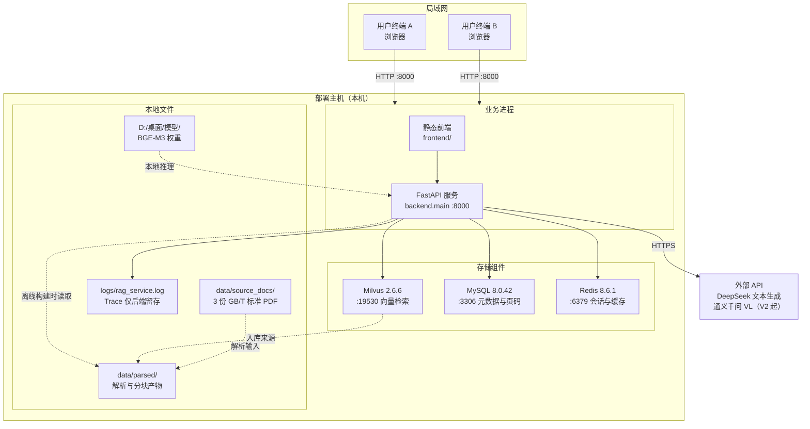

# 部署运行手册（M4）

| 文档版本 | V1.0 |
| --- | --- |
| 适用版本 | V1（MVP 基线） |
| 编写日期 | 2026-09-20 |
| 对应里程碑 | M4 部署 |
| 配套文档 | [部署验证记录](部署验证记录.md)（本手册各步骤的实测结果） |

> 本手册描述如何把系统从零部署到「本机与局域网可用」，包含环境依赖、启动步骤、验证方法、停止与重启、故障排查。
> 文中所有耗时与输出均来自 **2026-09-20 的真实部署实测**，未经验证的步骤会明确标注。

---

## 一、部署形态与范围

### 1.1 部署形态

本系统采用**单机部署 + 局域网访问**形态：一台机器同时承载数据存储与业务服务，局域网内的其他终端通过浏览器访问。



### 1.2 范围边界

| 项 | 本版本是否提供 | 说明 |
| --- | --- | --- |
| 本机访问 | ✅ | `http://127.0.0.1:8000` |
| 局域网访问 | ✅ | `http://<部署主机IP>:8000` |
| 公网部署 / 域名 / HTTPS | ❌ | 知识库为企业内部资料，不对外网暴露（N6） |
| 登录鉴权 | ❌ | 已记入《需求文档》5.3 后续版本 |
| 检索链路可视化页面 | ❌ | Trace 仅后端日志留存（N5） |

---

## 二、环境依赖

### 2.1 依赖清单

| 组件 | 用途 | 推荐版本 | 本次实测版本 |
| --- | --- | --- | --- |
| Python | 运行时 | 3.12 | **3.12.7** |
| Docker Desktop | 承载 Milvus 与 Redis 容器 | 任意近期版本 | 已安装并启动 |
| Milvus | 向量存储与检索 | 2.6+ | **2.6.6** |
| MySQL | 元数据与页码真相源 | 8.0+ | **8.0.42**（Windows 原生服务，服务名 `MySQL80`） |
| Redis | 会话短期记忆 + 高频查询缓存 | 6.0+ | **8.6.1** |
| MinerU | PDF 版面解析（离线） | 3.4+ | 已就绪 |
| BGE-M3 权重 | 向量化（1024 维） | — | `D:/桌面/模型/bge-m3` |
| BGE-reranker-v2-m3 权重 | 重排（V3 使用） | — | `D:/桌面/模型/bge-reranker-v2-m3` |
| DeepSeek API Key | 文本生成 | — | 已配置 |
| 通义千问 VL API Key | 图表解析（V2 起使用） | — | 已配置 |

### 2.2 关于虚拟环境

本项目使用**继承式虚拟环境**（`--system-site-packages`），复用宿主 Python 环境中的重型依赖：

```bash
python -m venv --system-site-packages .venv
.venv/Scripts/python.exe -m pip install -r requirements.txt
```

**为什么继承宿主环境**：MinerU、PyTorch、Transformers 等依赖体积达数 GB，且宿主环境中往往已存在。继承后可避免重复下载，同时 venv 内的包仍与宿主隔离。`requirements.txt` 头部有同样说明。

### 2.3 依赖服务的位置差异（部署时最容易踩的一点）

三类存储组件**启动方式并不相同**，这是本系统部署时最容易出错的地方：

| 组件 | 启动方式 | 是否需要管理员 | 启动耗时 |
| --- | --- | --- | --- |
| Milvus | Docker Desktop 容器 | 否（但需先启动 Docker Desktop） | 端口先就绪，**服务端完全可用还需约 40 秒**（见 8.3） |
| Redis | Docker Desktop 容器 | 否（同上） | 随 Docker 一起就绪 |
| MySQL | **Windows 原生服务 `MySQL80`** | **是** | 数秒 |

> ⚠️ **注意**：MySQL 不是容器，而是随 MySQL Installer 安装的 Windows 服务。因此「启动了 Docker」**不等于**「MySQL 也起来了」——这是本次部署实测中实际遇到的故障（详见第八章 8.1）。

---

## 三、配置说明

所有配置集中在项目根目录 `.env`（由 `.env.example` 复制而来）。**`.env` 已被 `.gitignore` 忽略，密钥不入库**（N6）。

```bash
copy .env.example .env
```

### 3.1 必须人工填写的配置项

| 配置项 | 说明 |
| --- | --- |
| `MYSQL_PASSWORD` | MySQL 密码 |
| `DEEPSEEK_API_KEY` | DeepSeek 密钥（文本生成，必填） |
| `VISION_API_KEY` | 通义千问 VL 密钥（V2 起需要，V1 可留空） |
| `BGE_M3_PATH` | BGE-M3 权重目录，本项目为 `D:/桌面/模型/bge-m3` |
| `BGE_RERANKER_PATH` | 重排模型权重目录（V3 使用） |

### 3.2 影响部署行为的关键配置项

| 配置项 | 默认值 | 说明 |
| --- | --- | --- |
| `APP_HOST` | `0.0.0.0` | **设为 `0.0.0.0` 才能被局域网访问**；若只想本机可访问，改为 `127.0.0.1` |
| `APP_PORT` | `8000` | 服务端口 |
| `MILVUS_HOST` / `MILVUS_PORT` | `127.0.0.1` / `19530` | Milvus 地址 |
| `MILVUS_COLLECTION` | `cs_kb_chunks` | 向量集合名 |
| `MYSQL_DATABASE` | `cs_rag` | 业务库名，首次启动时自动创建 |
| `VISION_ENABLED` | `false` | V1 保持 `false`；V2 启用图表解析时改为 `true` |
| `MINERU_METHOD` | `ocr` | **固定为 `ocr`，不要改为 `txt`**（原因见 ADR-013：`txt` 模式会间歇性丢失行首字符，导致标准编号丢失） |
| `LOG_LEVEL` | `INFO` | 日志级别 |

> **修改 `.env` 后必须重启后端服务才生效。**

---

## 四、启动步骤

### 启动顺序（重要）


**必须先起存储组件，再起后端。** 虽然后端在依赖不可用时**不会启动失败**（仅记录告警），但那样启动后检索功能不可用，需要重启才能恢复。

### ① 启动 Docker Desktop（Milvus + Redis）

启动 Docker Desktop，等待右下角鲸鱼图标变为稳定状态（Milvus 冷启动约 40 秒）。

验证：

```bash
docker ps
netstat -ano | findstr "19530 6379"
```

预期：19530（Milvus）与 6379（Redis）均处于 `LISTENING`。

### ② 启动 MySQL80 服务（需要管理员权限）

**以管理员身份**打开 PowerShell 或 CMD：

```powershell
net start MySQL80
```

验证：

```powershell
sc query MySQL80
```

预期：`STATE : 4  RUNNING`。

> 若提示「系统错误 5，拒绝访问」，说明当前窗口不是管理员窗口 —— 普通权限无法启动 Windows 服务。
> 也可用 `Win+R` → `services.msc` → 找到 `MySQL80` → 右键「启动」。

### ③ 启动后端服务

在项目根目录执行：

```bash
.venv/Scripts/python.exe -m backend.main
```

或使用 uvicorn：

```bash
.venv/Scripts/python.exe -m uvicorn backend.main:app --host 0.0.0.0 --port 8000
```

**预期启动日志**（节选）：

```
计算机专业知识库 RAG 问答助手 正在启动
监听地址：http://0.0.0.0:8000
知识库源目录：...\data\source_docs
Milvus 集合：cs_kb_chunks
依赖服务连通：Milvus
依赖服务连通：MySQL
依赖服务连通：Redis
Application startup complete.
Uvicorn running on http://0.0.0.0:8000
```

> ⚠️ **首次启动会阻塞约 40 秒**：日志输出启动横幅后会停留一段时间，直到 Milvus 连接建立才打印「依赖服务连通：Milvus」。**实测该次阻塞为 43 秒**，属正常现象，不是卡死（原因见 8.3）。
>
> 若某一依赖显示「依赖服务不可用」，服务仍会启动，但对应功能受损：Milvus 不可用 → 检索不可用；MySQL 不可用 → 页码溯源不可用；Redis 不可用 → 多轮记忆与缓存降级。

### ④ 访问地址

| 地址 | 说明 |
| --- | --- |
| `http://127.0.0.1:8000` | 问答页面（本机） |
| `http://<部署主机IP>:8000` | 问答页面（局域网） |
| `http://127.0.0.1:8000/docs` | 接口文档（Swagger UI） |
| `http://127.0.0.1:8000/api/health` | 健康检查 |

**获取部署主机 IP**：

```bash
ipconfig
```

取「以太网适配器」或「无线局域网适配器」下的 IPv4 地址。注意**不要**使用 Docker / WSL / VMware 创建的虚拟网卡地址（通常形如 `172.x.x.x` 或 `192.168.x.1`）。

---

## 五、部署验证

按四个层次逐级验证，任一层失败则不必继续向下。

### 第一层：依赖服务健康

```bash
curl http://127.0.0.1:8000/api/health
```

预期响应（三个依赖均为 `true`）：

```json
{
  "status": "ok",
  "app": "计算机专业知识库 RAG 问答助手",
  "dependencies": { "milvus": true, "mysql": true, "redis": true }
}
```

### 第二层：知识库已就绪

浏览器打开问答页面，或调用：

```bash
curl http://127.0.0.1:8000/api/kb/status
```

预期：`doc_count = 3`、`page_count = 74`、`chunk_count = 127`，三份文档 `status` 均为 `indexed`。

若知识库为空，见第六章「知识库构建」。

### 第三层：前端页面可加载

浏览器访问 `http://127.0.0.1:8000`，页面应正常渲染（样式与脚本均返回 200）。

### 第四层：端到端问答（含页码溯源）

在页面输入框提问：

> 数据中心业务连续性分为几个等级？

预期：

- 答案列出五个等级：起始级（一级）、发展级（二级）、稳健级（三级）、优秀级（四级）、卓越级（五级）
- **答案下方展示来源文档名称与页码**，如「GBT 42581-2023 信息技术服务 数据中心业务连续性等级评价准则.pdf 第 6 页」

**页码溯源是本系统的硬性要求**（N1 / ADR-006），若答案有内容但无来源页码，属部署异常，请检查 MySQL 连通性。

### 局域网访问验证

在**另一台**局域网终端上，浏览器打开 `http://<部署主机IP>:8000`，重复第四层问答。

> **首次局域网访问可能被 Windows 防火墙拦截**。若无法访问：
> 1. 确认 `.env` 中 `APP_HOST=0.0.0.0` 且已重启服务
> 2. 确认 `netstat -ano | findstr 8000` 显示 `0.0.0.0:8000` 而非 `127.0.0.1:8000`
> 3. 在部署主机上放行入站连接：`netsh advfirewall firewall add rule name="cs-rag 8000" dir=in action=allow protocol=TCP localport=8000`

---

## 六、知识库构建

知识库构建是**一次性离线操作**，不需要每次部署都执行。若 `kb/status` 已显示 3 份文档 127 个块，可跳过本章。

### 方式一：命令行（三步依次执行）

```bash
.venv/Scripts/python.exe -m scripts.pdf_parse       # ① MinerU 解析，提取文本 + 页码元数据
.venv/Scripts/python.exe -m scripts.chunk_split     # ② LangChain 分块，绑定页码元数据
.venv/Scripts/python.exe -m scripts.embedding_store # ③ BGE-M3 向量化，写入 Milvus + MySQL
```

三个脚本**均为幂等**：产物已存在时自动跳过（可用 `--force` 强制重跑）。

### 方式二：前端按钮

启动服务后，在问答页面点击「加载知识库」。构建过程在后台线程执行，页面展示进度（当前文件、已完成/总文件数）。

> 构建进行中重复触发会返回 HTTP 409。全量重建（含重新解析）请使用 `POST /api/kb/build` 并传 `{"force": true}`。

> ⚠️ **关于与他人共用 Milvus 实例**：Milvus 实例上可能存在**其他项目**的集合（本次部署实测该实例共有 7 个集合，除本项目的 `cs_kb_chunks` 外还有 6 个来自其它项目）。
> 好消息是重建操作**只影响 `MILVUS_COLLECTION` 指定的集合**（默认 `cs_kb_chunks`），不会波及其它集合；且本项目**只读写自己的集合**。
> 但仍建议：若与他人在同一 Milvus 实例上工作，重建前先确认 `MILVUS_COLLECTION` 配置无误，避免误改集合名导致操作到别人的数据。

### 实测耗时参考（CPU 环境，无 GPU）

| 阶段 | 实测耗时 |
| --- | --- |
| ① MinerU 解析 | 3 份 74 页合计约 **9 分钟**（约 10 秒/页） |
| ② 分块 | 数秒（127 个块） |
| ③ 向量化入库 | 127 个块约 **2 分钟**（batch=8） |
| **全量构建（含重新解析）** | **10 分钟以上** |
| **复用已有解析产物，仅重跑向量化** | 约 **2 分钟** |

> CPU 环境下解析与向量化较慢属预期。解析是一次性离线操作，74 页总量的耗时在可接受范围内。

---

## 七、停止与重启

### 停止后端

在运行后端的终端按 `Ctrl+C`。若以后台方式启动，结束对应 Python 进程即可。

### 停止依赖服务

| 组件 | 停止方式 |
| --- | --- |
| Milvus / Redis | 退出 Docker Desktop（或 `docker stop` 对应容器） |
| MySQL | 管理员窗口执行 `net stop MySQL80` |

### 重启后的状态说明

| 数据 | 是否持久 | 说明 |
| --- | --- | --- |
| 向量数据（Milvus） | ✅ 持久 | 存于 Docker 卷，重启不丢失 |
| 元数据与页码（MySQL） | ✅ 持久 | 存于 MySQL 数据目录 |
| 会话上下文与查询缓存（Redis） | ⚠️ 视配置 | 默认持久化到磁盘；会话本身有 30 分钟有效期 |

**知识库重建后缓存自动失效**：缓存 Key 中携带知识库版本号（`rag:kb:version`），重建后版本号自增，历史缓存自然失效，不会返回过期答案。无需手工清理。

---

## 八、常见故障排查

> 本章问题均来自 **2026-09-20 的实际部署过程**，不是假设性罗列。

### 8.1 后端日志报 MySQL 连接被拒绝

**现象**：

```
ERROR | backend.db.mysql | MySQL 健康检查失败：(2003, "Can't connect to MySQL server on '127.0.0.1' ([WinError 10061] 由于目标计算机积极拒绝，无法连接。)")
```

`/api/health` 返回 `"mysql": false`，问答能返回答案但**没有来源页码**。

**根因**：MySQL80 服务未运行。

**排查**：

```bash
sc query MySQL80
```

若为 `STOPPED`，用管理员窗口启动：

```powershell
net start MySQL80
```

> **注意**：MySQL80 服务可能在此前正常运行、中途停止（本次实测即如此）。因此**每次准备使用系统前都应确认它处于 RUNNING**。
>
> **MySQL 恢复后无需重启后端**：后端每次请求都新建数据库连接（`get_connection()`），MySQL 一起来，页码溯源立刻恢复。

### 8.2 `net start MySQL80` 报「系统错误 5，拒绝访问」

**根因**：当前 shell 不是管理员权限，普通权限无法启动 Windows 服务。

**解决**：用管理员身份重新打开 PowerShell / CMD，或 `Win+R` → `services.msc` → 右键 `MySQL80` → 启动。

### 8.3 后端启动后长时间无响应

**现象**：日志打印完启动横幅（监听地址、Milvus 集合）后停留数十秒无输出，端口 8000 尚未监听。

**根因**：这是**正常现象**。启动横幅之后是依赖服务连通性自检，其中 Milvus 首次建连耗时较长。实测该次阻塞 **43 秒**。

**证据**：Milvus 端口（19530）在服务端完全就绪**之前**就已开始监听，因此「端口通了」不等于「可以用了」。在同一实例上对比测试：

| Milvus 状态 | `MilvusClient()` 构造耗时 |
| --- | --- |
| 刚启动（首次建连） | **约 43 秒** |
| 已预热（再次建连） | **0.92 秒** |

可见这 43 秒花在等待 Milvus 服务端就绪上，而非客户端自身的固定开销。

**判断方法**：等待约 1 分钟后查看日志是否出现 `依赖服务连通：Milvus` 与 `Application startup complete.`。若超过 2 分钟仍无输出，再检查 Milvus 容器是否正常运行。

### 8.4 局域网无法访问

按以下顺序排查：

1. `.env` 中 `APP_HOST` 是否为 `0.0.0.0`（若为 `127.0.0.1` 则只监听本机）
2. `netstat -ano | findstr 8000` 是否显示 `0.0.0.0:8000`
3. Windows 防火墙是否拦截（见第五章「局域网访问验证」的放行命令）
4. 使用的 IP 是否为真实网卡地址（排除 `172.x.x.x`、`192.168.x.1` 等虚拟网卡）

### 8.5 答案内容正确但没有来源页码

**根因**：Milvus 中有向量、但 MySQL 中缺对应的 chunk 元数据。

**说明**：本系统的溯源信息**以 MySQL 为唯一真相源**（ADR-005）—— Milvus 只回答「哪些块相关」，文件名与页码一律由 MySQL 回填。因此 MySQL 数据缺失会直接导致溯源失败。

**解决**：重跑 `scripts.embedding_store` 重建元数据（幂等，不会产生重复 chunk）。

### 8.6 重复上传 PDF 是否会产生重复数据

**不会**。`doc_id` 由文件内容哈希生成（`file_hash[:16]`），内容不变则 ID 稳定；入库前会先按 `doc_id` 删除旧向量与旧 chunk 再写入（`ON DUPLICATE KEY UPDATE`）。因此重复执行同一份文档不会产生重复知识块。

---

## 附录：相关文档

| 文档 | 内容 |
| --- | --- |
| [部署验证记录](部署验证记录.md) | 本手册各步骤的实测结果与指标对照 |
| [需求文档](需求文档.md) | 非功能需求 N1–N9（本手册对应 N3 响应性能、N4 并发、N6 数据安全、N9 部署可移植） |
| [接口文档](接口文档.md) | 接口定义、Postman 调试说明、JMeter 压测方法 |
| [技术决策记录](技术决策记录.md) | ADR 选型与迭代决策、分层架构与数据模型（本手册涉及 ADR-005 溯源真相源、ADR-006 页码双字段、ADR-013 OCR 模式） |
