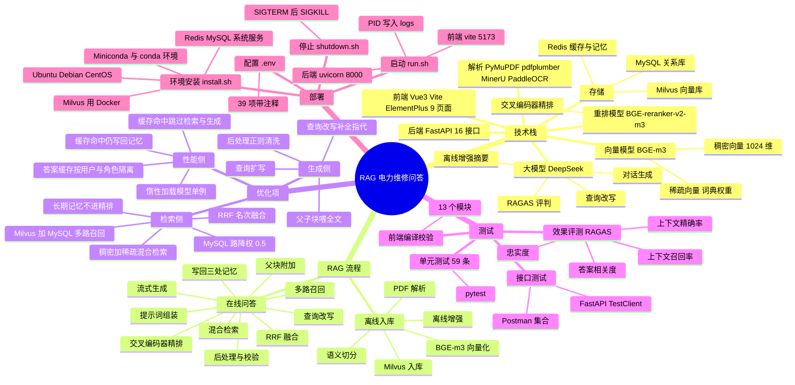

# 思维导图

用一张图看清整个项目的五个面：**技术栈、RAG 流程、优化项、测试、部署**。

## 1. 总览（Mermaid mindmap）



## 2. 文字版（便于不支持 mindmap 的查看器）

```
RAG 电力维修问答
├── 技术栈
│   ├── 大模型 DeepSeek（对话生成 / 查询改写 / 离线增强摘要 / RAGAS 评判）
│   ├── 向量模型 BGE-m3（稠密 1024 维 + 稀疏词典权重）
│   ├── 重排模型 BGE-reranker-v2-m3（交叉编码器）
│   ├── 存储：Milvus（向量）/ MySQL（关系）/ Redis（缓存与记忆）
│   ├── 后端：FastAPI，16 个接口
│   ├── 前端：Vue3 + Vite + Element Plus，9 个页面
│   └── 解析：PyMuPDF / pdfplumber / MinerU / PaddleOCR
├── RAG 流程
│   ├── 离线入库：PDF 解析 → 语义切分 → 离线增强 → BGE-m3 向量化 → Milvus 入库
│   └── 在线问答：查询改写 → 混合检索 → 多路召回 → RRF 融合 → 交叉编码器精排
│                 → 父块附加 → 提示词组装 → 流式生成 → 后处理与校验 → 写回三处记忆
├── 优化项
│   ├── 检索侧：稠密+稀疏混合、Milvus+MySQL 多路召回、RRF 融合、MySQL 路降权、
│   │           长期记忆不进精排
│   ├── 生成侧：查询改写补全指代、查询扩写、父子块喂全文、后处理正则清洗
│   └── 性能侧：答案缓存按用户与角色隔离、命中跳过检索与生成、
│                命中仍写回记忆、模型惰性加载单例
├── 测试
│   ├── 单元测试 59 条（pytest）
│   ├── 接口测试（Postman 集合 + FastAPI TestClient）
│   ├── 效果评测 RAGAS（忠实度 / 答案相关度 / 上下文精确率 / 上下文召回率）
│   └── 前端编译校验（13 个模块）
└── 部署
    ├── install.sh：系统识别 → 系统依赖 → Miniconda → conda 环境 → Python 依赖
    │                → Redis → MySQL → Milvus 提示
    ├── run.sh：后端 uvicorn:8000 + 前端 vite:5173，PID 落 logs/
    ├── shutdown.sh：先 SIGTERM 等 5 秒，不退再 SIGKILL
    └── .env：39 项配置，每项带中文注释
```

## 3. 三个视角的速览

| 视角 | 想看清什么 | 去看哪里 |
|---|---|---|
| **数据怎么流动** | 一份 PDF 变成答案的完整路径 | `docs/流程图.md` 的两张图 |
| **系统怎么搭起来** | 模块划分与选型理由 | `docs/设计文档.md` 第 1–3 节 |
| **接口怎么调用** | 16 个接口的方法、参数、响应 | `docs/接口文档.md` |
| **回答要守什么规矩** | 边界、安全提醒、无依据应答 | `docs/业务规则.md` |
| **做到什么程度了** | 测试与评测的实际数字 | `docs/测试成果.md` |
