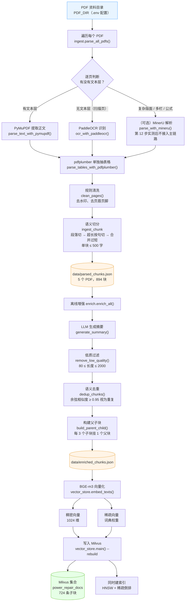
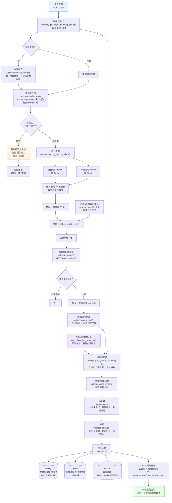
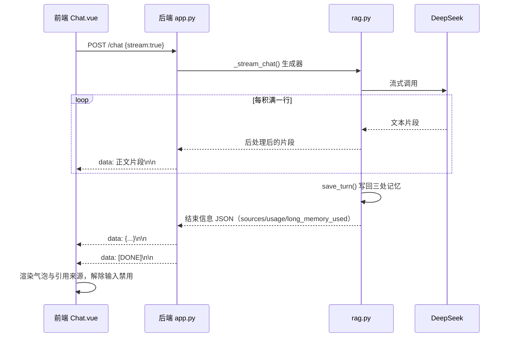

# 流程图

本文用 Mermaid 画两条主链路的流程图：**离线入库**与**在线问答**。
图中节点名与代码模块一一对应，方便对照阅读。

---

## 1. 离线：资料入库流程

从「一堆 PDF」到「Milvus 里可以检索的向量」。对应模块：
`ingest.py`（解析与分块）→ `enrich.py`（离线增强）→ `vector_store.py`（向量化与入库）。

**几个关键取舍**（详见设计文档 11、12 节）：

| 环节 | 做法 | 为什么 |
|---|---|---|
| 解析分工 | 文本层用 PyMuPDF、表格用 pdfplumber、扫描页用 OCR；MinerU 主线**不用**（第 12 步实测它会丢数字，见设计文档 11.5） | 各取所长：速度、表格结构、图片文字；版面还原能力换不来丢数字的代价 |
| 切分方式 | 只用语义切分（段落 → 句子 → 合并） | 保语义完整，避免固定长度把一句话切断 |
| 增强顺序 | 先摘要 → 再去噪 → 再去重 → 最后建父子块 | 去重放在摘要之后，用摘要比对更准；父块必须最后建，否则去重会打乱编号 |
| 向量 | 同时存稠密与稀疏 | 稠密管语义、稀疏管专有名词（如标准编号）精确命中 |

---

## 2. 在线：问答流程

从「用户提问」到「流式返回带出处的答案」。对应模块：
`rag.py`（主流程）→ `optimize.py` / `retrieval.py` / `prompt.py` / `postprocess.py` / `memory.py`。

**几个关键设计**（详见设计文档 12–15、16.9 节）：

| 设计点 | 做法 | 为什么 |
|---|---|---|
| 缓存键用「原问题」 | `cache_key` 用归一化后的**原始问题**，不用改写后的问题 | 改写结果依赖历史，同问题在不同轮次会改写不同 → 键不稳定，缓存永远不命中（第 8.5 步修复） |
| 长期记忆不进精排 | 走独立召回路径，不参与 reranker | 长期记忆存的是「问题+答案」，与提问高度相似，会把真实条款挤出前几名（第 8.5 步修复） |
| 缓存命中仍写回 | 命中只跳过检索与生成，`save_turn` 照常执行 | 否则这一轮不进记忆，下一轮 history 缺一段，多轮对话断片（第 9.7 步修复） |
| MySQL 路降权 | 融合权重 0.5 | 历史提问与当前问题词面接近，不降权会压过知识条款 |
| 父子块 | 子块用于检索（向量准），父块用于喂模型（上下文全） | 兼顾检索精度与上下文完整性 |

---

## 3. 流式输出（SSE）帧结构

`POST /chat` 传 `{"stream": true}` 时，服务端逐帧推送。前端不用 `EventSource`
（它只支持 GET），而用 `fetch` + `ReadableStream` 手写解析，详见接口文档第 11 节。

> 说明：结束标记 `[DONE]` **一定**会出现——正常结束时推；出错时先推错误帧、
> 再推 `[DONE]`，保证前端读取循环能退出。详见接口文档 11.2。
