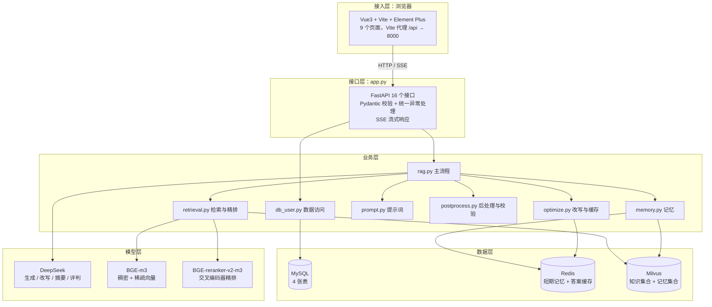

# 设计文档

> 第 0 步占位文档：本文件当前只写标题与目录，正文在后续步骤补充。

## 目录
1. 总体架构设计
2. 技术选型说明
3. 模块划分与职责
4. 数据库设计
5. 向量库设计
6. 资料入库流程设计
7. 问答流程设计
8. 前端页面设计
9. 日志与异常设计
10. 配置项说明
11. 文档解析与分块
12. 检索与重排
13. 提示词与生成
14. 记忆与多用户多角色
15. RAG 优化
16. HTTP 服务设计

## 1. 总体架构设计

系统按五层划分，每层只依赖下一层的接口，不跨层调用：



**四条设计原则**：

| 原则 | 体现 |
|---|---|
| 单一职责 | 检索、生成、记忆、缓存、提示词、后处理各自独立成模块，改一处不牵动其它 |
| 命令行可独立运行 | `ingest` / `enrich` / `vector_store` / `rag` 都能 `python -m xxx` 单跑，便于分步验证 |
| 失败降级不中断 | 依赖探测失败返回 `False`、记忆读不到返回空列表、检索失败返回空列表，主流程继续 |
| 写操作必须显式 | 写库/写记忆/写缓存都包 `try/except` 并记日志；绝不用 `or` 串联有副作用的调用（见 16.9.6） |

**两条数据流**（细图见 `docs/流程图.md`）：

- **离线**：PDF → 解析 → 切分 → 增强 → 向量化 → Milvus（一次性，可重跑）
- **在线**：提问 → 改写 → 检索 → 精排 → 生成 → 后处理 → 写回记忆 → SSE 返回（每次请求）

## 2. 技术选型说明

16 条选型的**逐条理由**见 `docs/需求规格说明书.md` 第 6 节表格，此处只补充三处
「为什么是它、以及代价是什么」的关键取舍。

### 2.1 为什么用 BGE-m3 一个模型，而不是两个模型

| 方案 | 优点 | 代价 |
|---|---|---|
| 稠密用 BGE-m3、稀疏用 BM25（Milvus 内置） | BM25 无需额外推理，纯统计 | 稀疏向量由检索器自算，与稠密向量不同源，「语义」和「词面」两套打分难对齐 |
| **本方案：BGE-m3 同时出稠密与稀疏** | 一次推理出两个向量，同源同模型，权重一致性好；稀疏是**学习式**的，能捕捉「乙炔注意值 ↔ C₂H₂ 含量」这类非字面匹配 | 稠密+稀疏两个 1024/词典维向量都占空间；模型常驻显存 |

### 2.2 为什么用 RRF 融合而不是加权求和

稠密检索的分数是余弦相似度（0~1），稀疏检索的分数是内积（量纲完全不同），
直接加权求和需要先归一化，而归一化方式本身又是个调参问题。
RRF（Reciprocal Rank Fusion）**只看名次不看分数**：`score = Σ 1/(k + rank)`，
天然免疫量纲差异，不需要归一化。代价是丢掉了分数里「差多少」的信息——
所以融合完还要过一遍交叉编码器精排，精度由精排兜底。

### 2.3 为什么长期记忆不进精排

长期记忆存的是「问题 + 答案」，而检索用的 query 就是同一个问题，
文本几乎逐字相同，交叉编码器会给接近满分。不隔离的话，
系统自己上一次的回答会挤掉真实标准条款——**自我强化的循环**。
所以长期记忆走**独立召回路径**（`rag.collect_long_memory`），
结果直接进提示词的独立段落，不与知识条款混排。这是第 8.5 步修复的（见 16.9.1）。

## 3. 模块划分与职责

### 3.1 后端模块

| 文件 | 职责 | 主要被谁调用 | 行数 |
|---|---|---|---|
| `config.py` | 从 `.env` 读 39 项配置并做默认值处理 | 所有模块 | — |
| `logger.py` | 日志基础配置：控制台 + 文件双输出，按名缓存 logger | 所有模块 | — |
| `schemas.py` | Pydantic 请求/响应模型 | `app.py` | 215 |
| `app.py` | FastAPI 应用：16 个接口、CORS、lifespan、统一异常转 500 | 外部 HTTP | 298 |
| `db.py` | MySQL / Redis 连接封装与 4 张表建表语句 | `db_user.py`、`memory.py`、`optimize.py` | — |
| `db_user.py` | 用户、角色、会话、消息的数据访问；含一次性清理工具 | `app.py`、`rag.py` | 298 |
| `ingest.py` | PDF 解析（PyMuPDF / pdfplumber / MinerU / PaddleOCR） | `app.py`（上传）、命令行 | — |
| `ingest_chunk.py` | 语义切分 | `ingest.py` | — |
| `enrich.py` | 离线增强：LLM 摘要、低质过滤、语义去重、父子块 | 命令行、`app.py`（重建） | — |
| `vector_store.py` | BGE-m3 向量化、Milvus 建库与入库 | `ingest`/`enrich`/`retrieval`/`memory` | 300 |
| `retrieval.py` | 混合检索、多路召回、RRF 融合、交叉编码器精排、父块附加 | `rag.py`、`eval_ragas.py` | 307 |
| `prompt.py` | 两套系统提示词、用户提示词模板、长期记忆段模板 | `rag.py` | — |
| `postprocess.py` | 答案正则清洗（`postprocess`）与合规校验（`validate_answer`） | `rag.py` | — |
| `optimize.py` | 查询改写、查询扩写、Redis 答案缓存（建键/读/写） | `rag.py` | — |
| `memory.py` | 短期记忆（Redis 列表）+ 长期记忆（Milvus 集合） | `rag.py`、`app.py` | — |
| `rag.py` | **问答主流程**：取记忆 → 改写 → 查缓存 → 检索 → 生成 → 后处理 → 写回 | `app.py`、`cli.py`、`eval_ragas.py` | 295 |
| `cli.py` | 命令行演示入口 | 命令行 | — |
| `eval_ragas.py` | RAGAS 评测：加载评测集 → 跑 RAG → 四指标 → 落盘 | 命令行 | 246 |

### 3.2 前端模块

| 文件 | 职责 | 行数 |
|---|---|---|
| `main.js` | 入口：注册路由 + Element Plus + 全部图标 | 19 |
| `router.js` | 10 条路由 + 登录守卫 | 41 |
| `api.js` | 15 个接口封装；axios 拦截器塞 `X-User-Id`、统一报错；`chatStream` 手写 SSE 解析 | 118 |
| `App.vue` | 根组件：顶部导航（登录页隐藏）+ 路由出口 | 113 |
| `views/*.vue` | 9 个页面，各自取数 | 63~191 |

### 3.3 依赖方向

```
app.py → rag.py → {retrieval, optimize, memory, prompt, postprocess} → {db, vector_store, config}
app.py → db_user.py → db.py
eval_ragas.py → {rag, retrieval, vector_store, memory, config}
```

**没有循环依赖**：`vector_store` 不反向调用 `retrieval`，
`memory` 不调用 `rag`。唯一需要延迟导入的地方是 `app.py` 里对重模块（`enrich`、`ingest`）的引用，
避免启动时就把 OCR / 解析链路拉起来。

## 4. 数据库设计

MySQL 库名 `rag`，字符集 `utf8mb4`，4 张表。建表语句在 `db.py`，均为 `CREATE TABLE IF NOT EXISTS`。

### 4.1 表结构

**users —— 用户**

| 字段 | 类型 | 说明 |
|---|---|---|
| `id` | INT AUTO_INCREMENT | 主键 |
| `username` | VARCHAR(64) NOT NULL UNIQUE | 用户名，唯一 |
| `password_hash` | VARCHAR(255) NOT NULL | 密码哈希（**不存明文**） |
| `created_at` | DATETIME DEFAULT CURRENT_TIMESTAMP | 创建时间 |

索引：`KEY idx_users_username (username)`

**roles —— 角色**

| 字段 | 类型 | 说明 |
|---|---|---|
| `id` | INT AUTO_INCREMENT | 主键 |
| `role_name` | VARCHAR(64) NOT NULL UNIQUE | 角色标识，如 `power_repair_expert` |
| `description` | VARCHAR(255) | 角色说明 |
| `created_at` | DATETIME | 创建时间 |

索引：`KEY idx_roles_name (role_name)`。预置两个角色，启动时幂等插入。

**conversations —— 会话**

| 字段 | 类型 | 说明 |
|---|---|---|
| `id` | INT AUTO_INCREMENT | 主键 |
| `user_id` | INT NOT NULL | 所属用户 |
| `role_id` | INT NOT NULL | 使用的角色 |
| `title` | VARCHAR(255) | 会话标题 |
| `created_at` | DATETIME | 创建时间 |

索引：`KEY idx_conv_user (user_id)`、`KEY idx_conv_role (role_id)`

**messages —— 消息**

| 字段 | 类型 | 说明 |
|---|---|---|
| `id` | INT AUTO_INCREMENT | 主键 |
| `conversation_id` | INT NOT NULL | 所属会话 |
| `role` | VARCHAR(32) NOT NULL | `user` / `assistant` |
| `content` | TEXT | 消息正文 |
| `created_at` | DATETIME | 创建时间 |

索引：`KEY idx_msg_conv (conversation_id)`

### 4.2 三个设计决定

| 决定 | 说明 |
|---|---|
| **不加外键约束** | 4 张表之间只有普通索引，没有 `FOREIGN KEY`。好处是插入顺序自由、便于灌测试数据；代价是**删除必须应用层手动级联**——这正是第 9.6 步踩的坑（见 16.9.7），现在 `delete_conversation` 在同一事务里先删 `messages` 再删 `conversations` |
| **密码只存哈希** | `hash_password()` 用 sha256 + `.env` 里的 `PASSWORD_SALT`。教学简化版，生产应换 bcrypt/argon2（见 14.7） |
| **消息不存来源** | `messages` 只有正文，没有 `sources` 列。所以历史页只能看到问答正文，引用来源仅在当次对话内可见（已知局限） |

### 4.3 隔离方式

多用户隔离**不靠数据库权限**，而靠每条 SQL 都带上 `user_id` / `conversation_id` 条件：

- 会话列表：`WHERE user_id = %s`
- 删除会话：`WHERE id = %s AND user_id = %s`（双条件，越权删不掉）
- 消息列表：`WHERE conversation_id = %s`

Redis 与 Milvus 侧同样按 `user_id` 隔离（键名前缀、`filter` 表达式），见 14.5。

## 5. 向量库设计

Milvus 里有两个集合：一个存**知识**（子块），一个存**长期记忆**（问答对）。
分开的理由是二者的检索策略完全不同——知识要参与精排、要附加父块；
长期记忆不参与精排、且需要按 `user_id` 强过滤。

### 5.1 知识集合 `power_repair_docs`

| 字段 | 类型 | 说明 |
|---|---|---|
| `id` | INT64（主键，auto_id） | Milvus 自动生成的编号，同时作为「父块索引」被引用 |
| `vector` | FLOAT_VECTOR(1024) | BGE-m3 稠密向量 |
| `sparse_vector` | SPARSE_FLOAT_VECTOR | BGE-m3 学习式稀疏向量 |
| `text` | VARCHAR | 子块原文 |
| `summary` | VARCHAR | 离线增强生成的摘要 |
| `parent_id` | INT64 | 所属父块的 `id`；无父块时为 -1 |
| `source` | VARCHAR | 来源文件名 |
| `created_at` | INT64 | 创建时间戳 |
| `updated_at` | INT64 | 更新时间戳 |

**索引**：

| 字段 | 索引类型 | 度量 |
|---|---|---|
| `vector` | `AUTOINDEX` | `COSINE` |
| `sparse_vector` | `SPARSE_INVERTED_INDEX` | `IP`（内积） |

**当前规模**：**724 条**子块（`GET /kb/status` 实测 `row_count = 724`）。
这个数字的来历见 5.3。

**父子块机制**：入库存 724 个**子块**（向量化对象），另有 242 个**父块**
只存在 `data/enriched_chunks.json` 与 Milvus 的 `parent_id` 引用里，
不单独入库、不参与检索。子块命中后，`retrieval.attach_parent_text()` 按 `parent_id`
把父块全文附加到候选上，**用子块检索、用父块喂模型**：
子块小所以向量准，父块大所以上下文全。

### 5.2 长期记忆集合 `power_repair_memory`

| 字段 | 类型 | 说明 |
|---|---|---|
| `id` | INT64（主键，auto_id） | 自增编号 |
| `vector` | FLOAT_VECTOR(1024) | **问题文本**的 BGE-m3 稠密向量（不用答案） |
| `question` | VARCHAR | 问题原文 |
| `answer` | VARCHAR | 答案原文 |
| `user_id` | INT64 | 所属用户，检索时用于过滤 |
| `source` | VARCHAR | 来源标记（存会话 ID 或 `manual`） |
| `created_at` | INT64 | 创建时间戳 |

**检索时强制带用户过滤**：`filter=f"user_id == {int(user_id)}"`，
保证不会串到别人的记忆。召回条数由 `.env` 的 `MEMORY_TOP_K` 控制（默认 3）。

**一个踩过的坑**：Milvus 的已加载快照看不到新写入的内容，
所以 `search_long_memory` 里显式调了 `refresh_load(name)`，否则刚写入的记忆当场搜不到（见 14.4）。

### 5.3 从 894 块到 724 条的来历

| 阶段 | 数量 | 变化 | 说明 |
|---|---|---|---|
| 解析切分后 | 894 | — | `data/parsed_chunks.json` |
| 低质过滤后 | 814 | −80 | 去掉过短（<80 字）与过长（>2000 字）的块 |
| 语义去重后 | 724 | −90 | 余弦相似度 ≥ 0.95 视为重复 |
| **入库子块** | **724** | — | 向量化并写入 Milvus，与 `row_count` 一致 |
| 另建父块 | +242 | +242 | 不入库，只做 `parent_id` 引用 |
| 增强产物合计 | 966 | — | `data/enriched_chunks.json` 里的块总数 |

> 数字来自 `data/enriched_chunks.json` 的 `stats` 字段：
> `{before: 894, after_low_quality: 814, after_dedup: 724, final: 966,
> low_quality_dropped: 80, duplicate_dropped: 90}`。

## 6. 资料入库流程设计

完整流程图见 `docs/流程图.md` 第 1 节，这里只记录**流程之外的设计决定**。

### 6.1 三步走，每步落一个文件

| 步骤 | 命令 | 输入 | 输出 |
|---|---|---|---|
| 1. 解析与切分 | `python -m ingest` | PDF 目录 | `data/parsed_chunks.json` |
| 2. 离线增强 | `python -m enrich` | parsed | `data/enriched_chunks.json` |
| 3. 向量化入库 | `python -m vector_store --rebuild` | enriched | Milvus 集合 |

**为什么拆成三步而不是一条流水线**：解析要跑 OCR（慢，几十分钟），
增强要调 LLM（要钱），入库要加载模型（吃显存）——
三件事的失败原因、耗时量级、重跑成本都不同。
拆开后可以单独重跑某一步，不用每次从头来。

### 6.2 各步骤的关键约束

| 步骤 | 约束 | 原因 |
|---|---|---|
| 解析 | 扫描页必须走 OCR | 标准 PDF 里有整页无文本层的情况（本批 5 个文件共 18 页），不补 OCR 这些页等于没入库 |
| 解析 | OCR 模型必须放**纯英文路径** | 中文路径会导致 PaddleOCR 的模型文件打不开（`.env` 里 `OCR_MODEL_DIR` 专门为此设成 `C:/paddleocr_models`） |
| 切分 | 单块 ≤ 500 字、过短要合并 | 太短语义不完整、太长向量会被稀释 |
| 增强 | 顺序必须是 摘要 → 过滤 → 去重 → 建父子块 | 去重放在摘要后可用摘要比对更准；父块必须最后建，否则去重会打乱编号 |
| 入库 | 重建用 `--rebuild`，会先删集合再建 | 增量更新在这个规模下没必要，重建更干净 |

### 6.3 入库与上传接口的分工

`POST /kb/upload` **只解析不入库**（返回页数与块数），
真正的入库要显式调 `POST /kb/rebuild`（后台任务）。

**为什么分开**：解析一个 PDF 几秒到几十秒可以同步返回；
而重建要跑完整增强 + 重新向量化 724 条，几分钟起步，同步调用会超时。
所以重建做成后台任务，立即返回 `{"status": "started"}`，让前端轮询 `GET /kb/status` 看结果。

## 7. 问答流程设计

完整流程图见 `docs/流程图.md` 第 2 节。`rag.ask()` 的十一步在 README 附录里逐行有注释，
这里只记录**流程层面的设计决定**。

### 7.1 十一步的分工

| 步 | 动作 | 关键点 |
|---|---|---|
| 1 | 取短期记忆 | 按 `user_id` 读，不是按会话读（这点决定了评测时必须逐条清记忆，见 17.4） |
| 2 | 查询改写 | **有历史才改写**；没有历史时改写只是浪费一次 LLM 调用 |
| 3 | 反查角色名 | 由 `role_id` 查 `roles` 表拿 `role_name`，决定用哪套提示词；查不到回退专家版 |
| 4 | 建缓存键 | 用**归一化后的原问题**，不用改写结果（见 16.9.2） |
| 5 | 查缓存 | 只在非流式时查；命中则跳过 6–10 步但仍做第 11 步 |
| 6 | 检索 | `retrieval.retrieve()`：混合检索 → 多路召回 → 融合 → 精排 → 附加父块 |
| 7 | 长期记忆 | **独立路径**，不进精排（见 2.3） |
| 8 | 组装提示词 | 系统提示词（按角色）+ 上下文 + 历史 + 长期记忆 + 问题 |
| 9 | 生成 | 非流式 `call_deepseek`；流式 `call_deepseek_stream` |
| 10 | 后处理 + 校验 | 正则清洗 + 三项合规检查（见业务规则 5、6 节） |
| 11 | 写回 | MySQL 消息 + Redis 短期记忆 + Milvus 长期记忆，三组独立 try/except |

### 7.2 两条路径的副作用必须对称

这是第 9.7 步花大力气修的地方：**缓存命中只该跳过"贵"的计算，不该跳过副作用**。

| 步骤 | 缓存未命中 | 缓存命中 |
|---|---|---|
| 取记忆 / 改写 | 执行 | 执行 |
| 检索 + 精排 | 执行 | **跳过**（贵） |
| 大模型生成 | 执行 | **跳过**（贵） |
| 写回 MySQL / Redis / Milvus | 执行 | **照常执行** |
| 写答案缓存 | 执行 | 跳过（已在缓存里） |

不对齐的后果是连锁的：这一轮不写记忆 → 下一轮 history 缺一段 → 多轮对话断片。
详见 16.9.8。

### 7.3 检索失败时的降级

| 情况 | 行为 |
|---|---|
| Milvus 不可用 | `hybrid_search_milvus` 返回空 → 候选集为空 → 精排后为空 → 上下文为空 |
| 精排把候选全过滤掉 | 上下文为空，提示词里「检索到的条款」段为空 |
| 上下文为空时 | 提示词要求模型说明「标准文档中没有找到相关条款」，不许硬答（见业务规则 3） |

也就是说：**检索失败不会让请求失败，而是让回答变成"我没找到依据"**——
这是刻意的选择，比返回 500 更有用。

## 8. 前端页面设计

### 8.1 技术选型与理由

| 选型 | 理由 |
|---|---|
| Vue 3（`<script setup>` 组合式 API） | 单文件组件把模板、逻辑、样式放一起，页面小、改起来直观；组合式 API 免去 `this` 跳转，看数据流更直接 |
| Vite | 冷启动和热更新都是毫秒级，改一行 `.vue` 立刻生效，适合边写边调的演示节奏；配置量极小 |
| Element Plus | 表单、表格、卡片、折叠面板、上传等本系统需要的组件齐全且成套，中文字体与排版默认合适；按需引入后体积可控 |
| vue-router 4 | 官方路由，`createWebHistory` 得到干净 URL；前置守卫一个函数就能做登录拦截 |
| axios | 请求/响应拦截器是刚需：一处塞 `X-User-Id`，一处统一弹错误提示，页面里不用重复写 |
| **不用** Pinia / Vuex | 教学版状态只有「当前用户 + 当前角色 + 当前会话」三个值，`localStorage` 足够；引入状态库反而增加一层需要理解的概念 |

### 8.2 路由结构

```
/            → 重定向到 /login
/login       → Login.vue        登录 / 注册（不显示导航栏）
/role        → RoleSelect.vue   角色选择
/chat        → Chat.vue         智能问答（核心页）
/history     → History.vue      历史记录
/kb          → KbManage.vue     知识库管理
/upload      → UploadStatus.vue 资料上传
/eval        → Eval.vue         评测结果
/admin       → Admin.vue        后台状态（只读）
/user        → User.vue         用户中心
```

使用 `createWebHistory()`（HTML5 历史模式）而不是哈希模式：URL 里不带 `#`，更像正式产品。
开发期由 Vite 自动处理「刷新子路由 404」的问题（SPA fallback 返回 `index.html`）；
生产部署时 Nginx 需要配 `try_files $uri $uri/ /index.html;`，这一点哈希模式不需要，
是历史模式的代价。

**登录守卫**：`router.beforeEach` 里判断「目标不是 `/login` 且 `localStorage` 没有 `user_id`」
就重定向到 `/login`。只做这一条判断——教学版不区分角色权限，任何登录用户都能进所有页面。

### 8.3 状态存储：localStorage（教学版）

| 键 | 写入时机 | 谁在读 |
|---|---|---|
| `user_id` | 登录成功 | 所有请求的 `X-User-Id` 头、各页面 |
| `username` | 登录成功 | 顶部导航栏 |
| `role_id` / `role_name` | 选择角色 | 问答请求、顶部导航栏 |
| `conversation_id` | 首次提问时自动创建 | 问答请求、历史页定位 |

**为什么够用**：这些值都是「字符串 + 跨页面共享 + 刷新后要还在」，
`localStorage` 三个条件全满足，且不需要任何库。

**副作用（已知）**：`localStorage` 不会自动通知 Vue 更新。
`App.vue` 的导航栏用 `computed` 读它，并在计算属性内部访问了一次 `route.fullPath`，
借路由变化触发重算——登录后 `router.push('/role')` 会顺带刷新导航栏。
这是教学版的小技巧，不是通用做法。

**切换到 Pinia 的理由（生产环境）**：
1. **响应式天然打通**：`store.user` 一变，所有用到它的组件自动重渲染，不用借路由变化触发；
2. **不被 XSS 直接读走**：`localStorage` 对任意同源脚本可读，token 放里面等于敞开；
   Pinia 的内存态 + HttpOnly Cookie 才是常规做法；
3. **能表达派生状态**：如「是否有权限」「当前会话是否属于当前用户」这类计算逻辑，
   放 store 里比每个页面各写一遍可靠；
4. **能持久化到该持久化的地方**：用 `pinia-plugin-persistedstate` 只挑需要的键存，
   不会把 `conversation_id` 这类临时值也一起留下。

### 8.4 SSE 流式处理方式

**为什么不用 `EventSource`**：它只支持 GET，且不能自定义请求体。
本系统的 `/chat` 需要 POST 一个 JSON body（含 `user_id`、`role_id`、`conversation_id`），
所以必须用 `fetch` + `ReadableStream` 手写解析。

处理流程（`frontend/src/api.js` 的 `chatStream()`）：

```
fetch('/api/chat', {method:'POST', body: JSON.stringify({...payload, stream:true})})
  └─ response.body.getReader()                    ← 拿到字节流读取器
       └─ TextDecoder.decode(value, {stream:true}) ← 增量解码，半个汉字留到下一轮
            └─ buffer.split('\n\n')                ← 按 SSE 规范切帧
                 ├─ 尾段留在 buffer              ← 可能不完整
                 └─ 完整帧逐条分派：
                      '[DONE]'      → onEnd(null)
                      能 JSON.parse  → 结束信息帧 → onEnd(payload)
                      不能 JSON.parse → 正文片段   → onChunk(text)
```

三个关键点，都是联调时实际踩出来的：

1. **必须增量解码**。一个汉字 3 字节，会被切在两次 `read()` 之间；直接
   `decode(value)` 会抛 `UnicodeDecodeError` 或出乱码。
2. **尾段必须留到下一轮**。`split('\n\n')` 的最后一段可能只收到半个帧，
   当帧处理会丢内容或误判。
3. **「能解析成 JSON」就是结束帧的判据**。正文片段里可能出现 `{`、`"`，
   但不会构成合法 JSON；而结束帧一定是合法 JSON。先后顺序不能反。

**停止生成**：`chatStream()` 返回 `AbortController`，页面上的「停止」按钮调 `abort()`。
`abort` 触发的 `AbortError` 要单独排除，否则用户主动停止会弹一条「请求失败」。

> 前端这套解析逻辑在联调时用 Python 复刻验证过一遍：字节流按 64 字节切块喂进去，
> 正文帧数、来源条数、`long_memory_used` 都与后端一致。

### 8.5 组件分层

```
main.js            注册路由 + Element Plus + 全部图标（图标全局注册，模板里直接写名字）
  └─ App.vue       顶部导航 + <router-view/>；/login 不显示导航
       └─ views/*.vue   9 个页面，每个页面自己调 api.js 取数
            └─ api.js      唯一与后端通信的地方：15 个函数，统一拦截器
                 └─ router.js / localStorage   跨页面共享的三四个状态值
```

**页面组件不做抽象**：9 个页面各管各的数据，没有抽公共「列表页」之类的基类组件。
理由是页面之间字段差异大（会话、消息、PDF、评测指标），强行抽象出来的通用组件
比重复几行代码更难读。

**唯一的下沉是 `api.js`**：所有请求、请求头、错误提示、SSE 解析都在这里，
页面里看不到 `axios`、`fetch`、`http` 字样，只调 `kbStatus()` 这样的语义函数。
换后端地址、加请求头、改错误提示都只改这一个文件。

### 8.6 已知局限

| 局限 | 说明 | 生产做法 |
|---|---|---|
| 用 `localStorage` 存登录态 | 任意同源脚本可读，且不响应式 | Pinia + HttpOnly Cookie |
| 不做路由级权限 | 任何登录用户都能进 `/admin` | 路由 `meta.roles` + 守卫校验 |
| 助手回答没有来源 | `messages` 表无 `sources` 列，历史页只能看正文 | 加一列 JSON，或在 Redis 里按 message_id 缓存来源 |
| 请求头 `X-User-Id` 不被校验 | 教学版，后端不校验（见 16.x） | 换成 JWT / Session 中间件 |
| `Admin.vue` 的 Redis 键数量 | 第 9 步时无接口可取，页面如实标注「需后端新增统计接口」；**第 9.5 步已补 `GET /cache/stats`**，页面显示真实数字 | 已解决 |

### 8.7 联调时发现的既有缺陷（第 9.5 步已修复）

前端跑通后，`/history` 只能看到用户提问、看不到助手回答。定位到 `rag.py` 的 `save_turn()`：

```python
("会话消息落库", lambda: db_user.save_message(conversation_id, "user", query) or
                         db_user.save_message(conversation_id, "assistant", answer)),
("短期记忆", lambda: memory.push_short_memory(user_id, "user", query) or
                     memory.push_short_memory(user_id, "assistant", answer)),
```

`save_message()` 返回新消息编号（`lastrowid`，如 `57`），`push_short_memory()` 返回当前条数
（如 `2`），**都是真值**。`A or B` 在 A 为真时短路，**B 永不执行**。两个后果：

1. MySQL 只写入用户提问，助手回答丢失 → 前端历史页只有半截对话；
2. Redis 短期记忆里只有用户提问 → 多轮对话时模型看不到自己上一轮的回答。

该缺陷由第 6 步引入、第 8.5 步未发现，**与第 9 步无关**。第 9 步明确要求不改 `rag.py`，
因此当时只记录不动手；**第 9.5 步已按「顺序语句 + 分组 try/except」修复**，
成因、教训与验证过程见 16.9.6。

修复后前端表现：`/history` 能拉到完整的问答两轮（后端 `GET /message/{id}` 实际返回 2 条）。

## 9. 日志与异常设计

### 9.1 日志配置

`logger.py` 是唯一的日志配置点，输出格式统一：

```
2026-09-30 09:01:38,456 | INFO | eval_ragas | 指标均分 faithfulness = 0.3042
```

| 项目 | 值 |
|---|---|
| 格式 | `%(asctime)s \| %(levelname)s \| %(name)s \| %(message)s` |
| 级别 | `INFO` |
| 输出 1 | 控制台（`StreamHandler`） |
| 输出 2 | 文件 `logs/app.log`（UTF-8） |
| 目录 | `logs/` 由 `logger.py` 首次写日志时自动创建 |

**按名缓存的 logger**：`get_logger("retrieval")` 用模块名建 logger，
内部用 `_LOGGER_CACHE` 缓存并判断 `logger.handlers`，
保证**重复调用不会重复挂处理器**（否则一条日志会打印多遍）。
`propagate = False` 关掉向上传递，避免 root logger 再打一遍。

文件处理器创建失败（例如目录无写权限）只打一条告警并继续，
**日志不该成为主流程的故障点**。

除 `logs/app.log` 外，`scripts/run.sh` 还会把前后端输出分别重定向到
`logs/backend.log` 与 `logs/frontend.log`。

### 9.2 异常处理的四级策略

| 级别 | 策略 | 用在哪 | 例子 |
|---|---|---|---|
| 1. 探测降级 | 捕获后返回"不可用" | 状态类、只读类操作 | `_check()` 探测依赖返回 `False`；`get_short_memory` 返回 `[]`；`search_long_memory` 返回 `[]`；`kb_status` 条数降级为 0 |
| 2. 警告继续 | 记录 `warning` 后继续 | 非关键的附加步骤 | 角色名反查失败 → 用默认提示词；父块缓存加载失败 → 不附加父块；清缓存失败 → 评测继续 |
| 3. 分组隔离 | 单组失败不影响其他组 | 有多个副作用的写操作 | `save_turn` 的 MySQL / Redis / Milvus 三组各自 `try/except` |
| 4. 抛错上转 | 记日志 + 抛异常 | 数据一致性相关的写操作 | `delete_conversation` 出错 `rollback` 后 re-raise；`register_user` 冲突返回 `None` |

### 9.3 接口层的统一处理

`app.py` 里两个内部函数把上面四级收敛成两个出口：

| 函数 | 作用 |
|---|---|
| `_fail(action, exc)` | 记录完整日志，返回 `HTTPException(500, detail=str(exc))` |
| `_check(fn)` | 探测失败返回 `False` 并记 `warning` |

**不向前端暴露 Python 堆栈**：`_fail` 只把异常信息本身放进 `detail`，
文件路径、依赖版本、内部结构都只写进日志。
业务性的判断单独返回明确状态码——用户名已存在 400、密码错 401、
用户不存在 404、会话不属于该用户 404。

### 9.4 前端侧

| 情况 | 处理 |
|---|---|
| 接口返回非 2xx | axios 响应拦截器统一弹 `ElMessage.error`，页面不用各写一遍 |
| 流式过程中的错误帧 | `chatStream` 识别 `{"error": "..."}` 帧，回调 `onError`，把错误显示在气泡里 |
| 主动停止生成 | `AbortController.abort()` 触发的 `AbortError` **单独排除**，不弹错误提示 |
| 登录态丢失 | 路由守卫拦回 `/login`，不出现半渲染的页面 |

## 10. 配置项说明

全部配置集中在 `.env`（模板为 `.env.example`，**39 项，每项带中文注释**，
与 `config.py` 读取的变量一一对应，无遗漏无多余）。
`config.py` 是唯一读取入口，代码里不出现任何密钥。

### 10.1 分组一览

| 分组 | 项数 | 关键项 |
|---|---|---|
| 大模型（LLM） | 6 | `LLM_API_KEY`（必填）、`LLM_BASE_URL`、`LLM_MODEL`、`LLM_TEMPERATURE=0.3`、`LLM_MAX_TOKENS=2000`、`LLM_HISTORY_LIMIT=10` |
| MySQL | 5 | `MYSQL_HOST/PORT/USER/PASSWORD/DB` |
| Redis | 3 | `REDIS_HOST/PORT/DB` |
| Milvus | 4 | `MILVUS_HOST/PORT/COLLECTION/TIMEOUT` |
| 本地模型路径 | 2 | `BGE_M3_PATH`、`RERANKER_PATH` |
| 数据目录 | 1 | `PDF_DIR`（待入库的 PDF 目录） |
| OCR 模型目录 | 1 | `OCR_MODEL_DIR`（**必须纯英文路径**） |
| HTTP 服务 | 3 | `API_HOST`、`API_PORT`、`API_CORS_ORIGINS` |
| 检索与重排 | 6 | `RERANK_SCORE_THRESHOLD=0.3`、`RRF_K=60`、`HYBRID_TOP_K=20`、`MYSQL_RECALL_TOP_K=10`、`RERANK_TOP_K=5`、`MYSQL_RECALL_WEIGHT=0.5` |
| 记忆与安全 | 3 | `MEMORY_COLLECTION`、`MEMORY_TOP_K=3`、`PASSWORD_SALT` |
| RAG 优化 | 5 | `CACHE_EXPIRE=3600`、`DEDUP_THRESHOLD=0.95`、`PARENT_SIZE=3`、`ENRICH_MIN_LEN=80`、`ENRICH_MAX_LEN=2000` |

### 10.2 必须改的几项

| 配置项 | 为什么必须改 |
|---|---|
| `LLM_API_KEY` | 模板里是空的，不填则所有生成类功能不可用 |
| `MYSQL_*` | 模板里主机/用户/密码/库名都是空的，不填则注册登录直接报错 |
| `REDIS_HOST`、`MILVUS_HOST` | 模板里是空的 |
| `BGE_M3_PATH`、`RERANKER_PATH` | 是**本机绝对路径**，换机器必须改 |
| `PDF_DIR` | 同上，指向自己的资料目录 |
| `OCR_MODEL_DIR` | 必须纯英文路径，中文路径会导致 OCR 模型打不开 |
| `PASSWORD_SALT` | 生产环境必须改成随机长字符串 |

### 10.3 三个易被忽略但有影响的参数

| 参数 | 默认 | 影响 |
|---|---|---|
| `LLM_TEMPERATURE` | 0.3 | 生成端的随机性。设 0 答案更稳但可能过于死板；RAGAS 评测时这个值会造成同题两次跑答案不同 |
| `RERANK_SCORE_THRESHOLD` | 0.3 | 精排过滤阈值。**调高**会滤掉更多候选（可能把依据也滤掉，`context_recall` 下降）；**调低**会放进噪声（`context_precision` 下降） |
| `MYSQL_RECALL_WEIGHT` | 0.5 | MySQL 历史路的融合权重。它**只影响 RRF 融合阶段**，最终排序由 rerank 决定——所以发现历史路仍压过知识条款时，正确做法是在 rerank 前过滤，而不是继续调这个权重（见 16.9.5） |

### 10.4 配置的读取方式

```python
LLM_MODEL = os.getenv("LLM_MODEL", "deepseek-v4-flash")   # config.py 里的典型写法
```

每项都带默认值，好处是**缺项也能起来**（用默认值），
坏处是**配置错了不一定报错**——所以 `GET /health` 提供了三项依赖的连通性探测，
启动时 `lifespan` 也会打印一次依赖状态，作为配置是否填对的快速自检。

## 11. 文档解析与分块

### 11.1 解析工具分工与选型理由

| 工具 | 负责哪一类解析 | 为什么选它 |
|---|---|---|
| MinerU | 复杂版面、多栏、公式、图表标题（**第 12 步实测后主线未采用**，见 11.5） | 具备版面分析能力，能判断阅读顺序，把多栏正文还原成单栏流；公式与图表标题单独成块。但实测它会丢数字，对标准文档不可接受 |
| PyMuPDF（fitz） | 正文文本层 | 提取速度最快、逐页稳定，作为主解析通道，保证任何 PDF 都至少有文本产出 |
| pdfplumber | 表格 | 基于坐标切分单元格，能还原行列结构；PyMuPDF 的文本提取会把表格拉成一串文字，无法还原 |
| PaddleOCR | 扫描件、图片文字 | 标准类 PDF 大量使用扫描页，本批 5 个文件共 18 页无文本层，只能靠 OCR 补全 |
| PyMuPDF + 规则 | 去水印、去页眉页脚 | 规则可解释、可复现、无额外模型依赖，出问题容易定位 |

**为什么四个都要**：它们覆盖的是不同失败场景，不是重复劳动。
PyMuPDF 覆盖「有文本层的正常页」，pdfplumber 覆盖「表格」，OCR 覆盖「没有文本层的扫描页」，
MinerU 覆盖「有文本层但版面复杂、PyMuPDF 读出来顺序错乱」的页。

### 11.2 去水印、页眉页脚处理规则

按以下三条规则逐行判定，命中即丢弃：

1. **跨页重复行（页眉页脚）**
   - 只统计每页**首尾各 3 行**作为候选，不统计正文中间的行。
   - 候选行长度 ≤ 30 字，且出现在超过 **50%** 的页面上，才判定为页眉页脚。
   - 页码行不参与重复行统计，单独按第 3 条处理。

2. **水印行**
   - 整行恰好等于水印词（如「标准」「内部」「受控」「仅供」）→ 判定为水印。
   - 短行（≤ 10 字）包含强水印关键词（受控、仅供、内部资料、禁止复制、标准下载、标准分享、内部使用、无水印）→ 判定为水印。
   - **长度阈值取 10 而不是更宽**，是为了避免误删 11 字的正文标题「中华人民共和国国家标准」。
     同理「标准值应不超过……」这类正文不会命中，因为「标准」只作为整行匹配词，不做子串匹配。

3. **页码行**
   - 仅在每页**首尾各 3 行**的页眉页脚区内判定，避免误删表格里的纯数字单元格。
   - 匹配形态：纯数字（`12`）、`第 X 页`、带横线的数字（`-12-`）、罗马数字（`Ⅰ`、`Ⅳ`、`xii`）。

**已知局限**：只出现在少数页面的运行页眉（例如某标准号的标题只印在 3/15 页上）达不到 50% 阈值，
不会被剔除，会作为噪声残留在块首。这是为保护正文而做的取舍——阈值一旦放宽，
跨页表格的重复表头（如「检测项目/检测工具/检测方法」在多页重复出现）就会被误删。

### 11.5 OCR 扫描页处理结果与 MinerU 补跑对比（第 12 步）

**PaddleOCR 扫描页处理结果：实际补充 0 页。**

第 2 步曾把 18 个「无文本层」的页面记为「扫描页」，第 3 步实地核查后推翻了这一判断：

| PDF | 无文本页 | 核查结论 |
|---|---|---|
| GBT 17623-2026 | 2, 4, 6, 30, 31 | 全部为空白页 |
| GBT 25438-2026 | 2, 6, 37, 38, 39 | 全部为空白页 |
| GBT 27743-2025 | 2, 4, 15 | 全部为空白页 |
| GBT 44653-2024 | 2, 6 | 全部为空白页 |
| GBT 46131-2025 | 2, 4, 6 | 全部为空白页 |

核查方法：逐页读取 PyMuPDF 的 `page.get_images()`、`page.get_drawings()`，
并把页面渲染成位图统计非白像素占比。18 页的结果一致——**图片对象 0 个、矢量绘制 0 个、非白像素 0.00%**。
这些是标准文档中的空白页（多为双面印刷的背面页），不是扫描件，没有文字可供识别。

因此 PaddleOCR 补 0 页是**正确结果**，不是失败：OCR 引擎正常加载（模型 18MB，加载约 4 秒），
渲染出的页面图像确认为纯白后返回空文本。

据此在 `ingest.py` 中增加了空白页判定（`_has_ink()`）：
空白页直接跳过 OCR，不再渲染并写出无用的 PNG 文件。
本次 894 块与第 2 步完全一致，也印证了「无内容可补」这一结论。

**MinerU 启用情况：第 12 步已补跑并完成对比，结论是「不接入主链路」。**

#### 一、版本、模型与来源

| 项目 | 实际情况 |
|---|---|
| 包名与版本 | **`mineru` 3.4.5**（新版包名，不是旧版 `magic-pdf`） |
| 安装方式 | 本机已装（`pip show mineru` 可见）；未执行 `pip install -U "mineru[core]"` |
| 补装的依赖 | **`torchvision==0.28.0`**。pipeline 后端要 `torchvision.transforms.v2`，本机缺失 |
| 模型来源 | ModelScope 镜像（`.env` 的 `MINERU_MODEL_SOURCE=modelscope`） |
| 模型套件 | `OpenDataLab/PDF-Extract-Kit-1.0`（pipeline 用）+ `OpenDataLab/MinerU2.5-Pro-2605-1.2B`（VLM 用） |
| 模型大小与位置 | **约 4.8 GB**，在 `C:/mineru_models`（**纯 ASCII 路径**，原因见第四小节） |
| 实际解析后端 | `backend="pipeline"`（8 GB 显存够用），`formula_enable=False`、`table_enable=True` |

**`MINERU_MODEL_DIR` 这个变量在 3.4.5 里不起作用**：全包搜索没有这个环境变量名，
模型路径实际由用户目录下的 `~/mineru.json` 的 `models-dir` 字段决定
（`models-dir.pipeline` / `models-dir.vlm`）。`.env` 里仍然把它写上，
但值填的是**实际生效的路径** `C:/mineru_models`，注释里也写明了它是记录性质，
避免填一个看着像配置、实际没人读的路径误导后来人。

#### 二、5 个 PDF 的对比结果

对比脚本：`python -m ingest --compare-mineru`，结果落在 `data/mineru_compare.json`。
字符数按各自原始产出统计（MinerU 为 markdown 原文长度），表格数分别是
MinerU 的 `<table>` 块数（实测 MinerU 把表格输出成 **HTML `<table>`，不是 markdown 管道表**）
与 pdfplumber 的表格数。

| PDF | 页数 | PyMuPDF 字符数 | MinerU 字符数 | PyMuPDF 表格数 | MinerU 表格数 | 差异说明 |
|---|---|---|---|---|---|---|
| GBT 17623-2026 绝缘油气相色谱 | 31 | 17405 | 23928 | 8 | 8 | 表格数一致；MinerU 多出的字符基本是表格标记与目次 |
| GBT 25438-2026 三相油浸式变压器 | 39 | 34373 | 107000 | 18 | 21 | MinerU 表格多 3 张；字符数是 3 倍，主因是 HTML 表格标签 |
| GBT 27743-2025 变压器专用设备检测方法 | 15 | 8366 | 16364 | 9 | **24** | **MinerU 表格数是 pdfplumber 的 2.7 倍**（把一张大表拆得更细） |
| GBT 44653-2024 SF6 循环再利用 | 15 | 11035 | 12605 | 1 | 1 | 唯一一个 MinerU 未明显占优的文档 |
| GBT 46131-2025 特高压分接开关 | 39 | 28851 | 44752 | 10 | 11 | 表格数接近 |

**但字符数多不等于内容多。** 去掉 markdown 与 HTML 标记后重新统计，
MinerU 的**纯文字量反而全面少于 PyMuPDF**（-7.5% ~ -27.6%）：

| PDF | PyMuPDF 字符数 | MinerU 去标记后 | 差值 |
|---|---|---|---|
| GBT 17623-2026 | 17405 | 13712 | −21.2% |
| GBT 25438-2026 | 34373 | 24884 | −27.6% |
| GBT 27743-2025 | 8366 | 6411 | −23.4% |
| GBT 44653-2024 | 11035 | 10202 | −7.5% |
| GBT 46131-2025 | 28851 | 21912 | −24.1% |

#### 三、最要命的问题：MinerU 会丢数字

对标准文档来说，**数字就是答案**（浓度限值、温升限值、试验次数、偏差百分比）。
实测 MinerU 在这一点上明显不可靠。以 GBT 27743 的前言页为例，同一句话：

```
PyMuPDF：本文件按照GB/T1.1—2020《标准化工作导则第1部分…》的规定起草。
         本文件代替GB/T27743—2011《变压器专用设备检测方法》…见第1章…见5.2,2011年版的4.2
MinerU ：本文件按照标准化工作导则第部分…的规定起草。
         本文件代替/—《变压器专用设备检测方法》…见第章…见,年版的
```

**所有数字与点分编号都被吞掉了**。全文量化：

| PDF | PyMuPDF 数字字符数 | MinerU 数字字符数 | 保留比例 |
|---|---|---|---|
| GBT 27743-2025 | 770 | 404 | **52%** |
| GBT 17623-2026 | 1843 | 1762 | 96% |

点分章节号（`5.2.3`、`6.1.1`）在两个文档里**都找不到**；
`第1章`也在 MinerU 输出里消失（写成 `第章`）。**丢数字的程度与文档有关**
（27743 只保住一半，17623 保住 96%），但这种不确定性本身就不可接受——
一旦关键限值被吞，问答系统就会给出缺了判据的答案，而它看上去仍然「格式很漂亮」。

**MinerU 的「独有内容」是什么**：对比脚本抓出来的 MinerU 独有片段，
5 个 PDF 全部是**目次页（带点前导符的目录行）、封面发布页**这类内容，
没有一条是标准正文条款。而目次对 RAG 检索**是噪声**（第 10 步的
`context_precision` 偏低，一部分原因正是语料里混了目次页）。

#### 四、为什么主链路仍不用 MinerU

| 维度 | PyMuPDF + pdfplumber | MinerU | 结论 |
|---|---|---|---|
| 数字保留 | 完整 | **最差只保留 52%** | 标准问答场景下不可接受 |
| 点分章节号 | 完整 | 丢失 | 同上 |
| 表格 | pdfplumber 能出结构化表格 | 更多表格，HTML 形式，结构更完整 | MinerU 占优，但**不足以抵消丢数字的代价** |
| 耗时 | 5 个 PDF 共十几秒 | 5 个 PDF **128 秒**（约 10 倍） | MinerU 明显更慢 |
| 显存 | 不需要 | pipeline 后端要占用 GPU | 8 GB 卡上会与 BGE-m3 / reranker 争显存 |
| 输出噪声 | 目次页照收 | 目次页照收，另加 HTML 标记 | 平手 |

**结论：对本次 5 个 GB/T 标准，PyMuPDF + pdfplumber 已够用，MinerU 未带来显著提升，
反而在「数字保留」这一关键维度上更差。因此主链路保持不动。**

MinerU 作为**可选对比工具**保留：`ENABLE_MINERU=True`（可调用），
但 `config.USE_MINERU_AS_MAIN=False`（不做主链路解析器）。
`parse_pdf()` 的解析链路**一行没改**，`data/parsed_chunks.json` 仍是 894 块、
Milvus `row_count` 仍是 724。

#### 五、补跑 MinerU 踩到的两个坑

1. **torchvision 缺失，且直接装会毁掉 torch**。
   pipeline 后端 import `torchvision.transforms.v2`，本机没有。
   但 `pip install torchvision` 的干跑结果是
   `Would install torch-2.14.0 torchvision-0.29.0`——**它要把 torch 从 2.13.0 升到 2.14.0**，
   而 torch 是 BGE-m3 与 reranker 的地基。改用 `torchvision==0.28.0`（与 torch 2.13.0 配套），
   干跑显示 `Would install torchvision-0.28.0`，只装自己、不动 torch。
   装完复验：torch 仍是 2.13.0+cu126、CUDA 可用、BGE-m3 推理正常（1024 维稠密 + 稀疏）。
2. **fast_langdetect 的原生加载器打不开中文路径**。
   MinerU 依赖 `fast_langdetect` 做语种判定，它用 FastText 的 C 扩展加载
   `lid.176.ftz`。本机用户目录是 `C:\Users\雨子\`（含中文），报
   `Failed to load FastText model: ... cannot be opened for loading!`。
   实测对照：同一份模型文件放在 `C:/fasttext_models/` 能加载，放在 `D:/模型/` **也不能**
   ——**必须纯 ASCII 路径**。这与上面 PaddleOCR 的 `OCR_MODEL_DIR` 是同一类问题。
   解决方式：把模型复制到 `C:/fasttext_models/`，并在 `ingest_mineru._fix_fasttext_path()`
   里把 `fast_langdetect` 的模型路径常量在运行时指过去（只影响本进程，不改第三方包）。

**另一个 Windows 特有的坑（值得记）**：MinerU 会起子进程做版面分析，
而 Windows 的 `multiprocessing` 用 spawn 方式启动子进程时会**重新导入主模块**。
因此调用 MinerU 的脚本**必须**把执行逻辑放进 `if __name__ == "__main__":` 守卫里，
否则子进程重跑顶层代码会抛
`RuntimeError: An attempt has been made to start a new process before the current process has finished its bootstrapping phase`。
`ingest.py` 原本就有这个守卫，所以主流程没受影响；
我最初的两版临时试验脚本没加，各踩了一次。

**OCR 模型路径的坑**：PaddleOCR 的 C++ 推理层无法打开含中文的文件路径。
模型默认下载到 `C:\Users\雨子\.paddleocr`（用户名含中文），
加载时报 `RuntimeError: (NotFound) Cannot open file ... inference.pdmodel`。
解决方式是把模型复制到纯英文目录 `C:/paddleocr_models`，并在 `.env` 中用 `OCR_MODEL_DIR` 指定。

### 11.3 语义切分规则

`semantic_chunk(text, max_len=500, min_len=80)` 的处理顺序：

1. **按段落切**：优先以空行（`\n\n`）分段；PDF 提取的文本通常没有空行，退化为按单换行切，靠第 3 步合并还原。
2. **超长段落按句子切**：段落长度超过 `max_len` 时，再按句末标点（`。！？；!?;`）切句，标点保留在句尾。
3. **合并过短块**：自左向右拼接相邻单元，拼到 ≥ `min_len` 就收成一个块；若继续拼接会超过 `max_len`，则先收当前块。
4. **硬截断**：仍有超过 `max_len` 的单句，直接截断到 `max_len`。
5. **修正尾块**：若最后一块短于 `min_len`，与倒数第二块合并；合并后超长则对半重分成两块。
6. **跨页承接**（在 `ingest.py` 中）：某页切分出的尾块短于 `min_len` 时，暂存并接到下一页开头再切，
   避免因分页把一句完整的话截成两个碎块。

### 11.4 未实现的分块方式：区别与优缺点

本步**只实现语义切分**，以下四种均未实现，记录在此以便对比选型。

**① 固定长度分块（Fixed-size Chunking）**
- 做法：不管内容，按固定字符数或 token 数硬切，块间可设置重叠（overlap）。
- 优点：实现最简单；块长度完全可控，方便批量推理；检索时每块的信息量均匀。
- 缺点：**会把一句话、一个表格、一个公式从中间切断**，切断处语义不完整；
  检索命中半句话时，生成阶段拿到的上下文是残缺的。
- 适用：快速搭原型、对文本结构无要求的场景。

**② 句子分块（Sentence Chunking）**
- 做法：以句号、问号、感叹号等句末标点为界，一句或相邻几句组成一块。
- 优点：不会切断句子，块内语义完整；实现简单，只依赖标点。
- 缺点：**块长度极不均匀**，短句可能只有十几个字，长句可能几百字；
  单个句子往往缺少上下文（代词指代不明），检索时区分度低。
- 适用：问答对、聊天记录这类天然以句为单位的数据。

**③ 段落分块（Paragraph Chunking）**
- 做法：以空行为界，一个自然段一块。
- 优点：一段话通常表达一个完整意思，语义连贯性最好；不需要调参。
- 缺点：**段落长度不可控**，标准文档里一个段落可能上千字，超出模型上下文；
  而 PDF 提取的文本经常丢失空行，段落边界根本识别不出来。
- 适用：排版规范的 Markdown、Word 文档。

**④ 标题分块（Heading-based / 结构分块）**
- 做法：按文档的章节标题（1、1.1、1.1.1）切分，把同一小节下的内容归为一块。
- 优点：**块的语义边界和文档结构完全一致**，天然带上章节路径，检索结果可解释性最强；
  适合标准、法规、手册这类层级清晰的文档。
- 缺点：**强依赖标题识别**，扫描件、无书签的 PDF 无法可靠识别标题；
  小节长度差异极大，需要再叠加上面的方式做二次切分。

**本项目的取舍**：本批是 GB/T 标准，标题层级清晰、但 PDF 文本层里空行丢失严重，
标题识别不够可靠（编号如「5.1」常与正文粘在同一行），因此没有采用标题分块；
改用**语义切分**作为主方式——它对排版格式的依赖最小，只依赖标点和长度，
在「段落切 → 句子切 → 合并短块」的流程下既能控制块长，又尽量不切断完整句子。

## 12. 检索与重排

### 12.1 混合检索方案：dense + sparse

**整体链路**

```
问题
 ├─ dense 检索（COSINE，top 2K）─┐
 └─ sparse 检索（IP，top 2K）────┤
                                 ├─ RRF 融合 ─→ top K
                                 ┘
```

Milvus 集合中同时存两种向量，共用同一行记录：

| 字段 | 类型 | 索引 | 度量 | 作用 |
|---|---|---|---|---|
| `vector` | FLOAT_VECTOR(1024) | AUTOINDEX | COSINE | 稠密语义相似度 |
| `sparse_vector` | SPARSE_FLOAT_VECTOR | SPARSE_INVERTED_INDEX | IP | 稀疏关键词匹配 |

**为什么要做混合检索**：稠密向量擅长语义泛化（「变压器渗油」能召回「漏油」），
但对标准号、型号、专业缩写这类**精确词**不敏感；稀疏向量正好相反，对词面精确匹配强。
两者互补，单一方式都会漏。

**为什么用 BGE-m3 sparse 而不是 Milvus 内置 BM25**

| 维度 | Milvus 内置 BM25 | BGE-m3 sparse（本方案） |
|---|---|---|
| 客户端要求 | 需 pymilvus ≥ 2.5（本机是 2.4.9，`Function` 导不进来） | 2.4.9 即可，无需升级 |
| 中文分词 | 标准分析器按空格/标点切，中文长串切不动，需另配 jieba | 学习式权重，中文开箱即用 |
| 权重来源 | 词频统计（TF-IDF 类），与语料相关 | 模型学出来的词项权重，含语义信息 |
| 稀疏来源 | 服务端自动生成 | 客户端 BGE-m3 一次编码同时产出 dense + sparse |
| 环境影响 | 需升级全局 pymilvus，波及本机其他 11 个共享该 Milvus 的项目 | 零改动 |

技术选型中的「支持混合检索、BM25」由 BGE-m3 sparse 落实：它属于**学习式稀疏检索**
（Learned Sparse Retrieval），在中文场景下优于字面 BM25 的词频统计方式，方向一致。

**融合方式：RRF**

对两路结果按名次融合，公式：

```
RRF_score(d) = Σ_path 1 / (k + rank_path(d))
```

- `rank` 从 1 开始计（代码中 `rank` 从 0 起，故实现为 `1/(k + rank + 1)`）
- `k = 60`（`config.RRF_K`），取自 RRF 原论文的经验值
- **为什么用 RRF 而不是加权求和**：dense 的 COSINE 分数在 0~1，sparse 的 IP 分数**没有上界**，
  两者量纲不同，直接加权需要归一化且对异常分数敏感；RRF 只用名次，天然免疫量纲问题，
  也不需要调权重。
- 若某文档被两路同时命中，分数累加，因而排在只被单路命中的文档前面——这正是互补性的体现。

### 12.2 多路召回：为什么只做 Milvus + MySQL

本步实现的召回路径：

| 路 | 数据源 | 手段 | 条数 |
|---|---|---|---|
| 1 | Milvus `power_repair_docs` | dense + sparse 混合检索 + RRF | 20 |
| 2 | MySQL `messages` 表 | `LIKE` 模糊匹配用户历史提问 | 10 |

两路合并后按 `text` 去重，得到 30 条候选交给精排。

**为什么只有这两路**：知识正文在 Milvus，历史对话在 MySQL，这覆盖了本项目
「标准原文 + 用户既往提问」两类可检索信息，是当前数据形态下的完整组合。

**其他召回路未选中**，不在本项目范围：图数据库类召回、互联网多路召回等，
本项目未纳入技术选型，故不实现、不设计。

**MySQL 路的定位**：这是多路召回的**简化实现**。MySQL 里存的是对话历史而非知识库，
`LIKE` 匹配没有相关性打分能力，因此该路用一个简化的名次分 `1/(rank+1)`，
且当前 `messages` 表为空时自然返回 0 条。它的价值在于把「用户问过的相似问题」
作为一路补充信号，接入成本低。

### 12.3 重排方案

**模型**：BGE-reranker-v2-m3，路径 `D:\模型\bge-reranker-v2-m3`，单例懒加载。

**为什么要有重排**：召回阶段用的是「向量相似度」，是**双塔**结构——query 和文档分别编码，
两者在编码时互不可见。reranker 是**交叉编码器**，把 `[query, 文档]` 拼在一起送进模型，
能做词级交互，精度显著高于双塔。代价是慢，无法对全库做，只能对召回出的少量候选精排。

**分数转换**：reranker 输出的是 **logits**（可正可负，无固定范围），
不能直接和 0~1 的阈值比较。代码中调用 `compute_score(pairs, normalize=True)`，
`normalize` 内部对 logits 做 **sigmoid**，映射到 0~1 后再与阈值比较。

**余弦相似度得分过滤**：阈值 `config.RERANK_SCORE_THRESHOLD = 0.3`，
sigmoid 后低于 0.3 的候选直接丢弃。**为什么加这道过滤**：RAG 的常见失败是
「检索不到相关内容却硬答」——如果所有候选相关度都很低，说明知识库里没有答案，
此时应当返回空，让上层知道「没查到」。过滤掉低分候选，等于给生成阶段一个
「检索无结果」的明确信号，避免用无关片段编造答案。

实测：一次查询召回 20 条，精排后过滤掉 11 条（低于 0.30），保留 9 条，最终取 top 5。

## 13. 提示词与生成

### 13.1 电力维修专家角色设定

提示词放在 `prompt.py`（单列一个文件的原因见 13.5），`SYSTEM_PROMPT` 包含五个部分：

**① 角色与专长**：电力维修专家，长期从事电力设备检修、试验与故障诊断，
擅长电力变压器、绝缘油检测、六氟化硫（SF6）气体、分接开关。
限定专长的作用是让模型在专业术语和工程语域上对齐，而不是泛泛而谈。

**② 性格**：严谨、务实。只讲有依据的结论，不夸大，不堆砌术语；
不确定就说不确定，宁可少说，不说错。
电力场景下错误的操作结论可能引发人身事故，因此**宁可拒答，不可妄答**。

**③ 口吻**：专业但易懂，使用工程语言；不用网络流行语、不用夸张修辞、不闲聊寒暄。

**④ 回答边界**（四条硬约束）：

| 边界 | 要求 | 为什么 |
|---|---|---|
| 领域 | 只答电力维修、设备检测、电力标准相关问题 | 防止模型在无关问题上消耗生成预算、发散跑题 |
| 安全 | 涉及人身安全必须提醒：先断电、验电、挂接地线，按安规与现场规程操作；提醒要放显著位置 | 电力作业是高危场景，安全提示不能因排版或省略而丢失 |
| 不编造 | 知识库无依据时明说「标准文档中没有找到相关条款」，**绝对不允许编造标准编号、条款号、试验数据或参数** | RAG 最危险的失败是伪造标准条款号，用户会当真去查，查不到才知被骗 |
| 不外推 | 不提供未经标准验证的偏方、土办法、经验性做法 | 经验做法可能有效但无法追责，标准才是可追溯的依据 |

**⑤ 回答格式**：先结论（一两句直接回答）→ 再依据（引用标准编号）→ 必要时按 1、2、3 分步骤
→ **末尾列出引用清单**（标准编号 + 文档名）。

引用清单是硬要求：它让用户能自行核对，也让「模型是否真的用了检索到的条款」可被外部验证。

### 13.2 提示词模板结构

消息按 `system + history + user` 三段组装：

```
[
  {"role": "system", "content": SYSTEM_PROMPT},
  ... 历史对话（第 6 步接入，本轮 history 参数已预留）...,
  {"role": "user",   "content": USER_PROMPT_TEMPLATE.format(context=..., question=...)}
]
```

`USER_PROMPT_TEMPLATE` 的正文：

```
以下是从标准文档中检索到的相关条款：
{context}
---
请基于以上条款回答下面的问题，如果条款不相关就说明标准中没有相关依据。

问题：{question}
```

`context` 由检索结果拼成，每条一行，带序号与来源：

```
[1] 来源：GBT 17623-2026 | 内容：……
[2] 来源：GBT 27743-2025 | 内容：……
```

**为什么带序号和来源**：模型在回答末尾要列引用清单，序号让它能准确指认条款出处；
也便于人工核对「模型引用的条款是否真的来自检索结果」。

**检索为空时**不传空字符串，而是显式写入「（本次检索没有找到任何相关条款）」。
传空会让模型以为是模板渲染出错而自行发挥；显式写入等于告诉它「这次真的没依据」，
与边界第 3 条配合，引导它走「明说没有依据」的分支。

### 13.3 后处理规则

`postprocess()` 按固定顺序做正则替换：

| 顺序 | 规则 | 正则 | 说明 |
|---|---|---|---|
| 1 | 去 markdown 代码块标记 | ```` ```[a-zA-Z]*\n? ```` | 模型偶发把整段答案包进代码块 |
| 2 | 全角空格转半角 | `　` | 全角空格在网页与终端里宽度异常 |
| 3 | 去行尾空格 | `[ \t]+$`（MULTILINE） | 逐行清理尾部空白 |
| 4 | 去中文标点后空格 | `([，。；：、！？）】”])[ \t]+` | 中文标点后不该有空格 |
| 5 | 合并连续空行 | `\n{3,}` → `\n\n` | 最多保留 2 个换行 |
| 6 | 超长截断 | 长度 > 8000 | 截到 8000 并追加「（回答过长已截断）」 |

**规则 4 必须用 `[ \t]+` 而不是 `\s+`**：Python 正则里 `\s` 包含 `\n`，
写成 `\s+` 会在遇到「标点 + 空格 + 换行」时把换行一并吃掉，
结果是**整篇答案的段落分隔全部消失、被压成一行**。这个 bug 在实现时被测试抓到过。

**规则 6 的截断长度要预留提示语**：直接写 `text[:8000] + "（回答过长已截断）"` 会得到
8009 字，反而突破 8000 上限，导致截断后的答案被自己的 `validate_answer` 判为不通过。
正确做法是 `text[:8000 - len(提示语)] + 提示语`。

### 13.4 校验规则

`validate_answer()` 返回 `{"ok", "reason", "is_no_evidence"}`，检查四项：

| 检查 | 判定 | 原因 |
|---|---|---|
| 非空 | 不通过 | 空答案通常意味着上游调用链断了，必须让上层感知 |
| 长度 ≤ 8000 | 不通过 | 超长说明截断逻辑失效 |
| 不含违规表述 | 不通过 | 「绝对安全」「保证不出问题」这类绝对化承诺在本领域是危险表述 |
| 是否含无依据话术 | 标记 `is_no_evidence` | 单独标记，不判不通过 |

**为什么 `is_no_evidence` 不判不通过**：说「标准文档中没有找到相关条款」是**正确的谨慎行为**，
不是错误。它需要被标记出来供上层决策（例如前端提示「未检索到依据，请谨慎参考」），
但不应被当成失败答案丢弃。

### 13.5 流式输出实现

`call_deepseek_stream()` 用 openai SDK 的 `stream=True`，逐 chunk 取 `delta.content`，
跳过空 delta（有些分片只带用量不带正文），结束时 yield 结束标记 `__END__`。
异常时 yield `[生成中断，请重试]` 并**仍然 yield 结束标记**，保证上层循环能正常退出。

`ask(stream=True)` 返回生成器，逐段产出正文，最后一段产出带 `sources` 与 `usage` 的 JSON 字符串。

**关于缓冲**：不对全文做 buffer，只保留**最后一个换行之后**的尾部，
等下一段到达再一起清理输出。原因是行尾空格清理需要看到完整行，留着尾部不会破坏流式体验，
而缓存全文会让「流式」退化成「一次性输出」。

**token 用量**：流式请求带 `stream_options={"include_usage": True}`，
最后一片会带上 usage；由于生成器不能 return 值，用量通过调用方传入的 `usage_sink` 字典回传。

**rag.py 与 prompt.py 的拆分**：提示词是长文本常量，占约 40 行且与逻辑无关；
塞进 rag.py 会挤占行数（300 行上限）。拆出后 rag.py 251 行、prompt.py 35 行，都是纯常量与纯函数。

## 14. 记忆与多用户多角色

### 14.1 为什么大模型没有记忆，需要外部记忆

大模型的每一次 API 调用都是**无状态**的：它只看到本次请求里的 messages，
上一轮说过什么、用户是谁，它一概不知道。所谓「对话」是靠每轮把历史重新塞进 messages 伪造出来的。

这带来两个必须外部解决的问题：

1. **上下文窗口有限**：历史无限累积会撑爆窗口，必须限制条数或做压缩。
2. **跨会话失忆**：换一个新会话，之前聊过的内容全部丢失。

因此本项目用两层记忆：

| 层 | 存储 | 解决什么 | 代价 |
|---|---|---|---|
| 短期记忆 | Redis | 当前会话内的连贯性（「那它呢」指代得清） | 内存、需设过期 |
| 长期记忆 | Milvus | 跨会话复用（换个会话问相似问题仍能想起） | 需向量化、需用户过滤 |

### 14.2 Redis 短期记忆方案

**数据结构选 list**：对话天然是**有头有尾的序列**，且只需要「追加最新的、丢掉最旧的」，
list 的 `LPUSH` + `LTRIM` 正好是这个语义，都是 O(1)（LTRIM 为 O(N)，N 为被删条数）。

**键设计**：`mem:short:{user_id}`，用户编号做前缀，天然隔离多用户，
不需要额外的锁或命名空间管理。

**存 JSON 而不是纯文本**：每条要同时带 `role` 和 `content`，
`{"role": "user", "content": "..."}` 序列化成一行存进 list，
读出来直接就是 `build_messages` 需要的格式。

**三个操作各自的作用**：

| 操作 | 作用 | 不做的后果 |
|---|---|---|
| `LPUSH` | 追加最新一条 | —— |
| `LTRIM 0 N-1` | 只保留最近 N 条（N = `LLM_HISTORY_LIMIT`） | list 无限增长，最终撑爆上下文窗口与内存 |
| `EXPIRE 86400` | 1 天后自动过期 | 用户再也不回来，键永久占着内存 |

**读的时候要反转**：`LPUSH` 是从左端插入，所以 list 里最新的在最前面；
而 `build_messages` 需要「旧 → 新」的顺序，因此 `get_short_memory` 用 `reversed()` 转成正序。

**降级策略（写抛错、读返回空）**：
`push_short_memory` 失败抛 `RuntimeError`，`get_short_memory` 失败返回 `[]`。
区别对待的理由——**写失败意味着记忆丢了，必须让调用方知道**；
读失败只是「这次没带上历史」，对话仍能正常进行，返回空列表让主流程继续更合理。

### 14.3 Milvus 长期记忆方案

**集合结构**：`power_repair_memory`，字段 `id / vector / question / answer / user_id / source / created_at`。
向量由**问题文本**编码（不是答案）——检索时输入的也是问题，两边都在「问题空间」里比较才对齐。

**按 user_id 过滤**：检索时带 `filter="user_id == 5"`，
只在该用户自己的记忆里做向量检索。**这是多用户隔离的关键**，
否则 A 用户会检索到 B 用户的历史问答，既是隐私泄露也是答非所问。

**二次核对**：拿到结果后代码里还会再比一次 `entity["user_id"] != user_id` 就跳过。
看似冗余，但过滤条件失效时（写错字段名、类型不匹配）它是最后一道防线。

**为什么多取候选再截断**：检索时取 `top_k * 4` 条，过滤用户后再截到 `top_k`。
单用户过滤本身已经生效，多取是为了在并发写入时留余量。

**写入时机**：一轮问答结束时同时写三处——MySQL 存全文归档、
Redis 存最近 N 条供下一轮用、Milvus 存问答对供将来用。

**流式模式下的写入**：流式不能等 `return`，因此在生成器内部**边收集边产出**，
收到结束标记后再拼出完整答案写回三处。

### 14.4 踩到的坑：Milvus 已加载快照看不到新写入

实现时 `test_long_memory_roundtrip` 失败：刚 `save_long_memory` 写入的记忆，紧接着 `search` 搜不到，
但 `count(*)` 显示数据确实在（行数对得上）。

原因：Milvus 的 `load_collection` 是**幂等**的——集合已经加载过就什么都不做，
检索用的是**加载那一刻的快照**。新插入的数据进入增长段，不在旧快照里，
所以要等下一次加载才可见。这和第 3 步 `verify_insert` 遇到的
「刚写完读 832、几秒后读 880」是同一个最终一致性问题。

**解决**：在 `load_collection` 之后显式调用 `refresh_load`，重建加载快照。
代价是每次检索多一次元数据操作，但换来了「刚写入就能搜到」的确定性。

**生产环境的影响**：真实对话里，写入发生在上一轮结尾、检索发生在下一轮开头，中间隔了几十秒，
不刷也能搜到；但单元测试是写完立刻搜，就会暴露这个问题。
这个坑说明**测试要覆盖「写入后立即读取」**，否则问题会一直潜伏到某个用户连续追问时才发作。

### 14.5 多用户隔离汇总

`user_id` 在三个地方起作用，形成三层隔离：

| 层 | 隔离方式 | 代码位置 |
|---|---|---|
| Redis 短期记忆 | 键前缀 `mem:short:{user_id}` | `memory._short_key()` |
| Milvus 长期记忆 | 检索过滤 `user_id == N` + 结果二次核对 | `memory.search_long_memory()` |
| MySQL 会话 | `DELETE ... WHERE id=? AND user_id=?` 双条件 | `db_user.delete_conversation()` |

### 14.6 多角色

角色由 `roles` 表驱动（不是硬编码在代码里），预置两条：

| role_name | description | 说明 |
|---|---|---|
| `power_repair_expert` | 电力维修专家 | 本项目的默认角色 |
| `general_assistant` | 通用助手 | 预留的通用角色 |

用 `INSERT ... ON DUPLICATE KEY UPDATE` 实现幂等初始化，重复调用不会报错也不会产生重复行。

**当前状态**：角色只记录在 `conversations.role_id`，**尚未据此切换提示词**——
`SYSTEM_PROMPT` 目前对所有角色都是同一份。按角色切换提示词属于后续扩展。

### 14.7 密码哈希：教学简化说明

实现为 `sha256(盐值 + 密码)`，盐值取自 `.env` 的 `PASSWORD_SALT`。

**为什么说是教学简化版**：

| 问题 | 本实现 | 生产应有 |
|---|---|---|
| 盐值 | 全局固定一个 | 每个用户独立随机盐，存在哈希串里 |
| 算法速度 | SHA256 极快，GPU 每秒可算数十亿次 | bcrypt / argon2 故意慢，单次几十毫秒 |
| 抗暴力破解 | 弱：固定盐 + 快哈希 = 彩虹表与爆破都容易 | 强：慢哈希 + 随机盐使爆破成本极高 |
| 哈希长度 | 固定 64 位十六进制 | 含算法参数、盐、摘要的自描述格式 |

**固定盐的后果**：两个用户用同样的密码，哈希值完全相同——攻击者拖库后一眼就能看出
「这两个人密码一样」，且破解一个等于破解一片。

生产必须换成 `bcrypt`（`bcrypt.hashpw`）或 `argon2-cffi`。
本步按需求使用 sha256，是为了不在教学流程里引入额外依赖。

### 14.8 已知局限：模糊追问检索不到内容

实测发现：第一轮问「绝缘油气相色谱分析步骤是什么」能召回 5 条；
第二轮追问「那具体操作步骤呢」，召回 21 条候选但**精排后只剩 1 条**
（分数普遍低于 0.3 阈值），几乎等于没有知识依据。

原因：「那具体操作步骤呢」这句话**脱离上下文没有独立语义**，
用它去做向量检索，与标准文档里的条款相似度自然很低。

**这是多轮 RAG 的经典问题**，解法是把历史与当前问题合并后再检索（查询改写 / 查询扩展）。
本步未做，留待第 7 步的 RAG 优化处理。

当前实际表现：第二轮靠**短期记忆**（上一轮的原话）与**长期记忆**补足上下文，
答案质量尚可，但知识库检索这一路基本空转。

## 15. RAG 优化

### 15.1 查询改写：为什么多轮 RAG 必须做

**问题**（第 6 步实测暴露）：第一轮问「绝缘油气相色谱分析步骤是什么」能命中 5 条知识；
第二轮追问「那具体操作步骤呢」，召回 21 条候选但**精排后只剩 1 条**，且那 1 条还是
MySQL 召回路返回的历史提问，不是知识条款。

**原因**：这句追问**脱离上下文没有独立语义**。「那」指代什么、「具体操作」指哪个操作，
只有看过上一轮才知道。拿它去做向量检索，与标准文档里任何条款的相似度都很低，
自然被 0.3 的阈值全部过滤掉。

**这是多轮对话与 RAG 之间的根本矛盾**：对话要求省略（否则每句话都要说全，很啰嗦），
检索要求自足（否则向量对不上）。查询改写就是调和这个矛盾的手段——
**把省略的对话补全成自足的检索式**。

**实现**：`optimize.rewrite_query(query, history)`

| 情况 | 行为 |
|---|---|
| 无历史（首轮） | 直接返回原 query，**不调模型**（省一次调用） |
| 有历史 | 取最近 2 轮，拼成「用户：… / 助手：…」文本，让 LLM 合并成一句自足问题 |
| 模型失败/返回空 | 返回原 query，记警告日志，主流程不受影响 |

改写结果用于**检索**（`retrieve` 与 `search_long_memory`），
而**写回记忆与落库仍用原问题**——用户看到的、历史里存的，应当是他自己说的话。

**实测效果**：

| | 改写前 | 改写后 |
|---|---|---|
| 检索用的 query | 那具体操作步骤呢 | 绝缘油气相色谱分析标准第9章中仪器准备、取气与检测条件的具体操作步骤是什么？ |
| 召回条数 | 21 | 20 |
| 精排命中 | **1**（且是历史提问，非知识） | **5**（全部是 GBT 17623-2026 真实条款） |

### 15.2 查询扩写：提升召回，代价是成本

`optimize.expand_query(query, n=3)` 让 LLM 生成 n 个不同表达的同义问题，
返回「原问题 + n 个变体」共 n+1 条。

**为什么能提高召回**：用户问「变压器漏油怎么处理」，标准里写的是「渗漏油」「油渍渗出」，
单一表述可能对不上；扩成多个说法，命中概率上升。

**代价**：每条 query 都要检索一遍，**检索成本翻 n+1 倍**（向量编码 + Milvus 检索 + 重排全都要做多次）。

**本步未接入主链路**：`expand_query` 实现在 `optimize.py` 里，
但 `rag.ask()` **没有调用它**。原因就是成本——扩写会让每轮问答的检索开销翻几倍，
而实测查询改写已经把模糊追问的问题解决了，扩写的边际收益不明确。
**留待第 8 步实测检索效果后再决定是否启用**，不凭感觉开。

### 15.3 摘要：为什么用规则版不用 LLM

`enrich.generate_summary(text, max_len=120)` 取「第一句完整句 + 出现频次最高的关键句」。

**为什么不用 LLM**：
1. **成本**：摘要要对全部 894 个块生成，走 LLM 就是 894 次调用，且是离线批处理，跑一次要很久。
2. **收益**：这里的摘要**不参与检索**（向量用的是 `text`，不是 `summary`），
   只作为结果展示时的辅助信息。展示用的东西不值得为它付 LLM 的钱。
3. **可控**：规则版行为确定、可复现、零延迟。

**规则细节**：
- 中文分句按 `。！？；` 切；
- 第一句通常点明主题，必取；
- 其余句按「句内 2~4 字中文片段的词频和 ÷ 句子位置」打分，取最高的 1 句；
  除以位置是为了避免偏向靠后的长句；
- 词频用 2~4 字片段近似（中文不像英文有空格分词，这是零依赖的粗糙替代）。

### 15.4 父子块：子块检索、父块回溯

**为什么需要**：切块是两难——块小，检索精确但上下文碎片化；块大，上下文完整但检索不精确
（一块里混了多个主题，向量被平均掉）。父子块让**两者兼得**：
用小块去检索（精确），命中后把它的父块（完整上下文）取回来喂给模型。

**实现**：`enrich.build_parent_child(chunks, parent_size=3)`
- 每 3 个子块合并成 1 个父块，父块文本 = 子块拼接；
- 子块加 `parent_id`（指向父块索引）、`is_parent=False`；
- 父块加 `is_parent=True`、`child_ids=[...]`、`parent_id=-1`；
- 返回的列表里**父块插在它那组子块之前**，便于按索引回溯。

**入库策略**：`vector_store.load_chunks_from_json` **跳过 `is_parent=True` 的块**——
父块不入 Milvus，只存在于 JSON 里。检索命中的永远是子块，
拿到子块的 `parent_id` 后去 JSON 里取父块全文，这就是「回溯」。

实测：724 子块 + 242 父块 = 966 条记录，**Milvus 只入 724 条**。

### 15.5 语义去重：为什么不用精确匹配

`enrich.dedup_chunks(chunks, threshold=0.95)` 用 BGE-m3 的 dense 向量算两两余弦相似度。

**为什么精确匹配不够**：标准文档里同一段话常因分页、OCR、转载而产生细微差异——
「变压器应停电检修。」和「变压器应停电检修。」差一个标点、多一个空格，
精确匹配（`text in seen`）认不出来，但它们在语义上是同一条。

**做法**：
- 先**按文本长度升序排序**，短的优先保留——短文本信息密度高，长文本往往是它加上冗余；
- 两两算余弦相似度，超过 0.95 的判为重复丢弃；
- 复杂度是 O(n²)，**块数超过 1000 时自动切换 MinHash 近似去重**
  （字符 shingle + 多哈希最小值，用签名相同位比例估计 Jaccard 相似度）。

**阈值 0.95 偏保守**：实测 814 块只去掉 90 块。宁可比对严格一些，
避免把「相似但不同」的条款误删——电力标准里差一个数值就是两条不同的规定。

### 15.6 删低质：三重规则

`enrich.remove_low_quality(chunks, min_len=80, max_len=2000)`：

| 规则 | 阈值 | 过滤什么 | 为什么 |
|---|---|---|---|
| 长度过短 | < 80 字 | 断句碎片 | 语义不完整，检索到了也没用 |
| 长度过长 | > 2000 字 | 异常长块 | 超长块向量被平均，检索精度差 |
| 空白占比 | > 50% | PDF 排版残留 | 大量空白说明是版式产物，不是内容 |
| 数字占比 | > 70% | 纯表格数字 | 参数表脱离表头看不懂，且向量化意义不大 |

实测：894 块丢弃 80 块，剩 814。

### 15.7 缓存：key 设计与过期策略

`optimize.cache_get/cache_set` 封装 Redis，键格式：

```
cache:rag:answer:{role_name}:{rewritten_query}
```

**为什么 key 里要带角色**：同一个问题，电力维修专家和通用助手的答案应该不同
（提示词不同）。若 key 只有问题，换角色会直接返回上一个角色的答案——张冠李戴。

**为什么用改写后的问题而不是原问题**：这样「那具体操作步骤呢」和
「绝缘油气相色谱分析的具体操作步骤是什么？」这类等价提问能命中同一个缓存。

**过期时间** `CACHE_EXPIRE=3600`（1 小时）：
- 太短则缓存频繁失效，起不到省钱作用；
- 太长则知识库更新后，用户还在吃旧答案。1 小时是问答场景的常用折中。

**流式不缓存**：流式响应是边生成边吐出的，中途可能中断，
缓存半截答案比不缓存更糟。所以 `ask(stream=True)` 完全跳过缓存读写。

**降级**：`cache_get` 失败返回 `None`（视为未命中），`cache_set` 失败静默跳过，
两者都记日志说明原因——缓存是**加速手段而非必需链路**，不能因为它让问答失败。

### 15.8 按角色切换提示词（补第 6 步遗留）

`prompt.get_system_prompt(role_name)` 做 `role_name → 提示词` 的映射：

| role_name | 使用的提示词 |
|---|---|
| `power_repair_expert` | `SYSTEM_PROMPT`（详细的电力维修专家） |
| `general_assistant` | `SYSTEM_PROMPT_GENERAL`（「你是通用知识助手，回答简洁准确，不确定时明确说明。」） |
| 未知 / 空 | 回退到 `SYSTEM_PROMPT` |

**角色名的来源**：`ask()` 拿到的是 `role_id`，通过 `rag._role_name_of()` 从 `roles` 表反查角色名。
之所以不直接加 `db_user.get_role_by_id()`，是因为本步约定不改 `db_user.py`，
所以用现有的 `list_roles()` 构造编号到名称的映射（角色只有两条，开销可忽略）。

**已知不足**：`general_assistant` 只是换了一句系统提示词，
但 user 消息里塞的仍然是「以下是从标准文档中检索到的相关条款」+ 检索结果，
所以它的回答看起来仍然很像专家版。真正的「通用助手」应当不检索知识库或换一套召回源，
这属于后续扩展。

### 15.9 重要陷阱：推理模型的 max_tokens 会把思维链算进去

`deepseek-v4-flash` 是**推理模型**。实测数据：

| 调用 | max_tokens | completion | reasoning | content |
|---|---|---|---|---|
| 默认改写 | 128 | 128 | **128** | **空字符串** |
| 默认改写 | 512 | 405 | 386 | 「绝缘油气相色谱分析中仪器准备、取气和检测条件的具体操作步骤是什么？」 |

`max_tokens=128` 时，**全部预算被思维链消耗，正文一个字都没有**——
不报错、不抛异常、HTTP 200，只是 `content` 为空。

**危害**：这是**静默失败**。改写功能看起来"实现了"，实际每次都在走降级分支返回原问题，
而日志里只有一条 warning，很容易被忽略。第一次实测时就是这样：
改写结果和原问题一模一样，差点当成"改写没效果"。

**结论**：调用推理模型时，`max_tokens` 必须按「思维链 + 正文」的总量来估，
不能按正文长度估。本项目实测改写约需 390 推理 token，因此下限设为 512。

## 16. HTTP 服务设计

### 16.1 FastAPI 选型理由

| 理由 | 说明 |
|---|---|
| 自带 OpenAPI 文档 | 启动后 `/docs` 直接可交互调试，前端对接不用另外写接口文档工具 |
| Pydantic 校验 | 请求体用 Pydantic 模型声明，类型错误自动返回 422，**路由里不用写字段校验代码** |
| 原生异步 | `StreamingResponse` 支持 SSE 流式，`UploadFile` 支持 multipart，本项目两个都用得上 |
| 依赖注入 | `BackgroundTasks`、`Query`、`File` 都是内置能力，不需要额外装包 |

技术选型阶段就定的是 FastAPI，本步只是落实。

### 16.2 路由分层

15 个路由按业务域分成 8 组，路径前缀即分组：

| 前缀 | 路由 | 职责 |
|---|---|---|
| `/health` | GET /health | 探活，不涉及业务 |
| `/auth` | register、login | 认证，Token 签发 |
| `/user` | GET /user/{id} | 用户信息 |
| `/roles` | GET /roles | 角色字典（供前端下拉框） |
| `/conversation` | POST、GET、DELETE | 会话的增删查 |
| `/message` | GET | 会话内消息 |
| `/chat` | POST | **核心接口**，问答，支持流式 |
| `/kb` | upload、rebuild、status | 知识库管理 |
| `/eval` | GET /eval/result | 评测结果（第 10 步产出） |
| `/cache` | GET /cache/clear | 缓存与短期记忆清理 |

**分层原则**：每个路由只做「参数接收 → 调用内部模块 → 结果包装」，
**业务逻辑一律在 rag / retrieval / memory / db_user 等模块里**，路由层不含业务。
这样命令行（`cli.py`）和 HTTP（`app.py`）能共用同一套内核，不会出现两套逻辑。

### 16.3 流式输出用 SSE

`POST /chat` 传 `{"stream": true}` 时返回 `StreamingResponse(media_type="text/event-stream")`。

**为什么用 SSE 而不是 WebSocket**：
- 问答是**单向推送**（服务端推、客户端收），不需要双向通信，WebSocket 属于过度设计；
- SSE 基于普通 HTTP，天然兼容浏览器的 `EventSource` 和 `fetch` 流式读取；
- SSE 断线后浏览器会自动重连，WebSocket 需要自己实现重连逻辑。

**帧格式**（SSE 规定每条消息以两个换行结尾）：

```
data: <正文片段>\n\n
data: <正文片段>\n\n
...
data: {"sources": [...], "conversation_id": 1}\n\n
data: [DONE]\n\n
```

**为什么要 `[DONE]` 结束标记**：SSE 没有「结束」语义，连接关闭才是结束，
但连接关闭有歧义（可能是正常结束，也可能是异常断开）。
显式推一个 `[DONE]` 让前端能区分「正常结束」与「断了」。

**出错也要推 `[DONE]`**：异常时先推 `data: {"error": "..."}` 帧，**再推 `[DONE]`**。
否则前端的读取循环会一直等下去，直到网络超时才退出。

**为什么流式不走缓存**：流式是边生成边吐出，中途可能中断，
把半截答案写进缓存比不缓存更糟。所以 `ask(stream=True)` 完全跳过缓存读写。

### 16.4 Token 用 user_id 哈希（教学版）

```python
token = hashlib.sha256(f"{user_id}{config.PASSWORD_SALT}".encode()).hexdigest()
```

**为什么说这是教学版**：这个 token 是 `user_id` 的**确定性函数**——
同样的 `user_id` 永远产生同样的 token，且**没有过期时间**、**没有签名校验**、
服务端**不验证** token 与请求是否匹配。

| 问题 | 本实现 | 生产应有 |
|---|---|---|
| 有效期 | 永不过期 | 短期 access token + 长期 refresh token |
| 撤销 | 无法撤销 | 服务端维护黑名单或版本号 |
| 校验 | 服务端不校验 | 每个受保护接口校验签名与有效期 |
| 携带信息 | 无 | JWT 可带 user_id、角色、过期时间 |

生产应换成 **JWT**（`python-jose` 或 `PyJWT`），并对需要鉴权的接口加依赖注入校验。
本步按需求实现教学版，是为了不在教学流程里引入额外的鉴权框架。

### 16.5 后台任务用 BackgroundTasks

`POST /kb/rebuild` 会触发「离线增强 + 全量向量入库」，实测耗时 **约 75 秒**
（增强 55 秒 + 入库 20 秒）。若同步执行，HTTP 请求会挂 75 秒，
浏览器与各类中间层都会因等待超时而断开连接。

因此用 FastAPI 的 `BackgroundTasks`：把任务交给后台，**立即返回** `{"status": "started"}`，
前端用 `GET /kb/status` 轮询查看结果。

**BackgroundTasks 的局限**（需要知道）：
- 任务跑在**同一个进程**里，服务重启任务就丢；
- 没有重试、没有进度查询、没有任务 ID；
- 多 worker 部署时，任务只在收到请求的那个 worker 上跑。

生产应换成 **Celery / RQ** 这类带队列的任务系统。本步用 BackgroundTasks 是因为
它是 FastAPI 内置能力，够用且不引入新依赖。

### 16.6 CORS 配置

前端（Vite 开发服务器 `http://localhost:5173`）与后端（`http://127.0.0.1:8000`）
**端口不同，属于跨域**，浏览器默认拦截。

```python
app.add_middleware(CORSMiddleware, allow_origins=config.API_CORS_ORIGINS,
                   allow_credentials=True, allow_methods=["*"], allow_headers=["*"])
```

**白名单不写 `["*"]`**：`allow_credentials=True` 与 `allow_origins=["*"]` 同时设置时，
浏览器会拒绝携带凭证的请求（规范限制），且通配符在生产环境是安全隐患。
因此白名单从 `.env` 的 `API_CORS_ORIGINS` 读，部署时按实际前端域名配置。

`config._parse_origins` 同时支持 JSON 数组写法 `["http://a","http://b"]` 与
逗号分隔写法 `http://a,http://b`，避免用户写错格式导致服务起不来。

### 16.7 错误处理

**所有路由都包 try/except**，异常时返回 `HTTPException(status_code=500, detail=str(exc))`，
**不向前端暴露 Python 堆栈**（堆栈会泄露文件路径、依赖版本、内部结构）。

分层处理：
- **业务异常**（用户名已存在、密码错误、会话不存在）→ 主动抛 `HTTPException`，
  带上明确的 4xx 状态码（400 / 401 / 404），`except HTTPException: raise` 原样放行，
  不被下面的通用捕获吃掉；
- **系统异常**（数据库连不上、模型调用失败）→ 记 `logger.error` 后返回 500。

### 16.8 本步同时补的两处第 7 步遗留

**① 父子块回溯**

`retrieval.attach_parent_text(results)`：Milvus 命中的子块带 `parent_id`，
据此从 `data/enriched_chunks.json` 里取出父块全文，写进 `item["extra"]["parent_text"]`。

父块映射用**模块级变量 `_PARENT_CACHE` 缓存**，首次访问时加载一次：
文件 966 条记录、约 1 MB，加载耗时几十毫秒；若不缓存，每次检索都要读盘解析。

`rag.build_messages` 拼上下文时按需求格式输出：

```
[1] 来源：GBT 17623-2026
命中片段：<子块原文>
上下文扩充：<父块全文>
```

没有父块时只输出「命中片段」一行。

**② MySQL 召回降权**

`retrieval.fuse_multi_route(routes)` 按路加权融合，每路给 `(候选列表, 权重, 路名)`：

```
score = Σ_path weight / (k + rank_path)
```

Milvus 路权重 1.0，MySQL 路权重 `config.MYSQL_RECALL_WEIGHT = 0.5`。
融合键用 `(路名, 主键)` 而不是主键——MySQL 与 Milvus 的主键是各自自增的，
直接按主键聚合会把两个不相关的条目错误合并。

**⚠️ 实测发现：降权生效了，但没解决最终排序问题。**
下一节说明。

### 16.9 历次暴露问题的修复（第 8.5 步、第 9.5 步、第 9.6 步、第 9.7 步完成）

第 8 步实测暴露了三个问题，第 8.5 步已全部修复。

#### 16.9.1 长期记忆干扰精排（已修复）

**问题现象**：一次问答的 sources 里，长期记忆以 0.9742 的高分出现 3 次，
把真实标准条款（0.4382、0.3725）挤到后面。

**成因**：长期记忆存的是「问题 + 答案」，而检索 query 就是同一个问题，
文本几乎完全一致 → reranker（交叉编码器）给出接近满分。
**这是自我强化的循环**：系统自己产出的答案，反过来挤掉了知识的召回。

**修复方案**：长期记忆**完全不参与 reranker**，两条路径彻底解耦。

| 路径 | 数据来源 | 是否过重排 | 去向 |
|---|---|---|---|
| 知识条款 | `retrieval.retrieve`（Milvus + MySQL → 融合 → 精排 → 父子块回溯） | 是 | 提示词里的「标准条款」段 |
| 历史记忆 | `rag.collect_long_memory`（单独向量检索 → 按问题去重） | **否** | 提示词里的「历史对话记忆」段 |

**为什么要拆开而不是调权重**：第 8 步试过给 MySQL 路降权（`MYSQL_RECALL_WEIGHT=0.5`），
但发现**融合阶段的权重影响不到 rerank 阶段**——rerank 会用交叉编码器重新打分，
文本相同的记忆照样拿满分。只有把记忆从精排的输入里拿掉，问题才真正解决。

**去重规则**：同一 `question` 只保留分数最高的一条（按 score 降序取首个）。
第 8 步实测出现过 3 条重复，因为同一轮问答被写进多次记忆。

**优先级声明**：`prompt.USER_PROMPT_TEMPLATE` 增加 `{long_memory}` 占位符，
拼接位置在标准条款之后、分隔线之前，段内写明
「仅供参考，优先级低于标准条款，冲突时以标准条款为准」。
没有历史记忆时该段整体不出现（传空串）。

**实测结果**：sources 里 `source=历史对话记忆` 的条目数 = 0；
提示词里仍有「历史对话记忆」段且带优先级声明。

#### 16.9.2 缓存键不稳定（已修复）

**问题现象**：连续 4 次问同一个问题，改写结果分别是
「变压器漏油应如何处理？」「变压器漏油应该如何处理？」「变压器漏油怎么处理？」「变压器漏油的处理方法是什么？」
——语义相同、文本不同，对应 4 个不同的缓存键，缓存几乎不命中。

**成因**：缓存键原本是 `answer:{角色}:{改写后问题}`，
而**改写由 LLM 生成，输出不稳定**（第 7 步的设计遗留）。

**修复方案**：
1. 新增 `optimize.normalize_query()`：去中英文标点、合并连续空白、转小写
2. 缓存键改为 `cache:rag:answer:{user_id}:{role_name}:{归一化原始问题}`
3. **用原始 query（用户原话）而不是改写结果**

**为什么用原始 query 而不是「让改写更稳定」**：
改写即使把 `temperature` 降到 0，也只是降低随机性、不能消除；
而且改写的价值在于**提升检索质量**，不该让它承担缓存键稳定性的职责。
用原始 query 归一化，键的稳定性只取决于用户输入，完全可控。

**代价**：语义等价但用词不同的提问（如「变压器漏油怎么处理」vs「变压器渗油如何处理」）
不再共享缓存。这是可接受的——命中率低总比完全不命中好。

**键里为什么要带 `user_id`**：同一问题不同用户的答案应当独立
（各自的长期记忆不同，上下文不同）；不带 `user_id` 会导致缓存串用户。

**实测结果**：四种标点问法（`变压器漏油怎么处理` / `…处理？` / `…，怎么处理！` / ` …处理。 `）
生成同一个键，第 2 次起 `cache_hit=True`。

#### 16.9.3 /cache/clear 误删所有用户（已修复）

**问题现象**：原实现用 `KEYS cache:rag:*` 删除**所有用户**的缓存，
因为旧键结构里没有 `user_id`，无法区分归属。

**修复方案**：
- 键结构加了 `user_id` 段后，可用模式 `cache:rag:answer:{user_id}:*` 精确匹配
- 用 **Redis `SCAN` 游标分批遍历**（`count=200`），**不用 `KEYS`**——
  `KEYS` 会一次性遍历整个键空间并阻塞 Redis 单线程，键多了会拖垮服务
- 同时清该用户的短期记忆 `mem:short:{user_id}`
- 返回结构改为 `{"msg", "cache_keys", "short_memory"}`

**注意**：模式必须带 `answer:` 段。实际键是 `cache:rag:answer:{user_id}:...`，
若照字面写成 `cache:rag:{user_id}:*` 会一条都匹配不到（本步实现时踩过这个坑，实测 `cache_keys: 0`）。

**已知限制（第 9 步已修复）**：`schemas.py` 在第 8.5 步不允许改动，而 `MsgResp` 只有 `msg` 字段，
因此当时该路由**不挂 `response_model`**，否则 FastAPI 会按模型序列化、把额外两个字段过滤掉。
第 9 步新增了 `schemas.ClearCacheResp`，该路由已改为 `response_model=schemas.ClearCacheResp`，
返回字段有了模型约束，`/docs` 里也能看到完整响应结构。

#### 16.9.4 on_event 废弃（已修复）

`@app.on_event("startup")` 在新的 FastAPI 中已废弃，启动时会打 `DeprecationWarning`。

**修复**：改用 `@asynccontextmanager` 定义 `lifespan`，由 `FastAPI(lifespan=lifespan)` 挂载。
初始化逻辑（预置角色、记忆集合、依赖探测）全部放在 `yield` 之前；
`yield` 之后目前只记一条停止日志，**本次没有需要释放的资源**
（连接由各模块自行管理，不在此处统一关闭）。

#### 16.9.5 MySQL 召回降权的边界说明

`retrieval.fuse_multi_route` 的权重**只影响 RRF 融合阶段的排序，最终排序由 rerank 决定**。

因此第 8 步实现的 `MYSQL_RECALL_WEIGHT=0.5` 效果是有限的：
MySQL 路降权后若仍能进入精排，说明它与 query 的相关度确实高（reranker 独立判定）。
**如果发现 MySQL 路仍压过知识条款，正确做法是在 rerank 前过滤掉 `source=mysql` 的结果**，
而不是继续调融合权重——权重到不了精排那一层。

#### 16.9.6 save_turn 里 `or` 短路导致助手回答全丢（第 9.5 步已修复）

**问题现象**（第 9 步做前端时暴露）：前端历史页 `/history` 只显示用户提问，
看不到助手回答。直接查 MySQL `messages` 表，会话 14、15、16、17 无一例外
**只有一条 `role='user'`**，`role='assistant'` 一条都没有。

**成因**：`rag.py` 的 `save_turn()` 把两次写入用 `or` 串在一行的 lambda 里：

```python
("会话消息落库", lambda: db_user.save_message(conversation_id, "user", query) or
                         db_user.save_message(conversation_id, "assistant", answer)),
("短期记忆", lambda: memory.push_short_memory(user_id, "user", query) or
                     memory.push_short_memory(user_id, "assistant", answer)),
```

`save_message()` 返回 `cursor.lastrowid`（新消息编号，如 `68`），
`push_short_memory()` 返回 `client.llen(key)`（当前条数，如 `1`）——**两个都是非 0 真值**。
Python 的 `A or B` 在 A 为真时**短路**，B 根本不求值。
所以写 user 成功之后，写 assistant 的那一句**永远不执行**。

写这个 lambda 的人（第 6 步）本意大概是想「先写 user，再写 assistant」，
把 `or` 当成了顺序连接符；但 `or` 是**逻辑运算符**，不是语句分隔符。
`lambda` 体又只能是一个表达式，没法写两条语句，于是被逼出了这个错误写法。

**后果**（两处，都不报错、静默丢数据）：

| 位置 | 后果 |
|---|---|
| MySQL `messages` | 助手回答全丢 → 前端历史页只有半截对话，用户以为系统没回答 |
| Redis `mem:short:{user_id}` | 同样只存用户提问 → 多轮对话时 `get_short_memory` 只返回用户的话，模型看不到自己上一轮说了什么，指代（「那具体步骤呢」）会失准 |

**修复方式**：改成顺序语句，用内层函数分组，每组外面包 `try/except`：

```python
def _write_messages() -> None:                # 第 1 组：会话消息落库（MySQL）
    db_user.save_message(conversation_id, "user", query)          # 写用户提问
    db_user.save_message(conversation_id, "assistant", answer)    # 写助手回答

def _write_short_memory() -> None:            # 第 2 组：短期记忆（Redis）
    memory.push_short_memory(user_id, "user", query)          # 推用户提问
    memory.push_short_memory(user_id, "assistant", answer)    # 推助手回答

writes = [("会话消息落库", _write_messages), ("短期记忆", _write_short_memory),
          ("长期记忆", _write_long_memory)]   # 三组互相独立
for label, action in writes:
    try: action()
    except Exception as exc: logger.warning("%s写入失败：%s", label, exc)   # 一组失败不影响其他组
```

- 组内两条**顺序执行**，不再有短路可能；
- 组间用 `try/except` 隔离，保留了原来「单处失败不影响其他处」的语义；
- `save_turn` 的函数签名与三处调用位置**都没动**，只改函数体。

**教训**：`lambda` + `or` 串联**有副作用的函数**是隐蔽陷阱。

1. **`or` / `and` 的右边不保证执行**。它只在左边「假」时才求值右边，
   把它当顺序连接符用，条件一变就会静默少执行一半。
2. **返回真值的函数最容易踩**。返回 `None`/`False`/`0` 的函数会「看起来正常」地
   串起来跑通；返回 `lastrowid`、`len()`、`bool()` 这类恒真值的函数，
   右边就永远不跑，而且不报任何错。
3. **`lambda` 只能写表达式**，天然容不下「两步操作」。需要顺序执行时
   用 `def` 内层函数或多写一行，不要为了塞进一行而用 `or` 拼接。
4. 这个 bug 藏了一整个步骤（第 6 步引入，第 8 步、第 8.5 步两次演示都没发现），
   因为它**不报错**：写 user 是成功的，日志也只记「写入成功」，
   只有去数「应该有几条」才会暴露。所以第 9.5 步补了
   `test_save_turn_writes_both`，正面断言「MySQL 2 条、Redis 2 条」。

**验证**：
- A/B 对照实测——旧写法 `['user']`，新写法 `['user', 'assistant']`；
- 新会话跑一次非流式问答：MySQL 2 条（user 20 字、assistant 1260 字），
  Redis `mem:short:{user_id}` 2 条，前端 `/history` 显示完整两轮。

#### 16.9.7 delete_conversation 未级联删 messages（第 9.6 步已修复）

**问题现象**（第 9.5 步清理数据时暴露）：删掉一个会话之后，它的消息还留在 `messages` 表里。
直接查库能看到一批「会话行已不存在、消息行还在」的孤儿数据；
`GET /message/{id}` 对一个**已经删除的会话**仍然能返回消息内容。

**成因**：`db_user.delete_conversation()` 里只有一条删除语句：

```python
cursor.execute("DELETE FROM conversations WHERE id = %s AND user_id = %s", (conversation_id, user_id))
```

而 `messages` 表的建表语句里**没有外键约束**，只有一个普通索引：

```sql
KEY idx_msg_conv (conversation_id)      -- 只是索引，不带 FOREIGN KEY ... ON DELETE CASCADE
```

索引只加速查询，**不产生任何级联行为**。父表删了，子表不动，MySQL 也不会报错。

**后果**：

| 现象 | 影响 |
|---|---|
| 消息变孤儿 | 数据只增不减，越用越脏；第 9.6 步清理时发现 29 条历史孤儿消息 |
| 已删会话仍可查 | `GET /message/{id}` 对已删会话返回内容，用户以为会话没删掉 |
| 会话编号被回收的隐患 | 本表用 `AUTO_INCREMENT`，编号不会复用，所以暂时不会串数据；但如果换成可复用的编号方案，孤儿消息会被新会话"继承" |

**修复方式**：在**同一个事务**里按顺序做三步：

```python
cursor.execute("SELECT id FROM conversations WHERE id = %s AND user_id = %s FOR UPDATE", ...)
if not cursor.fetchone():                     # 不是自己的会话
    conn.rollback(); return 0                 # 一条都不删
cursor.execute("DELETE FROM messages WHERE conversation_id = %s", ...)        # 先删子表
cursor.execute("DELETE FROM conversations WHERE id = %s AND user_id = %s", ...)   # 再删父表
conn.commit()                                 # 两条删除一次提交，要么都成要么都不成
```

**顺序是关键，不能反**。如果先删 `messages` 再校验归属，遇到"会话不属于该用户"时，
**别人的消息已经被删掉了**——校验必须发生在任何删除之前。
`FOR UPDATE` 给会话行加行锁，避免"校验通过 → 别的请求把会话转走 → 再删"这种竞态。

**教训**：删除操作必须考虑关联表。

1. **关系库不会替你想级联**。没有 `FOREIGN KEY ... ON DELETE CASCADE` 时，
   删父表记录**不会**动子表，而且不报错、不留痕迹，只有去数数据才发现。
   本项目 `messages` 表只有普通索引，所以必须在应用层手动删。
2. **deleting 的顺序是先子后父，校验的顺序是先于一切**。
   正确的序列是「校验归属 → 删子表 → 删父表 → 提交」，校验绝不能放到中间或最后。
3. **两种实现路径，本步选了应用层级联**：

   | 方案 | 做法 | 取舍 |
   |---|---|---|
   | 数据库层 | 建表时加 `FOREIGN KEY (conversation_id) REFERENCES conversations(id) ON DELETE CASCADE` | 由数据库保证一致性，最稳；但要改 `db.py` 的建表语句并迁移已有表，且本项目建表用的是 `CREATE TABLE IF NOT EXISTS`，已存在的表不会自动加上约束 |
   | 应用层（本步采用） | 在删除函数里显式删两张表，放同一事务 | 改动局限在 `db_user.py`，不动禁改的 `db.py`；代价是以后新增关联表时，每个删除函数都要记得手动级联 |

4. **同类风险还有一处**：`users` → `conversations` 也没有外键级联。
   本步没有删除用户的功能，所以暂时不触发；将来要做"注销账号"时，
   必须一并处理 `conversations` 与 `messages` 两层，否则会造出更大范围的孤儿数据。

**验证**：
- 级联删除实测：建会话 → `POST /chat` 写入 user + assistant 两条 → `DELETE /conversation/28`
  → 该会话消息数为 0，会话行与消息行都不剩；
- 越权删除实测：用 `user_id=999` 删别人的会话返回 404，且该会话的 2 条消息**一条没少**；
- 重复删除返回 404；
- 新增用例 `test_delete_conversation_cascade`、`test_cleanup_orphan_conversations` 覆盖上述三条。

**顺带记录一个连带发现**：非流式问答**命中缓存时不会调用 `save_turn`**，
所以在新建的会话里问一个已经缓存过的问题，该会话的 `messages` 表**不会新增任何记录**。
表现是"历史页看不到这次提问"。第 9.6 步只记录未改动（属第 7 步缓存设计），
**第 9.7 步已修复**，成因与修复见 16.9.8。

#### 16.9.8 缓存命中跳过 save_turn 导致多轮记忆断片（第 9.7 步已修复）

**问题现象**（第 9.6 步修完级联删除后，接着追查"历史页偶尔缺轮次"时暴露）：
在新会话里问一个**之前问过的问题**，`/history` 看不到这一轮；
再追问时模型像是"没看见上一句"，指代（「那具体步骤呢」）会答偏。

**成因**：`rag.py` 的 `ask()` 里，缓存命中分支直接 `return`，绕过了函数末尾的 `save_turn()`：

```python
if not stream:
    cached = optimize.cache_get(key)
    if cached:
        logger.info("缓存命中：%s", key)
        cached["cache_hit"] = True
        return cached            # ← 这里直接返回，save_turn 根本没机会执行
```

而 `save_turn()` 是三处副作用的唯一入口：

| 副作用 | 目标 | 缓存命中时的后果 |
|---|---|---|
| 会话消息落库 | MySQL `messages` | 这一轮 user + assistant 都不写 → `/history` 缺一轮 |
| 短期记忆 | Redis `mem:short:{user_id}` | 这一轮不进记忆 → **下一轮 `get_short_memory` 读不到，`build_messages` 的 history 缺一段** |
| 长期记忆 | Milvus `power_repair_memory` | 这一轮不进向量库 → 以后按语义召回不到它 |

**最严重的是第二条**。它不只是一条数据没写，而是会产生**连锁反应**：
第一次问 A 写入记忆 → 第二次问 A 命中缓存、不写记忆 → 第三次追问 B 时，
history 里只有第一次那一段，模型看不到第二次的问答，多轮对话就"断片"了。
命中缓存本是加速手段，却把上下文撕掉一块。

**修复方式**：命中缓存时补上写回，且**只调一次 `save_turn`**：

```python
if cached:                                   # 命中
    # 缓存只该跳过 LLM 调用，不该跳过副作用
    save_turn(user_id, conversation_id, query, cached["answer"])   # 与未命中路径完全一致
    logger.info("缓存命中：命中键=%s，仍写入 MySQL/Redis/Milvus", key)
    cached["cache_hit"] = True
    return cached
```

**一个容易写错的细节**：`save_turn()` 内部**已经包含 Milvus 长期记忆写入**
（它的第三组 `_write_long_memory`）。所以这里**只调 `save_turn` 一次**就够了，
不能"再单独调一次 `memory.save_long_memory`"——那样长期记忆会一轮写两条，
两条路径的副作用反而不再对称。实测确认：缓存命中时 Milvus 恰好新增 **1** 条。

**副作用对称性对照**（修复后的两条路径）：

| 步骤 | 缓存未命中 | 缓存命中 |
|---|---|---|
| 取短期记忆 | 执行 | 执行 |
| 查询改写（有历史时） | 执行 | 执行 |
| 读缓存 | 未命中 | 命中 |
| 检索 + 重排 | 执行 | **跳过**（昂贵） |
| 调大模型生成 | 执行 | **跳过**（昂贵） |
| 写回 MySQL / Redis / Milvus | 执行 | **照常执行** |
| 写答案缓存 | 执行 | 跳过（已在缓存里） |

**教训**：缓存的职责边界是"跳过昂贵计算"，不是"跳过副作用"。

1. **缓存该缓存的是计算，不是结果状态**。这里昂贵的是检索 + 大模型生成（10~20 秒），
   而写库、写记忆是廉价且**有语义后果**的（它们决定了下一轮能看见什么）。
   把两者一起跳过，等于用性能优化换掉了正确性。
2. **`return` 的位置决定副作用跑不跑**。`ask()` 里所有副作用都放在函数末尾，
   中间只要有任何一个提前 `return`，都会静默漏掉全部写回。
   **新增提前返回的分支时，必须回头检查它跳过了哪些副作用。**
3. **症状会出现在下游，不在现场**。这一轮什么都没写，本轮响应完全正常、
   日志也只显示"缓存命中"（看起来是好事），要到**下一轮**才发现上下文缺一段。
   这也是它能在第 7 步一路活到第 9.7 步才被发现的原因。
4. **验证要数"应该有几条"**。回归用例 `test_cache_hit_still_writes`
   正面断言"缓存命中这一轮也要多出 2 条消息、短期记忆也要多 2 条"，
   `test_cache_hit_writes_long_memory` 先清空 Milvus 再重放同一问题，
   断言长期记忆里能搜到这一轮问答——把"命中也要写"钉死成断言。

**一个已知的连带代价（可接受）**：同一问题被反复提问时，每次命中都会再写一轮
消息与记忆。MySQL 与 Redis 里会出现多轮内容相同的记录——这是**正确的**，
每次提问本来就是一个真实轮次。Milvus 长期记忆也会累积多条同题记忆，
但 `collect_long_memory()` 已按 question 去重（同问题只保留分数最高的那条），
所以不会挤占召回名额。

**验证**：
- A/B 实测（只在缓存命中那一次把 `save_turn` 换成空操作，精确复刻旧行为）：
  旧代码命中这轮写入 **0** 条，新代码写入 **2** 条；
- 三处副作用分别核对：缓存命中时 MySQL 多 2 条、Redis 多 2 条、Milvus 恰好多 1 条；
- 多轮实测：会话 42 连续四轮，第三轮追问时后端日志为「历史 **6** 条」——
  前两轮里有一次是缓存命中，若未修复这里只会有 2 条；
- `/message/42` 返回 4 个 user + 4 个 assistant，完整无缺。

---

## 17. RAGAS 评测

第 10 步实现。入口是 `python -m eval_ragas`，产出 `data/ragas_result.json`，
前端 `/eval` 页面读 `GET /eval/result` 展示。

### 17.1 评测集设计

`data/eval_dataset.json`，**15 条**，只含 `question` 与 `ground_truth` 两个字段
（按第 10 步规定的格式），覆盖语料里的 5 个标准：

| 标准 | 条数 | 考的是什么 |
|---|---|---|
| GB/T 17623 绝缘油中溶解气体气相色谱测定法 | 4 | 方法概要、最小检测浓度、重复性、取样时限 |
| GB/T 25438 三相油浸式立体卷铁芯电力变压器 | 3 | 适用范围、过负载能力试验、最大额定容量 |
| GB/T 27743 变压器专用设备检测方法 | 3 | 适用设备清单、绝缘电阻测量、试验时间与次数 |
| GB/T 44653 六氟化硫（SF6）气体现场循环再利用导则 | 3 | 净化处理定义、回收率与净化率、尾气限值 |
| GB/T 46131 特高压变压器用分接开关 | 2 | 触头温升限值、直流电阻偏差判据 |

**难度分层**（同一份评测集里混四种题型，避免只考"抄一句"）：

| 题型 | 条数 | 例子 |
|---|---|---|
| 简单事实查询 | 4 | "变压器专用设备检测方法标准适用于哪些设备？" |
| 流程步骤 | 2 | "样品中溶解的气体是怎么获得的？"（顶空取气或真空脱气 → 色谱分离检测） |
| 参数数值 | 5 | "氢气和烃类气体的最小检测浓度分别是多少？"（2 / 0.1 μL/L） |
| 判断标准 | 4 | "两次测定值之差应小于平均值的多少？"（10%） |

**`ground_truth` 来源**：全部从 `data/parsed_chunks.json`（第 2 步解析产物）里
**逐句摘录**，不编造。摘录时只做两件事：去掉 PDF 排版产生的多余空格、
把 `≥` 之类符号写成中文（"不小于"），数字与条款内容一字不改。
实测核对过原文，例如 GB/T 17623 表 4 的最小检测浓度、
GB/T 44653 的"回收率应≥96%""净化率应≥98%"，都是从原文整句抄下来的。

### 17.2 四个指标的定义

| 指标 | 它在问什么 | 需要哪些输入 |
|---|---|---|
| `faithfulness` 忠实度 | 回答里的每个论断，能不能在**检索到的上下文**里找到依据 | 问题、回答、检索上下文 |
| `answer_relevancy` 答案相关度 | 回答是否正面回答了问题（用向量算回答与问题的贴近程度） | 问题、回答（+ 向量模型） |
| `context_precision` 上下文精确率 | 检索回来的上下文里，**相关的排在前面**了吗 | 问题、检索上下文、参考答案 |
| `context_recall` 上下文召回率 | 参考答案里的信息，**在检索上下文里都出现了吗** | 问题、检索上下文、参考答案 |

**这四个指标的分工值得记住**：

- `faithfulness` 低 → 模型在"自由发挥"，回答超出了检索到的依据（**生成**的问题）；
- `answer_relevancy` 低 → 答非所问（**生成**的问题）；
- `context_precision` 低 → 检索回来一堆不相关的内容（**检索**的问题）；
- `context_recall` 低 → 该找到的依据没找到（**检索**的问题）。

前两个查"生成"，后两个查"检索"。分开看才能定位是哪一环拖后腿。

### 17.3 评估 LLM 与 Embedding 的选型

| 角色 | 选型 | 理由 |
|---|---|---|
| 评估 LLM | DeepSeek（`LLM_MODEL`，走 OpenAI 兼容接口） | 项目本来就在用，Key 已在 `.env` 里，不额外引入供应商；评判本身是"按标准打分"，不需要最强模型 |
| 评估 Embedding | 本地 BGE-m3（复用 `vector_store.embed_texts`） | `answer_relevancy` 要算语义相似度；复用项目已有的模型实例，不重复加载、不联网、与检索用的向量空间一致 |

**版本与 API 的坑（ragas 0.4.3）**：这个版本里同时存在两套指标 API，
名字一样但**不能混用**：

| 路径 | 是不是 `Metric` 子类 | 能不能传给 `evaluate()` |
|---|---|---|
| `ragas.metrics.collections.Faithfulness` | ❌ 不是 | ❌ 会报 "All metrics must be initialised metric objects" |
| `ragas.metrics.Faithfulness` | ✅ 是 | ✅ 可以，但它要的 `llm` 是旧式 `BaseRagasLLM` |

所以本实现走的是**旧式指标 + `LangchainLLMWrapper` / `LangchainEmbeddingsWrapper`**
这条路（这两者在 0.4.3 里已标记 deprecated，但仍是 `evaluate()` 唯一认的组合）。
新式的 `llm_factory`（返回 `InstructorLLM`）虽然更"新"，却喂不进 `evaluate()`，
排查时实测确认过：`llm_factory` 的结构化输出调用是通的，但指标校验那一步会被拦下。

另外两个实测踩到的细节：

1. `EvaluationDataset.from_list()` 在 0.4.3 里**收 dict 列表**，不收 `SingleTurnSample` 对象
   （传对象会报 `argument after ** must be a mapping`）；
2. `answer_relevancy` 默认 `strictness=3`，会要求模型生成 3 个变体问题。
   DeepSeek 只回 1 个，RAGAS 会打一条 "LLM returned 1 generations instead of requested 3"，
   **不影响出分**，属噪声告警。

### 17.4 评测流程与"每题独立"的处理

```
load_eval_set()      读 data/eval_dataset.json，逐条校验字段非空
clear_eval_cache()   清评测用户的答案缓存
for 每条问题:
    reset_eval_memory()      清该用户的短期记忆(Redis) + 长期记忆(Milvus)
    retrieval.retrieve(q, top_k=5)     取上下文原文
    db_user.create_conversation(...)   每条新建会话
    rag.ask(q, 9901, 1, conv_id)       跑完整链路拿答案
evaluate(...)        用四个指标打分
save_result(...)     写 data/ragas_result.json
```

**为什么每条之前要 `reset_eval_memory()`**：`rag.ask()` 的 history 与长期记忆
都是**按 `user_id` 读的，不是按会话读的**。只新建会话并不能隔离——
实测第一次冒烟测试时，第 2 条问题的查询改写里混进了第 1 条的内容
（日志显示 `历史 2 条、长期记忆 2 条`），`faithfulness` 直接被拉到 **0.0**。
单轮评测要求每条问题独立作答，所以每条之前都清一次记忆。
清完之后两条问题的日志都是 `历史 0 条，长期记忆 0 条`，改写结果也不再串。
**这是评测有效性的必要条件，不是可选优化。**

**评测专用用户 `user_id=9901`**：所有评测问答都记在这个用户名下，
不碰真实用户的会话与记忆。代价是评测跑多了会在库里留下若干会话
（每条一个问题一条会话），需要时可按 `user_id` 清理。

**每次评测都清答案缓存**：不清的话，第二次跑评测会全部命中缓存、
直接返回上次的答案——那样改了提示词或检索参数再跑评测，分数不会变，评测就失去意义了。

### 17.5 结果文件结构

`data/ragas_result.json`：

```json
{
  "timestamp": 1759213200,
  "model": "deepseek-v4-flash",
  "embedding": "bge-m3",
  "summary": {"faithfulness": 0.0, "answer_relevancy": 0.0,
              "context_precision": 0.0, "context_recall": 0.0},
  "details": [
    {"question": "...", "answer": "...", "ground_truth": "...",
     "faithfulness": 0.0, "answer_relevancy": 0.0,
     "context_precision": 0.0, "context_recall": 0.0}
  ]
}
```

- `summary`：四项指标的均分，前端汇总卡片的四个数字；
- `details`：逐条明细，与评测集**顺序一一对应**（代码里有条数一致性断言，
  不等就抛错，避免分数张冠李戴）；
- `timestamp` 是秒级时间戳，前端转成本地时间显示。

### 17.6 已知局限

| 局限 | 说明 | 影响 |
|---|---|---|
| 评测集偏小 | 只有 15 条，均分对单条异常值敏感：一条 0 分能拉动均分约 0.067 | 指标适合看趋势与横向对比，不适合当"绝对分数"下结论 |
| `ground_truth` 由人工摘录 | 从解析产物里逐句摘，虽然核对过原文，但仍是**人工选择**的结果 | 换了人摘可能选出不同条款，`context_recall` 会随参考文本变化 |
| RAGAS 的 LLM 评判有偏差 | `faithfulness`/`context_precision` 都靠 LLM 拆句判定，同一份数据不同次跑分数会波动 | 分数只能看量级，不要拿小数点后两位做严格比较 |
| 只做单轮评测 | 评测集是"一问一答"，没有多轮追问 | 第 6 步的多轮记忆能力**没有被这项评测覆盖**，本期未选做 |
| 评测把长期记忆关掉了 | 每条之前清空长期记忆以保证独立 | 评测反映的是"不用长期记忆"的效果，与线上多轮场景有差异 |
| 生成端温度不为 0 | `LLM_TEMPERATURE=0.3`，同一条问题两次跑答案不同 | 答案有随机性，指标随之波动（评估端已设 `temperature=0`，但生成端没动） |

**结论**：这套评测的定位是**发现问题的工具**，不是"给系统打一个最终分"。
从实测结果看，它能清楚地区分"检索没找到依据"和"模型没按依据答"——
这正是第 10 步要它能做到的事（详细分数与逐条分析见 `docs/测试成果.md`）。

### 17.7 指标算不出来时怎么处理

RAGAS 的四个指标都要**调 LLM 逐条判定**，所以单条失败是常态而非异常：
网络超时、模型返回格式不合预期、**账户额度不足**都可能让某一条的某一项算不出来。
第 10 步实跑时就撞上了 DeepSeek 返回 `HTTP 402 Insufficient Balance`，
15 条里有若干条因此没算出分。

**处理原则：区分「没算出来」和「得了 0 分」，绝不混为一谈。**

| 位置 | 处理方式 |
|---|---|
| 明细 `details[i][指标]` | 算不出来写 `null`（JSON 的 null，不是 0） | 
| 汇总 `summary[指标]` | **只对算出来的那些条求平均**，一条都没有时返回 `null` |
| 日志 | 逐指标打印「跳过 N 条算不出的」，只要有跳过就额外打一条 warning 提醒覆盖不全 |
| 前端 | `Eval.vue` 的 `fmt()` 把 `null` 显示成 `-`，而不是 `0.0000` |
| Schema | `EvalSummary` 与 `EvalDetail` 的四个指标字段是 `Optional[float]` |

**为什么不能兜底成 0**：0 是一个有效分数，表示"这条的忠实度判定结果是 0"；
而 `null` 表示"这项没算出来"。把后者写成前者，会让一次网络抖动
看起来像一次严重的质量问题，均分也被无端拉低。这个区别在只有 15 条样本时尤其明显。

**这个决定救过一次场**：第一次实跑（`strictness=3` 导致 DeepSeek 报 400）时，
明细里 15 条中有 2/1/7/3 条失败；如果按"NaN 直接进平均"的写法，
`sum()` 会把 NaN 传染给整个汇总，四个均分**全部变成 NaN**，
最终 JSON 里四个数字都是 `null`，评测结果完全不可用。
现在即便部分样本失败，也能给出"基于可用样本"的均分并明确标注覆盖范围。

**顺带记录的版本坑**：`AnswerRelevancy` 默认 `strictness=3`，会向模型请求 `n=3` 个生成，
而 **DeepSeek 只支持 `n=1`**，直接返回 400。首轮实跑 15 条里有 10 条因此失败。
必须显式写 `AnswerRelevancy(llm=llm, embeddings=emb, strictness=1)`。
这不是"可选优化"，是能不能跑通的前提——`strictness>1` 会要求多次生成以提升稳定性，
在只支持单次生成的模型上就会整片失败。
