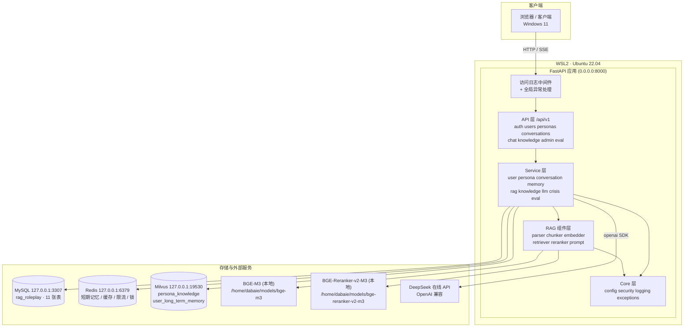
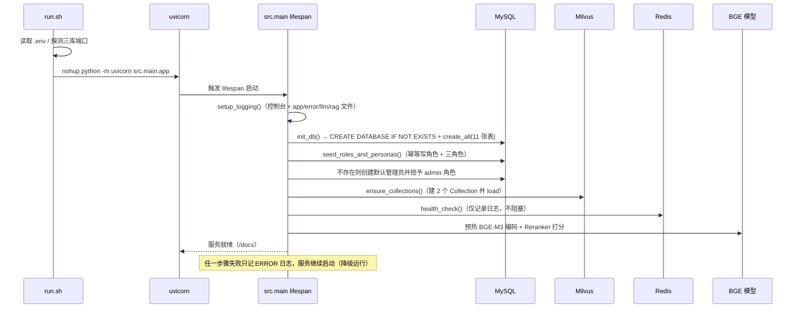
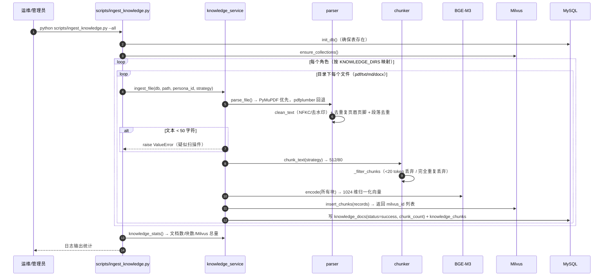
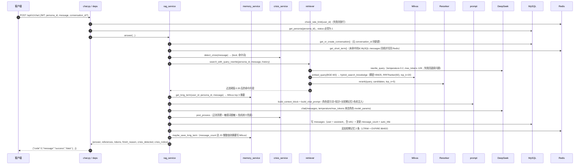
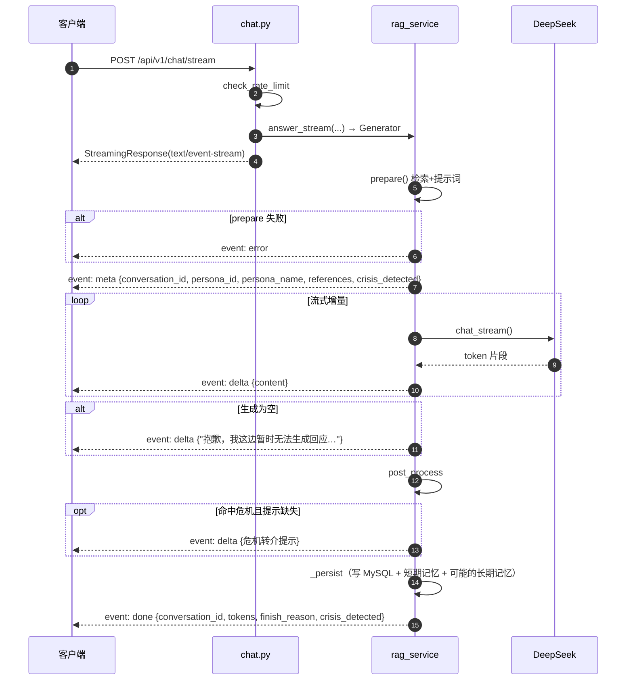
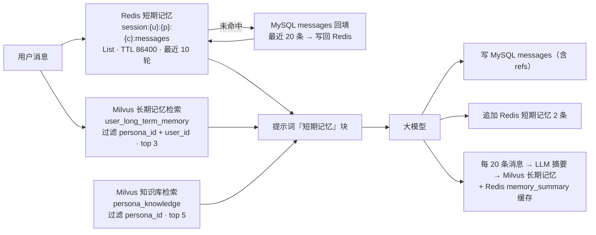

# 02 · 总体架构与设计

| 项目 | 内容 |
| :--- | :--- |
| 文档版本 | V1.0 |
| 编写日期 | 2026-09-15 |
| 对应代码 | `/home/dabaie/code/psychologist/src` |

---

## 1. 总体架构



**请求主链路**：`main.py`（中间件 → 路由 → 异常兜底）→ `api/v1/*`（校验 + 鉴权）→ `services/*`（业务编排）→ `{db, rag, models, core}`（存储与算法）→ 外部服务。

**依赖方向严格单向**：`api → services → {rag, db, models, core}`，`rag → {db, core}`。不存在反向依赖。

---

## 2. 组件部署视图

| 组件 | 进程/形态 | 端口 | 启动方式 |
| :--- | :--- | :--- | :--- |
| FastAPI 后端 | uvicorn 单进程（默认 1 worker） | 8000 | `bash scripts/run.sh`（nohup，PID 写 `data/uvicorn.pid`） |
| MySQL | 独立服务 | 3307 | 系统服务（`install.sh` 仅检查连通性） |
| Redis | 独立服务 | 6379 | 系统服务 |
| Milvus | 独立服务（standalone） | 19530 | 系统服务 |
| BGE-M3 | 进程内加载（懒加载单例） | — | 应用启动预热（`WARMUP_MODELS=1`） |
| BGE-Reranker-v2-M3 | 进程内加载（懒加载单例） | — | 同上 |
| DeepSeek | 远程 HTTPS | 443 | 按需调用（openai SDK，`max_retries=2`） |

各组件均为**单机共置部署**，通过 `127.0.0.1` 内网通信，不跨网络。

---

## 3. 应用启动流程（lifespan）



关键点：MySQL / Milvus / Redis / 模型均**不阻塞启动**，任何一步失败都只写 ERROR 日志。排查启动问题第一站是 `logs/app.log` 的启动段。

---

## 4. 离线流程（知识库构建）时序



**元数据双层记录**：Milvus 存向量与检索所需字段（`text`/`summary`/`source`），MySQL 存文档级与块级元数据（含 `milvus_id` 回写），便于运营与审计。

---

## 5. 在线流程（问答）时序

### 5.1 非流式 `POST /api/v1/chat`



### 5.2 流式 `POST /api/v1/chat/stream`（SSE）



**SSE 事件契约**

| 事件 | data 字段 | 时机 |
| :--- | :--- | :--- |
| `meta` | `conversation_id`, `persona_id`, `persona_name`, `references[]`, `crisis_detected` | 检索与提示词就绪后、LLM 之前 |
| `delta` | `content` | 每个 token 增量 |
| `done` | `conversation_id`, `tokens`, `finish_reason`, `crisis_detected` | 全部生成并落库后 |
| `error` | `message` | 准备阶段或生成阶段异常 |

**关键设计**：`meta` 先于 LLM 返回，前端可立即渲染会话与引用来源；首 token 延迟中，检索与重排时间占主要部分（一次完整问答只做一次检索）。

---

## 6. 模块划分与职责

```mermaid
flowchart LR
    subgraph 接口层
        M1["src/main.py<br/>应用入口 · 中间件 · 异常"]
        M2["src/api/router.py<br/>/api/v1 聚合"]
        M3["src/api/deps.py<br/>JWT · 管理员 · 客户端IP"]
        M4["src/api/v1/*.py<br/>8 个路由模块"]
    end
    subgraph 业务层
        S1["user_service"]
        S2["persona_service (+ persona_seed)"]
        S3["conversation_service"]
        S4["memory_service"]
        S5["rag_service"]
        S6["knowledge_service"]
        S7["llm_service"]
        S8["crisis_service"]
        S9["eval_service"]
    end
    subgraph RAG 组件
        R1[parser] --> R2[chunker] --> R3[embedder]
        R4[retriever] --> R5[reranker]
        R6[prompt]
    end
    subgraph 数据层
        D1[db/mysql]
        D2[db/redis]
        D3[db/milvus]
        D4[models 11 张表]
    end
    subgraph 基础层
        F1[core/config]
        F2[core/security]
        F3[core/logging]
        F4[core/exceptions]
    end
    M4 --> 业务层
    业务层 --> RAG 组件
    业务层 --> 数据层
    业务层 --> F1
    业务层 --> F4
```

### 6.1 接口层

| 文件 | 职责 | 关键点 |
| :--- | :--- | :--- |
| `src/main.py` | FastAPI 实例、lifespan、CORS、全局异常处理器、访问日志中间件、`/`、`/health` | 统一异常 → `fail()`；`X-Process-Time-Ms` 响应头 |
| `src/api/router.py` | 挂载 8 个子路由到 `/api/v1` | — |
| `src/api/deps.py` | `HTTPBearer` + JWT 解析、`get_current_user` / `get_current_admin` / `get_optional_user`、`get_client_ip`（支持 `X-Forwarded-For`） | 校验 token `type == "access"`、用户存在且 `status == 1` |
| `src/api/v1/auth.py` | 注册/登录/刷新/登出/me | 注册与登出写审计日志 |
| `src/api/v1/users.py` | 资料、改密、偏好角色、登录日志 | 偏好角色即 P-03 切换 |
| `src/api/v1/personas.py` | 列表/详情/新增/编辑/上下架 | 列表与编辑响应中**剔除 `system_prompt`** |
| `src/api/v1/conversations.py` | 会话 CRUD、历史消息、手动存长期记忆 | 所有查询强制 `user_id` 校验 |
| `src/api/v1/chat.py` | `/chat` 与 `/chat/stream` | 限流 + 角色上架校验 + SSE 头（`X-Accel-Buffering: no`） |
| `src/api/v1/knowledge.py` | 上传/列表/删除/重建/检索/统计 | 全部要求管理员；上传落盘 `data/uploads/` |
| `src/api/v1/admin.py` | 用户管理、日志、会话审计、系统监控 | 监控聚合三库健康与模型加载状态 |
| `src/api/v1/evaluate.py` | RAGAS 评测 | 报告落盘并返回路径 |

### 6.2 业务层

| 服务 | 职责 | 依赖 |
| :--- | :--- | :--- |
| `user_service` | 注册/登录/刷新、资料读写与缓存、改密、用户列表、状态启停、登录/审计日志 | `core.security`、`db.redis`、`persona_service` |
| `persona_service` | 角色 CRUD、缓存、默认角色偏好、角色与系统角色幂等初始化、权限判定 | `db.redis`、`persona_seed` |
| `persona_seed` | **纯数据模块**：三角色定义 + `KNOWLEDGE_DIRS` 目录映射 + `SYS_ROLES` | `rag.prompt` |
| `conversation_service` | 会话创建/查询/逻辑删除、消息写入与分页、自动标题、Redis 回填 | `db.redis` |
| `memory_service` | 短期记忆（Redis，含 MySQL 回填）、长期记忆摘要生成（LLM + 规则兜底）与 Milvus 读写 | `db.redis`、`db.milvus`、`llm_service`、`embedder` |
| `rag_service` | 在线问答编排：`prepare` / `answer` / `answer_stream` / `_persist` | 几乎全部 rag 与 service 组件 |
| `knowledge_service` | 离线入库、文档元数据、删除、重建、统计、检索测试 | `rag.parser`、`rag.chunker`、`embedder`、`db.milvus` |
| `llm_service` | OpenAI 兼容客户端（单例）、`chat` / `chat_stream` / `simple_complete` | `core.config`、`core.exceptions` |
| `crisis_service` | 危机词与风险语气检测、转介提示、敏感词脱敏、后处理 | `core.config` |
| `eval_service` | 数据集加载、内置 LLM-as-Judge、ragas 尝试与回退、报告落盘 | `retriever`、`llm_service`、`rag.prompt` |

### 6.3 RAG 组件层

| 文件 | 职责 | 关键实现 |
| :--- | :--- | :--- |
| `parser.py` | 文档解析与清洗 | `SUPPORTED_TYPES={pdf,txt,md,markdown,docx}`；PyMuPDF → pdfplumber 回退；`.docx` 段落 + 表格；`clean_text`（NFKC、去控制字符、去水印正则）；`remove_repeated_lines`（页眉页脚）；`deduplicate_paragraphs`（段落去重） |
| `chunker.py` | 分块与 token 估算 | `estimate_tokens`（CJK=1、其他 4 字符≈1）；6 种策略：`fixed/sentence/paragraph/heading/semantic/parent_child`（默认 `paragraph`）；`summarize_chunk` 首句规则摘要 |
| `embedder.py` | BGE-M3 封装 | 单例懒加载 + 双检锁；`encode` 归一化（适配 COSINE）；GPU 失败**自动降级 CPU** |
| `reranker.py` | BGE-Reranker-v2-M3 封装 | CrossEncoder（`max_length=512`）；分数 `sigmoid` 归一化到 `(0,1)`；降序取 top_n；GPU 失败自动降级 CPU |
| `retriever.py` | 检索编排 | `rewrite_query`（LLM 改写并与原文拼接）→ 向量化 → Milvus 混合检索（失败降级稠密）→ 精排 → 阈值过滤（全低时保留最高分 1 条） |
| `prompt.py` | 提示词工厂 | 通用模板 + 三角色 prompt + 危机注入 + 各辅助 prompt；`build_context_block`（带来源与相关度，默认上限 2400 字符）、`build_recent_messages_block`、`build_long_term_memory_block`、`build_chat_prompt` |

### 6.4 数据层

| 文件 | 职责 | 关键实现 |
| :--- | :--- | :--- |
| `db/mysql.py` | 引擎/会话/建库建表/健康检查 | `create_database_if_not_exists`（无权限时容忍）；`get_db`（FastAPI 依赖，异常回滚）；`session_scope`（脚本用，自动 commit）；`pool_recycle=3600`、`pool_pre_ping` |
| `db/redis.py` | 客户端、Key 构造、通用 JSON 读写、短期记忆、缓存、限流、锁 | 全部捕获 `RedisError` 降级；`append_message` 用 pipeline（RPUSH+LTRIM+EXPIRE）；`acquire_lock` 异常时**返回 True**（不阻塞业务） |
| `db/milvus.py` | 两个 Collection 的 Schema/索引/写入/检索/删除/统计 | `MilvusClient` 单例；知识库 = 稠密 HNSW/COSINE + BM25 Function 稀疏 + `RRFRanker(60)`；长期记忆 = 稠密 HNSW + `user_id` INVERTED |
| `models/*.py` | 11 张 ORM 表 | 集中在 `models/__init__.py` 导出 `Base` 与所有模型 |

### 6.5 基础层

| 文件 | 职责 | 关键实现 |
| :--- | :--- | :--- |
| `core/config.py` | 全部配置 | `pydantic-settings` 读 `.env`（可用 `PSYCH_ENV_FILE` 覆盖路径）；`lru_cache` 单例 `settings`；派生 `database_url` / `server_url` / `emergency_phones`；强制 `HF_HUB_OFFLINE` |
| `core/security.py` | 口令与 JWT | bcrypt（rounds 限制 4~16）；JWT payload：`sub`(user_id)、`type`(access/refresh)、`iat`、`exp`、`roles` |
| `core/logging.py` | 日志 | 根 logger + `RotatingFileHandler`（20MB×5）；`llm` / `rag` 独立 logger 与文件 |
| `core/exceptions.py` | 异常与响应封装 | 8 种业务异常（code/http_status 对齐）；`ok()` / `fail()` |
| `utils/helpers.py` | 纯工具 | 时间格式化、截断、md5、空白规范化、安全文件名、分页 |

---

## 7. 数据流转

### 7.1 记忆的分层流转



三层记忆的职责边界：

| 层 | 载体 | 内容 | 生命周期 |
| :--- | :--- | :--- | :--- |
| 短期记忆 | Redis List | 最近 10 轮原文对话 | TTL 86400 秒，随写随滚 |
| 长期记忆 | Milvus | ≤200 字会话摘要（向量检索 top 3） | 永久（除非删除向量） |
| 事实记录 | MySQL `messages` | 全量消息原文 + 引用 | 永久（会话逻辑删除后仍保留） |

### 7.2 知识库数据流转

```
原始文档 → parser（文本 + 清洗 + 去重）
        → chunker（512/80 分块 + 低质/重复过滤 + 首句摘要）
        → embedder（BGE-M3 1024 维归一化）
        → milvus.insert_chunks（text/summary/source/doc_id/chunk_id/persona_id → 返回主键）
        → MySQL knowledge_docs（状态、块数）+ knowledge_chunks（内容、摘要、milvus_id）
```

检索时反向：`query → embed_query → Milvus 过滤 persona_id → 命中 text/summary/source → rerank → 提示词上下文（带来源标注）→ references 返回前端`。

---

## 8. 技术选型理由

| 选型 | 理由 | 备选与否决原因 |
| :--- | :--- | :--- |
| **FastAPI** | 原生异步、自动 OpenAPI 文档（`/docs` 即交付物）、Pydantic 校验、`StreamingResponse` 天然支持 SSE | Flask（无自动文档/异步弱）、Django（过重） |
| **SQLAlchemy 2.0 ORM** | 参数绑定天然防 SQL 注入；`Base.metadata.create_all` 一键建表；Alembic 可演进 | 手写 SQL（注入风险与维护成本） |
| **MySQL（3307）** | 需求强制；关系型事务适合用户/会话/消息一致性；JSON 列可存 `refs`/`model_params` | — |
| **Redis** | List 结构天然适合"最近 N 轮"；`LTRIM` 常数复杂度；`INCR+EXPIRE` 即限流；缓存角色/用户资料 | 内存表（无 TTL/持久化语义弱） |
| **Milvus** | 需求指定；原生支持 `partition_key`（角色隔离无需额外过滤索引）；2.5+ 支持 **BM25 Function** 内置稀疏向量与 `hybrid_search` + `RRFRanker`，混合检索一条语句完成 | FAISS（无服务化/无混合检索）、pgvector（功能弱于 Milvus） |
| **BGE-M3（本地）** | 中文检索效果好、1024 维、支持长文本；本地部署无需外网、无 token 成本 | 在线 embedding（依赖网络与费用） |
| **BGE-Reranker-v2-M3（本地）** | CrossEncoder 精排显著提升 top-5 命中质量；与 BGE-M3 同源 | 仅靠向量召回（语义漂移、精度不足） |
| **DeepSeek（在线 OpenAI 兼容）** | 需求指定；`openai` SDK 直连，改 `LLM_BASE_URL`/`LLM_MODEL` 即可切换任意兼容服务 | 本地 LLM（GPU 显存 8GB 不足，见 FAQ Q3） |
| **pydantic-settings** | 配置即类型校验，`.env` 单一来源，禁止硬编码 | `os.getenv` 散落各处（无校验、易错） |
| **bcrypt + PyJWT** | bcrypt 自带 salt、抗彩虹表；HS256 简单可靠，refresh token 分离类型 | 明文/单向 md5（不安全） |
| **SSE 而非 WebSocket** | 场景是单向流式输出，SSE 更轻、可穿透代理、HTTP 语义简单 | WebSocket（双向信道，本场景不需要） |
| **RAG 双引擎评测** | `ragas 0.4.3` 在本环境因 `langchain-community` 冲突不可用，内置 LLM-as-Judge 保证指标口径一致且永远可跑 | 强行升级 langchain 全家桶（影响面不可控） |

---

## 9. 关键设计权衡

| 设计点 | 取舍 |
| :--- | :--- |
| **Milvus 只存 `text`/`summary`/`source`，不存全量块正文以外元数据** | 减少向量库存量；MySQL 作为元数据权威源（`knowledge_chunks` 含完整正文与 `milvus_id`），便于运营与删除 |
| **每个角色各存一份通用知识库向量** | 查询时可用分区键 `persona_id` 一条过滤条件完成隔离，避免跨角色召回污染；代价是存储冗余 |
| **`get_persona_dict` 与用户资料走 Redis 缓存（TTL 3600）** | 角色提示词较长，避免每轮问答重复查库；更新角色时主动 `invalidate_persona` |
| **长期记忆按"每 20 条消息"触发摘要** | 避免每轮都调用 LLM 做摘要（成本与延迟）；`save-memory` 接口支持用户主动触发 |
| **重排后仍保留 1 条最低分片段** | 全部低于阈值时宁可有依据地保守回答，也不做无依据发挥，降低幻觉 |
| **`answer` 的 `refs` 存 MySQL `messages.refs`（JSON）** | 历史消息回放时可还原当轮引用来源，便于审计与溯源 |
| **Redis 降级为"放行/返回空"** | 缓存与限流属非关键路径，可用性优先于严格性；短期记忆缺失由 MySQL 回填补齐 |
| **限流按用户 + 分钟窗口，计数在 Redis** | 无状态、易水平扩展；服务重启不清零（Key 带时间戳，`EXPIRE 60` 自动清理） |