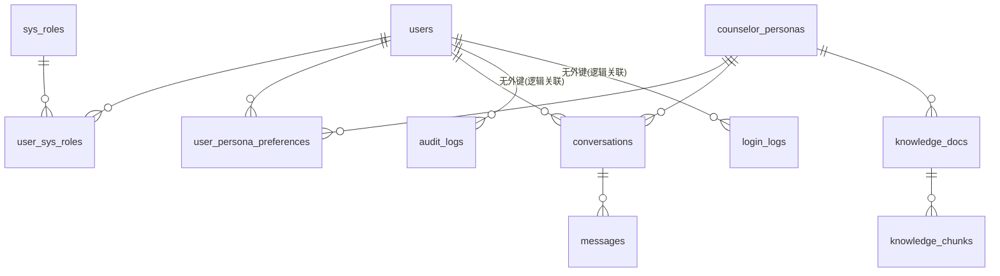

# 03 · 数据设计（MySQL / Milvus / Redis）

| 项目 | 内容 |
| :--- | :--- |
| 文档版本 | V1.0 |
| 编写日期 | 2026-09-15 |
| 权威来源 | `src/models/*.py`（ORM，实际建表依据）、`src/db/milvus.py`、`src/db/redis.py` |
| 交付物 | `sql/schema.sql`（DDL，交付审查用） |

---

## 0. 总览

| 存储 | 内容 | 数量 |
| :--- | :--- | :--- |
| MySQL `rag_roleplay` | 用户、角色、会话、消息、知识元数据、日志 | **11 张表** |
| Milvus | 知识库分块、长期记忆摘要 | **2 个 Collection** |
| Redis | 短期记忆、缓存、限流、并发锁、会话摘要 | **6 类 Key** |



> 实际 DDL 中 `audit_logs` / `login_logs` 只有 `user_id` 列与索引，**没有外键约束**（避免日志写入被用户删除动作阻塞）。

**字符集**：数据库与全部表均为 `utf8mb4` / `utf8mb4_unicode_ci`，引擎 `InnoDB`。

---

## 1. MySQL 数据表（11 张）

### 1.1 `users` — 用户

> 模型：`src/models/user.py::User`

| 字段 | 类型 | 空 | 默认 | 说明 |
| :--- | :--- | :--- | :--- | :--- |
| `id` | BIGINT | PK | AUTO_INCREMENT | 主键 |
| `username` | VARCHAR(64) | NOT NULL | — | 用户名，**唯一** |
| `password_hash` | VARCHAR(255) | NOT NULL | — | bcrypt 哈希（60 字符左右） |
| `email` | VARCHAR(128) | NULL | — | 邮箱（注册时唯一性校验） |
| `phone` | VARCHAR(32) | NULL | — | 手机号 |
| `nickname` | VARCHAR(64) | NULL | — | 昵称，默认取 username |
| `avatar` | VARCHAR(512) | NULL | — | 头像 URL |
| `status` | INT | — | 1 | 1=启用，0=禁用 |
| `created_at` | DATETIME | — | `CURRENT_TIMESTAMP` | 创建时间 |
| `updated_at` | DATETIME | — | `CURRENT_TIMESTAMP ON UPDATE` | 更新时间 |
| `last_login_at` | DATETIME | NULL | — | 最近登录时间 |

索引：`PRIMARY(id)`、`UNIQUE(username)`、`idx_users_email(email)`、`idx_users_phone(phone)`

### 1.2 `sys_roles` — 系统角色

> 模型：`src/models/user.py::SysRole`

| 字段 | 类型 | 空 | 默认 | 说明 |
| :--- | :--- | :--- | :--- | :--- |
| `id` | BIGINT | PK | AUTO_INCREMENT | 主键 |
| `role_code` | VARCHAR(64) | NOT NULL | — | 角色编码，**唯一**：`admin` / `user` |
| `role_name` | VARCHAR(64) | NOT NULL | — | 角色名称 |
| `description` | VARCHAR(255) | NULL | — | 描述 |

初始化数据（`src/services/persona_seed.py::SYS_ROLES`）：
| role_code | role_name | description |
| :--- | :--- | :--- |
| `admin` | 管理员 | 系统管理员，可管理用户、角色、知识库 |
| `user` | 普通用户 | 普通用户，可进行心理陪伴对话 |

### 1.3 `user_sys_roles` — 用户-系统角色关联

> 模型：`src/models/user.py::UserSysRole`

| 字段 | 类型 | 空 | 说明 |
| :--- | :--- | :--- | :--- |
| `id` | BIGINT | PK | 主键 |
| `user_id` | BIGINT | NOT NULL | → `users.id`（外键） |
| `role_id` | BIGINT | NOT NULL | → `sys_roles.id`（外键） |

索引：`UNIQUE uk_user_role(user_id, role_id)`

### 1.4 `counselor_personas` — 心理医生角色

> 模型：`src/models/persona.py::CounselorPersona`

| 字段 | 类型 | 空 | 默认 | 说明 |
| :--- | :--- | :--- | :--- | :--- |
| `id` | BIGINT | PK | AUTO_INCREMENT | 主键，同时作为 Milvus 分区键 |
| `persona_code` | VARCHAR(64) | NOT NULL | — | 角色编码，**唯一**：`humanistic_lin` / `cbt_chen` / `mindfulness_zhou` |
| `name` | VARCHAR(64) | NOT NULL | — | 角色名称 |
| `title` | VARCHAR(128) | NULL | — | 职称/定位，如"人本共情倾听型心理咨询师" |
| `therapy_type` | VARCHAR(64) | NULL | — | 流派，如"人本主义 / 共情倾听" |
| `style` | VARCHAR(255) | NULL | — | 风格 |
| `methods` | VARCHAR(255) | NULL | — | 核心方法/技巧 |
| `greeting` | TEXT | NULL | — | 开场白（建会话时返回给前端） |
| `system_prompt` | TEXT | NOT NULL | — | 独立 system prompt |
| `knowledge_scope` | VARCHAR(255) | NULL | — | 知识库范围描述 |
| `avatar` | VARCHAR(512) | NULL | — | 头像 URL（需求 DDL 未含，代码新增） |
| `safety_boundary` | TEXT | NULL | — | 安全边界文案（需求 DDL 未含，代码新增） |
| `model_params` | JSON | NULL | — | 模型参数 `{"temperature":0.8,"max_tokens":2048,"top_p":0.9}` |
| `status` | INT | — | 1 | 1=上架，0=下架 |
| `created_at` | DATETIME | — | `CURRENT_TIMESTAMP` | — |
| `updated_at` | DATETIME | — | `CURRENT_TIMESTAMP ON UPDATE` | — |

索引：`PRIMARY(id)`、`UNIQUE(persona_code)`

三角色实际数据（`src/services/persona_seed.py::PERSONAS`，`seed_personas.py` 幂等写入；已存在时会**同步覆盖**提示词/开场白/model_params 并清 Redis 缓存）：

| persona_code | name | therapy_type | model_params |
| :--- | :--- | :--- | :--- |
| `humanistic_lin` | 林知暖医生 | 人本主义 / 共情倾听 | `{"temperature":0.8,"max_tokens":2048,"top_p":0.9}` |
| `cbt_chen` | 陈认知医生 | CBT 认知行为疗法 | `{"temperature":0.5,"max_tokens":2048,"top_p":0.9}` |
| `mindfulness_zhou` | 周正念医生 | 正念减压 / 情绪接纳 | `{"temperature":0.6,"max_tokens":2048,"top_p":0.9}` |

### 1.5 `user_persona_preferences` — 用户默认心理医生偏好

> 模型：`src/models/user.py::UserPersonaPreference`；支撑 U-08 / P-03

| 字段 | 类型 | 空 | 默认 | 说明 |
| :--- | :--- | :--- | :--- | :--- |
| `id` | BIGINT | PK | AUTO_INCREMENT | 主键 |
| `user_id` | BIGINT | NOT NULL | — | → `users.id` |
| `persona_id` | BIGINT | NOT NULL | — | → `counselor_personas.id` |
| `is_default` | INT | — | 0 | 1=当前默认角色（设置新默认时会先把该用户所有记录置 0） |
| `created_at` | DATETIME | — | `CURRENT_TIMESTAMP` | — |

索引：`UNIQUE uk_user_persona(user_id, persona_id)`

### 1.6 `conversations` — 会话

> 模型：`src/models/conversation.py::Conversation`

| 字段 | 类型 | 空 | 默认 | 说明 |
| :--- | :--- | :--- | :--- | :--- |
| `id` | BIGINT | PK | AUTO_INCREMENT | 主键 |
| `user_id` | BIGINT | NOT NULL | — | → `users.id` |
| `persona_id` | BIGINT | NOT NULL | — | → `counselor_personas.id`（决定独立知识库与独立记忆域） |
| `title` | VARCHAR(255) | NULL | — | 标题；默认"新的心理咨询会话"，首条用户消息后截断 20 字 |
| `status` | INT | — | 1 | 1=正常，0=已删除（逻辑删除，C-07） |
| `message_count` | INT | — | 0 | 消息条数，用于长期记忆触发（每 20 条） |
| `created_at` | DATETIME | — | `CURRENT_TIMESTAMP` | — |
| `updated_at` | DATETIME | — | `CURRENT_TIMESTAMP ON UPDATE` | 新消息写入时手动更新，列表按其倒序 |

索引：`idx_conv_user(user_id)`、`idx_conv_persona(persona_id)`；外键指向 `users`、`counselor_personas`

### 1.7 `messages` — 消息

> 模型：`src/models/conversation.py::Message`

| 字段 | 类型 | 空 | 默认 | 说明 |
| :--- | :--- | :--- | :--- | :--- |
| `id` | BIGINT | PK | AUTO_INCREMENT | 主键 |
| `conversation_id` | BIGINT | NOT NULL | — | → `conversations.id` |
| `role` | VARCHAR(32) | NOT NULL | — | `user` / `assistant` |
| `content` | TEXT | NOT NULL | — | 消息正文（assistant 为后处理后的最终回答） |
| `tokens` | INT | NULL | — | token 数；用户消息用 `estimate_tokens` 估算，助手消息优先用 API 返回值 |
| `refs` | JSON | NULL | — | 该轮引用的知识片段：`[{"doc_id","chunk_id","source","score"}]` |
| `created_at` | DATETIME | — | `CURRENT_TIMESTAMP` | — |

索引：`idx_msg_conv(conversation_id)`

> 无 `updated_at`（消息不可编辑）。

### 1.8 `knowledge_docs` — 知识文档

> 模型：`src/models/knowledge.py::KnowledgeDoc`

| 字段 | 类型 | 空 | 默认 | 说明 |
| :--- | :--- | :--- | :--- | :--- |
| `id` | BIGINT | PK | AUTO_INCREMENT | 主键 |
| `persona_id` | BIGINT | NOT NULL | — | → `counselor_personas.id`（文档归属角色） |
| `title` | VARCHAR(255) | NULL | — | 标题（解析器取 PDF 元数据或文件名） |
| `source` | VARCHAR(512) | NULL | — | 来源（文件名） |
| `file_path` | VARCHAR(512) | NULL | — | 文件路径（运行时上传为 `data/uploads/{ts}_{name}`） |
| `file_type` | VARCHAR(32) | NULL | — | `pdf` / `txt` / `md` / `docx` |
| `status` | VARCHAR(32) | — | `pending` | `pending` / `processing` / `success` / `failed` |
| `chunk_count` | INT | — | 0 | 成功入库的分块数 |
| `error_msg` | TEXT | NULL | — | 失败原因（截断 2000 字符） |
| `created_at` | DATETIME | — | `CURRENT_TIMESTAMP` | — |
| `updated_at` | DATETIME | — | `CURRENT_TIMESTAMP ON UPDATE` | — |

索引：`idx_doc_persona(persona_id)`

### 1.9 `knowledge_chunks` — 知识分块

> 模型：`src/models/knowledge.py::KnowledgeChunk`

| 字段 | 类型 | 空 | 默认 | 说明 |
| :--- | :--- | :--- | :--- | :--- |
| `id` | BIGINT | PK | AUTO_INCREMENT | 主键 |
| `doc_id` | BIGINT | NOT NULL | — | → `knowledge_docs.id` |
| `persona_id` | BIGINT | NOT NULL | — | 冗余角色 ID，便于按角色统计/删除（无外键） |
| `chunk_id` | BIGINT | NOT NULL | — | 文档内分块序号（从 0 开始），与 Milvus `chunk_id` 对齐 |
| `content` | TEXT | NOT NULL | — | 分块正文（完整） |
| `summary` | VARCHAR(2048) | NULL | — | 分块摘要（`summarize_chunk` 取首句，≤120 字） |
| `milvus_id` | BIGINT | NULL | — | 回写 Milvus 主键，用于精确删除 |
| `created_at` | DATETIME | — | `CURRENT_TIMESTAMP` | — |

索引：`idx_chunk_doc(doc_id)`、`idx_chunk_persona(persona_id)`

### 1.10 `audit_logs` — 审计日志

> 模型：`src/models/user.py::AuditLog`

| 字段 | 类型 | 空 | 默认 | 说明 |
| :--- | :--- | :--- | :--- | :--- |
| `id` | BIGINT | PK | AUTO_INCREMENT | 主键 |
| `user_id` | BIGINT | NULL | — | 操作者（登录失败时可能为 NULL） |
| `action` | VARCHAR(128) | NULL | — | 动作：`register` / `login` / `login_failed` / `logout` / `change_password` / `set_user_status` 等 |
| `detail` | VARCHAR(4000) | NULL | — | 详情（代码截断至 4000） |
| `ip` | VARCHAR(64) | NULL | — | 客户端 IP（优先 `X-Forwarded-For`） |
| `created_at` | DATETIME | — | `CURRENT_TIMESTAMP` | — |

索引：`idx_audit_user(user_id)`

> ⚠️ **差异**：`sql/schema.sql` 中该列定义为 `TEXT`，ORM 定义为 `String(4000)`（即 `VARCHAR(4000)`）。实际建表以 ORM（`Base.metadata.create_all`）为准。写入前代码已 `detail[:4000]` 截断，两者行为等价。

### 1.11 `login_logs` — 登录日志

> 模型：`src/models/user.py::LoginLog`

| 字段 | 类型 | 空 | 默认 | 说明 |
| :--- | :--- | :--- | :--- | :--- |
| `id` | BIGINT | PK | AUTO_INCREMENT | 主键 |
| `user_id` | BIGINT | NULL | — | → `users.id`（逻辑关联，无外键） |
| `ip` | VARCHAR(64) | NULL | — | 客户端 IP |
| `user_agent` | VARCHAR(512) | NULL | — | UA（截断 512） |
| `created_at` | DATETIME | — | `CURRENT_TIMESTAMP` | 登录时间 |

索引：`idx_login_user(user_id)`

---

## 2. Milvus Collection

连接：`MilvusClient(uri=settings.milvus_uri)` → `http://127.0.0.1:19530`
创建入口：`src/db/milvus.py::ensure_collections()`（服务启动或 `init_db.py` 时调用，已存在则跳过；`drop=True` 可重建）

### 2.1 `persona_knowledge` — 知识库分块（配置项 `MILVUS_COLLECTION`）

| 字段 | 类型 | 约束 | 说明 |
| :--- | :--- | :--- | :--- |
| `id` | INT64 | 主键，`auto_id=True` | 自增主键（写入后返回并回写 MySQL `milvus_id`） |
| `persona_id` | INT64 | **`is_partition_key=True`** | 心理医生角色 ID，物理分区，检索按此隔离 |
| `doc_id` | INT64 | — | MySQL `knowledge_docs.id` |
| `chunk_id` | INT64 | — | 文档内分块序号 |
| `text` | VARCHAR(65535) | `enable_analyzer=True` | 分块正文原始文本（BM25 分析字段，实际写入截断至 65000） |
| `summary` | VARCHAR(2048) | — | 分块摘要（写入截断至 2000） |
| `source` | VARCHAR(512) | — | 来源文件名（写入截断至 500） |
| `created_at` | INT64 | — | Unix 秒时间戳 |
| `updated_at` | INT64 | — | Unix 秒时间戳 |
| `vector` | FLOAT_VECTOR | `dim = EMBEDDING_DIM`（1024） | BGE-M3 稠密向量（已归一化） |
| `sparse_vector` | SPARSE_FLOAT_VECTOR | 由 Function 自动生成 | BM25 稀疏向量 |

**BM25 Function**：

```python
Function(name="bm25_fn", function_type=FunctionType.BM25,
         input_field_names=["text"], output_field_names=["sparse_vector"])
```

即写入时只需提供 `text`，稀疏向量由 Milvus 自动计算，无需客户端生成。

**索引**

| 字段 | 索引类型 | 度量 | 参数 | 说明 |
| :--- | :--- | :--- | :--- | :--- |
| `vector` | `HNSW` | `COSINE` | `M=16, efConstruction=200` | 稠密向量近邻 |
| `sparse_vector` | `SPARSE_INVERTED_INDEX` | `BM25` | — | 稀疏倒排（关键词召回） |

> 与需求文档差异：需求写"稀疏向量度量 IP"，实际 pymilvus 2.5+ 的 BM25 Function 要求 `metric_type="BM25"`。

**分区键**：`persona_id`（每个角色一个物理分区，过滤条件 `persona_id == {id}` 同时命中分区裁剪）

**混合检索**（`hybrid_search_knowledge`）：

```python
reqs = [
  AnnSearchRequest(data=[query_dense], anns_field="vector",
                   param={"metric_type": "COSINE"}, limit=top_k, expr="persona_id == {id}"),
  AnnSearchRequest(data=[query_text],  anns_field="sparse_vector",
                   param={"metric_type": "BM25"},   limit=top_k, expr="persona_id == {id}"),
]
client.hybrid_search(collection, reqs, ranker=RRFRanker(60), limit=top_k,
                     output_fields=["doc_id","chunk_id","text","summary","source","persona_id"])
```

- 融合算法：**RRFRanker(k=60)**
- 输出字段：`doc_id` / `chunk_id` / `text` / `summary` / `source` / `persona_id`
- 返回结构中 `score` 取 `hit.distance`（RRF 融合分，非余弦相似度；最终相关性以 **rerank_score** 为准）
- 混合检索抛 `MilvusException` 时返回 `[]`，上层 `retriever.retrieve` 自动降级为 `dense_search_knowledge`（纯稠密，返回真实 COSINE 距离）

**写入/删除/统计 API**

| 函数 | 作用 |
| :--- | :--- |
| `insert_chunks(records)` | 批量插入 + `flush`，返回 Milvus 主键列表 |
| `delete_knowledge_by_doc(doc_id, persona_id)` | 按 `doc_id and persona_id` 删除，返回删除条数 |
| `delete_knowledge_by_persona(persona_id)` | 按角色整体清空 |
| `count_knowledge(persona_id=None)` | 无参数时读 collection 统计；有参数时 `count(*)` 过滤 |

### 2.2 `user_long_term_memory` — 长期记忆摘要（配置项 `MILVUS_MEMORY_COLLECTION`，默认 `user_long_term_memory`）

| 字段 | 类型 | 约束 | 说明 |
| :--- | :--- | :--- | :--- |
| `id` | INT64 | 主键，`auto_id=True` | 自增主键 |
| `persona_id` | INT64 | **`is_partition_key=True`** | 角色分区键（同一用户在不同角色下记忆隔离） |
| `user_id` | INT64 | 有 INVERTED 索引 | 用户 ID（标量过滤） |
| `conversation_id` | INT64 | — | 来源会话 ID |
| `summary` | VARCHAR(8192) | `enable_analyzer=True` | 会话摘要（≤200 字，LLM 生成或规则兜底） |
| `created_at` | INT64 | — | Unix 秒时间戳 |
| `vector` | FLOAT_VECTOR | `dim = EMBEDDING_DIM`（1024） | 摘要的 BGE-M3 向量 |

**索引**

| 字段 | 索引类型 | 度量 / 参数 | 说明 |
| :--- | :--- | :--- | :--- |
| `vector` | `HNSW` | `COSINE`，`M=16, efConstruction=200` | 按当前问题语义召回历史摘要 |
| `user_id` | `INVERTED` | — | 加速标量过滤 |

**检索**（`search_memory`）：

```python
client.search(collection, data=[query_dense], anns_field="vector",
              filter=f"persona_id == {persona_id} and user_id == {user_id}",
              limit=top_k, output_fields=["conversation_id","summary","created_at"],
              search_params={"metric_type": "COSINE"})
```

- 默认 `top_k = 3`（`memory_service.get_long_term`）
- 触发写入：`conversations.message_count % LONG_TERM_SUMMARY_TRIGGER == 0`（默认 20）或调用 `POST /conversations/{id}/save-memory` 强制触发
- 摘要生成：LLM `SUMMARY_PROMPT`（temperature 0.3，max_tokens 400，最多取最近 40 轮）；失败时规则兜底为"用户主要倾诉内容：{最近 3 条用户消息}"

> ⚠️ `MILVUS_MEMORY_COLLECTION` 未写入 `.env` / `.env.example`，仅存在于 `src/core/config.py` 默认值。如需改名请在 `.env` 手动添加该键。

### 2.3 Collection 管理函数

| 函数 | 说明 |
| :--- | :--- |
| `ensure_knowledge_collection(drop=False)` | 建知识库 Collection（存在且 `drop=True` 时先删后建） |
| `ensure_memory_collection(drop=False)` | 建长期记忆 Collection |
| `ensure_collections()` | 建两个 Collection 并 `load_collection` 到内存 |
| `drop_all()` | 删除两个 Collection（危险操作） |
| `health_check()` | `list_collections()` 探测连通性 |

---

## 3. Redis Key 设计

> 实现：`src/db/redis.py`；客户端参数：`decode_responses=True`、`socket_timeout=5`、`socket_connect_timeout=5`、`health_check_interval=30`

| Key 模板 | 实际类型 | 内容 | TTL | 写入函数 | 用途 |
| :--- | :--- | :--- | :--- | :--- | :--- |
| `session:{user_id}:{persona_id}:{conversation_id}:messages` | **List** | 元素为 JSON `{"role":"user/assistant","content":"..."}` | 86400 秒（`SHORT_TERM_TTL`） | `append_message`（pipeline：RPUSH + LTRIM `-2N..-1` + EXPIRE） | 短期记忆，保留最近 `SHORT_TERM_MAX_TURNS * 2` 条 |
| `user:{user_id}:profile` | **String（JSON）** | 用户资料 dict（含 roles、`default_persona_id`） | 3600 秒 | `cache_user_profile`（`set_json`） | 用户资料缓存，更新/禁用时 `invalidate_user_profile` |
| `persona:{persona_id}` | **String（JSON）** | 角色 dict（含 `system_prompt`） | 3600 秒 | `cache_persona`（`set_json`） | 角色缓存，避免每轮问答查库；角色变更/种子写入时 `invalidate_persona` |
| `rate_limit:{user_id}:{YYYYMMDDHHmm}` | **String** | 该分钟计数（`INCR`） | 60 秒 | `check_rate_limit` | 限流，默认 `RATE_LIMIT_PER_MINUTE = 30` |
| `lock:conversation:{conversation_id}` | **String** | 值固定 `"1"`，`SET NX EX 30` | 30 秒 | `acquire_lock` / `release_lock` | 会话级并发锁（Redis 异常时视为加锁成功，不阻塞） |
| `memory_summary:{user_id}:{persona_id}:{conversation_id}` | **String（JSON）** | `{"summary": "...", "message_count": N}` | 86400 秒 | `memory_service.maybe_save_long_term` | 已生成摘要的缓存（避免重复调用 LLM） |

**Key 构造函数**（`src/db/redis.py`）：`session_messages_key` / `user_profile_key` / `persona_key` / `rate_limit_key` / `conversation_lock_key` / `memory_summary_key`。

> ⚠️ **文档与实现差异**：`src/db/redis.py` 文件头注释把 `user:{user_id}:profile` 与 `persona:{persona_id}` 标注为 `Hash`，但实现使用 `set_json()`（`SET`/`SETEX`）存储，实际类型为 **String（JSON 文本）**。原始需求文档同样标注为 Hash。以代码为准。

**降级策略**（全部捕获 `RedisError`，主流程不中断）：

| 操作 | 失败时行为 |
| :--- | :--- |
| `set_json` / `get_json` / `delete` | 返回 `False` / `None` / `0`，记 ERROR 日志 |
| `append_message` | 记 ERROR 日志，消息丢失（后续可从 MySQL 回填） |
| `get_recent_messages` | 返回 `[]` → 触发 MySQL 回填 |
| `check_rate_limit` | 返回 `True`（**放行**） |
| `acquire_lock` | 返回 `True`（视为已加锁） |
| `health_check` | 返回 `False` |

**缓存一致性**：采用"写库后主动失效"策略——`update_profile` / `set_user_status` / `update_persona` / `set_status` / `seed_roles_and_personas` 均在提交后删除对应 Key，不做过期等待。

---

## 4. 初始化与环境准备

### 4.1 一键初始化

```bash
cd /home/dabaie/code/psychologist
/home/dabaie/code/my_project/.venv/bin/python scripts/init_db.py
```

该脚本依次执行：`create_database_if_not_exists()`（无建库权限时容忍并假定库已存在）→ `Base.metadata.create_all()`（11 张表）→ 幂等写入 `SYS_ROLES` 与 `PERSONAS` → 创建默认管理员（`ADMIN_USERNAME`/`ADMIN_PASSWORD`）→ `ensure_collections()`。

参数：`--drop-all`（先删表重建，**危险**）、`--skip-milvus`（跳过 Milvus）。

### 4.2 手工 DDL

```bash
mysql -h 127.0.0.1 -P 3307 -u dev -p < /home/dabaie/code/psychologist/sql/schema.sql
```

`schema.sql` 与 ORM 的差异（以 ORM 为准）：
1. `counselor_personas` 的 `avatar`、`safety_boundary` 列在需求原始 DDL 中缺失，`schema.sql` 已补齐；
2. `conversations.message_count` 同上；
3. `audit_logs.detail` 在 `schema.sql` 为 `TEXT`，ORM 为 `VARCHAR(4000)`；
4. 三角色数据由 `scripts/seed_personas.py` 写入（提示词较长，未内联到 DDL）。

### 4.3 Alembic 迁移

```bash
# 连接串与 metadata 均来自 src.core.config / src.models（alembic/env.py）
/home/dabaie/code/my_project/.venv/bin/alembic upgrade head

# 后续模型变更
/home/dabaie/code/my_project/.venv/bin/alembic revision --autogenerate -m "add xxx"
```

> 初始版本 `alembic/versions/0001_init.py` 的 `upgrade()` 直接调用 `Base.metadata.create_all`；`alembic.ini` 中的 `sqlalchemy.url` 仅是占位符，真实连接串在 `env.py` 中由 `settings.database_url` 注入。

### 4.4 常见运维命令

```bash
# 查看某角色向量数
curl -s http://127.0.0.1:8000/api/v1/knowledge/stats -H "Authorization: Bearer <admin_token>"

# 全局监控（三库健康 + 模型加载 + 各角色向量数）
curl -s http://127.0.0.1:8000/api/v1/admin/monitor -H "Authorization: Bearer <admin_token>"

# Redis 检查
redis-cli -h 127.0.0.1 -p 6379 keys 'session:*' | head
redis-cli -h 127.0.0.1 -p 6379 ttl  'session:1:1:1:messages'
redis-cli -h 127.0.0.1 -p 6379 keys 'persona:*'

# MySQL 检查
mysql -h 127.0.0.1 -P 3307 -u dev -p rag_roleplay -e \
  "SELECT id,persona_code,name,status FROM counselor_personas; \
   SELECT persona_id,COUNT(*) chunks,SUM(status='failed') failed FROM knowledge_docs GROUP BY persona_id;"
```

### 4.5 数据清理

```bash
# 清空某角色知识库（Milvus 向量 + MySQL 元数据）
curl -X POST http://127.0.0.1:8000/api/v1/knowledge/rebuild \
  -H "Authorization: Bearer <admin_token>" -H "Content-Type: application/json" \
  -d '{"persona_id":1,"drop_existing":true}'

# 重建两个 Milvus Collection（会丢全部知识库与长期记忆）
/home/dabaie/code/my_project/.venv/bin/python - <<'PY'
from src.db.milvus import drop_all, ensure_collections
drop_all(); ensure_collections()
PY
```