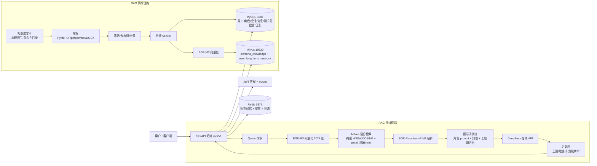

# 基于 RAG 的心理医生多角色陪伴系统

> 一个基于 RAG（检索增强生成）的心理陪伴对话系统。内置 **三个独立心理医生角色**（人本共情倾听 / CBT 认知行为 / 正念情绪调节），支持多用户、多角色、多会话、独立提示词、独立知识库、独立会话记录，并使用 Redis 短期记忆 + Milvus 长期记忆。

- 项目根目录：`/home/dabaie/code/psychologist`
- Python 虚拟环境：`/home/dabaie/code/my_project/.venv`（Python 3.10.12）
- 向量模型（本地）：`/home/dabaie/models/bge-m3`
- 重排序模型（本地）：`/home/dabaie/models/bge-reranker-v2-m3`
- 大模型（在线）：DeepSeek OpenAI 兼容接口，`deepseek-flash`
- 接口文档（运行时）：`http://127.0.0.1:8000/docs`

---

## ⚠️ 免责声明（请务必阅读）

**本系统只提供心理陪伴、心理教育、自助技巧和就医建议，不能替代专业医疗。**

1. **不做医学诊断**：系统不会给出任何疾病诊断结论（如"你患有抑郁症"）。
2. **不开药、不推荐药物**：系统不会给出处方或用药建议。
3. **不替代线下就医**：无法替代精神科医生、心理治疗师或线下心理咨询。
4. **不提供急救调度**：遇到紧急情况请直接拨打急救电话。
5. **危机转介**：当识别到自伤/自杀/伤人风险表达时，系统会优先提示联系
   **心理援助热线 12356**、**急救 120**、**报警 110**，或前往当地精神卫生中心急诊。
6. 对话内容仅供个人参考，请勿作为医疗决策依据。如症状持续或加重，请及时线下就诊。

---

## 1. 项目简介

本项目是一个"多角色 + RAG"的心理陪伴聊天系统。与普通聊天机器人的区别：

| 能力 | 说明 |
| :--- | :--- |
| 多角色 | 三个心理医生，人格、流派、话术、知识库、模型参数完全独立 |
| 独立知识库 | Milvus 以 `persona_id` 作为分区键，检索时严格按角色过滤，角色之间知识不串味 |
| 独立会话 | 每个会话绑定一个角色，短期/长期记忆均按 `(user_id, persona_id, conversation_id)` 隔离 |
| 可溯源 | 每条回复可返回命中的知识片段来源（`references`），降低幻觉 |
| 双记忆 | Redis 短期记忆（最近 N 轮）+ Milvus 长期记忆（历史会话摘要按需召回） |
| 知识库动态更新 | 支持上传入库、单文档删除、按角色重建索引、低质量块过滤 |
| 可评测 | 内置 RAGAS 四项指标（Faithfulness / Answer Relevancy / Context Precision / Context Recall） |

---

## 2. 总体架构



详细架构见 [`docs/02-architecture.md`](docs/02-architecture.md)。

---

## 3. 技术栈

| 层次 | 技术 | 版本（当前环境实测） |
| :--- | :--- | :--- |
| Web 框架 | FastAPI + Uvicorn | 0.141.1 / 0.53.0 |
| 配置 | pydantic-settings（全部读 `.env`） | pydantic 2.x |
| 关系库 | MySQL 8 + SQLAlchemy 2.0 + PyMySQL | SQLAlchemy 2.0.53 / PyMySQL 1.2.0 |
| 缓存/短期记忆 | Redis + redis-py | redis 8.1.0 |
| 向量库 | Milvus + pymilvus `MilvusClient` | pymilvus 3.0.1 |
| 向量模型 | BGE-M3（sentence-transformers，本地） | sentence-transformers 6.0.1 / torch 2.11.0+cu128 |
| 重排序 | BGE-Reranker-v2-M3（CrossEncoder，本地） | 同上 |
| 大模型 | DeepSeek（openai SDK，OpenAI 兼容） | openai 1.109.1 |
| 鉴权 | PyJWT（HS256）+ bcrypt | bcrypt 5.0.0 |
| 文档解析 | PyMuPDF、pdfplumber、python-docx | 1.28.2 / 1.2.0 |
| 文本型 PDF 增强解析 | MinerU（独立 venv，子进程调用） | `tier=flash` |
| 扫描件 OCR | PaddleOCR（独立 venv，子进程调用） | `lang=ch` |
| 迁移 | Alembic（初始版本 `0001_init`） | — |
| 测试/评测 | pytest、RAGAS 0.4.3（见 FAQ） | pytest 9.1.1 |

---

## 4. 目录结构

```
psychologist/
├── README.md                  # 本文件
├── CLAUDE.md                  # 面向后续 AI/开发者的项目约定
├── .env                       # 实际配置（含密钥，勿提交）
├── .env.example               # 配置模板
├── requirements.txt
├── alembic.ini
├── alembic/
│   ├── env.py                 # 连接串与 metadata 均来自 src.core.config
│   └── versions/0001_init.py  # 初始迁移：create_all 全部业务表
├── scripts/
│   ├── install.sh             # 环境检查 + 依赖安装 + 连通性检查 + 初始化
│   ├── run.sh                 # 启动 uvicorn（nohup，写 PID）
│   ├── run_all.sh             # 一键完整流程：自检→初始化→入库→启动→冒烟验证
│   ├── shutdown.sh            # 停止服务（SIGTERM → 轮询 10s → SIGKILL）
│   ├── init_db.py             # 建库建表 + 角色 + 默认管理员 + Milvus Collection
│   ├── seed_personas.py       # 幂等写入三个心理医生角色
│   ├── ingest_knowledge.py    # 离线知识库构建（解析→分块→向量化→入库）
│   ├── check_ingest.sh        # 入库进度巡检（进程/日志/OCR 缓存/已入库文档/Milvus 行数）
│   └── fix_doc_titles.sh      # 校正扫描件无效标题（回退为文件名）
├── sql/schema.sql             # MySQL DDL（交付审查用，与模型对齐）
├── docs/
│   ├── 01-requirements.md     # 需求规格说明
│   ├── 02-architecture.md     # 总体架构与流程时序
│   ├── 03-database.md         # MySQL / Milvus / Redis 数据设计
│   ├── 04-api.md              # 接口文档
│   ├── 05-prompts.md          # 提示词模板与三角色 prompt
│   ├── 06-deployment.md       # 部署与运维
│   ├── 07-testing.md          # 测试策略、用例清单、报告模板、评测与压测
│   └── 08-security.md         # 安全与合规
├── src/
│   ├── main.py                # FastAPI 入口、lifespan 初始化、全局异常、访问日志
│   ├── api/
│   │   ├── router.py          # /api/v1 路由聚合
│   │   ├── deps.py            # JWT 鉴权 / 管理员校验 / 客户端 IP
│   │   └── v1/                # auth users personas conversations chat knowledge admin evaluate
│   ├── core/                  # config / security / logging / exceptions
│   ├── db/                    # mysql / redis / milvus
│   ├── models/                # SQLAlchemy ORM（11 张表）
│   ├── schemas/               # Pydantic 请求/响应模型
│   ├── services/              # 业务层（user/persona/conversation/memory/rag/knowledge/llm/crisis/eval + persona_seed）
│   ├── rag/                   # RAG 引擎层（纯函数、无状态、可独立测试）
│   │   ├── parser.py          # 文档解析（MinerU→PyMuPDF→pdfplumber→PaddleOCR 四级降级）
│   │   ├── chunker.py         # 文本分块（6 种策略：固定/句子/段落/标题/语义/父子块）
│   │   ├── embedder.py        # BGE-M3 向量化（双检锁单例懒加载）
│   │   ├── reranker.py        # BGE-Reranker 精排（sigmoid 归一化）
│   │   ├── retriever.py       # 检索漏斗（召回 → 重排 → 阈值过滤）
│   │   ├── prompt.py          # 提示词模板（三层记忆注入 + 三角色 system prompt）
│   │   ├── ocr_loader.py      # MinerU / PaddleOCR 外部进程调用（WSL venv 桥接）
│   │   ├── _paddle_runner.py  # PaddleOCR 独立运行脚本（逐页流式 + 增量写盘）
│   │   └── pipeline.py        # 组合根（只做编排转发，不含业务逻辑）
│   └── utils/helpers.py
├── 心理医生/                  # 知识库原始文档（按角色分目录）
│   ├── 林知暖医生（人本共情倾听型）/
│   ├── 陈认知医生（CBT 认知行为治疗型）/
│   ├── 周正念医生（正念情绪调节型）——3 本/
│   └── 通用知识库/
├── 心理医生需求文档.md         # 原始需求规格说明书
├── data/                      # 运行时数据：uploads/、ocr_cache/、uvicorn.pid、eval/ 评测集与报告
└── logs/                      # app.log / error.log / llm.log / rag.log / uvicorn.out
```

---

## 5. 快速开始

> 所有命令均可直接复制执行。项目固定使用虚拟环境 `/home/dabaie/code/my_project/.venv`，**不要**另建 venv。

### 5.1 配置 `.env`

```bash
cd /home/dabaie/code/psychologist

# 首次部署：从模板复制
cp .env.example .env

# 编辑配置（至少要填 LLM_API_KEY / JWT_SECRET_KEY）
vim .env
```

关键配置项（完整说明见 [`docs/06-deployment.md`](docs/06-deployment.md)）：

| 变量 | 说明 | 默认值 |
| :--- | :--- | :--- |
| `VENV_PATH` / `PYTHON_BIN` | 虚拟环境与解释器绝对路径 | `/home/dabaie/code/my_project/.venv` |
| `EMBEDDING_MODEL_PATH` | BGE-M3 路径 | `/home/dabaie/models/bge-m3` |
| `RERANKER_MODEL_PATH` | BGE-Reranker-v2-M3 路径 | `/home/dabaie/models/bge-reranker-v2-m3` |
| `DB_HOST/DB_PORT/DB_NAME/DB_USER/DB_PASSWORD` | MySQL 连接 | `127.0.0.1:3307/rag_roleplay/dev/355359` |
| `REDIS_HOST/REDIS_PORT/REDIS_DB` | Redis 连接 | `127.0.0.1:6379/0` |
| `MILVUS_URI` / `MILVUS_COLLECTION` | Milvus 连接与知识库集合 | `http://127.0.0.1:19530` / `persona_knowledge` |
| `LLM_API_KEY` / `LLM_MODEL` / `LLM_BASE_URL` | 在线大模型 | `https://api.deepseek.com` / `deepseek-flash` |
| `JWT_SECRET_KEY` | JWT 签名密钥，**生产必须改** | `change_me_in_production` |
| `CRISIS_HOTLINE` / `EMERGENCY_PHONE` | 危机转介号码 | `12356` / `120,110` |
| `OCR_FALLBACK_ENABLED` | 是否启用扫描件 OCR 回退 | `true` |
| `OCR_MIN_TEXT_LAYER_CHARS` / `OCR_TIMEOUT` | 扫描件判定阈值 / OCR 超时基数（秒） | `100` / `1800` |
| `MINERU_ENABLED` / `MINERU_TIER` / `MINERU_VENV_PATH` | MinerU 开关 / 档位 / 独立 venv 入口 | `true` / `flash` / `.venv-mineru/bin/mineru` |
| `PADDLE_OCR_VENV_PATH` / `PADDLE_OCR_LANG` | PaddleOCR 独立 venv 解释器 / 语言 | `.venv-paddle/bin/python` / `ch` |
| `WSL_DISTRIBUTION` | 主程序跑在 Windows 时的 WSL 发行版名 | `Ubuntu-22.04` |
| `RATE_LIMIT_PER_MINUTE` | 单用户每分钟请求上限 | `30` |

### 5.2 环境安装与检查

```bash
cd /home/dabaie/code/psychologist
bash scripts/install.sh
```

`install.sh` 会依次：读取 `.env` → 校验 Ubuntu → 校验虚拟环境与 Python → 安装 `requirements.txt` → 校验两个本地模型目录 → 检查 MySQL/Redis/Milvus 端口连通性 → 调用 `scripts/init_db.py` 初始化。

### 5.3 初始化数据库与角色

```bash
# 建库建表 + 系统角色 + 三个心理医生 + 默认管理员 + Milvus Collection
/home/dabaie/code/my_project/.venv/bin/python scripts/init_db.py

# 仅幂等刷新三个心理医生角色（会同步提示词/开场白/模型参数）
/home/dabaie/code/my_project/.venv/bin/python scripts/seed_personas.py
```

默认管理员：`admin / admin123456`（由 `.env` 的 `ADMIN_USERNAME` / `ADMIN_PASSWORD` 控制，**上线前必须修改**）。

### 5.4 构建知识库

```bash
cd /home/dabaie/code/psychologist

# 方式一：按三个角色的知识库目录批量入库（推荐）
/home/dabaie/code/my_project/.venv/bin/python scripts/ingest_knowledge.py --all

# 方式二：指定单个角色（按 persona_code）
/home/dabaie/code/my_project/.venv/bin/python scripts/ingest_knowledge.py --persona code=cbt_chen

# 方式三：单个文件 / 单个目录
/home/dabaie/code/my_project/.venv/bin/python scripts/ingest_knowledge.py --file "/path/to/book.pdf" --persona-id 2
/home/dabaie/code/my_project/.venv/bin/python scripts/ingest_knowledge.py --dir "/path/to/dir" --persona-id 2

# 重建索引（先清空该角色已有向量与元数据）
/home/dabaie/code/my_project/.venv/bin/python scripts/ingest_knowledge.py --all --drop-existing

# 可选：分块策略 fixed / sentence / paragraph / heading / semantic（默认 paragraph）
/home/dabaie/code/my_project/.venv/bin/python scripts/ingest_knowledge.py --all --strategy heading
```

> 注意：目录名中带空格与中文、以及"——3 本"等字符是**真实目录名**，脚本按 `src/services/persona_seed.py` 的 `KNOWLEDGE_DIRS` 映射读取。

### 5.5 启动 / 停止服务

```bash
cd /home/dabaie/code/psychologist

# 启动（后台运行，日志 logs/uvicorn.out，PID 写入 data/uvicorn.pid）
bash scripts/run.sh

# 开发模式：热重载 / 换端口
bash scripts/run.sh --reload
bash scripts/run.sh --port 8001

# 健康检查
curl http://127.0.0.1:8000/health
curl http://127.0.0.1:8000/

# 接口文档
# 浏览器打开 http://127.0.0.1:8000/docs

# 停止
bash scripts/shutdown.sh
```

`run.sh` 会先探测 MySQL/Redis/Milvus 端口；不可用时打印告警但**不阻止启动**（相关功能会降级）。服务在 `lifespan` 中自动完成：建表 → 初始化角色与管理员 → 创建 Milvus Collection → 预热 BGE-M3 / Reranker（`WARMUP_MODELS=0` 可关闭预热）。

### 5.6 冒烟验证

```bash
# 1) 注册
curl -s -X POST http://127.0.0.1:8000/api/v1/auth/register \
  -H "Content-Type: application/json" \
  -d '{"username":"demo001","password":"demo123456","nickname":"演示用户"}'

# 2) 登录并取 token
TOKEN=$(curl -s -X POST http://127.0.0.1:8000/api/v1/auth/login \
  -H "Content-Type: application/json" \
  -d '{"username":"demo001","password":"demo123456"}' \
  | /home/dabaie/code/my_project/.venv/bin/python -c "import sys,json;print(json.load(sys.stdin)['data']['access_token'])")

# 3) 查看心理医生列表
curl -s http://127.0.0.1:8000/api/v1/personas

# 4) 非流式聊天（persona_id 以第 3 步返回值为准，默认顺序 1/2/3）
curl -s -X POST http://127.0.0.1:8000/api/v1/chat \
  -H "Authorization: Bearer $TOKEN" -H "Content-Type: application/json" \
  -d '{"persona_id":1,"message":"我最近总是失眠，心里很慌。"}'

# 5) 流式聊天（SSE）
curl -N -X POST http://127.0.0.1:8000/api/v1/chat/stream \
  -H "Authorization: Bearer $TOKEN" -H "Content-Type: application/json" \
  -d '{"persona_id":2,"message":"我总觉得自己做得不够好。"}'
```

---

## 6. 接口一览表

统一响应体：`{"code": 0, "message": "success", "data": {...}}`（错误时 `code` 非 0，HTTP 状态同步）。
鉴权方式：`Authorization: Bearer <access_token>`。完整文档见 [`docs/04-api.md`](docs/04-api.md)。

### 系统

| 方法 | 路径 | 鉴权 | 说明 |
| :--- | :--- | :--- | :--- |
| GET | `/` | 否 | 服务信息与免责声明 |
| GET | `/health` | 否 | 健康检查（MySQL/Redis/Milvus） |
| GET | `/docs` `/redoc` `/openapi.json` | 否 | 在线接口文档 |

### 认证

| 方法 | 路径 | 鉴权 | 说明 |
| :--- | :--- | :--- | :--- |
| POST | `/api/v1/auth/register` | 否 | 用户注册（U-01） |
| POST | `/api/v1/auth/login` | 否 | 登录，返回 access/refresh token（U-02） |
| POST | `/api/v1/auth/refresh` | 否 | 刷新 Token |
| POST | `/api/v1/auth/logout` | 用户 | 退出登录（写审计日志） |
| GET | `/api/v1/auth/me` | 用户 | 当前用户信息 |
| PUT | `/api/v1/auth/me` | 用户 | 修改当前用户信息 |

### 用户

| 方法 | 路径 | 鉴权 | 说明 |
| :--- | :--- | :--- | :--- |
| GET | `/api/v1/users/me` | 用户 | 当前用户资料（U-03） |
| PUT | `/api/v1/users/me` | 用户 | 修改资料/昵称/头像（U-04） |
| POST | `/api/v1/users/me/password` | 用户 | 修改密码 |
| GET | `/api/v1/users/me/preferences` | 用户 | 我的心理医生偏好（U-08） |
| POST | `/api/v1/users/me/preferences` | 用户 | 设置默认心理医生（P-03 切换） |
| GET | `/api/v1/users/me/login-logs` | 用户 | 我的登录日志（U-07） |

### 心理医生角色

| 方法 | 路径 | 鉴权 | 说明 |
| :--- | :--- | :--- | :--- |
| GET | `/api/v1/personas` | 否 | 角色列表，`?include_inactive=true` 含下架（P-01） |
| GET | `/api/v1/personas/{persona_id}` | 否 | 角色详情（含 system_prompt）（P-02） |
| POST | `/api/v1/personas` | 管理员 | 新增角色（P-08） |
| PUT | `/api/v1/personas/{persona_id}` | 管理员 | 编辑角色 |
| POST | `/api/v1/personas/{persona_id}/status?status=1` | 管理员 | 角色上下架（P-07） |

### 会话与对话

| 方法 | 路径 | 鉴权 | 说明 |
| :--- | :--- | :--- | :--- |
| POST | `/api/v1/conversations` | 用户 | 新建会话（C-01） |
| GET | `/api/v1/conversations` | 用户 | 会话列表，`?persona_id=&limit=`（C-08） |
| GET | `/api/v1/conversations/{conversation_id}` | 用户 | 会话详情 |
| GET | `/api/v1/conversations/{conversation_id}/messages` | 用户 | 历史消息，`?limit=&offset=`（C-05） |
| DELETE | `/api/v1/conversations/{conversation_id}` | 用户 | 逻辑删除会话（C-07） |
| POST | `/api/v1/conversations/{conversation_id}/save-memory` | 用户 | 手动保存长期记忆 |
| POST | `/api/v1/chat` | 用户 | 非流式聊天（R-01~R-10） |
| POST | `/api/v1/chat/stream` | 用户 | SSE 流式聊天（C-06） |

### 知识库（管理员）

| 方法 | 路径 | 说明 |
| :--- | :--- | :--- |
| POST | `/api/v1/knowledge/upload` | 上传文档并入库（multipart：`persona_id`/`strategy`/`file`） |
| GET | `/api/v1/knowledge/docs` | 文档列表，`?persona_id=` |
| DELETE | `/api/v1/knowledge/docs/{doc_id}` | 删除文档及其向量 |
| POST | `/api/v1/knowledge/rebuild` | 按角色重建索引 |
| POST | `/api/v1/knowledge/search` | 知识库检索测试 |
| GET | `/api/v1/knowledge/stats` | 知识库统计 |

### 管理后台 / 评测（管理员）

| 方法 | 路径 | 说明 |
| :--- | :--- | :--- |
| GET | `/api/v1/admin/users` | 用户管理列表（U-05） |
| POST | `/api/v1/admin/users/{user_id}/status` | 用户禁用/启用（U-05） |
| GET | `/api/v1/admin/logs/login` | 登录日志（U-07） |
| GET | `/api/v1/admin/logs/audit` | 审计日志 |
| GET | `/api/v1/admin/conversations` | 会话审计 |
| GET | `/api/v1/admin/monitor` | 系统监控（库/缓存/向量库/模型） |
| POST | `/api/v1/eval/ragas` | RAGAS 评测 |

---

## 7. 三个心理医生角色

| 项目 | 林知暖医生 | 陈认知医生 | 周正念医生 |
| :--- | :--- | :--- | :--- |
| 角色编码 | `humanistic_lin` | `cbt_chen` | `mindfulness_zhou` |
| 流派 | 人本主义 / 共情倾听 | CBT 认知行为疗法 | 正念减压 / 情绪接纳 |
| 风格 | 温暖、耐心、不评判、多倾听 | 结构化、理性、合作式 | 平静、缓慢、引导式 |
| 核心方法 | 情绪命名、复述、开放式提问、无条件积极关注 | 识别自动思维、认知重构、行为激活、家庭作业 | 正念呼吸、身体扫描、情绪接纳、放松训练 |
| 适用场景 | 情绪低落、孤独、压力倾诉、关系困扰 | 焦虑、拖延、负面自动思维、行为回避 | 失眠、紧张、躯体化压力、情绪波动 |
| 开场白 | 你好，我是林知暖。你可以慢慢说，我会认真听。 | 你好，我是陈认知。我们可以一起看看，最近是什么想法在影响你。 | 你好，我是周正念。我们先做三次深呼吸，好吗？ |
| 知识库目录 | `心理医生/林知暖医生（人本共情倾听型）` + `通用知识库` | `心理医生/陈认知医生（CBT 认知行为治疗型）` + `通用知识库` | `心理医生/周正念医生（正念情绪调节型）——3 本` + `通用知识库` |
| 模型参数 | `temperature=0.8, max_tokens=2048, top_p=0.9` | `temperature=0.5, max_tokens=2048, top_p=0.9` | `temperature=0.6, max_tokens=2048, top_p=0.9` |
| 头像 | 代码中已内置 `avatar` 图片 URL（需求文档 DDL 未含该列，以代码为准） | 同左 | 同左 |

三角色完整 system prompt 见 [`docs/05-prompts.md`](docs/05-prompts.md)。

---

## 8. RAG 参数说明

参数均可在 `.env` 中覆盖，默认值来自 `src/core/config.py`。

| 参数 | `.env` 变量 | 默认值 | 说明 |
| :--- | :--- | :--- | :--- |
| 分块大小 | `CHUNK_SIZE` | 512 | 目标 token 数（中文 1 字符≈1 token） |
| 分块重叠 | `CHUNK_OVERLAP` | 80 | 相邻块重叠 token |
| 父块大小 | `PARENT_CHUNK_SIZE` | 1024 | `parent_child` 策略父块 |
| 子块大小 | `CHILD_CHUNK_SIZE` | 256 | `parent_child` 策略子块（检索单元） |
| 召回 top_k | `RETRIEVE_TOP_K` | 20 | Milvus 每路召回条数 |
| 重排后 top_n | `RERANK_TOP_N` | 5 | 重排后送入提示词的片段数 |
| 相似度阈值 | `SIMILARITY_THRESHOLD` | 0.35 | 重排分数（sigmoid 归一化后）下限；全部低于阈值时保留最高分 1 条 |
| 短期记忆轮数 | `SHORT_TERM_MAX_TURNS` | 10 | Redis List 保留最近 N 轮（≈2N 条） |
| 短期记忆 TTL | `SHORT_TERM_TTL` | 86400 | 秒 |
| 长期记忆触发 | `LONG_TERM_SUMMARY_TRIGGER` | 20 | 会话消息数达到该值整数倍时自动生成摘要入库 |
| Query 改写 | `QUERY_REWRITE_ENABLED` | true | 是否启用 LLM Query 改写/扩写 |
| 向量维度 | `EMBEDDING_DIM` | 1024 | BGE-M3 dense 维度 |
| 向量化批量 | `EMBEDDING_BATCH_SIZE` | `.env` 为 64（代码默认 16） | 入库吞吐与显存权衡 |
| 重排批量 | `RERANKER_BATCH_SIZE` | 8 | CrossEncoder batch |
| 检索融合 | 代码固定 | `RRFRanker(60)` | 稠密 + BM25 稀疏混合检索融合 |
| OCR 回退开关 | `OCR_FALLBACK_ENABLED` | true | 文本层过薄时是否触发 PaddleOCR |
| 扫描件判定阈值 | `OCR_MIN_TEXT_LAYER_CHARS` | 100 | 文本层字符数低于此值判为扫描件 |
| OCR 超时基数 | `OCR_TIMEOUT` | 1800 | 秒；实际超时 = `min(max(该值, 页数×3), 7200)` |
| MinerU 开关 | `MINERU_ENABLED` | true | 文本型 PDF 高质量解析（降级链第 1 级） |
| MinerU 档位 | `MINERU_TIER` | flash | `flash`=纯文本 / `standard`=OCR+版面分析（需下载模型） |
| OCR 语言 | `PADDLE_OCR_LANG` | ch | 中文语料；换英文模型会显著掉点 |
| OCR 缓存目录 | `PADDLE_OCR_CACHE_DIR` | `<项目根>/data/ocr_cache` | 环境变量可覆盖；按内容哈希缓存，同书跨角色复用 |

检索链路（`src/rag/retriever.py`）：Query 改写 → BGE-M3 向量化 → Milvus 混合检索（HNSW/COSINE + BM25，失败降级纯稠密）→ BGE-Reranker-v2-M3 精排 → 阈值过滤。

---

## 9. 常见问题（FAQ）

### Q1. 扫描版 PDF 没有文本层怎么办？

**已内置自动 OCR 回退，无需人工干预。** `src/rag/parser.py` 采用**四级降级链**，逐级尝试直到拿到文本：

| 级别 | 解析器 | 触发条件 | 说明 |
| :--- | :--- | :--- | :--- |
| 1 | **MinerU** | `MINERU_ENABLED=true`（默认） | 文本型 PDF 高质量解析，默认 `tier=flash`；成功即跳过后续 |
| 2 | **PyMuPDF** | 上级未产出文本 | 经典 PDF 文本层提取，速度最快 |
| 3 | **pdfplumber** | PyMuPDF 失败 | 第二回退 |
| 4 | **PaddleOCR** | 文本层过薄，判定为扫描件 | 逐页 OCR，最慢但能兜住扫描件 |

**扫描件判定条件**（`src/rag/parser.py`，任一满足即触发 OCR）：

- 文本层总字符数 `< OCR_MIN_TEXT_LAYER_CHARS`（默认 100）；**或**
- 总页数 ≥ 10 且有效页占比 < 5% —— 专门捕捉"前几页有封面文字、正文全是图片"的书

**大文档内存安全设计**（针对扫描版《现代人心理实战700题》1237 页 OOM 问题专门优化）：

- **逐页流式处理**：渲染一页 → OCR 一页 → `page.close()` 立即释放，内存占用与总页数无关
- **增量写盘**：每完成一页即 `flush` 到磁盘，进程被超时杀死时已完成页仍保留在输出文件中
- **自适应超时**：`min(max(OCR_TIMEOUT, 页数 × 3), 7200)` —— 按 3 秒/页估算，下限取配置值，上限 2 小时
- **进程组击杀**：超时用 `os.killpg` 杀掉**整个进程组**（`start_new_session=True` 创建），只杀 bash 会让 Python 子进程变孤儿继续占用内存
- **内容哈希缓存**：以「文件内容 sha256 + 页码范围」为 key 缓存识别结果到 `data/ocr_cache/`，同一本书在不同角色目录下（路径不同但内容相同）可直接复用；只有完整跑完才写缓存，避免半成品污染

**依赖隔离**：MinerU 与 PaddleOCR 依赖重且与主环境版本冲突，因此装在**独立 venv** 中，由 `src/rag/ocr_loader.py` 通过子进程调用（`src/rag/_paddle_runner.py` 是 OCR 侧的独立运行脚本）：

```bash
/home/dabaie/code/my_project/.venv-mineru/bin/mineru   # MINERU_VENV_PATH
/home/dabaie/code/my_project/.venv-paddle/bin/python   # PADDLE_OCR_VENV_PATH
```

> 因此 `requirements.txt` **刻意不包含** PaddleOCR / MinerU。主环境缺少这两个 venv 时会自动降级（跳过该级、记 debug 日志），不影响其余链路，文档会继续命中下一级解析器。
>
> 若文档入库后状态为 `failed`（可在 `/api/v1/knowledge/docs` 查看 `error_msg`），说明四级链路均未产出有效文本，通常是纯图片且对应 venv 未安装。用 `bash scripts/check_ingest.sh` 可查看入库进度、OCR 缓存与已入库文档。

**扫描件标题校正**：扫描仪与 PDF 生成器常写入无意义的元数据标题（如 `SSReader Print.`、`Untitled`、`扫描全能王`）。入库时 `_clean_title` 已自动回退为文件名；若历史数据已写入脏标题，用以下脚本批量校正（会同时清理标题中的控制字符）：

```bash
bash scripts/fix_doc_titles.sh          # 立即校正
bash scripts/fix_doc_titles.sh --wait   # 等待正在运行的导入结束后再校正
```

> 仓库中 `心理医生/陈认知医生（CBT 认知行为治疗型）/思维改变生活：积极而实用的认知行为疗法.扫描版.pdf` 即为典型扫描件，可作为回退链路的功能验证样本。

### Q2. RAGAS 为什么不能直接 `import`？

当前虚拟环境安装的是 `ragas 0.4.3` + `langchain-community 0.4.2`，二者不兼容，导入即报错：

```
ModuleNotFoundError: No module named 'langchain_community.chat_models.vertexai'
```

因此 `src/services/eval_service.py` 采用**双引擎**设计：

- `_try_ragas()`：尝试 `from ragas import evaluate`，**导入失败或评测失败时自动回退**；
- 内置 **LLM-as-Judge** 实现：用同一套指标定义（Faithfulness / Answer Relevancy / Context Precision / Context Recall），判定模型同样是 DeepSeek，对每条样本输出 0~1 分数并取平均。

即：**API 与脚本在任何环境都能跑通**，`engine` 字段会返回实际使用的引擎 (`builtin_llm_judge` 或 `ragas`)。**结论：RAGAS 指标口径不变，评测走内置 Judge。**

评测数据集位置：`data/eval/ragas_dataset.jsonl`（每行一个 JSON：`persona_code`/`persona_id`、`question`、可选 `ground_truth`）；报告输出到 `data/eval/reports/`。

### Q3. GPU 显存不足会怎样？

BGE-M3 与 BGE-Reranker-v2-M3 加载时若在 `cuda:0` 上失败（OOM、驱动不匹配等），`src/rag/embedder.py` 与 `src/rag/reranker.py` 会**自动降级到 CPU** 重新加载，并记录：

```
BGE-M3 在 cuda:0 加载失败（...），降级到 CPU
```

降级后功能正常，但检索/重排延迟显著上升。可手动配置 `EMBEDDING_DEVICE=cpu`、`RERANKER_DEVICE=cpu`，并调小 `EMBEDDING_BATCH_SIZE` / `RERANKER_BATCH_SIZE`。

当前机器 GPU 为 `NVIDIA GeForce RTX 5060 Laptop GPU（8151 MiB）`，若与在线服务、其他模型同时占用显存，容易触发降级。

### Q4. 服务启动了但聊天报 `未配置 LLM_API_KEY`？

`.env` 中 `LLM_API_KEY` 为空。该错误由 `llm_service.get_client()` 抛出 `ExternalServiceError`（HTTP 502，`code=502`）。

### Q5. 知识库检索不到内容 / 回复说"未检索到相关片段"？

按顺序排查：

1. 是否已执行 `scripts/ingest_knowledge.py`；
2. `GET /api/v1/knowledge/stats` 查看各角色 `chunks` 与 `milvus_total`；
3. `GET /api/v1/admin/monitor` 查看 `milvus.vectors_total`；
4. 用 `POST /api/v1/knowledge/search` 直接测试检索；
5. 若重排分数普遍低于 `SIMILARITY_THRESHOLD`（0.35），可适当下调阈值。

### Q6. Redis 挂了会影响对话吗？

不会中断。`src/db/redis.py` 所有操作都捕获 `RedisError`：短期记忆读写失败返回空/静默，限流检查失败**放行**，并发锁失败视为加锁成功。短期记忆丢失时会从 MySQL `messages` 表回填最近消息。

### Q7. 默认管理员账号是什么？

`admin / admin123456`（`.env` 的 `ADMIN_USERNAME`/`ADMIN_PASSWORD`，首次 `init_db.py` 或服务启动时创建）。**上线前必须修改。**

### Q8. 端口和地址在哪里改？

`API_HOST` / `API_PORT` / `API_WORKERS`。MySQL 默认 `3307`（不是 3306），Redis `6379`，Milvus `19530`。

---

## 10. 相关文档

| 文档 | 内容 |
| :--- | :--- |
| [CLAUDE.md](CLAUDE.md) | 面向后续 AI/开发者的项目约定与扩展指南 |
| [docs/01-requirements.md](docs/01-requirements.md) | 需求规格说明（U/P/C/K/R 编号 + 非功能 + 验收标准） |
| [docs/02-architecture.md](docs/02-architecture.md) | 总体架构、离线/在线时序、模块职责、技术选型 |
| [docs/03-database.md](docs/03-database.md) | MySQL 11 张表、Milvus 2 个 Collection、Redis Key 设计 |
| [docs/04-api.md](docs/04-api.md) | 完整接口文档（参数、示例、错误码） |
| [docs/05-prompts.md](docs/05-prompts.md) | 提示词模板与三角色 system prompt |
| [docs/06-deployment.md](docs/06-deployment.md) | 部署、配置逐项说明、故障排查 |
| [docs/07-testing.md](docs/07-testing.md) | 测试策略、用例清单、报告模板、RAGAS 评测、JMeter 压测 |
| [docs/08-security.md](docs/08-security.md) | 安全与合规、危机干预、隐私与审计 |