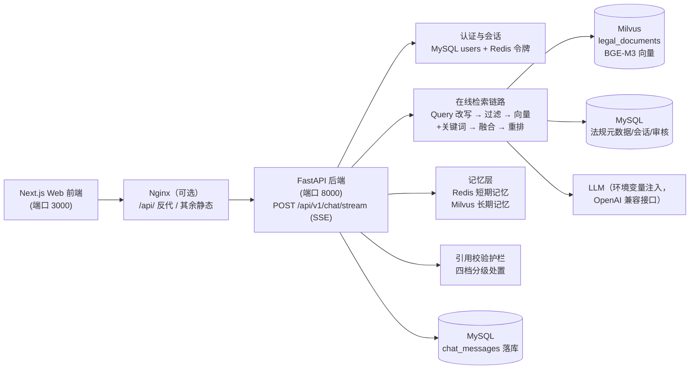

# 劳法智答（LaborLex）· 面向劳动法领域的 RAG 问答系统

面向劳动法领域的 RAG 问答系统（首期为单助手；多角色为二期扩展）。围绕中国大陆劳动法法规与司法解释，
提供带法律引用校验的流式问答（SSE）、混合检索（BM25 + 向量 + 重排）、
短期/长期记忆与管理员审核链路。

## 架构



模型不锁定供应商：LLM / Embedding（BGE-M3, dim=1024）/ Reranker
（BGE-Reranker）经统一适配器 + 环境变量注入；开发用占位配置，生产换真实凭据。

## 环境要求

| 项 | 要求（install.sh 硬门槛） |
| --- | --- |
| 系统 | Ubuntu 22.04+ |
| CPU | ≥ 2 核 |
| 内存 | ≥ 8G（6~8G 会警告：Milvus standalone 3~4G + MySQL/Redis/前后端/系统 ≈ 5~6G） |
| 磁盘 | ≥ 40G（25~40G 会警告；Milvus 镜像 ~1.5G + 数据 <1G） |
| Python | 3.11+（conda 环境 `rag`） |
| Node.js | 前端构建与 `next start` 所需 |

## 快速开始

```bash
# 1. 安装（幂等，可先加 --dry-run 演练；数据服务已存在会自动跳过）
sudo bash scripts/deploy/install.sh --method archive --archive legal-rag.tar.gz

# 2. 启动后端 + 前端（自动做健康检查，失败打印日志尾部 20 行）
bash scripts/deploy/run.sh --env production

# 3. 停止（默认不停 Redis/MySQL/Milvus，需确认才停）
bash scripts/deploy/shutdown.sh
```

验证：

```bash
curl -s http://127.0.0.1:8000/health/ready     # 期望 data.status = ready
cd backend && python -m app.cli.demo_ask "公司解除劳动合同需要提前多久通知？"
```

详细步骤与每步检查项见 `docs/部署文档.md` 与 `scripts/deploy/install.sh`
（脚本结尾会打印"下一步该做什么"）。

## 环境配置

三份按环境取值的配置文件（全占位符，不含真实密钥），加载逻辑按
`ENVIRONMENT` 选择：

| 文件 | ENVIRONMENT | 用途 |
| --- | --- | --- |
| `.env.development` | development | 本机开发（仅「密码重置验证码」回显 `debug_code`，注册验证码任何环境都不回显） |
| `.env.test` | test | 联调/集成测试（独立测试库，密钥假值；`ENVIRONMENT=test` 启用验证码固定码旁路 `000000`，见 `app/auth/service.py`） |
| `.env.production` | production | 生产（必填校验：缺配置拒启动，不静默回退） |

本机私有覆盖：项目根 `.env`（如真实凭据）会在 `.env.<ENVIRONMENT>` 之后加载并
**覆盖同名键**；进程环境变量优先级最高。`.env` 不入交付物。

## 目录结构

```text
backend/                 后端（FastAPI，单文件 ≤300 行约定见 docs/目录与命名约定.md）
├── app/
│   ├── main.py          应用入口：中间件、路由注册、健康检查
│   ├── api/             HTTP 路由层（chat / session / memory / review / legal_search / users_me）
│   ├── auth/            认证与会话令牌（MySQL 用户 + Redis 会话）
│   ├── chat/            问答编排、提示词、引用校验护栏、SSE 流
│   ├── retrieval/       检索：改写/过滤/向量/关键词/融合/重排/上下文组装
│   ├── ingest/          离线处理：解析/清洗/条文切块/元数据
│   ├── crawler/         官方站点采集（白名单/robots/限速）
│   ├── models/          LLM/Embedding 客户端适配
│   ├── db/              实体定义与词表常量
│   ├── core/            配置加载（唯一读取入口）与日志
│   └── cli/             命令行工具（导入/索引/管理员/试答）
├── tests/               pytest 全量单测
evaluation/              评测工具（run_eval 等，项目根下）
frontend/                Next.js Web 前端
scripts/
├── deploy/              install.sh / run.sh / shutdown.sh / nginx.conf
├── loadtest/            JMeter 压测计划 + 首字延迟脚本
├── api-collection/      Postman/ApiPost 接口测试集合
├── e2e/ · eval/ · migrations/   端到端脚本 / 评测辅助 / 数据库迁移登记
data/                    法律数据包（import_mysql 的输入）
docs/                    需求/架构/接口/测试/部署/目录约定/路线图
reports/                 评测与核验报告（JSON + Markdown）
```

## 常用命令

以下命令均以当前代码为准（2026-09-22 核对；Python 用 conda 环境 `rag`）。

| 用途 | 命令 | 位置 |
| --- | --- | --- |
| 全量单测 | `python -m pytest tests -q` | `backend/` |
| 服务自检 | `python scripts/check_services.py` | 项目根 |
| 问答评测 | `python -m evaluation.run_eval --limit 20 --tag <标记>` | 项目根 |
| 导入法律数据 | `python -m app.cli.import_mysql --packages-root ../data` | `backend/` |
| 重建向量索引 | `python -m app.cli.index_legal_documents --recreate-collection --limit 100000 --embedding-batch-size 32` | `backend/` |
| 升级管理员 | `python -m app.cli.create_admin --email <已注册邮箱>` | `backend/` |
| 不起服务试答 | `python -m app.cli.demo_ask "<问题>"` | `backend/` |
| JMeter 压测 | `jmeter -n -t chat_stream_loadtest.jmx -l result.jtl -JTHREADS=50 ...` | `scripts/loadtest/`（用法见该目录 README） |
| 接口测试 | 导入 `legal_rag_collection.json` | `scripts/api-collection/`（用法见该目录 README） |

评测报告落 `reports/`（JSON 机器可读 + Markdown 人可读）。

## 当前基线（2026-09-22，勿凭旧记忆引用）

- 数据：11 部法规 / 485 条条文 / 1627 分块（父 486 + 子 1141）；Milvus 集合 `legal_documents`
- 检索质量（全量 100 题）：Recall@5 0.9647 / MRR@10 0.7583 / 引用正确率 1.0（402 处 0 越界）
- 拒答：准确率 0.9333 / 误拒率 0.1059（阈值 `REFUSAL_MIN_VECTOR_SCORE=0.6304`；召回窗口 20/20/20）
- 单测：`700 passed`

## 已知限制

见 `docs/开发路线图.md` 的「已知限制」节（2026-09-20 记录，均有实测依据），
包括：列举式长条文精排偏后、长期记忆写入到可检索有秒级延迟、外部模型 API
瞬态超时、同义词扩写默认关闭、本机 Milvus 嵌入式 etcd 偶发损坏（生产建议
独立 etcd）、部分法规元数据待人工核对、as_of_date 语义边界等。

## 文档

- [需求规格说明书](./docs/需求文档.md)
- [技术栈与架构文档](./docs/技术栈与架构文档.md)
- [接口文档](./docs/接口文档.md)
- [测试文档](./docs/测试文档.md)
- [部署文档](./docs/部署文档.md)
- [目录与命名约定](./docs/目录与命名约定.md)
- [开发路线图](./docs/开发路线图.md)
