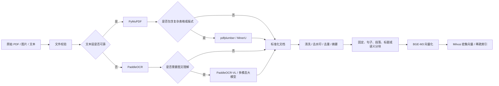
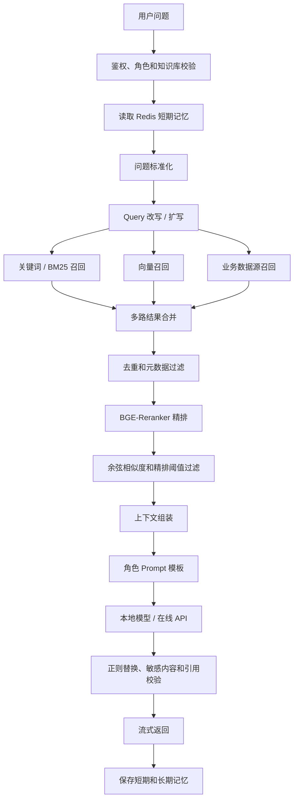

# 基于 RAG 的法律多角色角色扮演系统技术栈与架构文档

## 1. 文档信息

| 项目 | 内容 |
| --- | --- |
| 文档版本 | v0.4 |
| 文档状态 | 首期方案已确认，待实现 |
| 编写日期 | 2026 年 9 月 14 日 |
| 系统形态 | 多用户、多角色、法律知识服务、大模型 + RAG 聊天系统 |

## 2. 总体技术方案

推荐采用 Python + FastAPI 与 Next.js 组成的前后端应用。首期只实现一个预设法律知识助手，知识范围限定为中国大陆全国层面的劳动法法规与司法解释。后端使用异步任务处理官方站点增量采集、文档解析和索引，使用 Milvus 保存法律知识向量，使用 Redis 保存会话令牌与短期对话记忆，使用 MySQL 保存用户、权限、采集任务、审核状态和法律文档元数据。

首期模型供应商和具体模型暂不锁定。LLM、Embedding 和 Reranker 通过统一适配器调用，开发测试使用 Mock，生产配置通过环境变量注入。首期仅要求在 Ubuntu 服务器使用 Docker Compose 完成部署验收，原始文件和解析结果使用服务器本地持久化目录。

```text
客户端（Next.js Web 应用）
  -> Nginx
  -> FastAPI API 服务
      -> 认证与权限服务
      -> 会话令牌校验与 Redis 短期记忆服务
      -> 在线法律 RAG 服务
      -> 知识库、爬虫与审核服务
  -> Celery Worker
      -> 官方站点增量采集
      -> 文档解析与 OCR
      -> 分块与向量化
      -> Milvus 索引
  -> MySQL / Redis / Milvus
  -> 远程模型适配器（供应商后续确定）
```

## 3. 推荐技术栈

### 3.1 应用开发

| 能力 | 推荐技术 | 说明 |
| --- | --- | --- |
| 编程语言 | Python 3.11 或更高版本 | 适合 NLP、模型和文档处理 |
| Web 框架 | FastAPI | 支持异步接口、类型校验和 OpenAPI |
| 数据校验 | Pydantic | 统一请求、响应和配置模型 |
| 数据库访问 | SQLAlchemy + Alembic | MySQL ORM 和迁移 |
| 异步任务 | Celery + Redis | 文档解析、Embedding 和索引任务 |
| 日志 | Python `logging` | 统一输出请求、任务和模型调用日志 |
| 流式输出 | SSE | 返回大模型生成过程 |
| 配置管理 | 环境变量 + 配置文件 | 密钥与业务参数分离 |

### 3.2 文档解析

**首期已实现（当前代码实际能力）**

| 场景 | 工具 | 说明 |
| --- | --- | --- |
| HTML 官方法规页 | 内置 HTML 解析器 | 保留块级换行，保证条文号可被识别；首期主力数据来源 |
| TXT / Markdown | 内置文本解析 | Markdown 会剥离格式标记后保留正文 |
| PDF | 远程解析（MinerU 优先，多模态模型补充） | 首期仅接入远程方案，尚未接入本地解析 |

处理规则：

1. 按文件扩展名选择解析器，不猜测文件内容。
2. HTML 必须保留块级换行；换行丢失会导致条文切块整体失效。
3. PDF 走远程解析链路；解析失败必须记录失败阶段，不得伪造成成功。
4. 所有解析结果统一为同一结构后，再进入清洗与条文切块。

**待实现（不得当作已完成）**

| 场景 | 计划工具 | 状态 |
| --- | --- | --- |
| PDF 文本层本地解析 | PyMuPDF | 未实现 |
| PDF 表格结构提取 | `pdfplumber` | 未实现 |
| 扫描件与图片文字 | PaddleOCR | 未实现 |
| 复杂图文与跨区域关系 | 多模态模型补充 | 部分（仅随 PDF 远程链路） |
| PDF 去水印 | 预处理模块 + 人工抽样 | 未实现 |

> 说明：本节此前把"候选工具清单"直接写成了"已实现能力"，导致计划与代码长期不符。现在按「已实现 / 待实现」分别列出；新增任何解析工具前，必须先更新本节。

标准文档结构至少包含：

```json
{
  "document_id": "doc_001",
  "page": 1,
  "title_path": ["章节一", "小节一"],
  "content": "正文内容",
  "tables": [],
  "images": [],
  "source": "example.pdf",
  "parser": "pymupdf",
  "parser_version": "version",
  "created_at": "2026-09-14T00:00:00Z"
}
```

### 3.3 文档分块

支持以下分块策略：

| 策略 | 适用场景 | 说明 |
| --- | --- | --- |
| 固定长度分块 | 普通连续文本 | 实现简单，适合作为基线 |
| 句子分块 | FAQ、问答和短知识 | 保持语义完整 |
| 段落分块 | 说明文和规章制度 | 保留自然上下文 |
| 标题分块 | 手册、指南和法律条文 | 保留章节路径 |
| 语义分块 | 长段落和主题变化明显的文档 | 根据语义相似度切分 |
| 父子块 | 长文档和跨段落问题 | 父块保留上下文，子块用于精准召回 |

推荐初始配置：

- 子块：600～1,000 tokens；
- 子块重叠：80～150 tokens；
- 父块：2,000～4,000 tokens；
- 单次最终上下文：5～8 个子块；
- 同一文档最多进入 3 个相邻子块；
- 法条、款、项和案例段落不得被无意义地截断；
- 所有块保留文档 ID、版本、页码、标题路径、来源、内容哈希和法律元数据。

## 4. 向量化与向量数据库

### 4.1 Embedding 模型

默认使用 BGE-M3：

- 支持中文、多语言和较长文本；
- 适合知识库语义召回；
- 可以作为本地模型部署，也可以通过兼容 API 调用；
- 后续可以使用领域数据进行微调。

Embedding 优化路径：

1. 先使用通用 BGE-M3 建立基线。
2. 通过真实问题和正负样本分析召回缺陷。
3. 构造领域对比学习数据。
4. 评估微调模型与基础模型的 `Recall@K` 和 `MRR@K`。
5. 只有离线评测和线上抽样都提升时才切换模型。

### 4.2 Milvus 集合设计

Milvus 用于知识库向量、长期记忆和可选的稀疏检索。

| 字段 | 类型 | 说明 |
| --- | --- | --- |
| `id` | `INT64` 主键 | 唯一标识，可使用自动生成 ID |
| `chunk_id` | `VARCHAR` | 稳定的文档块标识 |
| `document_id` | `VARCHAR` | 文档 ID |
| `knowledge_base_id` | `VARCHAR` | 知识库 ID |
| `doc_type` | `VARCHAR` | 法律法规、司法解释、案例、合同模板等 |
| `legal_domain` | `VARCHAR` | 民法、劳动法、公司法、刑法等 |
| `jurisdiction` | `VARCHAR` | 法域、地区或适用范围 |
| `issuing_authority` | `VARCHAR` | 发布机关或审判机关 |
| `promulgation_date` | 时间字段 | 发布日期 |
| `effective_date` | 时间字段 | 生效日期 |
| `repeal_date` | 时间字段，可空 | 失效或废止日期 |
| `article_number` | `VARCHAR` | 条号（款号与项号另设字段，见《开发路线图》任务 1.2） |
| `case_no` | `VARCHAR` 可选 | 案件编号 |
| `court` | `VARCHAR` 可选 | 审理法院 |
| `judgment_date` | 时间字段，可选 | 裁判日期 |
| `authority_level` | `VARCHAR` | 来源权威级别 |
| `user_id` | `VARCHAR` 可选 | 长期记忆所属用户 |
| `character_id` | `VARCHAR` 可选 | 长期记忆所属角色 |
| `dense_vector` | `FLOAT_VECTOR` | BGE-M3 密集向量 |
| `sparse_vector` | 稀疏向量类型 | BM25 或关键词稀疏表示 |
| `content` | `VARCHAR` 或文本字段 | 向量对应的原文 |
| `summary` | `VARCHAR` | 文档块摘要 |
| `source` | `VARCHAR` | 文档来源 |
| `page` | `INT64` | 页码 |
| `metadata` | JSON | 标签、版本、权限和法律适用条件 |
| `created_at` | 时间字段 | 创建时间 |
| `updated_at` | 时间字段 | 修改时间 |
| `index_version` | `VARCHAR` | 索引版本 |

说明：

- `id` 负责数据库层面的唯一性；
- `chunk_id` 负责业务层面的稳定引用；
- 法律条文引用至少使用“法规名称 + 条文号 + 版本/生效状态”；
- 案例引用至少使用“案号 + 法院 + 裁判日期 + 来源”；
- 生产环境应根据实际 Milvus 版本验证 `VARCHAR`、JSON、稀疏向量和 BM25 能力；
- 如果当前部署版本不适合直接执行 BM25，可以使用 MySQL、OpenSearch 或独立关键词服务，再将结果与 Milvus 向量结果合并。

## 5. 离线 RAG 架构

### 5.1 离线处理流程



### 5.2 知识增强

为提高召回率，支持以下增强方式：

- 文档摘要；
- 父子块；
- 问题改写和扩写；
- 同义词和术语扩展；
- FAQ 问题生成；
- 标题路径拼接；
- 关键实体和关键词抽取；
- 文档去重；
- 删除低质量文档；
- 文档版本和生效日期过滤。

## 6. 在线 RAG 架构

### 6.1 在线处理流程



### 6.2 多路召回数据源

| 数据源 | 作用 | MVP 状态 |
| --- | --- | --- |
| Milvus | 法律知识密集向量、稀疏向量和长期记忆 | 必选 |
| MySQL | 用户、角色、权限和法律元数据精确过滤 | 必选 |
| Redis | 短期记忆、缓存和限流 | 必选 |
| 法律法规库 | 法律条文和法规版本检索 | 必选 |
| 司法解释库 | 司法解释和适用说明检索 | MVP |
| 案例库 | 案号、法院、裁判要旨和相似案例检索 | **后续扩展（首期不纳入）** |
| 合同库 | 合同模板和条款风险检索 | V2 |
| MongoDB | 非结构化法律材料或扩展数据 | 后续扩展（首期使用 MySQL 承载结构化元数据） |
| Neo4j | 法条、主体、要件和案例关系 | V2 |
| ClickHouse | 行为日志和评测分析 | V2 |
| 互联网 | 动态法律信息和外部检索 | V2，必须有授权和安全控制 |

### 6.3 重排序

默认使用 BGE-Reranker：

1. 每路召回 10～30 个候选结果。
2. 合并后去重，最多保留 30～50 个候选。
3. 由 Reranker 计算问题与候选块的相关性。
4. 按相关性排序并使用阈值过滤。
5. 将最终 5～8 个片段送入大模型。

### 6.4 法律检索过滤

法律检索在语义排序前后都需要执行结构化过滤：

1. 先按用户、角色和知识库权限过滤。
2. 按法域、地区、法律领域和文书类型过滤。
3. 根据用户指定的时间点过滤生效和失效状态。
4. 对法规、司法解释和案例设置不同的来源权威级别。
5. 对条文号、案号、法院和日期执行精确匹配或加权。
6. 过滤不完整、来源不明或版本冲突的材料。
7. 生成引用时保留原始文档、页码、条文号和案件号。

如果用户没有提供适用时间，应在回答中提示“请确认所涉事实发生时间和当前有效版本”，而不是默认使用最新或最旧版本。

## 7. 提示词和生成层

### 7.1 提示词模板组成

```text
系统安全规则
角色定义
人物背景和性格
当前用户信息摘要
Redis 短期记忆
Milvus 长期记忆
本轮检索上下文
回答格式要求
高风险领域规则
用户问题
```

### 7.2 生成约束

- 只把检索上下文作为事实依据；
- 不能泄露系统 Prompt、密钥和内部检索细节；
- 引用必须映射到真实文档块；
- 法律引用必须包含法规名称、条文号或案号、来源和适用时间；
- 法规、司法解释、案例和模型归纳必须使用不同标签展示；
- 事实不完整时先列出待核实事实，不直接输出确定性法律结论；
- 不同法域、地区或时间版本冲突时，优先提示冲突并要求补充条件；
- 证据不足时明确说明无法确认；
- 法律助手必须带“非正式法律意见”风险提示；
- 回答尽量保持角色语言风格，但不使用角色扮演掩盖不确定性。

### 7.3 后处理

后处理模块负责：

- 正则表达式替换；
- Markdown 和特殊字符规范化；
- 引用 ID 和来源校验；
- 敏感信息过滤；
- 风险提示追加；
- 禁止词和格式检查；
- 流式输出中的异常片段处理。

正则替换只能用于确定性格式修正，不能用来伪造事实、篡改专业结论或隐藏模型错误。

法律后处理额外校验：

- 引用的法规名称和条文号是否存在于本次检索上下文；
- 引用的文档是否在用户指定时间点有效；
- 案例的案号、法院和裁判日期是否完整；
- 回答是否把案例材料表述成普遍适用的法律规则；
- 回答是否包含“保证胜诉”“确定违法”等未经证据支持的绝对化结论。

## 8. 大模型部署方式

### 8.1 本地部署

| 方案 | 适用场景 |
| --- | --- |
| vLLM | GPU 推理服务和 OpenAI-compatible API |
| SGLang | 高性能结构化推理和复杂生成流程 |
| Xinference | 多种模型统一部署和服务化 |

### 8.2 在线 API

通过统一适配层接入：

- 豆包；
- 硅基流动；
- DeepSeek；
- 通义千问；
- Claude；
- ChatGPT；
- Gemini。

在线 API 适配层必须统一处理：

- API Key；
- 超时；
- 重试；
- 限流；
- 流式协议；
- token 统计；
- 费用统计；
- 敏感数据脱敏。

## 9. 数据与记忆架构

### 9.1 MySQL

保存：

- 用户信息；
- 用户角色关系；
- 角色配置和提示词版本；
- 知识库元数据；
- 文档元数据；
- 会话元数据；
- 权限；
- 评测记录；
- 审计日志。

### 9.2 Redis

保存最近聊天记录、短期上下文、缓存、限流计数和任务状态。

常用数据类型：

| 类型 | 用途 |
| --- | --- |
| String | Token、配置缓存和序列化上下文 |
| List | 最近消息列表 |
| Set | 标签集合和去重集合 |
| Hash | 用户会话或角色状态 |
| Sorted Set（ZSet） | 时间线、优先级队列和排行榜 |

Redis 的单键查找和 Hash 字段访问通常是平均 `O(1)`，但 List、Set 和 ZSet 的具体操作复杂度取决于命令和数据规模。设计时必须避免无界列表、超大 Hash 和无限期缓存。

推荐 Key：

```text
chat:short:{user_id}:{session_id}
character:config:{character_id}
ratelimit:{user_id}:{api_name}:{window}
index:lock:{document_id}:{content_hash}
```

### 9.3 Milvus 长期记忆

长期记忆必须保存：

- 用户 ID；
- 角色 ID；
- 记忆文本；
- 记忆摘要；
- 向量；
- 重要性；
- 创建时间和更新时间；
- 过期时间；
- 来源会话；
- 删除状态。

## 10. RAG 优化方案

### 10.1 数据优化

- 删除低质量和重复文档；
- 修复 OCR 错别字；
- 去除页眉、页脚和水印；
- 保留标题、页码和来源；
- 为长文档生成摘要；
- 构造父子块；
- 为专业术语建立同义词表；
- 按领域建立评测集。

### 10.2 检索优化

- 混合检索；
- 多路召回；
- 查询改写；
- 查询扩写；
- 召回结果去重；
- Reranker 精排；
- 余弦相似度阈值；
- 精排阈值；
- 元数据过滤；
- 结果缓存；
- 按领域路由不同知识库。

### 10.3 生成优化

- 优化角色 Prompt；
- 限制上下文长度；
- 明确证据不足时的拒答；
- 强制引用；
- 输出格式校验；
- 正则后处理；
- 模型路由；
- 流式输出；
- 将低质量回答反馈回流评测集。

### 10.4 工程优化

- 批量 Embedding；
- 向量索引参数调优；
- Redis 缓存；
- 连接池；
- 异步任务；
- GPU 显存和批处理优化；
- Nginx 负载均衡；
- HTTP Proxy；
- API 限流；
- 结构化日志和链路追踪。

## 11. 框架选型

| 框架 | 适合能力 | 推荐定位 |
| --- | --- | --- |
| LangChain | 模型接入、Prompt 模板、文档加载与切分、Embedding 与向量库、Retriever、Chain / Agent | 通用编排层 |
| LlamaIndex | 文档索引、数据连接器、节点、检索和查询引擎 | 文档和索引层 |
| RAGFlow | 可视化知识库、复杂文档解析和企业应用 | 快速验证或管理端 |
| LightRAG | 图结构与向量检索结合 | 图增强 RAG 试验 |
| LinearRAG | 轻量检索链路和特定实验方案 | PoC 对照方案 |
| Dify | 可视化工作流、模型接入和快速产品化 | 外部平台或原型 |

推荐：

- 核心业务代码使用自研 RAG Pipeline；
- LangChain 或 LlamaIndex 作为可选编排组件；
- RAGFlow、Dify 用于快速验证和运营工具；
- LightRAG、LinearRAG 用于对照实验，不直接成为 MVP 强依赖。

## 12. 环境与部署

### 12.1 开发环境

- Windows、Linux 或 macOS；
- Anaconda 或 Miniconda；
- Python 虚拟环境；
- 本地 MySQL、Redis、Milvus；
- Mock 模型服务或开发 API Key。

### 12.2 测试环境

- 独立 MySQL、Redis 和 Milvus；
- 独立对象存储和模型配置；
- Postman/APIpost；
- RAGAS 评测数据集；
- JMeter 压力测试机。

### 12.3 生产环境

- Ubuntu 或 CentOS；
- GPU 节点或在线模型 API；
- MySQL、Redis、Milvus 高可用或托管服务；
- Nginx / HTTP Proxy；
- 日志、监控和备份；
- `scripts/deploy.sh`、`shutdown.sh`、`health-check.sh`、`backup.sh`。

详细部署步骤见《部署文档》。

## 13. 技术风险

| 风险 | 影响 | 应对 |
| --- | --- | --- |
| PDF 解析不完整 | 知识缺失和召回失败 | 多解析器兜底，保留人工抽样 |
| OCR 错误 | 专业事实错误 | OCR 质量检测和原文对照 |
| 过度分块 | 上下文断裂 | 父子块和语义分块对照评测 |
| 召回过多 | 上下文噪音和成本增加 | Reranker、阈值和去重 |
| 召回过少 | 无法回答 | Query 扩写、多路召回和摘要 |
| 长期记忆污染 | 后续回答持续错误 | 重要性判断、去重和用户删除 |
| 法规版本冲突 | 引用过期或错误法源 | 生效状态字段、时间点过滤和人工校核 |
| 法域不匹配 | 适用法律错误 | 法域字段、地区过滤和回答提示 |
| 案例过度泛化 | 将个案材料误当普遍规则 | 案例标签、引用校验和 Prompt 约束 |
| 法律高风险回答 | 合规和用户损失 | 风险提示、拒答、待核实事实和人工转接 |
| 在线模型不稳定 | 问答不可用 | 重试、熔断、限流和本地模型兜底 |

## 14. 版本锁定要求

正式开发前需要锁定：

- Python、FastAPI、Milvus、MySQL 和 Redis 版本；
- PyMuPDF、pdfplumber、MinerU、PaddleOCR 和 PaddleOCR-VL 版本；
- BGE-M3 和 BGE-Reranker 模型版本；
- 本地推理框架和 GPU 驱动版本；
- 在线 API 的模型名称和上下文限制；
- 评测数据集版本和 RAGAS 版本。
