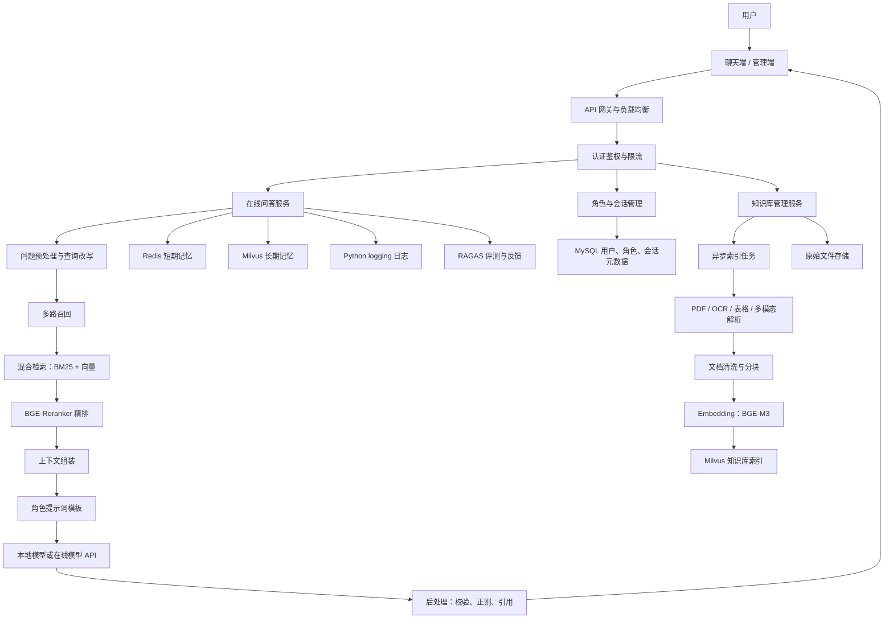
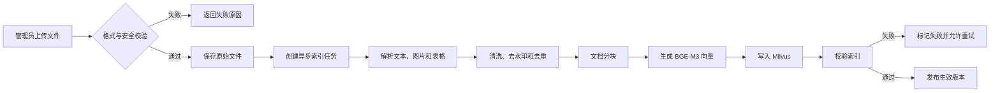
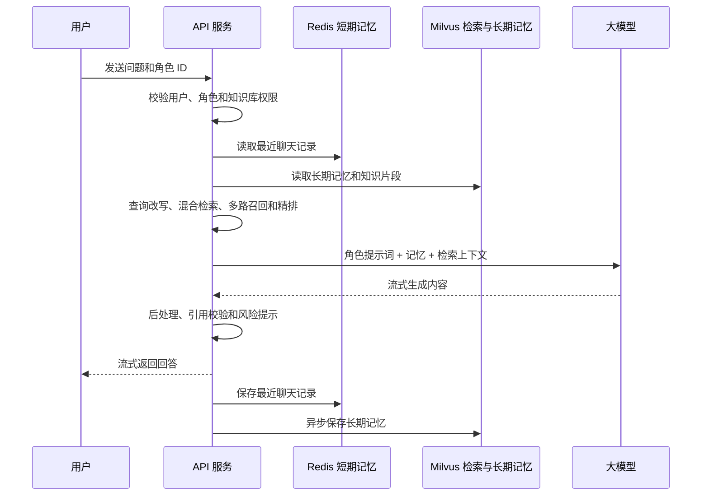
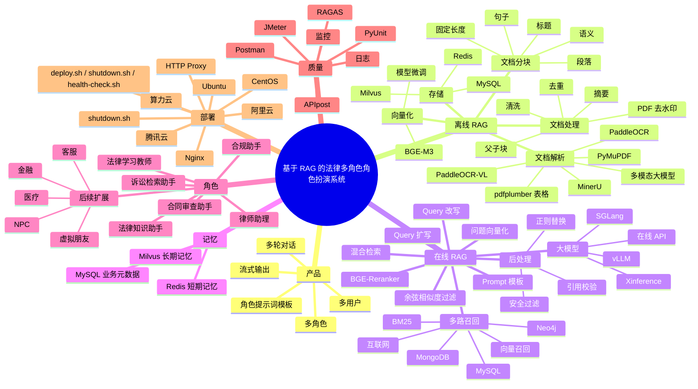

# 基于 RAG 的法律多角色角色扮演系统需求规格说明书

## 1. 文档信息

| 项目 | 内容 |
| --- | --- |
| 文档版本 | v0.4 |
| 文档状态 | 首期范围已确认，待实现 |
| 编写日期 | 2026 年 9 月 14 日 |
| 项目类型 | 大模型 + RAG + 角色扮演聊天机器人 |
| 目标用户 | 普通用户、角色创建者、知识库管理员、系统管理员 |

## 2. 项目概述

### 2.1 项目背景

本项目建设一个以法律知识服务为核心的多用户、多角色角色扮演聊天系统。首期先实现一个法律知识助手和完整的劳动法问答链路，后续再扩展律师助理、合同审查助手、诉讼检索助手等角色。系统通过 RAG（Retrieval-Augmented Generation，检索增强生成）为角色提供法律法规和司法解释，并使用 Redis 保存短期对话记忆、使用 Milvus 保存用户长期记忆。案例材料和其他角色属于后续扩展。

- 符合预设法律知识助手的表达风格；
- 能够使用已审核发布的劳动法法规和司法解释；
- 支持多轮上下文、Redis 短期记忆与 Milvus 长期记忆；
- 支持知识库动态更新；
- 支持远程模型适配器，具体供应商后续确定；
- 对法律咨询场景提供法源引用、时效校验、适用范围说明和风险提示。

### 2.2 项目目标

1. 实现一个可扩展的多用户、多角色法律知识服务平台。
2. 优先实现法律知识助手、律师助理、合同审查助手和诉讼检索助手。
3. 建立面向法律法规、司法解释和案例材料的 RAG 离线处理、在线问答、优化和评测流程。
4. 支持从用户事实描述中提取争议焦点、法律问题和待补充事实。
5. 使用 Redis 管理短期记忆，使用 Milvus 管理法律知识向量与用户长期记忆（独立集合），使用 MySQL 管理业务元数据和法律文档元数据。
6. 通过法源引用、评测、日志和用户反馈持续提升回答质量。

### 2.3 产品定位

本系统不是简单的通用聊天机器人，而是“法律角色设定 + 法律知识库 + 对话记忆 + RAG 检索 + 大模型生成”的组合系统。

每个角色至少包含：

- 角色名称；
- 角色类型；
- 人物背景；
- 人物性格；
- 说话风格；
- 禁止行为；
- 提示词模板；
- 关联知识库；
- 记忆策略；
- 风险等级；
- 可见范围和使用权限。

## 3. 用户角色与使用场景

### 3.1 系统用户角色

| 用户角色 | 主要能力 |
| --- | --- |
| 普通用户 | 注册登录、选择角色、发起聊天、查看历史、管理自己的记忆 |
| 角色创建者 | 创建或编辑自定义角色、配置提示词和知识库 |
| 知识库管理员 | 上传文档、维护数据源、查看索引状态、触发重新索引 |
| 系统管理员 | 管理用户、角色、权限、模型、限流、日志和部署配置 |

### 3.2 法律角色类型

首期只提供一个系统预设角色：法律知识助手。该角色用于解释法律概念、法规条文和程序要求，不代表执业律师。

律师助理、合同审查助手、诉讼检索助手、合规助手和法律学习教师列为后续扩展，不进入首期验收。

### 3.3 首期法律范围

- 法域限定为中国大陆全国层面；
- 专题限定为劳动法；
- 首期法源为全国性法律法规和司法解释；
- 暂不纳入指导性案例、普通裁判文书和合同模板；
- 法律材料通过官方站点白名单采集，管理员手动触发采集任务；
- 采集结果必须经过管理员人工审核，审核通过后才能发布为生效版本；
- 爬虫必须遵守站点服务条款、`robots.txt`、访问频率限制、版权和个人信息保护要求，不得绕过登录或验证码。

### 3.4 首期产品形态与部署

- 产品形态为浏览器 Web 应用；
- 前端采用 Next.js + TypeScript，生产环境使用 standalone 构建；
- 后端采用 FastAPI；
- 首期仅要求在 Ubuntu 服务器成功部署和验收；
- 使用 Docker Compose 统一编排 Next.js、FastAPI、Worker、MySQL、Redis、Milvus 和 Nginx；
- 原始法律文档、解析结果、日志和备份使用 Ubuntu 服务器本地持久化目录。

### 3.5 首期认证与权限

- 仅允许 `@qq.com` 和 `@foxmail.com` 邮箱注册；
- 使用 QQ SMTP 发送注册和密码重置验证码；
- 注册采用「邮箱验证码 + 密码」，登录采用邮箱和密码；
- 普通用户只能使用预设法律知识助手并管理自己的会话；
- 管理员负责法律材料采集、审核、发布、知识库和索引任务管理；
- 首次部署通过环境变量初始化管理员账号。

### 3.6 记忆策略

系统同时启用两级记忆：

**短期记忆（Redis）**：保存当前会话最近若干轮对话，带过期时间，用于多轮追问与指代补全。

**长期记忆（Milvus，独立集合）**：跨会话保留用户的关键事实与偏好，用于个性化回答。要点：

- 独立集合存储，**不与法律知识库集合混用**，从存储层杜绝跨用户数据泄漏；
- 保存字段：用户 ID、角色 ID、记忆文本、记忆摘要、向量、重要性、创建时间、更新时间、过期时间、来源会话、删除状态；
- 写入时机：一次问答结束后写入，写入前先摘要并去重（相似记忆更新而非新增）；
- 读取时机：检索法律知识之前，按用户 ID 过滤取出相关记忆并注入提示词；
- 用户可关闭长期记忆（关闭后既不写入也不读取），可删除单条记忆，删除为软删除。

> 范围说明：长期记忆原计划为后续扩展，经项目决策提前实现，已纳入本期功能与测试范围。

### 3.7 首期规模基线

- 约 20 个并发问答用户；
- 法律文档不超过 1 万份；
- 单文件不超过 50 MB；
- 问答首 Token `p95` 不超过 3 秒；
- 完整回答 `p95` 不超过 10 秒；
- 检索阶段 `p95` 不超过 2 秒；
- 健康检查 `p95` 不超过 200 ms；
- 错误率不超过 1%。

## 4. 产品范围

### 4.1 首期 MVP 范围

- QQ 邮箱验证码注册、邮箱密码登录和密码重置；
- 普通用户与管理员两级权限；
- 一个预设法律知识助手；
- 中国大陆全国层面的劳动法法规与司法解释知识库；
- 官方站点白名单手动采集、增量抓取和内容哈希去重；
- 管理员人工审核后发布法律文档；
- PDF、扫描 PDF、图片、Markdown 和 TXT 文件入库；
- 文档解析（HTML / TXT / Markdown / PDF 远程解析）、条文切块、向量化和入库；
- OCR 与表格结构抽取列为后续扩展（首期不实现，见《开发路线图》）；
- Milvus 向量检索；
- BM25 + 向量的混合检索；
- 查询改写、查询扩写和 Redis 短期记忆；
- 大模型流式输出、引用校验和安全后处理；
- RAGAS 离线评测、接口测试和 JMeter 性能测试；
- Ubuntu 服务器上的 Docker Compose 部署和脚本验收。

### 4.2 后续扩展范围

- 律师助理、合同审查助手、诉讼检索助手、合规助手和法律学习教师；
- 指导性案例、普通裁判文书和合同模板；
- 用户自定义角色和知识库；
- 多模型供应商路由、本地模型和模型故障切换；
- 多云部署和自动定时采集。

### 4.3 暂不纳入 MVP

- 自动出具具有执业效力的法律意见；
- 自动代替律师作出诉讼策略、案件胜诉判断或法律责任最终结论；
- 自动签署合同、提交诉讼材料或操作外部政务/司法系统；
- 自动修改或发布法律法规原文；
- 以角色身份向外部系统自动发送消息；
- 真实社交平台自动化运营；
- 视频、语音和数字人形象；
- 未经授权的互联网数据抓取；
- 未经许可的个人信息和受版权保护数据批量入库。

## 5. 总体项目架构

### 5.1 逻辑架构



### 5.2 离线处理架构

> 说明：本节描述的是**完整目标架构**（含 OCR、多模态解析等）。首期实际实现范围以 4.1 节为准，两者不一致时以 4.1 为准。

```text
原始文档
  -> 文件格式和安全校验
  -> PDF 文本层判断
  -> PyMuPDF 文本提取
  -> pdfplumber 表格提取
  -> MinerU 复杂版式解析
  -> PaddleOCR / PaddleOCR-VL 扫描文字识别
  -> 多模态大模型补充理解
  -> 去水印、去重、清洗和结构恢复
  -> 固定长度 / 句子 / 段落 / 标题 / 语义分块
  -> BGE-M3 向量化
  -> Milvus 密集向量和 BM25 稀疏索引
  -> 索引版本发布
```

### 5.3 在线问答架构

```text
用户问题
  -> 身份、角色和知识库权限校验
  -> 多轮上下文拼接
  -> Query 改写 / 扩写
  -> 关键词召回
  -> 向量召回
  -> 其他数据源召回
  -> 合并、去重和过滤
  -> BGE-Reranker 精排
  -> 余弦相似度和精排分数阈值过滤
  -> 角色提示词模板组装
  -> 调用大模型
  -> 正则替换、敏感内容处理和引用校验
  -> 流式返回用户
  -> 记录短期记忆、长期记忆和日志
```

### 5.4 架构约束

1. 在线问答与离线索引分离，文档解析不能阻塞在线聊天。
2. 权限过滤必须在检索前生效，未授权内容不能进入模型上下文。
3. 回答来源必须来自本次实际检索结果，并能定位到文档和文档块。
4. 低相关性问题必须拒答或说明无法确认，不能强行编造。
5. 文档、分块、向量和提示词配置必须支持版本管理。
6. 异步任务必须支持幂等、重试、失败记录和状态查询。
7. 模型、向量数据库、OCR 和对象存储不能与业务逻辑强耦合。
8. 上传、索引、检索、模型调用和反馈必须使用关联 ID 追踪。

## 6. 业务流程

### 6.1 文档入库流程



### 6.2 角色聊天流程



### 6.3 知识库动态更新流程

1. 管理员上传新文件或更新已有文件。
2. 系统根据内容哈希判断是否发生变化。
3. 新版本进入异步索引任务。
4. 新索引完成并通过校验后切换为生效版本。
5. 旧版本进入保留或清理状态。
6. 在线问答只读取当前生效版本。

### 6.4 多轮记忆流程

1. 用户发送当前问题。
2. 系统从 Redis 读取最近聊天记录。
3. 系统从 Milvus 检索相关长期记忆。
4. 系统将问题、短期记忆和长期记忆交给查询改写模块。
5. 系统执行知识库检索并生成回答。
6. 系统将最近消息写回 Redis。
7. 系统异步摘要重要事实，经质量检查后写入 Milvus。

## 7. 功能需求

### 7.1 用户与权限

| 编号 | 功能 | 优先级 | 验收标准 |
| --- | --- | --- | --- |
| FR-USER-001 | 用户注册、登录和退出 | P0 | 用户可以完成认证，未认证请求被拒绝 |
| FR-USER-002 | 多用户数据隔离 | P0 | 用户不能访问其他用户的会话、角色私有配置和记忆 |
| FR-USER-003 | 角色权限管理 | P0 | 角色创建者和管理员的权限边界清晰 |
| FR-USER-004 | 知识库权限管理 | P0 | 检索前完成知识库和文档权限过滤 |
| FR-USER-005 | 操作审计 | P1 | 上传、删除、更新和权限变更都有日志 |

### 7.2 角色管理

| 编号 | 功能 | 优先级 | 验收标准 |
| --- | --- | --- | --- |
| FR-ROLE-001 | 创建自定义角色 | P0 | 可以配置名称、类型、性格、背景和提示词 |
| FR-ROLE-002 | 绑定角色知识库 | P0 | 角色只能检索已绑定且有权限的知识库 |
| FR-ROLE-003 | 配置表达风格 | P0 | 回答体现语气、称谓、语言和禁用表达 |
| FR-ROLE-004 | 配置角色安全规则 | P0 | 高风险角色包含风险提示和拒答规则 |
| FR-ROLE-005 | 角色版本管理 | P1 | 提示词、知识库和模型变更可追踪 |
| FR-ROLE-006 | 角色公开和私有设置 | P1 | 私有角色不能被无权限用户发现和使用 |

### 7.3 角色提示词模板

角色模板必须至少包含：

```text
你是：{角色名称}
角色类型：{角色类型}
人物背景：{人物背景}
人物性格：{性格描述}
表达风格：{语气、称谓、语言偏好}
当前用户：{用户信息摘要}
短期记忆：{最近对话}
长期记忆：{相关长期记忆}
知识库上下文：{检索结果}
回答规则：{事实、引用、拒答和安全规则}
当前问题：{用户问题}
```

模板规则：

1. 系统安全规则优先于角色设定。
2. 角色设定优先于普通回答风格。
3. 检索知识只能作为事实依据，不能覆盖系统安全规则。
4. 知识库没有证据时，不得通过角色扮演编造事实。
5. 用户输入、文档内容和记忆内容都必须被视为不可信数据，不能改变系统指令。

### 7.4 知识库和文档

| 编号 | 功能 | 优先级 | 验收标准 |
| --- | --- | --- | --- |
| FR-KB-001 | 创建、编辑和删除知识库 | P0 | 知识库状态和权限可管理 |
| FR-KB-002 | 上传 PDF、图片、Markdown 和 TXT | P0 | 合法文件进入索引任务 |
| FR-KB-003 | 支持 PDF 文本解析（远程链路） | P0 | PDF 正文可被解析并可被检索 |
| FR-KB-003b | 支持 OCR 与表格结构抽取 | P1 | **后续扩展**，首期不实现 |
| FR-KB-004 | 文档去水印、清洗和去重 | P1 | 常见页眉、页脚和重复内容不污染索引 |
| FR-KB-005 | 文档分块策略可配置 | P0 | 支持固定长度、句子、段落、标题和语义分块 |
| FR-KB-006 | 文档动态更新和重建索引 | P0 | 新版本校验通过后才生效 |
| FR-KB-007 | 查看索引任务状态 | P0 | 支持成功、失败、重试和错误原因 |

### 7.5 在线聊天

| 编号 | 功能 | 优先级 | 验收标准 |
| --- | --- | --- | --- |
| FR-CHAT-001 | 用户选择角色发起聊天 | P0 | 角色设置正确加载 |
| FR-CHAT-002 | 支持多轮对话 | P0 | 后续问题可以使用前文实体和上下文 |
| FR-CHAT-003 | 支持流式输出 | P0 | 用户可以逐步看到模型回答 |
| FR-CHAT-004 | 支持引用知识来源 | P0 | 引用来源来自本次实际检索结果 |
| FR-CHAT-005 | 支持回答后处理 | P0 | 完成正则替换、敏感信息处理和格式校验 |
| FR-CHAT-006 | 支持无依据拒答 | P0 | 低相关性问题不生成确定性结论 |
| FR-CHAT-007 | 支持会话创建、查询和删除 | P1 | 用户只能操作自己的会话 |
| FR-CHAT-008 | 支持回答反馈 | P1 | 反馈可关联到问题、角色、模型和检索版本 |

### 7.6 法律业务能力

| 编号 | 功能 | 优先级 | 验收标准 |
| --- | --- | --- | --- |
| FR-LAW-001 | 法律问题识别 | P0 | 能够识别咨询主题、法律领域和问题类型 |
| FR-LAW-002 | 事实要素提取 | P0 | 能够从用户描述中提取时间、主体、行为、金额和证据等要素 |
| FR-LAW-003 | 争议焦点提取 | P0 | 能够输出待确认的争议焦点，而不是直接下最终结论 |
| FR-LAW-004 | 法条和司法解释检索 | P0 | 返回条文内容、条文号、法规名称、来源和适用时间 |
| FR-LAW-005 | 案例材料检索 | P1 | 返回案件基本信息、裁判要点、来源和与当前事实的相似点 |
| FR-LAW-006 | 合同条款分析 | P1 | 能够定位原文条款、提示风险点和列出待人工确认事项 |
| FR-LAW-007 | 法律引用生成 | P0 | 回答中的法条或案例引用可追溯到实际检索片段 |
| FR-LAW-008 | 法律时效和适用范围提示 | P0 | 对生效日期、失效日期、法域和适用主体进行提示 |
| FR-LAW-009 | 法律材料清单生成 | P1 | 根据问题输出需要补充的事实、证据和文书清单 |

### 7.7 记忆管理

| 记忆类型 | 存储位置 | 内容 | 生命周期 |
| --- | --- | --- | --- |
| 短期记忆 | Redis | 最近若干轮对话、当前上下文摘要 | 按会话和 TTL 管理 |
| 长期记忆 | Milvus | 用户偏好、事实记忆、重要事件的向量和原文 | 用户主动删除或按策略清理 |
| 业务元数据 | MySQL | 用户、角色、会话、记忆状态和权限 | 持久化 |

长期记忆写入前必须经过摘要、去重、敏感信息识别和重要性判断，不能把所有聊天原文无条件写入长期记忆。

### 7.8 评测与运维

- 管理员可以触发 RAGAS 离线评测。
- 系统记录召回数量、分数、精排结果和模型调用信息。
- 系统使用 Python `logging` 输出结构化日志。
- 系统提供健康检查、就绪检查和依赖状态检查。
- 系统支持限流、超时、重试和熔断。
- 系统支持开发、测试和生产环境独立配置。

## 8. 业务规则

### 8.1 角色规则

1. 一个用户可以拥有多个角色。
2. 一个角色可以绑定一个或多个知识库。
3. 角色的知识库、提示词和模型配置必须版本化。
4. 角色回答应优先体现角色人格，但不得牺牲事实性和安全性。
5. 角色名称、提示词和背景内容不得包含绕过系统安全规则的指令。

### 8.2 检索规则

1. 权限过滤必须在检索前完成。
2. 问题默认执行关键词召回和向量召回。
3. 不同数据源的结果需要统一字段后合并。
4. 合并结果必须去重，再交给 BGE-Reranker 精排。
5. 余弦相似度和精排分数低于阈值的内容不能进入最终上下文。
6. 最终上下文应限制片段数量、总 token 数和同文档片段数量。

### 8.3 记忆规则

1. Redis 只保存短期上下文，不作为长期事实来源。
2. 长期记忆写入 Milvus 前需要摘要和质量判断。
3. 用户可以查看、删除和关闭长期记忆。
4. 记忆必须绑定用户和角色，不能跨用户共享。
5. 用户明确要求忘记的信息必须从短期和长期记忆中清理。

### 8.4 高风险领域规则

- 法律角色必须提示：内容仅供法律信息参考，不能替代律师出具的正式法律意见。
- 法律角色不得声称已经代理案件、已经审查全部证据或能够保证诉讼结果。
- 涉及人身安全、刑事风险、重大财产损失、临近期限或正在进行的诉讼时，应优先提示尽快咨询执业律师。
- 法律角色应区分“法规原文”“司法解释”“案例材料”“模型归纳”和“待核实事实”。
- 当用户要求规避法律、伪造证据、隐瞒事实或实施违法行为时，应拒绝提供操作性帮助。
- 其他领域角色属于后续扩展，接入时必须单独设计相应的风险规则。

### 8.5 数据规则

- 首批法律知识库包括拟纳入的 311 件法律条文、司法解释和经授权的案例材料，具体清单、版本和范围由数据负责人确认。
- 法律文档必须记录法规名称、文书类型、发布机关、发布日期、生效日期、失效日期、法域、适用范围和来源地址。
- 法律条文必须记录条文号、章节路径和原文，不得只保存模型摘要。
- 案例材料必须记录案号、法院、裁判日期、审级、争议焦点、裁判要旨和来源。
- 中国裁判文书网内容必须遵守网站使用规则、版权和个人信息保护要求。
- GitHub、Hugging Face、ModelScope 数据：必须记录仓库地址、许可证、版本和下载时间。
- 外部数据入库前必须经过授权、清洗、去重和敏感信息检查。

## 9. 非功能需求

### 9.1 性能

| 指标 | MVP 目标 |
| --- | --- |
| 问答首 token | `p95` 不超过 3 秒 |
| 普通问答完整响应 | `p95` 不超过 10 秒 |
| 检索耗时 | `p95` 不超过 2 秒 |
| 健康检查 | `p95` 不超过 200 ms |
| 并发验证 | 至少完成 20 并发问答压力测试 |
| 索引任务 | 支持异步执行，不阻塞在线聊天 |

### 9.2 安全

- 所有接口必须鉴权。
- 多用户、多角色和知识库必须隔离。
- 禁止日志记录 Token、API Key 和完整敏感内容。
- 上传文件需要校验扩展名、MIME 类型、大小和内容。
- 防护 Prompt Injection、越权检索、数据外泄和恶意文件。

### 9.3 可维护性

- LLM、Embedding、Reranker、OCR 和向量数据库必须通过适配器隔离。
- 本地模型与在线 API 使用同一套调用接口。
- 分块、检索、提示词和后处理参数必须可配置。
- 所有索引和评测结果记录版本信息。

## 10. 数据实体

| 实体 | 关键字段 |
| --- | --- |
| 用户 | `id`、`username`、`role`、`status`、`created_at` |
| 角色 | `id`、`name`、`type`、`personality`、`prompt_template`、`risk_level` |
| 知识库 | `id`、`name`、`description`、`owner_id`、`status` |
| 法律文档 | `id`、`knowledge_base_id`、`doc_type`、`title`、`source`、`hash`、`version`、`status` |
| 法律效力信息 | `issuing_authority`、`promulgation_date`、`effective_date`、`repeal_date`、`jurisdiction`、`applicable_scope` |
| 法条 | `article_number`、`paragraph_number`、`item_number`、`chapter_path`、`article_text`、`law_version_id` |
| 案例材料 | `case_no`、`court`、`trial_level`、`judgment_date`、`facts`、`issues`、`holding` |
| 文档块 | `chunk_key`、`document_version_id`、`content`、`summary`、`page`、`article_number` |
| Milvus 向量记录 | `id`、`chunk_id`、`dense_vector`、`sparse_vector`、`content`、`source`、`created_at`、`updated_at` |
| 会话 | `id`、`user_id`、`character_id`、`title`、`created_at` |
| 消息 | `id`、`session_id`、`role`、`content`、`citations`、`model` |
| 记忆 | `id`、`user_id`、`character_id`、`content`、`importance`、`status` |
| 评测记录 | `id`、`dataset_version`、`model_version`、`metrics`、`created_at` |

## 11. 验收标准

### 11.1 功能验收

- [ ] 用户可以注册登录，并使用预设的法律知识助手进行对话。
- [ ] 管理员可以创建知识库并上传 PDF。
- [ ] 文本 PDF、扫描 PDF、表格 PDF 至少各有一类样本成功入库。
- [ ] 文档经过解析、分块、BGE-M3 向量化后可被检索。
- [ ] 在线链路完成问题向量化、混合检索、多路召回和精排。
- [ ] 回答通过提示词模板生成，并完成后处理和引用校验。
- [ ] 法律回答能够返回法规名称、条文号、版本、生效状态和来源。
- [ ] 过期、失效或法域不匹配的法律文档不会直接作为当前有效依据。
- [ ] Redis 保存短期记忆；Milvus 长期记忆不属于首期验收范围。
- [ ] 知识库更新后新版本可以生效，失败版本不会覆盖旧版本。
- [ ] 不同用户之间的数据互不可见（首期为普通用户与管理员两级）。

### 11.2 质量验收

- [x] 评测集可重复运行（自研运行器 `evaluation/run_eval.py`，一条命令出 JSON + Markdown 报告；
      未引入 RAGAS，理由是避免重依赖，指标口径与判定标准固化在 `data/evaluation/_schema.md`）。
- [x] `Recall@5`、`MRR@10`、`Faithfulness` 和引用正确率达到评测基线：
      85 条评测集实测 —— Recall@5 **0.9429**、MRR@10 **0.7711**、引用正确率 **1.0000**、
      拒答准确率 **0.9333**（误拒率 0.10）、Faithfulness 均值 **0.9841**；
      拒答阈值 `REFUSAL_MIN_VECTOR_SCORE=0.6304`（用评测集校准，非拍脑袋）。
- [ ] 接口按《接口文档》的路径、请求体与响应结构逐条验证通过。
- [ ] 模块测试通过（一个模块一个测试脚本，见《目录与命名约定》第四节）。
- [ ] Ubuntu 至少完成一次部署验证。
- [ ] 法律知识助手的免责声明、拒答规则与绝对化表述拦截测试通过。
- [ ] JMeter 压力测试在部署验证完成后执行，达到约定的 QPS 与响应时间目标。

## 12. 项目思维导图



## 13. 项目交付物

| 交付物 | 文件或内容 |
| --- | --- |
| 需求规格说明书 | `需求文档.md` |
| 技术栈与架构文档 | `技术栈与架构文档.md` |
| 测试文档 | `测试文档.md` |
| 接口文档 | `接口文档.md` |
| 部署文档 | `部署文档.md` |
| README | 项目根目录 `README.md` |
| 功能代码 | 实现阶段交付 |
| 测试代码和测试结果 | 实现和测试阶段交付 |
| 安装、启动和停止脚本 | 部署实现阶段交付 |

## 14. 已确认项与后续决策

### 14.1 已确认项

首期角色、劳动法法域、法源类型、官方站点采集、人工审核、QQ 邮箱认证、普通用户与管理员权限、Next.js Web 端、Ubuntu Docker Compose 部署、Redis 短期记忆和 MVP 规模均已确认，具体规则见第 3 节和第 4 节。

### 14.2 后续决策项

1. 官方站点白名单的具体 URL 和采集字段；
2. 远程 LLM、Embedding 和 Reranker 的供应商、模型名和配额；
3. 法规与司法解释的首批正式清单及数据负责人；
4. 长期记忆、案例材料、其他法律角色和多云部署的启动时间；
5. 生产环境域名、HTTPS 证书、备份周期和监控告警策略。
