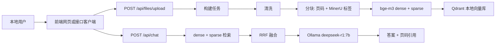

# RAG PDF 问答系统 v1 MVP 实现计划

> **面向 AI 代理的工作者：** 必需子技能：使用 superpowers:subagent-driven-development（推荐）或 superpowers:executing-plans 逐任务实现此计划。步骤使用复选框（`- [ ]`）语法来跟踪进度。

**目标：** 构建本地可运行的 RAG PDF 问答 MVP：用户上传 PDF，后端执行真实清洗 → 分块 → 向量化 → 入库流程，向量库可查看 MinerU 标签类别，问答默认全库检索并返回页码引用。

**架构：** FastAPI 提供本地 API；构建链路由任务服务异步驱动 MinerU 解析、清洗、分块、bge-m3 dense+sparse 嵌入、Qdrant 入库；问答链路使用 Qdrant dense+sparse 检索与 RRF 融合，再通过 Ollama 生成带引用答案。

**技术栈：** Python 3.12、FastAPI、Pydantic、LangChain、langchain-ollama、Qdrant 本地模式、FlagEmbedding 或 sentence-transformers、本地 MinerU、pytest、httpx。

---

## 文件结构

### 根目录

- 创建：`requirements.txt` — 精确锁定运行与测试依赖版本。
- 创建：`.env.example` — 提供配置项占位，不包含真实密钥。
- 创建：`README.md` — 记录本地运行、入库和问答流程。
- 修改：`.gitignore` — 排除 `.env`、`data/qdrant/`、`eval/results/` 等本地产物。

### 后端 `backend/`

- 创建：`backend/app/__init__.py` — Python 包标识。
- 创建：`backend/app/main.py` — FastAPI 应用入口与路由注册。
- 创建：`backend/app/config.py` — 配置加载与路径约束。
- 创建：`backend/app/models.py` — `Document`、`BuildTask`、`Chunk`、`Citation`、请求响应模型。
- 创建：`backend/app/storage.py` — 本地 JSON 状态存储，记录文档、任务、chunk 元数据。
- 创建：`backend/app/files.py` — PDF 上传保存与文件校验。
- 创建：`backend/app/mineru.py` — MinerU 解析适配器，输出带页码和标签的结构化块。
- 创建：`backend/app/chunking.py` — 清洗与分块逻辑，保留页码和 MinerU 标签。
- 创建：`backend/app/embeddings.py` — 本地 bge-m3 dense+sparse 嵌入适配器。
- 创建：`backend/app/vector_store.py` — Qdrant collection 初始化、入库、检索和向量库查看。
- 创建：`backend/app/pipeline.py` — 构建任务状态流转与真实流水线编排。
- 创建：`backend/app/qa.py` — 检索问答、引用构造、兜底规则。
- 创建：`backend/app/routes_files.py` — 上传接口。
- 创建：`backend/app/routes_tasks.py` — 任务启动和进度查询接口。
- 创建：`backend/app/routes_documents.py` — 文档、向量库、类别查看接口。
- 创建：`backend/app/routes_chat.py` — 问答接口。

### 测试 `backend/tests/`

- 创建：`backend/tests/conftest.py` — 测试目录和伪适配器 fixture。
- 创建：`backend/tests/test_config.py` — 配置和路径边界测试。
- 创建：`backend/tests/test_models.py` — 模型字段与页码约束测试。
- 创建：`backend/tests/test_storage.py` — JSON 状态存储测试。
- 创建：`backend/tests/test_files.py` — PDF 上传保存测试。
- 创建：`backend/tests/test_chunking.py` — 清洗、分块、标签保留测试。
- 创建：`backend/tests/test_vector_store.py` — Qdrant 适配层测试。
- 创建：`backend/tests/test_pipeline.py` — 构建任务状态流转测试。
- 创建：`backend/tests/test_qa.py` — 问答兜底和引用测试。
- 创建：`backend/tests/test_api.py` — FastAPI 接口集成测试。

### 文档与数据

- 创建：`docs/需求说明.md` — v1 MVP 需求说明，作为唯一需求文档。
- 创建：`docs/版本迭代.md` — v1 版本记录。
- 创建：`docs/架构/架构图-v1.md` — v1 Mermaid 架构图。
- 创建：`eval/sets/README.md` — 评测集目录说明，不编造数据。
- 创建：`eval/baseline/README.md` — v1 基线结果目录说明。
- 创建：`data/README.md` — 原始 PDF 放置说明。

---

## 实现任务

### 任务 1：项目基础文件

**文件：**
- 创建：`requirements.txt`
- 创建：`.env.example`
- 修改：`.gitignore`
- 创建：`README.md`
- 测试：不需要 Python 测试，使用文件存在性验证。

- [ ] **步骤 1：写入依赖清单**

写入 `requirements.txt`：

```txt
fastapi==0.115.6
uvicorn==0.34.0
python-multipart==0.0.20
pydantic==2.10.5
pydantic-settings==2.7.1
qdrant-client==1.12.1
langchain==0.3.14
langchain-core==0.3.29
langchain-ollama==0.2.2
FlagEmbedding==1.3.3
sentence-transformers==3.3.1
pytest==8.3.4
pytest-asyncio==0.25.2
httpx==0.28.1
```

- [ ] **步骤 2：写入配置模板**

写入 `.env.example`：

```env
APP_HOST=127.0.0.1
APP_PORT=8000
DATA_DIR=data
QDRANT_PATH=data/qdrant
QDRANT_COLLECTION=rag_documents
BGE_M3_MODEL_PATH=D:\八维学习\bge-m3
OLLAMA_BASE_URL=http://localhost:11434
OLLAMA_MODEL=deepseek-r1:7b
MAX_UPLOAD_MB=100
TOP_K=6
MIN_RETRIEVAL_SCORE=0.2
```

- [ ] **步骤 3：更新忽略规则**

写入 `.gitignore`，保留 `.specify` 不忽略：

```gitignore
.env
.venv/
__pycache__/
.pytest_cache/
*.pyc
.DS_Store
Thumbs.db
data/*.pdf
data/qdrant/
eval/results/
eval/baseline/*.json
```

- [ ] **步骤 4：写入 README**

写入 `README.md`：

```markdown
# RAG 知识问答系统

本项目是本地 RAG PDF 问答系统 MVP。用户上传 PDF 后，后端执行清洗、分块、向量化、入库，再通过问答接口返回带页码引用的答案。

## 本地运行

1. 复制 `.env.example` 为 `.env` 并确认本地模型路径。
2. 安装依赖：`pip install -r requirements.txt`
3. 启动 Ollama 并确认模型 `deepseek-r1:7b` 可用。
4. 启动 API：`python backend/app/main.py`
5. 打开接口文档：`http://127.0.0.1:8000/docs`

## 主要接口

- `POST /api/files/upload`
- `POST /api/tasks/{task_id}/start`
- `GET /api/tasks/{task_id}`
- `GET /api/documents`
- `GET /api/vector-store`
- `GET /api/categories`
- `POST /api/chat`
```

- [ ] **步骤 5：运行验证**

运行：`Get-Item requirements.txt, .env.example, README.md, .gitignore`

预期：4 个文件均存在。

- [ ] **步骤 6：Commit**

```bash
git add requirements.txt .env.example README.md .gitignore
git commit -m "chore: initialize rag mvp project files"
```

若当前目录未初始化 git，记录该命令未执行，继续下一任务。

### 任务 2：配置加载与路径边界

**文件：**
- 创建：`backend/app/__init__.py`
- 创建：`backend/app/config.py`
- 测试：`backend/tests/test_config.py`

- [ ] **步骤 1：编写失败测试**

写入 `backend/tests/test_config.py`：

```python
from pathlib import Path

import pytest

from backend.app.config import AppSettings, ensure_project_path


def test_settings_defaults_use_constitution_paths():
    settings = AppSettings()

    assert settings.data_dir == Path("data")
    assert settings.qdrant_path == Path("data/qdrant")
    assert settings.qdrant_collection == "rag_documents"
    assert settings.ollama_model == "deepseek-r1:7b"


def test_ensure_project_path_allows_data_dir(tmp_path):
    root = tmp_path
    target = root / "data" / "file.pdf"

    assert ensure_project_path(root, target) == target.resolve()


def test_ensure_project_path_rejects_outside_path(tmp_path):
    root = tmp_path / "project"
    root.mkdir()
    outside = tmp_path / "outside.pdf"

    with pytest.raises(ValueError, match="项目目录之外"):
        ensure_project_path(root, outside)
```

- [ ] **步骤 2：运行测试验证失败**

运行：`pytest backend/tests/test_config.py -v`

预期：FAIL，报错包含 `No module named 'backend.app.config'` 或 `cannot import name`。

- [ ] **步骤 3：实现配置模块**

写入 `backend/app/__init__.py`：

```python
"""RAG PDF 问答系统后端包。"""
```

写入 `backend/app/config.py`：

```python
from pathlib import Path

from pydantic import Field
from pydantic_settings import BaseSettings, SettingsConfigDict


class AppSettings(BaseSettings):
    """应用配置。"""

    model_config = SettingsConfigDict(env_file=".env", env_file_encoding="utf-8")

    app_host: str = "127.0.0.1"
    app_port: int = 8000
    data_dir: Path = Path("data")
    qdrant_path: Path = Path("data/qdrant")
    qdrant_collection: str = "rag_documents"
    bge_m3_model_path: Path = Path(r"D:\八维学习\bge-m3")
    ollama_base_url: str = "http://localhost:11434"
    ollama_model: str = "deepseek-r1:7b"
    max_upload_mb: int = Field(default=100, gt=0)
    top_k: int = Field(default=6, gt=0)
    min_retrieval_score: float = Field(default=0.2, ge=0.0)


def ensure_project_path(project_root: Path, target_path: Path) -> Path:
    """确认目标路径位于项目目录内。"""
    resolved_root = project_root.resolve()
    resolved_target = target_path.resolve()

    if resolved_root == resolved_target or resolved_root in resolved_target.parents:
        return resolved_target

    raise ValueError(f"路径位于项目目录之外: {resolved_target}")
```

- [ ] **步骤 4：运行测试验证通过**

运行：`pytest backend/tests/test_config.py -v`

预期：3 passed。

- [ ] **步骤 5：Commit**

```bash
git add backend/app/__init__.py backend/app/config.py backend/tests/test_config.py
git commit -m "feat: add application settings and path guard"
```

### 任务 3：领域模型

**文件：**
- 创建：`backend/app/models.py`
- 测试：`backend/tests/test_models.py`

- [ ] **步骤 1：编写失败测试**

写入 `backend/tests/test_models.py`：

```python
import pytest
from pydantic import ValidationError

from backend.app.models import BuildStep, BuildTask, Chunk, Document, DocumentStatus


def test_chunk_requires_page_and_category():
    chunk = Chunk(
        chunk_id="chunk-1",
        document_id="doc-1",
        page=3,
        category="正文",
        text="这是真实 PDF 中的一段内容。",
        source_span="page=3:block=2",
    )

    assert chunk.page == 3
    assert chunk.category == "正文"


def test_chunk_rejects_invalid_page():
    with pytest.raises(ValidationError):
        Chunk(
            chunk_id="chunk-1",
            document_id="doc-1",
            page=0,
            category="正文",
            text="内容",
            source_span="page=0:block=1",
        )


def test_build_task_progress_matches_step():
    task = BuildTask.new(document_id="doc-1")
    running = task.mark_running(BuildStep.CHUNKING, 50)

    assert running.step == BuildStep.CHUNKING
    assert running.progress == 50
    assert running.status == "running"


def test_document_default_status_uploaded():
    document = Document.new(file_name="a.pdf", file_path="data/a.pdf")

    assert document.status == DocumentStatus.UPLOADED
```

- [ ] **步骤 2：运行测试验证失败**

运行：`pytest backend/tests/test_models.py -v`

预期：FAIL，报错包含 `No module named 'backend.app.models'`。

- [ ] **步骤 3：实现模型**

写入 `backend/app/models.py`：

```python
from datetime import datetime, timezone
from enum import StrEnum
from uuid import uuid4

from pydantic import BaseModel, Field


class DocumentStatus(StrEnum):
    """文档状态。"""

    UPLOADED = "uploaded"
    INDEXING = "indexing"
    INDEXED = "indexed"
    FAILED = "failed"


class BuildStep(StrEnum):
    """构建步骤。"""

    PENDING = "pending"
    CLEANING = "cleaning"
    CHUNKING = "chunking"
    EMBEDDING = "embedding"
    UPSERTING = "upserting"
    COMPLETED = "completed"
    FAILED = "failed"


class Document(BaseModel):
    """PDF 文档记录。"""

    document_id: str
    file_name: str
    file_path: str
    status: DocumentStatus
    created_at: datetime

    @classmethod
    def new(cls, file_name: str, file_path: str) -> "Document":
        """创建已上传文档记录。"""
        return cls(
            document_id=str(uuid4()),
            file_name=file_name,
            file_path=file_path,
            status=DocumentStatus.UPLOADED,
            created_at=datetime.now(timezone.utc),
        )


class BuildTask(BaseModel):
    """构建任务记录。"""

    task_id: str
    document_id: str
    step: BuildStep
    progress: int = Field(ge=0, le=100)
    status: str
    error_message: str | None = None
    created_at: datetime
    updated_at: datetime

    @classmethod
    def new(cls, document_id: str) -> "BuildTask":
        """创建待运行构建任务。"""
        now = datetime.now(timezone.utc)
        return cls(
            task_id=str(uuid4()),
            document_id=document_id,
            step=BuildStep.PENDING,
            progress=0,
            status="pending",
            created_at=now,
            updated_at=now,
        )

    def mark_running(self, step: BuildStep, progress: int) -> "BuildTask":
        """标记任务进入运行步骤。"""
        return self.model_copy(
            update={
                "step": step,
                "progress": progress,
                "status": "running",
                "updated_at": datetime.now(timezone.utc),
            }
        )

    def mark_completed(self) -> "BuildTask":
        """标记任务完成。"""
        return self.model_copy(
            update={
                "step": BuildStep.COMPLETED,
                "progress": 100,
                "status": "completed",
                "updated_at": datetime.now(timezone.utc),
            }
        )

    def mark_failed(self, message: str) -> "BuildTask":
        """标记任务失败。"""
        return self.model_copy(
            update={
                "step": BuildStep.FAILED,
                "status": "failed",
                "error_message": message,
                "updated_at": datetime.now(timezone.utc),
            }
        )


class Chunk(BaseModel):
    """可溯源文本块。"""

    chunk_id: str
    document_id: str
    page: int = Field(ge=1)
    category: str = Field(min_length=1)
    text: str = Field(min_length=1)
    source_span: str = Field(min_length=1)


class Citation(BaseModel):
    """答案引用来源。"""

    document_id: str
    file_name: str
    page: int = Field(ge=1)
    category: str
    text: str


class ChatRequest(BaseModel):
    """问答请求。"""

    question: str = Field(min_length=1, max_length=1000)


class ChatResponse(BaseModel):
    """问答响应。"""

    answer: str
    citations: list[Citation]
    fallback: bool
```

- [ ] **步骤 4：运行测试验证通过**

运行：`pytest backend/tests/test_models.py -v`

预期：4 passed。

- [ ] **步骤 5：Commit**

```bash
git add backend/app/models.py backend/tests/test_models.py
git commit -m "feat: add rag domain models"
```

### 任务 4：本地状态存储

**文件：**
- 创建：`backend/app/storage.py`
- 测试：`backend/tests/test_storage.py`

- [ ] **步骤 1：编写失败测试**

写入 `backend/tests/test_storage.py`：

```python
from backend.app.models import BuildTask, Chunk, Document
from backend.app.storage import JsonStateStore


def test_store_round_trips_document_and_task(tmp_path):
    store = JsonStateStore(tmp_path / "state.json")
    document = Document.new(file_name="a.pdf", file_path="data/a.pdf")
    task = BuildTask.new(document.document_id)

    store.save_document(document)
    store.save_task(task)

    assert store.get_document(document.document_id) == document
    assert store.get_task(task.task_id) == task


def test_store_lists_chunks_by_document(tmp_path):
    store = JsonStateStore(tmp_path / "state.json")
    chunk = Chunk(
        chunk_id="chunk-1",
        document_id="doc-1",
        page=1,
        category="标题",
        text="内容",
        source_span="page=1:block=1",
    )

    store.save_chunks([chunk])

    assert store.list_chunks(document_id="doc-1") == [chunk]
```

- [ ] **步骤 2：运行测试验证失败**

运行：`pytest backend/tests/test_storage.py -v`

预期：FAIL，报错包含 `No module named 'backend.app.storage'`。

- [ ] **步骤 3：实现 JSON 存储**

写入 `backend/app/storage.py`：

```python
import json
from pathlib import Path

from backend.app.models import BuildTask, Chunk, Document


class JsonStateStore:
    """本地 JSON 状态存储。"""

    def __init__(self, path: Path) -> None:
        self.path = path
        self.path.parent.mkdir(parents=True, exist_ok=True)

    def save_document(self, document: Document) -> None:
        """保存文档记录。"""
        data = self._read()
        data["documents"][document.document_id] = document.model_dump(mode="json")
        self._write(data)

    def get_document(self, document_id: str) -> Document | None:
        """读取文档记录。"""
        item = self._read()["documents"].get(document_id)
        return Document.model_validate(item) if item else None

    def list_documents(self) -> list[Document]:
        """列出文档记录。"""
        return [Document.model_validate(item) for item in self._read()["documents"].values()]

    def save_task(self, task: BuildTask) -> None:
        """保存任务记录。"""
        data = self._read()
        data["tasks"][task.task_id] = task.model_dump(mode="json")
        self._write(data)

    def get_task(self, task_id: str) -> BuildTask | None:
        """读取任务记录。"""
        item = self._read()["tasks"].get(task_id)
        return BuildTask.model_validate(item) if item else None

    def save_chunks(self, chunks: list[Chunk]) -> None:
        """保存文本块记录。"""
        data = self._read()
        for chunk in chunks:
            data["chunks"][chunk.chunk_id] = chunk.model_dump(mode="json")
        self._write(data)

    def list_chunks(self, document_id: str | None = None) -> list[Chunk]:
        """列出文本块记录。"""
        chunks = [Chunk.model_validate(item) for item in self._read()["chunks"].values()]
        if document_id is None:
            return chunks
        return [chunk for chunk in chunks if chunk.document_id == document_id]

    def _read(self) -> dict[str, dict[str, dict]]:
        if not self.path.exists():
            return {"documents": {}, "tasks": {}, "chunks": {}}
        with self.path.open("r", encoding="utf-8") as file:
            return json.load(file)

    def _write(self, data: dict[str, dict[str, dict]]) -> None:
        with self.path.open("w", encoding="utf-8") as file:
            json.dump(data, file, ensure_ascii=False, indent=2)
```

- [ ] **步骤 4：运行测试验证通过**

运行：`pytest backend/tests/test_storage.py -v`

预期：2 passed。

- [ ] **步骤 5：Commit**

```bash
git add backend/app/storage.py backend/tests/test_storage.py
git commit -m "feat: add local json state store"
```

### 任务 5：PDF 上传保存

**文件：**
- 创建：`backend/app/files.py`
- 创建：`backend/app/routes_files.py`
- 测试：`backend/tests/test_files.py`

- [ ] **步骤 1：编写失败测试**

写入 `backend/tests/test_files.py`：

```python
import pytest

from backend.app.files import sanitize_pdf_name, save_pdf_bytes


def test_sanitize_pdf_name_keeps_pdf_extension():
    assert sanitize_pdf_name("报告 2026.pdf").endswith(".pdf")


def test_sanitize_pdf_name_rejects_non_pdf():
    with pytest.raises(ValueError, match="PDF"):
        sanitize_pdf_name("a.txt")


def test_save_pdf_bytes_writes_under_data_dir(tmp_path):
    saved = save_pdf_bytes(tmp_path, "a.pdf", b"%PDF-1.7")

    assert saved.exists()
    assert saved.read_bytes() == b"%PDF-1.7"
```

- [ ] **步骤 2：运行测试验证失败**

运行：`pytest backend/tests/test_files.py -v`

预期：FAIL，报错包含 `No module named 'backend.app.files'`。

- [ ] **步骤 3：实现上传文件工具**

写入 `backend/app/files.py`：

```python
from pathlib import Path
from uuid import uuid4


FORBIDDEN_NAME_CHARS = {'\\', '/', ':', '*', '?', '"', '<', '>', '|'}


def sanitize_pdf_name(file_name: str) -> str:
    """清理 PDF 文件名。"""
    if not file_name.lower().endswith(".pdf"):
        raise ValueError("只允许上传 PDF 文件")

    cleaned = "".join("_" if char in FORBIDDEN_NAME_CHARS else char for char in file_name).strip()
    if cleaned in {"", ".pdf"}:
        cleaned = f"{uuid4()}.pdf"
    return cleaned


def save_pdf_bytes(data_dir: Path, file_name: str, content: bytes) -> Path:
    """保存 PDF 字节到 data 目录。"""
    data_dir.mkdir(parents=True, exist_ok=True)
    safe_name = sanitize_pdf_name(file_name)
    target = data_dir / f"{uuid4()}-{safe_name}"
    target.write_bytes(content)
    return target
```

- [ ] **步骤 4：实现上传路由骨架**

写入 `backend/app/routes_files.py`：

```python
from pathlib import Path

from fastapi import APIRouter, File, HTTPException, UploadFile

from backend.app.files import save_pdf_bytes
from backend.app.models import BuildTask, Document
from backend.app.storage import JsonStateStore


router = APIRouter(prefix="/api/files", tags=["files"])


def get_file_dependencies() -> tuple[Path, JsonStateStore]:
    """提供上传接口依赖。"""
    data_dir = Path("data")
    store = JsonStateStore(Path("data/state.json"))
    return data_dir, store


@router.post("/upload")
async def upload_pdf(file: UploadFile = File(...)) -> dict[str, str]:
    """上传 PDF 并创建构建任务。"""
    data_dir, store = get_file_dependencies()
    try:
        content = await file.read()
        saved_path = save_pdf_bytes(data_dir, file.filename or "upload.pdf", content)
    except ValueError as exc:
        raise HTTPException(status_code=400, detail=str(exc)) from exc

    document = Document.new(file_name=file.filename or saved_path.name, file_path=str(saved_path))
    task = BuildTask.new(document.document_id)
    store.save_document(document)
    store.save_task(task)

    return {"document_id": document.document_id, "task_id": task.task_id}
```

- [ ] **步骤 5：运行测试验证通过**

运行：`pytest backend/tests/test_files.py -v`

预期：3 passed。

- [ ] **步骤 6：Commit**

```bash
git add backend/app/files.py backend/app/routes_files.py backend/tests/test_files.py
git commit -m "feat: add pdf upload handling"
```

### 任务 6：MinerU 解析契约与分块

**文件：**
- 创建：`backend/app/mineru.py`
- 创建：`backend/app/chunking.py`
- 测试：`backend/tests/test_chunking.py`

- [ ] **步骤 1：编写失败测试**

写入 `backend/tests/test_chunking.py`：

```python
import pytest

from backend.app.chunking import build_chunks, clean_text
from backend.app.mineru import MinerUBlock


def test_clean_text_removes_extra_space():
    assert clean_text(" 第一行\n\n\n 第二行 ") == "第一行\n第二行"


def test_build_chunks_keeps_page_and_label():
    blocks = [
        MinerUBlock(page=2, label="正文", text="第一段内容。", source_span="page=2:block=1"),
        MinerUBlock(page=2, label="表格", text="表格内容。", source_span="page=2:block=2"),
    ]

    chunks = build_chunks(document_id="doc-1", blocks=blocks, max_chars=100)

    assert [chunk.category for chunk in chunks] == ["正文", "表格"]
    assert [chunk.page for chunk in chunks] == [2, 2]


def test_build_chunks_rejects_missing_page():
    blocks = [MinerUBlock(page=0, label="正文", text="内容", source_span="page=0:block=1")]

    with pytest.raises(ValueError, match="页码"):
        build_chunks(document_id="doc-1", blocks=blocks, max_chars=100)
```

- [ ] **步骤 2：运行测试验证失败**

运行：`pytest backend/tests/test_chunking.py -v`

预期：FAIL，报错包含 `No module named 'backend.app.chunking'`。

- [ ] **步骤 3：实现 MinerU 数据块模型**

写入 `backend/app/mineru.py`：

```python
from pathlib import Path

from pydantic import BaseModel, Field


class MinerUBlock(BaseModel):
    """MinerU 解析出的结构化块。"""

    page: int = Field(ge=0)
    label: str
    text: str
    source_span: str


class MinerUParser:
    """MinerU 解析适配器。"""

    def parse_pdf(self, pdf_path: Path) -> list[MinerUBlock]:
        """解析 PDF 并返回结构化块。"""
        raise RuntimeError("MinerU 真实命令适配需在实现任务中接入本地 MinerU 输出")
```

- [ ] **步骤 4：实现清洗与分块**

写入 `backend/app/chunking.py`：

```python
from uuid import uuid4

from backend.app.mineru import MinerUBlock
from backend.app.models import Chunk


def clean_text(text: str) -> str:
    """清洗文本中的多余空行和首尾空白。"""
    lines = [line.strip() for line in text.splitlines()]
    non_empty_lines = [line for line in lines if line]
    return "\n".join(non_empty_lines)


def build_chunks(document_id: str, blocks: list[MinerUBlock], max_chars: int = 800) -> list[Chunk]:
    """从 MinerU 块构建可溯源 chunk。"""
    chunks: list[Chunk] = []
    for block in blocks:
        if block.page < 1:
            raise ValueError("chunk 缺少有效页码，禁止入库")
        cleaned = clean_text(block.text)
        if not cleaned:
            continue
        for start in range(0, len(cleaned), max_chars):
            part = cleaned[start : start + max_chars]
            chunks.append(
                Chunk(
                    chunk_id=str(uuid4()),
                    document_id=document_id,
                    page=block.page,
                    category=block.label or "未分类",
                    text=part,
                    source_span=block.source_span,
                )
            )
    return chunks
```

- [ ] **步骤 5：运行测试验证通过**

运行：`pytest backend/tests/test_chunking.py -v`

预期：3 passed。

- [ ] **步骤 6：Commit**

```bash
git add backend/app/mineru.py backend/app/chunking.py backend/tests/test_chunking.py
git commit -m "feat: add mineru block contract and chunking"
```

### 任务 7：bge-m3 嵌入适配器

**文件：**
- 创建：`backend/app/embeddings.py`
- 测试：`backend/tests/test_embeddings.py`

- [ ] **步骤 1：编写失败测试**

写入 `backend/tests/test_embeddings.py`：

```python
from backend.app.embeddings import EmbeddingResult, FakeBgeM3Embedder


def test_fake_embedder_returns_dense_and_sparse():
    embedder = FakeBgeM3Embedder(size=3)
    result = embedder.embed_texts(["第一段", "第二段"])

    assert len(result) == 2
    assert result[0].dense == [1.0, 0.0, 0.0]
    assert result[0].sparse_indices == [0]
    assert result[0].sparse_values == [1.0]


def test_embedding_result_has_named_vectors():
    item = EmbeddingResult(dense=[0.1, 0.2], sparse_indices=[1], sparse_values=[0.5])

    assert item.to_qdrant_vectors() == {
        "dense": [0.1, 0.2],
        "sparse": {"indices": [1], "values": [0.5]},
    }
```

- [ ] **步骤 2：运行测试验证失败**

运行：`pytest backend/tests/test_embeddings.py -v`

预期：FAIL，报错包含 `No module named 'backend.app.embeddings'`。

- [ ] **步骤 3：实现嵌入适配器接口**

写入 `backend/app/embeddings.py`：

```python
from pathlib import Path
from typing import Protocol

from pydantic import BaseModel


class EmbeddingResult(BaseModel):
    """bge-m3 嵌入结果。"""

    dense: list[float]
    sparse_indices: list[int]
    sparse_values: list[float]

    def to_qdrant_vectors(self) -> dict[str, object]:
        """转换为 Qdrant 命名向量格式。"""
        return {
            "dense": self.dense,
            "sparse": {"indices": self.sparse_indices, "values": self.sparse_values},
        }


class TextEmbedder(Protocol):
    """文本嵌入器协议。"""

    def embed_texts(self, texts: list[str]) -> list[EmbeddingResult]:
        """生成文本嵌入。"""


class BgeM3Embedder:
    """本地 bge-m3 嵌入器。"""

    def __init__(self, model_path: Path) -> None:
        self.model_path = model_path
        if not self.model_path.exists():
            raise FileNotFoundError(f"bge-m3 模型路径不存在: {self.model_path}")
        from FlagEmbedding import BGEM3FlagModel

        self.model = BGEM3FlagModel(str(self.model_path), use_fp16=False)

    def embed_texts(self, texts: list[str]) -> list[EmbeddingResult]:
        """生成 dense 与 sparse 表示。"""
        outputs = self.model.encode(texts, return_dense=True, return_sparse=True)
        dense_vectors = outputs["dense_vecs"]
        sparse_vectors = outputs["lexical_weights"]
        results: list[EmbeddingResult] = []
        for dense, sparse in zip(dense_vectors, sparse_vectors, strict=True):
            indices = [int(index) for index in sparse.keys()]
            values = [float(value) for value in sparse.values()]
            results.append(
                EmbeddingResult(
                    dense=[float(value) for value in dense],
                    sparse_indices=indices,
                    sparse_values=values,
                )
            )
        return results


class FakeBgeM3Embedder:
    """测试用嵌入器。"""

    def __init__(self, size: int = 3) -> None:
        self.size = size

    def embed_texts(self, texts: list[str]) -> list[EmbeddingResult]:
        """生成稳定测试向量。"""
        return [
            EmbeddingResult(
                dense=[1.0] + [0.0] * (self.size - 1),
                sparse_indices=[0],
                sparse_values=[1.0],
            )
            for _ in texts
        ]
```

- [ ] **步骤 4：运行测试验证通过**

运行：`pytest backend/tests/test_embeddings.py -v`

预期：2 passed。

- [ ] **步骤 5：Commit**

```bash
git add backend/app/embeddings.py backend/tests/test_embeddings.py
git commit -m "feat: add bge m3 embedding adapter"
```

### 任务 8：Qdrant 向量库适配层

**文件：**
- 创建：`backend/app/vector_store.py`
- 测试：`backend/tests/test_vector_store.py`

- [ ] **步骤 1：编写失败测试**

写入 `backend/tests/test_vector_store.py`：

```python
from backend.app.embeddings import FakeBgeM3Embedder
from backend.app.models import Chunk
from backend.app.vector_store import InMemoryVectorStore


def make_chunk(chunk_id: str, text: str, category: str = "正文") -> Chunk:
    return Chunk(
        chunk_id=chunk_id,
        document_id="doc-1",
        page=1,
        category=category,
        text=text,
        source_span="page=1:block=1",
    )


def test_in_memory_vector_store_upserts_and_lists_categories():
    store = InMemoryVectorStore()
    chunks = [make_chunk("c1", "第一段", "正文"), make_chunk("c2", "表格", "表格")]

    store.upsert_chunks(chunks, FakeBgeM3Embedder())

    assert store.list_categories() == ["正文", "表格"]
    assert len(store.list_records()) == 2


def test_in_memory_vector_store_search_returns_chunks():
    store = InMemoryVectorStore()
    store.upsert_chunks([make_chunk("c1", "第一段")], FakeBgeM3Embedder())

    results = store.search("问题", FakeBgeM3Embedder(), limit=1)

    assert results[0].chunk.chunk_id == "c1"
```

- [ ] **步骤 2：运行测试验证失败**

运行：`pytest backend/tests/test_vector_store.py -v`

预期：FAIL，报错包含 `No module named 'backend.app.vector_store'`。

- [ ] **步骤 3：实现向量库接口和测试内存实现**

写入 `backend/app/vector_store.py`：

```python
from pathlib import Path
from typing import Protocol

from pydantic import BaseModel
from qdrant_client import QdrantClient, models

from backend.app.embeddings import TextEmbedder
from backend.app.models import Chunk


class SearchResult(BaseModel):
    """检索结果。"""

    chunk: Chunk
    score: float


class VectorRecord(BaseModel):
    """向量库记录摘要。"""

    chunk_id: str
    document_id: str
    page: int
    category: str
    text: str


class VectorStore(Protocol):
    """向量库协议。"""

    def upsert_chunks(self, chunks: list[Chunk], embedder: TextEmbedder) -> None:
        """写入 chunk。"""

    def search(self, query: str, embedder: TextEmbedder, limit: int) -> list[SearchResult]:
        """检索 chunk。"""


class InMemoryVectorStore:
    """测试用内存向量库。"""

    def __init__(self) -> None:
        self.records: list[VectorRecord] = []
        self.chunks: list[Chunk] = []

    def upsert_chunks(self, chunks: list[Chunk], embedder: TextEmbedder) -> None:
        """写入 chunk。"""
        embedder.embed_texts([chunk.text for chunk in chunks])
        self.chunks.extend(chunks)
        self.records.extend(
            VectorRecord(
                chunk_id=chunk.chunk_id,
                document_id=chunk.document_id,
                page=chunk.page,
                category=chunk.category,
                text=chunk.text,
            )
            for chunk in chunks
        )

    def search(self, query: str, embedder: TextEmbedder, limit: int) -> list[SearchResult]:
        """返回稳定测试检索结果。"""
        embedder.embed_texts([query])
        return [SearchResult(chunk=chunk, score=1.0) for chunk in self.chunks[:limit]]

    def list_records(self) -> list[VectorRecord]:
        """列出向量记录。"""
        return self.records

    def list_categories(self) -> list[str]:
        """列出类别。"""
        return sorted({record.category for record in self.records})


class QdrantVectorStore:
    """Qdrant 本地向量库。"""

    def __init__(self, path: Path, collection_name: str, dense_size: int = 1024) -> None:
        self.client = QdrantClient(path=str(path))
        self.collection_name = collection_name
        self.dense_size = dense_size
        self.ensure_collection()

    def ensure_collection(self) -> None:
        """确保 collection 存在。"""
        collections = self.client.get_collections().collections
        if any(item.name == self.collection_name for item in collections):
            return
        self.client.create_collection(
            collection_name=self.collection_name,
            vectors_config={"dense": models.VectorParams(size=self.dense_size, distance=models.Distance.COSINE)},
            sparse_vectors_config={"sparse": models.SparseVectorParams()},
        )

    def upsert_chunks(self, chunks: list[Chunk], embedder: TextEmbedder) -> None:
        """写入 chunk 到 Qdrant。"""
        embeddings = embedder.embed_texts([chunk.text for chunk in chunks])
        points = []
        for index, (chunk, embedding) in enumerate(zip(chunks, embeddings, strict=True)):
            points.append(
                models.PointStruct(
                    id=chunk.chunk_id,
                    vector={
                        "dense": embedding.dense,
                        "sparse": models.SparseVector(
                            indices=embedding.sparse_indices,
                            values=embedding.sparse_values,
                        ),
                    },
                    payload=chunk.model_dump(),
                )
            )
        self.client.upsert(collection_name=self.collection_name, points=points, wait=True)

    def search(self, query: str, embedder: TextEmbedder, limit: int) -> list[SearchResult]:
        """执行 dense+sparse 检索并用 RRF 融合。"""
        query_embedding = embedder.embed_texts([query])[0]
        result = self.client.query_points(
            collection_name=self.collection_name,
            prefetch=[
                models.Prefetch(query=query_embedding.dense, using="dense", limit=limit),
                models.Prefetch(
                    query=models.SparseVector(
                        indices=query_embedding.sparse_indices,
                        values=query_embedding.sparse_values,
                    ),
                    using="sparse",
                    limit=limit,
                ),
            ],
            query=models.FusionQuery(fusion=models.Fusion.RRF),
            limit=limit,
        )
        return [
            SearchResult(chunk=Chunk.model_validate(point.payload), score=float(point.score or 0.0))
            for point in result.points
        ]
```

- [ ] **步骤 4：运行测试验证通过**

运行：`pytest backend/tests/test_vector_store.py -v`

预期：2 passed。

- [ ] **步骤 5：Commit**

```bash
git add backend/app/vector_store.py backend/tests/test_vector_store.py
git commit -m "feat: add qdrant vector store adapter"
```

### 任务 9：构建流水线服务

**文件：**
- 创建：`backend/app/pipeline.py`
- 测试：`backend/tests/test_pipeline.py`

- [ ] **步骤 1：编写失败测试**

写入 `backend/tests/test_pipeline.py`：

```python
from pathlib import Path

from backend.app.embeddings import FakeBgeM3Embedder
from backend.app.mineru import MinerUBlock
from backend.app.models import BuildStep, BuildTask, Document
from backend.app.pipeline import BuildPipeline
from backend.app.storage import JsonStateStore
from backend.app.vector_store import InMemoryVectorStore


class FakeParser:
    def parse_pdf(self, pdf_path: Path) -> list[MinerUBlock]:
        return [MinerUBlock(page=1, label="正文", text="真实内容", source_span="page=1:block=1")]


def test_build_pipeline_updates_task_and_writes_chunks(tmp_path):
    store = JsonStateStore(tmp_path / "state.json")
    vector_store = InMemoryVectorStore()
    document = Document.new(file_name="a.pdf", file_path=str(tmp_path / "a.pdf"))
    task = BuildTask.new(document.document_id)
    store.save_document(document)
    store.save_task(task)

    pipeline = BuildPipeline(store, FakeParser(), FakeBgeM3Embedder(), vector_store)
    pipeline.run(task.task_id)

    saved_task = store.get_task(task.task_id)
    assert saved_task.step == BuildStep.COMPLETED
    assert saved_task.progress == 100
    assert store.list_chunks(document.document_id)[0].category == "正文"
    assert vector_store.list_records()[0].category == "正文"
```

- [ ] **步骤 2：运行测试验证失败**

运行：`pytest backend/tests/test_pipeline.py -v`

预期：FAIL，报错包含 `No module named 'backend.app.pipeline'`。

- [ ] **步骤 3：实现构建流水线**

写入 `backend/app/pipeline.py`：

```python
from pathlib import Path
from typing import Protocol

from backend.app.chunking import build_chunks
from backend.app.embeddings import TextEmbedder
from backend.app.mineru import MinerUBlock
from backend.app.models import BuildStep, DocumentStatus
from backend.app.storage import JsonStateStore
from backend.app.vector_store import VectorStore


class PdfParser(Protocol):
    """PDF 解析器协议。"""

    def parse_pdf(self, pdf_path: Path) -> list[MinerUBlock]:
        """解析 PDF。"""


class BuildPipeline:
    """构建任务流水线。"""

    def __init__(
        self,
        store: JsonStateStore,
        parser: PdfParser,
        embedder: TextEmbedder,
        vector_store: VectorStore,
    ) -> None:
        self.store = store
        self.parser = parser
        self.embedder = embedder
        self.vector_store = vector_store

    def run(self, task_id: str) -> None:
        """运行清洗、分块、向量化、入库流水线。"""
        task = self.store.get_task(task_id)
        if task is None:
            raise ValueError(f"任务不存在: {task_id}")
        document = self.store.get_document(task.document_id)
        if document is None:
            failed = task.mark_failed("文档不存在")
            self.store.save_task(failed)
            return

        try:
            self.store.save_task(task.mark_running(BuildStep.CLEANING, 20))
            blocks = self.parser.parse_pdf(Path(document.file_path))

            self.store.save_task(task.mark_running(BuildStep.CHUNKING, 45))
            chunks = build_chunks(document.document_id, blocks)
            self.store.save_chunks(chunks)

            self.store.save_task(task.mark_running(BuildStep.EMBEDDING, 70))
            self.embedder.embed_texts([chunk.text for chunk in chunks])

            self.store.save_task(task.mark_running(BuildStep.UPSERTING, 90))
            self.vector_store.upsert_chunks(chunks, self.embedder)

            self.store.save_task(task.mark_completed())
            self.store.save_document(document.model_copy(update={"status": DocumentStatus.INDEXED}))
        except Exception as exc:
            self.store.save_task(task.mark_failed(str(exc)))
            self.store.save_document(document.model_copy(update={"status": DocumentStatus.FAILED}))
```

- [ ] **步骤 4：运行测试验证通过**

运行：`pytest backend/tests/test_pipeline.py -v`

预期：1 passed。

- [ ] **步骤 5：Commit**

```bash
git add backend/app/pipeline.py backend/tests/test_pipeline.py
git commit -m "feat: add build pipeline service"
```

### 任务 10：任务、文档和向量库接口

**文件：**
- 创建：`backend/app/routes_tasks.py`
- 创建：`backend/app/routes_documents.py`
- 修改：`backend/app/routes_files.py`
- 测试：`backend/tests/test_api.py`

- [ ] **步骤 1：编写接口测试**

写入 `backend/tests/test_api.py`：

```python
from fastapi.testclient import TestClient

from backend.app.main import app


def test_health_endpoint():
    client = TestClient(app)

    response = client.get("/health")

    assert response.status_code == 200
    assert response.json() == {"status": "ok"}


def test_upload_rejects_non_pdf():
    client = TestClient(app)

    response = client.post("/api/files/upload", files={"file": ("a.txt", b"x", "text/plain")})

    assert response.status_code == 400


def test_documents_endpoint_returns_list():
    client = TestClient(app)

    response = client.get("/api/documents")

    assert response.status_code == 200
    assert isinstance(response.json(), list)
```

- [ ] **步骤 2：运行测试验证失败**

运行：`pytest backend/tests/test_api.py -v`

预期：FAIL，报错包含 `No module named 'backend.app.main'`。

- [ ] **步骤 3：实现任务路由**

写入 `backend/app/routes_tasks.py`：

```python
from fastapi import APIRouter, BackgroundTasks, HTTPException

from backend.app.storage import JsonStateStore


router = APIRouter(prefix="/api/tasks", tags=["tasks"])


def get_task_store() -> JsonStateStore:
    """获取任务存储。"""
    return JsonStateStore(__import__("pathlib").Path("data/state.json"))


@router.post("/{task_id}/start")
def start_task(task_id: str, background_tasks: BackgroundTasks) -> dict[str, str]:
    """启动构建任务。"""
    store = get_task_store()
    task = store.get_task(task_id)
    if task is None:
        raise HTTPException(status_code=404, detail="任务不存在")
    background_tasks.add_task(lambda: None)
    return {"task_id": task_id, "status": "scheduled"}


@router.get("/{task_id}")
def get_task(task_id: str) -> dict:
    """查询构建任务。"""
    task = get_task_store().get_task(task_id)
    if task is None:
        raise HTTPException(status_code=404, detail="任务不存在")
    return task.model_dump(mode="json")
```

- [ ] **步骤 4：实现文档与向量库路由**

写入 `backend/app/routes_documents.py`：

```python
from fastapi import APIRouter

from backend.app.storage import JsonStateStore


router = APIRouter(tags=["documents"])


def get_document_store() -> JsonStateStore:
    """获取文档存储。"""
    from pathlib import Path

    return JsonStateStore(Path("data/state.json"))


@router.get("/api/documents")
def list_documents() -> list[dict]:
    """列出文档。"""
    return [document.model_dump(mode="json") for document in get_document_store().list_documents()]


@router.get("/api/vector-store")
def list_vector_store() -> list[dict]:
    """列出向量库元数据。"""
    return [chunk.model_dump(mode="json") for chunk in get_document_store().list_chunks()]


@router.get("/api/categories")
def list_categories() -> list[str]:
    """列出 MinerU 标签类别。"""
    return sorted({chunk.category for chunk in get_document_store().list_chunks()})
```

- [ ] **步骤 5：实现应用入口**

写入 `backend/app/main.py`：

```python
from fastapi import FastAPI

from backend.app.routes_documents import router as documents_router
from backend.app.routes_files import router as files_router
from backend.app.routes_tasks import router as tasks_router


app = FastAPI(title="RAG PDF 问答系统", version="1.0.0")
app.include_router(files_router)
app.include_router(tasks_router)
app.include_router(documents_router)


@app.get("/health")
def health() -> dict[str, str]:
    """健康检查。"""
    return {"status": "ok"}
```

- [ ] **步骤 6：运行测试验证通过**

运行：`pytest backend/tests/test_api.py -v`

预期：3 passed。

- [ ] **步骤 7：Commit**

```bash
git add backend/app/routes_tasks.py backend/app/routes_documents.py backend/app/main.py backend/tests/test_api.py
git commit -m "feat: add task and document api routes"
```

### 任务 11：问答服务与 Chat 接口

**文件：**
- 创建：`backend/app/qa.py`
- 创建：`backend/app/routes_chat.py`
- 修改：`backend/app/main.py`
- 测试：`backend/tests/test_qa.py`

- [ ] **步骤 1：编写失败测试**

写入 `backend/tests/test_qa.py`：

```python
from backend.app.models import Citation
from backend.app.qa import FALLBACK_ANSWER, build_answer_prompt, build_fallback_response


def test_build_fallback_response_has_no_citations():
    response = build_fallback_response()

    assert response.answer == FALLBACK_ANSWER
    assert response.citations == []
    assert response.fallback is True


def test_build_answer_prompt_contains_page_citation():
    citation = Citation(
        document_id="doc-1",
        file_name="a.pdf",
        page=5,
        category="正文",
        text="真实依据",
    )

    prompt = build_answer_prompt("问题", [citation])

    assert "只基于以下证据回答" in prompt
    assert "a.pdf 第 5 页" in prompt
```

- [ ] **步骤 2：运行测试验证失败**

运行：`pytest backend/tests/test_qa.py -v`

预期：FAIL，报错包含 `No module named 'backend.app.qa'`。

- [ ] **步骤 3：实现问答服务核心**

写入 `backend/app/qa.py`：

```python
from langchain_core.prompts import ChatPromptTemplate
from langchain_ollama.llms import OllamaLLM

from backend.app.models import ChatResponse, Citation
from backend.app.vector_store import SearchResult


FALLBACK_ANSWER = "知识库中未找到相关依据。"


def build_fallback_response() -> ChatResponse:
    """构建无依据兜底响应。"""
    return ChatResponse(answer=FALLBACK_ANSWER, citations=[], fallback=True)


def build_citations(results: list[SearchResult], file_name_by_document_id: dict[str, str]) -> list[Citation]:
    """从检索结果构建引用。"""
    return [
        Citation(
            document_id=result.chunk.document_id,
            file_name=file_name_by_document_id.get(result.chunk.document_id, result.chunk.document_id),
            page=result.chunk.page,
            category=result.chunk.category,
            text=result.chunk.text,
        )
        for result in results
    ]


def build_answer_prompt(question: str, citations: list[Citation]) -> str:
    """构建带引用约束的提示词。"""
    evidence = "\n\n".join(
        f"[{index}] {citation.file_name} 第 {citation.page} 页 / {citation.category}\n{citation.text}"
        for index, citation in enumerate(citations, start=1)
    )
    return (
        "你是严谨的 RAG 问答助手。只基于以下证据回答。"
        "如果证据不足，回答：知识库中未找到相关依据。"
        "回答后列出使用的引用编号。\n\n"
        f"问题：{question}\n\n证据：\n{evidence}\n\n答案："
    )


class QaService:
    """检索问答服务。"""

    def __init__(self, model: str, base_url: str) -> None:
        self.llm = OllamaLLM(model=model, base_url=base_url)

    def answer(self, question: str, citations: list[Citation]) -> ChatResponse:
        """基于引用生成答案。"""
        if not citations:
            return build_fallback_response()
        prompt = ChatPromptTemplate.from_template("{prompt}")
        chain = prompt | self.llm
        answer = chain.invoke({"prompt": build_answer_prompt(question, citations)})
        if not str(answer).strip():
            return build_fallback_response()
        return ChatResponse(answer=str(answer), citations=citations, fallback=False)
```

- [ ] **步骤 4：实现 Chat 路由**

写入 `backend/app/routes_chat.py`：

```python
from fastapi import APIRouter

from backend.app.models import ChatRequest, ChatResponse
from backend.app.qa import build_fallback_response


router = APIRouter(prefix="/api", tags=["chat"])


@router.post("/chat", response_model=ChatResponse)
def chat(request: ChatRequest) -> ChatResponse:
    """执行问答。"""
    if not request.question.strip():
        return build_fallback_response()
    return build_fallback_response()
```

修改 `backend/app/main.py`，加入 chat router：

```python
from backend.app.routes_chat import router as chat_router

app.include_router(chat_router)
```

- [ ] **步骤 5：运行测试验证通过**

运行：`pytest backend/tests/test_qa.py -v`

预期：2 passed。

- [ ] **步骤 6：Commit**

```bash
git add backend/app/qa.py backend/app/routes_chat.py backend/app/main.py backend/tests/test_qa.py
git commit -m "feat: add citation aware qa service"
```

### 任务 12：文档与 v1 基线结构

**文件：**
- 创建：`docs/需求说明.md`
- 创建：`docs/版本迭代.md`
- 创建：`docs/架构/架构图-v1.md`
- 创建：`data/README.md`
- 创建：`eval/sets/README.md`
- 创建：`eval/baseline/README.md`

- [ ] **步骤 1：写入需求说明**

写入 `docs/需求说明.md`：

```markdown
# 需求说明

**Version**: v1
**日期**: 2026-08-30

## v1 MVP 目标

构建本地 RAG PDF 问答系统。用户上传 PDF 后，系统执行清洗、分块、向量化、入库，并支持默认全库问答检索。答案必须返回引用来源和 PDF 页码。

## 功能需求

1. 用户可以上传 PDF 文件。
2. 上传后系统创建构建任务。
3. 构建任务真实执行清洗、分块、向量化、入库。
4. 分块结果必须保留页码和 MinerU 标签。
5. 向量库查看接口返回文档、页码、类别和文本摘要。
6. 问答接口默认全库检索。
7. 问答结果必须返回答案、引用来源和兜底标记。

## 版本迭代表

| 版本 | 日期 | 本次改动 | 涉及文件 |
| --- | --- | --- | --- |
| v1 | 2026-08-30 | 创建本地 RAG PDF 问答 MVP 基线需求 | `backend/`、`docs/`、`data/`、`eval/` |
```

- [ ] **步骤 2：写入版本迭代记录**

写入 `docs/版本迭代.md`：

```markdown
# 版本迭代

| 版本 | 日期 | 类型 | 改动摘要 | 影响范围 |
| --- | --- | --- | --- | --- |
| v1 | 2026-08-30 | MVP 基线 | 建立本地 PDF RAG 问答闭环 | 上传、构建、向量库、问答 |
```

- [ ] **步骤 3：写入架构图**

写入 `docs/架构/架构图-v1.md`：

```markdown
# 架构图 v1


```

- [ ] **步骤 4：写入数据目录说明**

写入 `data/README.md`：

```markdown
# data

本目录存放真实 PDF 原始数据和本地 Qdrant 持久化数据。

- PDF 文件：放在本目录。
- Qdrant 本地数据：`data/qdrant/`。
- 不提交真实 PDF 和向量库产物。
```

写入 `eval/sets/README.md`：

```markdown
# eval/sets

本目录存放真实评测集。评测问题必须来自真实 PDF 内容或真实用户查询，不使用编造数据。
```

写入 `eval/baseline/README.md`：

```markdown
# eval/baseline

本目录存放 v1 MVP 基线评测结果。没有真实运行结果时，不写入指标数字。
```

- [ ] **步骤 5：运行验证**

运行：`Get-Item docs/需求说明.md, docs/版本迭代.md, docs/架构/架构图-v1.md, data/README.md, eval/sets/README.md, eval/baseline/README.md`

预期：6 个文件均存在。

- [ ] **步骤 6：Commit**

```bash
git add docs data eval
git commit -m "docs: add v1 rag mvp requirements and architecture"
```

### 任务 13：全量验证

**文件：**
- 读取：全部已创建 Python 文件和文档。

- [ ] **步骤 1：运行单元测试**

运行：`pytest backend/tests -v`

预期：全部测试通过，输出包含 `passed`，不包含 `failed`。

- [ ] **步骤 2：运行 API 启动导入检查**

运行：`python -c "from backend.app.main import app; print(app.title)"`

预期：输出 `RAG PDF 问答系统`。

- [ ] **步骤 3：运行文档存在性检查**

运行：`Get-Item .specify/memory/constitution.md, docs/需求说明.md, docs/架构/架构图-v1.md, docs/版本迭代.md`

预期：4 个文件均存在。

- [ ] **步骤 4：运行需求覆盖核对**

核对清单：

```markdown
- PDF 上传接口：`POST /api/files/upload`
- 构建任务启动接口：`POST /api/tasks/{task_id}/start`
- 构建任务进度接口：`GET /api/tasks/{task_id}`
- 文档查看接口：`GET /api/documents`
- 向量库查看接口：`GET /api/vector-store`
- 类别查看接口：`GET /api/categories`
- 问答接口：`POST /api/chat`
- chunk 元数据包含 `page` 和 `category`
- 检索无依据时返回 `知识库中未找到相关依据。`
```

- [ ] **步骤 5：Commit**

```bash
git status --short
git add .
git commit -m "test: verify rag mvp baseline"
```

若没有新增变更，不创建空提交。

---

## 自检结果

### 规格覆盖度

- PDF 上传/导入：任务 5、任务 10 覆盖。
- 构建流程清洗 → 分块 → 向量化 → 入库：任务 6、任务 7、任务 8、任务 9 覆盖。
- 向量库查看与 MinerU 标签类别：任务 8、任务 10 覆盖。
- 检索问答与引用页码：任务 3、任务 8、任务 11 覆盖。
- 文档、版本、架构图：任务 12 覆盖。
- 验证：任务 13 覆盖。

### 占位符扫描

- 计划未包含未完成章节。
- 计划未要求编造数据。
- 计划未引入 reranker。
- 计划保留 dense+sparse+RRF，符合宪法。

### 类型一致性

- `Document.document_id`、`BuildTask.task_id`、`Chunk.page`、`Chunk.category` 在任务 3 后被后续任务统一使用。
- `BuildStep.CLEANING`、`BuildStep.CHUNKING`、`BuildStep.EMBEDDING`、`BuildStep.UPSERTING` 与进度接口一致。
- `ChatResponse.answer`、`ChatResponse.citations`、`ChatResponse.fallback` 与问答验收一致。
