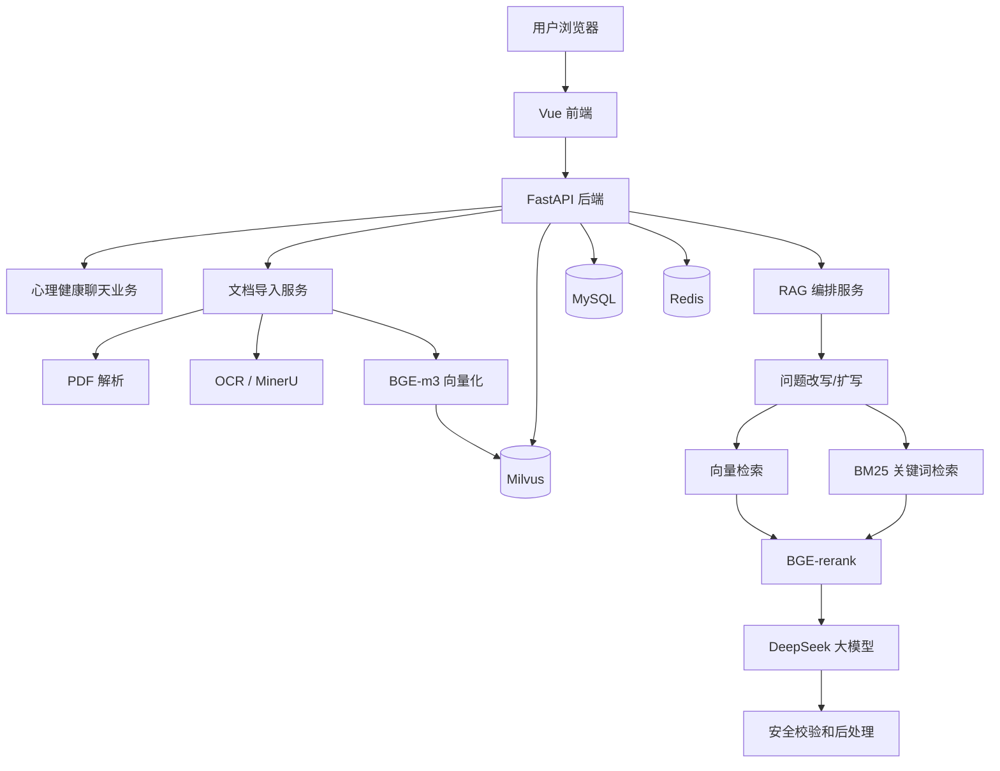
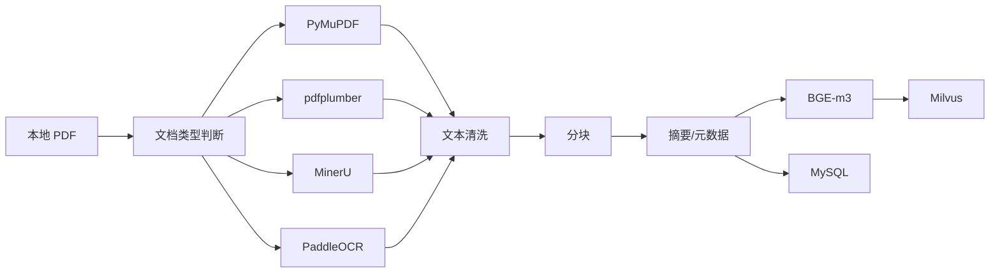
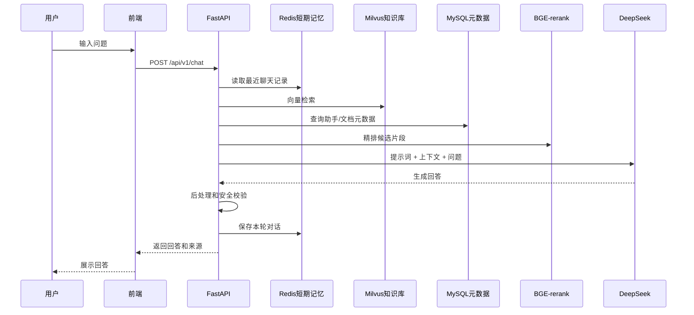

# 技术架构设计

> 项目：MentalHeal RAG  
> 版本：v0.1

## 1. 总体架构

这个项目可以理解成 4 层：

1. 前端页面：用户聊天、心理健康助手、知识库管理。
2. 后端服务：接口、业务逻辑、RAG 编排、权限和日志。
3. AI 能力层：PDF 解析、OCR、Embedding、Rerank、大模型。
4. 数据存储层：MySQL、Redis、Milvus。



## 2. 离线知识库链路

离线链路负责把 PDF 变成可检索的知识。



关键点：

- 普通 PDF 优先用 PyMuPDF。
- 表格多的 PDF 用 pdfplumber 辅助。
- 扫描版或图片型 PDF 必须走 OCR。
- 复杂版面可以接 MinerU。
- 分块不要太碎，也不要太长。
- 每个 chunk 都要保留来源、页码、文档 ID、心理健康分类。

## 3. 在线问答链路

在线链路负责回答用户问题。



## 4. 数据存储分工

## 4.1 MySQL

MySQL 保存结构化数据：

- 用户信息。
- 心理健康助手配置。
- 文档信息。
- 文档分块元数据。
- 聊天会话信息。
- 聊天消息记录。
- RAG 评测记录。

## 4.2 Redis

Redis 保存短期、高频、临时数据：

- 最近聊天记录。
- 热门问题缓存。
- 文档解析任务状态。
- 临时验证码或 token。

## 4.3 Milvus

Milvus 保存语义向量：

- 知识库 chunk 向量。
- 长期记忆向量。

## 5. 后端模块设计

```text
backend/app/
  api/          只放接口路由
  core/         配置、日志、异常、安全基础能力
  db/           MySQL、Redis、Milvus 连接
  models/       SQLAlchemy 数据库模型
  schemas/      Pydantic 请求和响应结构
  services/     业务服务
  rag/          检索、重排、提示词、生成、后处理
  ingestion/    PDF 解析、OCR、清洗、分块、向量化
  memory/       短期记忆和长期记忆
  security/     心理危机检测、内容安全
```

建议原则：

- `api` 不写复杂业务，只接收请求、调用 service、返回结果。
- `services` 负责业务流程。
- `rag` 负责 RAG 链路。
- `ingestion` 负责知识库入库链路。
- `db` 只负责连接和底层封装。

## 6. 前端页面设计

一期可以做 4 个页面：

1. 登录页：简单登录或游客进入。
2. 心理健康聊天页：核心演示页面。
3. 知识库管理页：上传心理健康 PDF、查看解析状态。
4. RAG 评测页：查看测试问题和评测结果。

后续再加：

- 心理健康助手配置页。
- RAG 评测页。
- 系统监控页。

## 7. 心理健康安全策略

系统需要内置最基本的安全策略：

- 不做诊断。
- 不替代医生。
- 不鼓励危险行为。
- 检测到自杀、自伤、伤害他人时，优先安全引导。
- 建议用户联系专业机构、紧急服务、可信任的人。
- 回答语气必须温和，不责备用户。

## 8. 可扩展设计

本项目不做多行业角色扩展，只在心理健康范围内做配置化扩展：

- 心理健康助手有独立 prompt。
- 心理健康助手绑定心理健康知识库。
- 不同心理健康场景可以配置不同语气，例如压力管理、睡眠健康、焦虑自助。
- 心理危机安全规则始终启用。
- 如果用户问非心理健康问题，系统应礼貌说明当前只支持心理健康相关内容。

## 9. 部署架构

一期开发环境：

```text
本机浏览器
  -> 前端 Vite dev server
  -> FastAPI
  -> 本机 MySQL
  -> Docker Redis
  -> Docker Milvus
  -> DeepSeek API
  -> MinerU API
```

生产环境：

```text
Nginx
  -> 前端静态资源
  -> FastAPI 多进程
  -> MySQL
  -> Redis
  -> Milvus
  -> 日志目录
  -> 外部大模型 API / 本地模型服务
```

## 10. 一期最小可运行版本

最小可运行版本不要一开始追求特别复杂，先做到：

1. 后端能启动。
2. 能连接 MySQL、Redis、Milvus。
3. 能导入一个 PDF。
4. 能解析 PDF 和 OCR。
5. 能向量化并写入 Milvus。
6. 用户能问问题。
7. 系统能检索知识库并调用 DeepSeek 回答。
8. 前端能显示聊天内容和来源。

这个版本跑通后，再逐步优化混合检索、RAGAS、压力测试、部署脚本。
