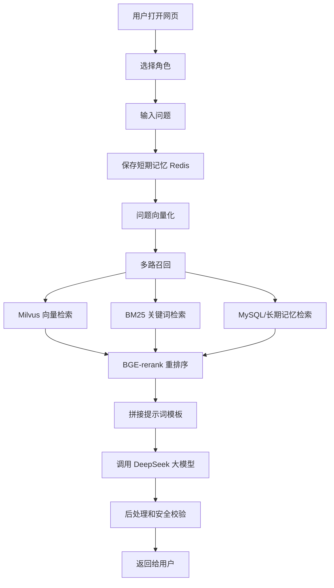
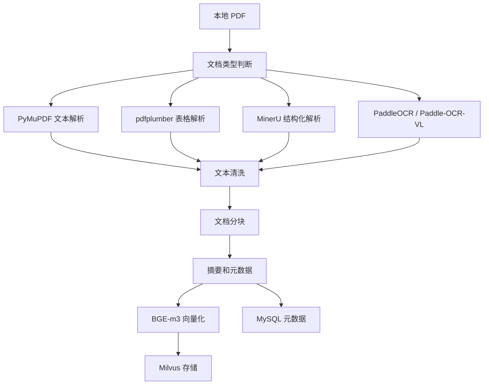
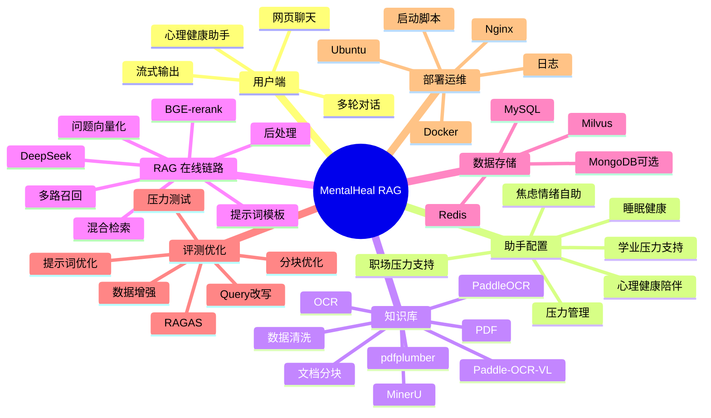

# 基于 RAG 的心理健康问答系统需求规格说明书

> 版本：v0.1  
> 项目名称：MentalHeal RAG  
> 当前阶段：从 0 到 1 搭建第一版网页版 AI 机器人  
> 面向读者：项目开发者、测试人员、部署人员、后续答辩/汇报人员  
> 写法说明：这份文档尽量用口语化方式说明，方便小白理解，也方便后面直接照着开发。

---

## 1. 项目一句话说明

我们要做一个网页版 AI 聊天机器人。用户打开网页后，直接进入“心理健康陪伴助手”，然后像聊天一样提问。系统只使用心理健康相关 PDF 作为知识库，会先从本地心理健康资料里找内容，再让大模型结合资料回答用户。

它不是单纯调用 DeepSeek 这种大模型，而是一个完整的 RAG 系统：

1. 先把本地 PDF 解析出来。
2. 用 OCR 识别图片里的文字。
3. 把文档切成小块。
4. 用 BGE-m3 之类的模型把文字变成向量。
5. 存进 Milvus 向量数据库。
6. 用户提问时，系统再去 Milvus、MySQL、Redis 等地方检索相关内容。
7. 用 BGE-rerank 重新排序。
8. 把最相关的资料塞进提示词模板。
9. 调用 DeepSeek 大模型生成回答。
10. 最后做安全校验和格式清洗，再返回给用户。

---

## 2. 一期目标

一期不做多行业角色扩展，先做一个稳定可演示的核心版本：

**一期主角色：心理健康陪伴助手。**

这个助手主要做：

- 倾听用户情绪。
- 根据心理健康资料做温和解释。
- 给出非诊断性的建议。
- 遇到危机情况时提醒用户联系专业人士或紧急求助。
- 支持多轮对话，能记住最近聊天内容。
- 能引用本地 PDF 知识库里的内容。

本项目范围固定为心理健康方向。后续如果要扩展，也只在心理健康内部扩展，比如：

- 压力管理陪伴。
- 睡眠健康科普。
- 焦虑情绪自助。
- 亲子沟通科普。
- 学业压力支持。
- 职场压力支持。
- 心理危机安全引导。

不做律师、金融、股票、NPC、普通客服、医学诊断等非心理健康方向。

---

## 3. 项目边界

### 3.1 系统要做什么

系统要做这些事情：

- 提供一个网页聊天界面。
- 支持用户登录或区分不同用户。
- 支持心理健康助手的人设、语气和提示词配置。
- 支持上传或导入 PDF 知识库。
- 支持 OCR 识别扫描版 PDF 或图片文字。
- 支持 Milvus 向量检索。
- 支持 BM25 关键词检索。
- 支持混合检索、多路召回和重排序。
- 支持 Redis 保存短期聊天记忆。
- 支持 Milvus / MySQL 保存长期记忆和知识库内容。
- 支持调用 DeepSeek API 生成回答。
- 支持日志记录。
- 支持 RAGAS 评测。
- 支持接口测试、单元测试、集成测试和压力测试。
- 支持部署到 Ubuntu、算力云、腾讯云、阿里云等环境。

### 3.2 系统不应该做什么

心理健康系统需要特别注意安全边界：

- 不能声称自己是现实中的医生。
- 不能给出正式医学诊断。
- 不能替代心理咨询师、精神科医生或急救服务。
- 不能鼓励自伤、自杀、伤害他人。
- 遇到高风险表达时，需要给出危机干预提示。
- 不能泄露用户隐私、密钥、后台配置。
- 不回答律师、金融、股票、普通医学诊断等非心理健康领域问题。

---

## 4. 主要用户

### 4.1 普通用户

普通用户就是网页上的聊天对象。他们可能会：

- 说自己压力大、焦虑、睡不好。
- 想找一个虚拟朋友聊聊天。
- 想了解心理健康知识。
- 想看系统基于资料给出的解释。

### 4.2 管理员

管理员负责维护知识库和角色配置。他们可以：

- 上传 PDF。
- 查看文档解析状态。
- 重新切分文档。
- 重新向量化。
- 管理角色提示词。
- 查看系统日志。
- 运行 RAG 评测。

### 4.3 开发/测试人员

开发和测试人员负责：

- 写后端接口。
- 写前端页面。
- 写单元测试和集成测试。
- 用 Postman / Apipost 测接口。
- 用 JMeter 做压力测试。
- 写部署脚本和部署文档。

---

## 5. 业务流程

### 5.1 用户聊天流程

用户最常用的流程是：

1. 打开网页。
2. 登录或进入游客模式。
3. 选择一个角色，比如“心理健康陪伴助手”。
4. 输入问题。
5. 后端保存用户问题到 Redis 最近聊天记录。
6. 后端把用户问题向量化。
7. 后端去知识库检索相关内容。
8. 后端做重排序。
9. 后端拼接提示词模板。
10. 后端调用 DeepSeek。
11. 后端做安全检查和后处理。
12. 前端流式展示回答。
13. 系统保存本轮对话。



### 5.2 知识库导入流程

管理员导入本地 PDF 时，系统需要这样处理：

1. 上传或放入本地 PDF。
2. 判断 PDF 类型：文本型、扫描型、图片型、表格多的 PDF。
3. 用合适工具解析：
   - PyMuPDF / fitz：普通 PDF 文本解析。
   - pdfplumber：表格解析比较好。
   - MinerU：复杂 PDF 结构化解析。
   - PaddleOCR / Paddle-OCR-VL：图片、扫描版、复杂版面 OCR。
   - 多模态大模型：处理图片、图表、复杂页面理解。
4. 清洗文本，比如去水印、去页眉页脚、去重复内容。
5. 文档分块。
6. 生成摘要和元数据。
7. 用 BGE-m3 生成向量。
8. 写入 Milvus。
9. 元数据写入 MySQL。
10. 记录日志和处理结果。



---

## 6. 核心功能需求

## 6.1 用户模块

### 功能说明

用户模块用来区分不同用户。因为系统要支持多用户、多轮对话和个人聊天记录，所以最好有用户表。

### 主要功能

- 用户注册。
- 用户登录。
- 用户退出。
- 查看用户信息。
- 保存用户偏好。
- 游客模式，方便演示。

### 数据存储

用户信息建议存 MySQL：

- 用户 ID。
- 用户名。
- 密码哈希。
- 昵称。
- 创建时间。
- 最近登录时间。

---

## 6.2 心理健康助手配置模块

### 功能说明

本项目不做多行业角色系统，只做心理健康助手。这里的“助手配置”主要用来管理心理健康助手的人设、语气、提示词模板、安全规则和绑定的心理健康知识库。

### 一期默认助手

#### 心理健康陪伴助手

助手特点：

- 温和。
- 有耐心。
- 不批判用户。
- 会先共情，再解释，再给建议。
- 不做医学诊断。
- 不替代医生、心理咨询师或急救服务。
- 遇到危机表达会引导用户求助。

### 后续心理健康内部扩展

后续如果需要扩展，也只在心理健康范围内做细分助手，例如：

- 压力管理助手。
- 睡眠健康助手。
- 焦虑情绪自助助手。
- 学业压力支持助手。
- 职场压力支持助手。
- 心理危机安全引导助手。

不做律师、金融、股票、NPC、普通客服等非心理健康方向。

### 助手配置字段

助手配置建议存 MySQL：

- 助手 ID。
- 助手名称。
- 助手头像。
- 心理健康细分方向。
- 助手人设。
- 提示词模板。
- 安全规则。
- 绑定知识库 ID。
- 是否启用。
- 创建时间。

---

## 6.3 知识库模块

### 功能说明

知识库模块负责管理 PDF、解析结果、分块、向量、元数据。

### 知识来源

一期使用本地心理健康 PDF。后续如果需要补充数据，也只补充心理健康相关资料：

- 国家卫健委心理健康相关资料。
- 心理健康科普资料。
- 睡眠、压力、焦虑、抑郁科普资料。
- 学校、医院、官方机构发布的心理健康指南。
- GitHub / HuggingFace / ModelScope 上合法可用的心理健康数据集。

### PDF 解析工具

系统需要支持多种 PDF 解析方式：

- PyMuPDF / fitz：适合普通文本 PDF。
- pdfplumber：适合表格。
- MinerU：适合结构化复杂文档。
- PaddleOCR：适合图片 OCR。
- Paddle-OCR-VL：适合复杂视觉文档理解。
- 多模态大模型：适合图片、图表、复杂版面辅助理解。

### PDF 去水印

PDF 去水印要谨慎处理。它主要用于提高解析质量，比如去掉重复页眉页脚、背景水印、页码、广告字样。不能用于绕过版权保护。

### 文档分块方式

系统需要支持多种分块策略：

- 固定长度分块。
- 按句子分块。
- 按段落分块。
- 按标题层级分块。
- 语义分块。
- 父子块分块。

一期推荐：

- 普通文本：标题 + 段落优先。
- 长段落：再按 token 长度切。
- 表格：尽量保留整张表含义。
- 扫描版：OCR 后再按段落切。

---

## 6.4 向量化模块

### 功能说明

向量化就是把文本变成数字向量，方便相似度检索。

### 推荐模型

一期推荐：

- Embedding 模型：BGE-m3。
- Rerank 模型：BGE-rerank。

### 向量化对象

需要向量化的内容包括：

- 文档分块原文。
- 文档分块摘要。
- 用户问题。
- 长期记忆内容。

---

## 6.5 Milvus 向量数据库模块

### 功能说明

Milvus 用来存储向量和原文，方便根据用户问题找相似内容。

你已经在 Docker 上部署了 Milvus，一期可以直接连接本地 Milvus。

### Collection 设计

建议 collection 里至少有这些字段：

- `id`：主键，唯一，可以自增。
- `vector`：向量字段。
- `text`：向量对应的原文。
- `summary`：摘要。
- `source`：文档来源。
- `doc_id`：文档 ID。
- `chunk_id`：分块 ID。
- `role_id`：绑定角色 ID。
- `created_at`：创建时间。
- `updated_at`：修改时间。
- `metadata`：其他扩展信息。

### 检索方式

一期需要支持：

- 向量检索。
- BM25 关键词检索。
- 混合检索。
- 相似度得分过滤。
- top_k 控制。

---

## 6.6 Redis 短期记忆模块

### 功能说明

大模型本身没有真正的长期记忆，所以需要我们帮它管理聊天上下文。

Redis 用来保存最近聊天记录，也就是短期记忆。

### Redis 常用数据类型

Redis 常见类型包括：

- String。
- List。
- Set。
- Hash / Dict。
- ZSet。

一期推荐用 List 保存最近对话：

- key：`chat:history:{user_id}:{role_id}`。
- value：最近 N 轮对话。
- 超时时间：可以设置 1 天、7 天或更久。

Redis 大部分简单操作是 O(1) 常数时间复杂度，适合做缓存和短期记忆。

---

## 6.7 长期记忆模块

### 功能说明

长期记忆用来保存用户长期偏好和重要事实，比如：

- 用户希望被怎样称呼。
- 用户长期关注的问题。
- 用户明确提到的重要背景。

### 存储方案

长期记忆可以存：

- MySQL：结构化记忆。
- Milvus：语义记忆。
- MongoDB：如果后面有灵活 JSON 记忆，也可以用。

一期建议先用 MySQL + Milvus，不要一开始引入太多数据库。

---

## 6.8 在线 RAG 问答模块

### 功能说明

这是系统最核心的链路。

### 处理步骤

1. 接收用户问题。
2. 做问题安全检查。
3. 获取最近聊天记录。
4. 做 Query 改写或扩写。
5. 对问题向量化。
6. 多路召回：
   - Milvus 向量检索。
   - BM25 关键词检索。
   - MySQL 结构化数据检索。
   - Redis 短期记忆检索。
   - 长期记忆检索。
   - 后续可以接互联网、Neo4J、MongoDB、ClickHouse。
7. 合并召回结果。
8. 去重。
9. BGE-rerank 精排。
10. 相似度阈值过滤。
11. 拼接提示词。
12. 调用 DeepSeek。
13. 后处理。
14. 保存对话。
15. 返回用户。

---

## 6.9 提示词模板模块

### 一期心理健康助手提示词模板

```text
你是一个温和、专业、可靠的心理健康陪伴助手。

你的任务：
1. 先理解用户的情绪，不要急着说教。
2. 回答要温柔、清楚、短句多一点。
3. 如果知识库里有相关资料，要优先依据资料回答。
4. 不能做医学诊断，不能替代医生、心理咨询师或急救服务。
5. 如果用户表达自伤、自杀、伤害他人等风险，要优先进行安全引导，建议联系当地紧急服务、可信任的人或专业机构。
6. 如果资料不足，要诚实说明，不要编造。

角色人设：
{role_profile}

最近聊天记录：
{chat_history}

检索到的知识库资料：
{retrieved_context}

用户问题：
{user_question}

请用中文回答。回答结构建议：
- 先共情
- 再解释
- 再给 2-4 条可执行建议
- 最后给一句温和的鼓励
```

### 提示词优化方向

后续可以优化：

- 增加结构化输出。
- 增加引用来源。
- 增加角色语气配置。
- 增加危险内容检测。
- 增加“不知道就说不知道”。
- 增加多轮对话摘要。

---

## 6.10 后处理模块

### 功能说明

后处理就是大模型回答完之后，再做一层处理。

### 处理内容

- 正则表达式替换敏感格式。
- 去掉多余空行。
- 修复 Markdown 格式。
- 检查是否出现“我是医生”“我能诊断你”等不合适表达。
- 对高风险内容增加安全提醒。
- 给引用内容加来源。

---

## 6.11 RAG 优化模块

RAG 优化不是一次做完的，是后面不断调参和改进。

主要优化方向：

- 混合检索。
- 多路召回。
- 重排序。
- Query 改写。
- Query 扩写。
- 分块优化。
- 父子块。
- 摘要增强。
- 知识库去重。
- 删除低质量文档。
- Embedding 模型优化。
- BGE-m3 微调。
- 提示词优化。
- 相似度阈值过滤。
- 生成结果后处理。
- Milvus 索引优化。
- 缓存优化。
- 流式输出。
- 代码逻辑优化。
- 硬件优化。

---

## 6.12 RAG 评测模块

### 工具

使用 RAGAS 做评测。

### 评测指标

建议关注：

- faithfulness：回答是否忠于检索资料。
- answer_relevancy：回答是否切题。
- context_precision：检索到的上下文是否精准。
- context_recall：应该召回的资料有没有召回。
- context_relevancy：上下文和问题是否相关。

### 评测数据

需要准备一批测试问题，比如：

- 焦虑时可以做什么？
- 睡眠不好怎么办？
- 压力大时怎么缓解？
- 我是不是抑郁症？
- 如果有人说不想活了怎么办？

注意：涉及诊断和危机问题时，系统必须谨慎回答。

---

## 7. 非功能需求

## 7.1 安全性

- API Key 不允许写死在代码里。
- MinerU 密钥放环境变量。
- DeepSeek 密钥放环境变量。
- 数据库密码放环境变量。
- 用户密码必须哈希存储。
- 日志不能记录完整敏感信息。
- 危机表达需要安全响应。

## 7.2 性能

- 普通问答响应尽量控制在几秒内。
- 支持流式输出，用户不用一直等。
- Redis 缓存最近会话。
- Milvus 使用合适索引。
- 重排序 top_k 不要太大，避免太慢。

## 7.3 可扩展性

- 角色可配置。
- 知识库可动态更新。
- 大模型供应商可切换。
- 本地模型和在线 API 都能接。
- 检索源可以扩展到 Neo4J、MongoDB、ClickHouse、互联网。

## 7.4 可维护性

- Python 使用 logging 记录日志。
- 后端模块分清楚。
- 配置集中管理。
- 接口有文档。
- 关键功能有测试。

---

## 8. 技术选型

## 8.1 后端

建议使用：

- Python。
- FastAPI。
- Pydantic。
- SQLAlchemy。
- PyMySQL / asyncmy。
- pymilvus。
- redis-py。
- LangChain 或 LlamaIndex。

## 8.2 前端

建议使用：

- Vue 3。
- TypeScript。
- Vite。
- Axios。
- Element Plus 或 Naive UI。

## 8.3 数据库和中间件

- MySQL：用户、角色、文档元数据、会话元数据。
- Redis：短期记忆、缓存。
- Milvus：向量库和长期语义记忆。
- MongoDB：后续可选。

## 8.4 大模型

一期使用：

- DeepSeek API。

后续可支持：

- 豆包。
- 硅基流动。
- 千问。
- Claude。
- ChatGPT。
- Gemini。
- 本地 vLLM。
- SGLang。
- Xinference。

## 8.5 RAG 框架

可以调研和对比：

- LangChain。
- LlamaIndex。
- Dify。
- RAGFlow。
- LightRAG。
- LinearRAG。

一期建议：

- 后端自己写清楚 RAG 主链路。
- 局部使用 LangChain / LlamaIndex 辅助。
- 不要一开始完全依赖 Dify，否则代码可控性会弱一些。

---

## 9. 接口需求

接口统一使用 HTTP + JSON。

### 9.1 聊天接口

```http
POST /api/v1/chat
```

请求示例：

```json
{
  "user_id": "u001",
  "role_id": "mental_health_companion",
  "message": "我最近压力很大，晚上睡不着怎么办？",
  "stream": true
}
```

返回示例：

```json
{
  "answer": "听起来你这段时间真的很累……",
  "sources": [
    {
      "doc_id": "doc001",
      "title": "心理健康科普资料.pdf",
      "chunk_id": "chunk_001",
      "score": 0.82
    }
  ],
  "session_id": "s001"
}
```

### 9.2 文档上传接口

```http
POST /api/v1/documents/upload
```

### 9.3 文档解析接口

```http
POST /api/v1/documents/{doc_id}/parse
```

### 9.4 文档向量化接口

```http
POST /api/v1/documents/{doc_id}/embed
```

### 9.5 角色列表接口

```http
GET /api/v1/roles
```

### 9.6 RAG 评测接口

```http
POST /api/v1/evaluations/ragas
```

---

## 10. 数据库需求

### 10.1 MySQL 表

建议包含：

- `users`：用户表。
- `roles`：角色表。
- `knowledge_bases`：知识库表。
- `documents`：文档表。
- `document_chunks`：文档分块表。
- `chat_sessions`：聊天会话表。
- `chat_messages`：聊天消息表。
- `long_term_memories`：长期记忆表。
- `rag_evaluation_runs`：RAG 评测任务表。

### 10.2 Redis Key

建议包含：

- `chat:history:{user_id}:{role_id}`：最近聊天记录。
- `rag:cache:{query_hash}`：问题缓存。
- `doc:parse:status:{doc_id}`：文档解析状态。

### 10.3 Milvus Collection

建议包含：

- `knowledge_chunks`：知识库分块向量。
- `long_term_memories`：长期记忆向量。

---

## 11. 测试需求

## 11.1 单元测试

使用 Python unittest / pytest 都可以。你要求 pyunit，所以文档里按 pyunit 写。

测试内容：

- PDF 解析函数。
- OCR 调用封装。
- 文档分块函数。
- 向量化函数。
- Milvus 写入和查询封装。
- Redis 记忆读写。
- 提示词拼接。
- 后处理正则。

## 11.2 接口测试

使用：

- Postman。
- Apipost。
- Python requests 测试脚本。

## 11.3 集成测试

测试完整链路：

1. 上传 PDF。
2. 解析 PDF。
3. 分块。
4. 向量化。
5. 存 Milvus。
6. 用户提问。
7. 检索。
8. 重排序。
9. 大模型回答。
10. 返回结果。

## 11.4 压力测试

使用 JMeter。

关注指标：

- QPS。
- 平均响应时间。
- P95 响应时间。
- 错误率。
- CPU、内存、显存占用。

---

## 12. 部署需求

## 12.1 部署环境

需要支持：

- Ubuntu。
- 算力云。
- 腾讯云。
- 阿里云。

CentOS 可以作为后续兼容。

## 12.2 服务器准备

部署脚本需要检查：

- 操作系统版本。
- CPU。
- 内存。
- 磁盘空间。
- Docker。
- Python。
- Conda。
- Git。
- 端口占用。

## 12.3 安装内容

部署脚本需要支持：

- 安装 Anaconda / Miniconda。
- 创建 Python 环境。
- 安装 `requirements.txt`。
- 连接 Redis。
- 连接 MySQL。
- 连接 Milvus。
- 拉取或解压代码。
- 初始化数据库表。
- 启动后端。
- 启动前端。

## 12.4 启动脚本

需要提供：

- 后端启动脚本。
- 前端启动脚本。
- 一键启动脚本。
- 停止脚本。
- 健康检查脚本。

## 12.5 负载均衡

后续生产环境可以使用：

- Nginx。
- http-proxy。
- 多实例后端。

---

## 13. 日志需求

后端使用 Python logging。

日志至少分：

- API 请求日志。
- RAG 检索日志。
- 文档解析日志。
- 大模型调用日志。
- 错误日志。
- 评测日志。

注意：日志里不能直接打印 API Key，不能记录用户特别敏感的完整隐私内容。

---

## 14. 项目目录规划

当前建议目录：

```text
MentalHeal_RAG/
  backend/                  后端代码
    app/
      api/                  接口路由
      core/                 配置、日志、安全
      db/                   MySQL、Redis、Milvus 连接
      models/               数据库模型
      schemas/              接口请求和响应结构
      services/             业务服务
      rag/                  RAG 主流程
      ingestion/            PDF 解析、OCR、分块、向量化
      memory/               短期记忆、长期记忆
      security/             内容安全和心理危机检测
      main.py               FastAPI 入口
    tests/
      unit/                 单元测试
      integration/          集成测试
  frontend/                 前端代码
    src/
      components/           通用组件
      views/                页面
      api/                  前端请求封装
      stores/               状态管理
      types/                TypeScript 类型
      assets/               静态资源
  docs/                     文档
    requirements/           需求文档
    architecture/           架构设计
    api/                    接口文档
    deployment/             部署文档
    evaluation/             评测文档
  scripts/                  脚本
    install/                安装脚本
    start/                  启动脚本
    ops/                    运维脚本
  data/                     本地数据目录
    raw/                    原始 PDF
    processed/              解析后数据
    failed/                 失败数据
  configs/                  配置文件模板
  logs/                     日志
  notebooks/                实验 notebook
```

---

## 15. 思维导图



---

## 16. 分阶段开发计划

### 第 1 阶段：项目骨架和基础配置

目标：项目能启动。

要做：

- 建好后端目录。
- 建好前端目录。
- 写 `.env.example`。
- 写 README。
- 配好 FastAPI。
- 配好日志。
- 能访问健康检查接口。

### 第 2 阶段：数据库连接

目标：系统能连上 MySQL、Redis、Milvus。

要做：

- MySQL 连接。
- Redis 连接。
- Milvus 连接。
- 数据库初始化脚本。
- 健康检查。

### 第 3 阶段：文档解析和入库

目标：本地 PDF 能变成 Milvus 里的向量。

要做：

- PDF 上传。
- PyMuPDF 解析。
- pdfplumber 表格解析。
- MinerU 封装。
- OCR 封装。
- 文本清洗。
- 文档分块。
- BGE-m3 向量化。
- 写入 Milvus。

### 第 4 阶段：RAG 问答链路

目标：用户能问问题，系统能基于知识库回答。

要做：

- 问题向量化。
- Milvus 检索。
- BM25 检索。
- 混合检索。
- BGE-rerank。
- 提示词模板。
- DeepSeek 调用。
- 后处理。

### 第 5 阶段：多轮对话和助手配置

目标：支持不同用户、心理健康助手配置和短期记忆。

要做：

- 用户表。
- 心理健康助手配置表。
- Redis 最近聊天记录。
- 长期记忆。
- 心理健康提示词配置。

### 第 6 阶段：前端页面

目标：有一个能演示的网页版聊天机器人。

要做：

- 登录页。
- 心理健康助手聊天页。
- 聊天页。
- 文档管理页。
- 评测页。

### 第 7 阶段：评测和优化

目标：系统回答更稳定、更可信。

要做：

- RAGAS 评测。
- 测试集。
- 检索参数调优。
- 分块策略调优。
- 提示词调优。

### 第 8 阶段：测试和部署

目标：可以部署到服务器。

要做：

- 单元测试。
- 集成测试。
- Postman / Apipost 测试。
- JMeter 压测。
- Ubuntu 部署脚本。
- README 部署文档。

---

## 17. 验收标准

一期完成时，至少要达到：

- 可以启动后端服务。
- 可以打开前端页面。
- 可以连接 MySQL、Redis、Milvus。
- 可以导入至少一个 PDF。
- 可以完成 PDF 解析、OCR、分块、向量化、入库。
- 用户可以在网页上和心理健康助手聊天。
- 回答能使用知识库内容。
- 最近聊天记录能保存在 Redis。
- 敏感心理危机问题有安全提醒。
- 有接口文档。
- 有部署文档。
- 有测试结果截图或日志。
- 有 RAGAS 初步评测结果。

---

## 18. 风险和注意事项

### 18.1 PDF 质量风险

有些 PDF 可能是扫描件、图片、表格很多、排版很乱。解决办法是多工具解析：PyMuPDF、pdfplumber、MinerU、PaddleOCR 一起配合。

### 18.2 检索不准

如果检索不准，回答就容易跑偏。解决办法：

- 优化分块。
- 使用混合检索。
- 使用 BGE-rerank。
- 调整相似度阈值。
- 做知识库清洗。

### 18.3 大模型胡说

大模型可能编造。解决办法：

- 提示词要求基于资料回答。
- 没资料就说不知道。
- RAGAS 评测。
- 后处理校验。

### 18.4 心理健康安全风险

这是最重要的风险。系统必须明确：它是陪伴和科普工具，不是医生。遇到危机表达，需要优先安全引导。

---

## 19. 一期推荐技术路线总结

最推荐的落地路线：

- 后端：FastAPI。
- 前端：Vue 3 + TypeScript。
- 大模型：DeepSeek API。
- Embedding：BGE-m3。
- Rerank：BGE-rerank。
- 向量库：Milvus。
- 缓存和短期记忆：Redis。
- 结构化数据：MySQL。
- PDF 解析：PyMuPDF + pdfplumber + MinerU + PaddleOCR。
- 评测：RAGAS。
- 测试：pyunit + Postman/Apipost + JMeter。
- 部署：Ubuntu + Docker + shell 脚本。

---

## 20. 下一步要做什么

下一步建议直接进入开发：

1. 写后端 FastAPI 基础项目。
2. 写配置读取 `.env`。
3. 写 MySQL、Redis、Milvus 连接测试。
4. 写 DeepSeek 调用封装。
5. 写 PDF 解析和 OCR 封装。
6. 写第一个 `/api/v1/chat` 接口。
7. 写简单前端聊天页。

这样项目就能从“文档设计”进入“能跑起来”的阶段。
